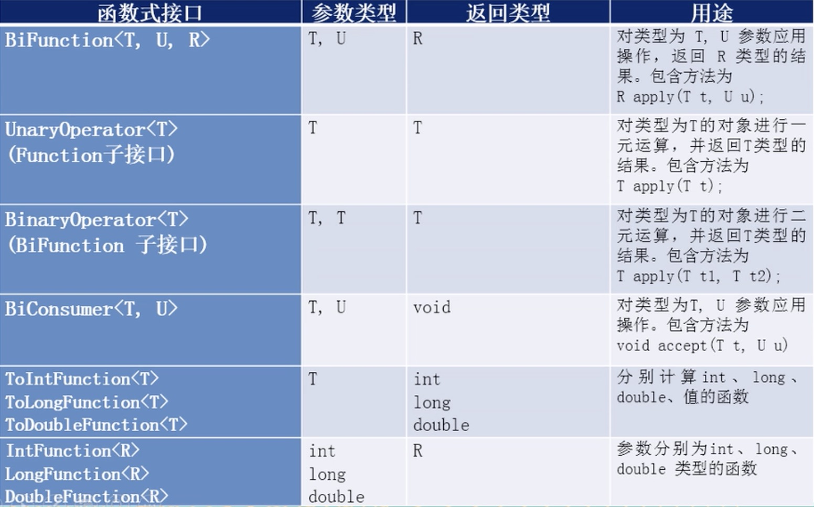

### 一.Lambda表达式

#### 1)Lambda简介

	 Java8引入了一个新的操作符"==->==",该操作符称为尖头操作符或Lambda操作符。箭头操作符把Lambda表达式分成两部分:

1. Lambda左侧:表达式的参数列表
2. Lambda右侧:表达式中所需执行的功能，即Lambda体

#### 2)Lambda基础语法

1. 无参数，无返回值

   ```java
   () -> lambda体
   ```

   ```java
   @Test
   public void test01(){
   
       Runnable runnable = ()-> System.out.println("sada");
       runnable.run();
   }
   ```

   tips：==若Lambd体中只有一条语句时，return和大括号可以省略==

2. 有一个参数，无返回值

   ```java
   (T)-> lambda体
   ```

   ```java
   @Test
   public void test02(){
   
       Consumer<String> consumer = (name)-> System.out.println(name);
       consumer.accept("张三");
   }
   ```

   tips:

   - ==如参数只有一个，则参数的小括号可以省略==

     ```
     Consumer<String> consumer = name -> System.out.println(name);
     ```

3. 有两个以上参数，有返回值，并且lambda体中有多条语句

   ```
   (x,y) -> {
       
      方法体
   }
   ```

   ```java
   @Test
   public void test03(){
   
       List<Integer> list = Arrays.asList(3,4,1,2,6,9,8);
       Comparator<Integer> comparator = (t1,t2) ->{
   
           return  Integer.compare(t1,t2);
       };
       list.sort(comparator);
       System.out.println(list);
   }
   ```

   tips：==lambda表达式的参数列表的数据类型可以省略不写，因为JVM编译器可以通过上下文推断出数据类型。==

#### 3) Lambda表达式需要 函数式接口 的支持

1. 函数式接口的定义

   接口中只有==一个抽象方法==的接口，称为函数式接口。

   可以使用==@FunctionalInterface==修饰，表明该接口是函数式接口

2. 例子

   - 定义

     ```java
     @FunctionalInterface
     public interface MyLamdbaInterface<T> {
     
         public T compare(T t1, T t2);
     
     }
     ```

   - 使用

     ```java
     @Test
     public void test04(){
     
         MyLamdbaInterface<Integer> myLamdbaInterface = (t1,t2)-> {
     
             return  t1 - t2;
         };
     
         useTest04(myLamdbaInterface);
     }
     
     public void useTest04(MyLamdbaInterface myLamdbaInterface){
     
         System.out.println(myLamdbaInterface.compare(10, 20));;
     }
     ```

#### 4)内置的函数式接口

1. 消费型接口(Consumer)

   ```java
   @FunctionalInterface
   public interface Consumer<T> {
   
       /**
        * Performs this operation on the given argument.
        *
        * @param t the input argument
        */
       void accept(T t);
   
   }
   ```

2. 供给型接口(Supplier)

   ```java
   @FunctionalInterface
   public interface Supplier<T> {
   
       /**
        * Gets a result.
        *
        * @return a result
        */
       T get();
   }
   ```

3. 函数型接口(Function)

   ```java
   @FunctionalInterface
   public interface Function<T, R> {
   
       /**
        * Applies this function to the given argument.
        *
        * @param t the function argument
        * @return the function result
        */
       R apply(T t);
   
       /**
        * Returns a function that always returns its input argument.
        *
        * @param <T> the type of the input and output objects to the function
        * @return a function that always returns its input argument
        */
       static <T> Function<T, T> identity() {
           return t -> t;
       }
   }
   
   ```

4. 断言型接口(Predicate)

   ```java
   @FunctionalInterface
   public interface Predicate<T> {
   
       /**
        * Evaluates this predicate on the given argument.
        *
        * @param t the input argument
        * @return {@code true} if the input argument matches the predicate,
        * otherwise {@code false}
        */
       boolean test(T t);
   
       /**
        * Returns a predicate that tests if two arguments are equal according
        * to {@link Objects#equals(Object, Object)}.
        *
        * @param <T> the type of arguments to the predicate
        * @param targetRef the object reference with which to compare for equality,
        *               which may be {@code null}
        * @return a predicate that tests if two arguments are equal according
        * to {@link Objects#equals(Object, Object)}
        */
       static <T> Predicate<T> isEqual(Object targetRef) {
           return (null == targetRef)
                   ? Objects::isNull
                   : object -> targetRef.equals(object);
       }
   }
   ```

5. 其他函数式接口

   


#### 5)使用方法或者构造器创建lambda表达式

##### (1)使用方法

1. ==对象::实例方法名==

   ```java
   @Test
   public void instancMethodTest(){
   
       Person person = new Person("zhangsan","pppp",23);
       Consumer<Integer> consumer = person::setAge;
   
       consumer.accept(25);
       System.out.println(person.getAge());
   
       Supplier<String> supplier = person::getUsername;
   
       System.out.println(supplier.get());
   
       Function<Integer,String> function = person::toStr;
   
       System.out.println(function.apply(34));
       
       Consumer<String> consumer01 = System.out::println;
       consumer01.accept('asdad');
   }
   ```

2. ==类名::静态方法名==

   ```java
   Comparator<Integer> comparator = Integer::compareTo;
   ```

3. ==类名::实例方法名==

   ```sql
   BiPredicate<String,String> biPredicate = (x,y)-> x.equals(y); 
   
   BiPredicate<String,String> biPredicate1 = String::equals;
   
   Function<Person,String> function1 = Person::getUsername;
   //单个参数没有返回值
   Consumer<Person> consumer = Person::toString;
   
   /**
    *  person 实例调用toStr参数类型是Integer类型的方法，
    *  返回值是String类型
    */
   BiFunction<Person,Integer,String> biFunction = Person::toStr;
   ```

   这种类型的规律:

   	 ==第一个泛型类型调用该实例的 等于号(=) 右边的 ::后面的方法，方法的参数类型是第二个泛型类型，返回值类型是第三个泛型类型==

##### (2)构造器引用

1. 格式

   ==类名:new==

2. 使用

   ```java
   //调用的无参构造器
   Supplier<Person> supplier = Person::new;
   supplier.get();
   //调用参数类型为Integer类型的构造器
   Function<Integer,Person> function = Person::new;
   function.apply(23);
   ```

3. 规律

   ==返回类型是要创建的类型，前面的参数类型是对应构造器的要的参数类型==

##### (3)数组引用

1. 格式

   ==类名[]:new==

2. 使用

   ```java
   Function<Integer,String[]> function01 = String[]::new;
   //等同于
   Function<Integer,String[]> function02 = (x) -> new String[x];
   System.out.println(function02.apply(10).length);
   ```


### 二.stream的api

#### 1)说明

1. 创建Stream

   一个数据源(数组，集合)，获取一个流

2. 中间操作

   对数据源的数据进行的操作

3. 终止操作(终端操作)

   执行中间操作链，产生结果

#### 2)创建Stream

##### 1.collection系列集合的stream

```java
List<Integer> list = Arrays.asList(1,2,3,4,5);
list.stream().forEach(System.out::println);
```

##### 2.Arrays里面的静态方法stream()获取数组流

```java
Integer []ints = {1,2,4};
Stream<Integer> integerStream = Arrays.stream(ints);
integerStream.forEach(System.out::println);
```

##### 3.Stream类的静态方法of()获取流

```
Stream<Integer> integerStream1 = Stream.of(1,2,4,5);
integerStream1.forEach(System.out::println);
```

##### 4.Stream类创建无限流

1. 迭代(iterate)

   ```java
   stream<Integer> integerStream2 =  Stream.iterate(0,x-> x + 2);
   integerStream2.forEach(System.out::println);
   ```

2. 生成(generate)

   ```java
   Stream<Person> stream = Stream.generate(Person::new);
   List<Person> peoples = stream.limit(10).collect(Collectors.toList());
   for (Person people : peoples) {
       System.out.println(people);
   }
   ```

#### 2)中间操作

##### 1.筛选与切片

1. filter:从流中排除某些元素。

2. limit-截断流， 使其元素不超过给定数量。

3. skip(n)一跳过元素，返回一个扔掉了前n个元素的流。若流中元素不足n个，则返回一个空流。与limit(n)互补

4. distinct-筛选， 通过流所生成元素的==hashCode()和equals( )==去除重复元素

   ```java
    List<Person> peoples = Arrays.asList(new Person("zhangsan","ssss",23),
                                       new Person("lisi","opsdasd",28),
                                       new Person("wangwu","sasda",25),
                                       new Person("zhaoliu","kondsfsdf",21),
                                       new Person("田七","ghsdasd",27),
                                       new Person("田七","ghsdasd",27),
                                       new Person("田七","ghsdasd",27),
                                       new Person("田七","ghsdasd",27));
   
   peoples.stream()
          .filter((x)->x.getAge()> 25).limit(1)
          .forEach(System.out::println);
   System.out.println("-------------------------------");
   peoples.stream()
          .skip(2)
          .distinct()
          .forEach(System.out::println);
   ```

5. 注意点

   - 惰性求值

     多个中间操作可以连接起来形成一个流水线，除非流水线上触发终止操作，否则中间操作不会执行任何的处理!而在终止操作时一次性全部处理。

##### 2.映射

1. map

   接收Lambda，将元素转换成其他形式或提取信息。接收一个函数作作为参数，该函数会被应用到毎个元素上,并将其映射成一个新的元素。

   ```java
   peoples.stream()
           .map(Person::getUsername)
           .distinct()
           .forEach(System.out::println);
   ```

2. flatMap

   接收一个函数作为参数，将流中的毎个值都换成另一个流，然后把所有流连接成一个流

   ```java
   List<String> names = Arrays.asList("zhangsan","lisi","wangwu");
   //不使用flatMap
   names.stream().map(x->x.chars().mapToObj(y->new Character((char)y))).forEach((x)->x.forEach(System.out::print));
   
   System.out.println("\n------------------");
   //使用了flatMap
   names.stream().flatMap(x->x.chars().mapToObj(y->new Character((char)y))).forEach(System.out::print);
   ```

##### 3.排序

1. sorted

   ```java
   peoples.stream().sorted((x,y)->{
   
       int age_rst = x.getAge().compareTo(y.getAge());
       if (age_rst != 0){
           return age_rst;
       }
       return x.getUsername().compareTo(y.getUsername());
   }).forEach(System.out::println);
   ```

#### 3)终止操作

##### 1.reduce

	将流中元素反复结合起来，得到一个值。

```java
Integer sum01 = peoples.stream().map(Person::getAge).reduce(0,Integer::sum);
Optional<Integer> sum02 = peoples.stream().map(Person::getAge).reduce(Integer::sum);

System.out.println(sum01);
System.out.println(sum02.get());
```

##### 2.査找与匹配

1. allMatch一检査是否匹配所有元素

   ```java
   peoples.stream().allMatch(x->x.getAge() > 25);
   ```

2. anyMatch一检査是否至少匹配- -个元素

   ```java
   peoples.stream().anyMatch(x->x.getAge() > 25);
   ```

3. noneMatch一检査是否没有匹配所有元素

   ```java
   peoples.stream().noneMatch(x->x.getAge() < 20);
   ```

4. findrirst-返回第- - 个元素

   ```java
    peoples.stream().findFirst();
   ```

5. findAny一返回当前流中的任意元素

   ```java
   peoples.stream().findAny().get()
   ```

6. count -返回流中元素的总个数

   ```java
   peoples.stream().count()
   ```

7. max-返回流中最大值

   ```
   peoples.stream().max((x, y) -> {
       int res = x.getUsername().compareTo(y.getUsername());
   
       if (res != 0) {
       	return res;
       }
       return x.getAge().compareTo(y.getAge());
   }).orElse(null)
   ```

8. min-返回流中最小值

   ```java
   peoples.stream().min((x, y) -> {
       int res = x.getUsername().compareTo(y.getUsername());
   
       if (res != 0) {
           return res;
       }
       return x.getAge().compareTo(y.getAge());
   }).orElse(null)
   ```

##### 3.收集(collect)

	collect一将 流转换为其他形式。接收一一个Collector接口的实现,

1. 集合(list,set)

   - 常用集合

     ```java
     peoples.stream().collect(Collectors.toList());
     peoples.stream().map(Person::getUsername).collect(Collectors.toSet())
     ```

   - 特殊集合

     ```java
     LinkedList<Integer> linkedList = peoples.stream().map(Person::getAge).collect(Collectors.toCollection(LinkedList::new));
     ```

2. 分组函数

   ```java
   //年龄总和
   System.out.println(peoples.stream().collect(Collectors.summingInt(Person::getAge)));;
   //总数
   peoples.stream().collect(Collectors.counting());
   //平均值
   System.out.println(peoples.stream().collect(Collectors.averagingDouble(Person::getAge)));;
   //最多值
   System.out.println(peoples.stream().collect(Collectors.maxBy((x, y) -> {
       int res = x.getUsername().compareTo(y.getUsername());
   
       if (res != 0) {
           return res;
       }
       return x.getAge().compareTo(y.getAge());
   })).orElse(null));
   
   ```

3. 分组

```java
//分组
Map<Integer,List<Person>> map = peoples.stream().collect(Collectors.groupingBy(Person::getAge));
System.out.println(map);

Map<Integer,Map<String,List<Person>>> map1 = peoples.stream().collect(Collectors.groupingBy(Person::getAge,Collectors.groupingBy(Person::getUsername)));

System.out.println(map1);
```

4.字符串连接

```java
//使用,连接字符串
peoples.stream().map(Person::getUsername).collect(Collectors.joining(","));
//使用,连接字符串，头部使用*,尾部使用=
peoples.stream().map(Person::getUsername).collect(Collectors.joining(",","****","====="));
```

#### 4)串型流与并行流

1. 源码

   串型流的创建

   ```java
   default Stream<E> stream() {
       return StreamSupport.stream(spliterator(), false);
   }
   ```

   并行流的创建(多线程)

   ```java
   default Stream<E> parallelStream() {
       return StreamSupport.stream(spliterator(), true);
   }
   ```

   ```java
   peoples.parallelStream()  //创建并行流
          .map(Person::getAge)
          .collect(Collectors.toList());
   ```

2. 原理

   使用的ForkJoin框架(分治处理)

   ```java
   public class ForkJoinTest extends RecursiveTask<Long> {
   
       private Long begin;
       private Long end;
       public final static Integer cur = 10000;
   
       public ForkJoinTest(Long begin, Long end) {
           this.begin = begin;
           this.end = end;
       }
   
       @Override
       protected Long compute() {
   
           if (end - begin <= cur){
   
   //            return Stream.iterate(begin, x -> x + 1).limit(end - begin + 1).collect(Collectors.summingInt(x -> x));
   //            return Stream.iterate(begin, x -> x + 1).limit(end - begin + 1).mapToLong(x->x).sum();
   
               long sum = 0;
   
               for (long i = begin; i <= end ; i++) {
                   sum +=i;
               }
   
               return  sum;
           }
   
           long middle = (end + begin) / 2;
           ForkJoinTest forkJoinTest = new ForkJoinTest(begin,middle);
           ForkJoinTest forkJoinTest01 = new ForkJoinTest(middle + 1,end);
   
           forkJoinTest.fork();
           forkJoinTest01.fork();
   
   
           return forkJoinTest.join() + forkJoinTest01.join();
       }
   }
   ```

   使用

   ```java
   @Test
   public void forkJoinTest() throws Exception{
   
       ForkJoinPool forkJoinPool = new ForkJoinPool();
   
       ForkJoinTest forkJoinTest = new ForkJoinTest(1l,100000000l);
   
       Future<Long> future = forkJoinPool.submit(forkJoinTest);
   
       //131547136
       System.out.println(future.get());
   }
   ```

#### 三.Optional容器

##### 1)简介

 	Optional<T>类(java. util. Optional)是一个容器类，代表一个值存在或不存在，原来用null表示一个值不存在，现在Optional可以更好的表达这个概念。并且可以避免空指针异常。

##### 2.常用api

1. 创建Optional类

   Optional.of(T t) :创建一个Optional实例,参数不能为null

   Optional.empty() :创建一个空的Optional 实例

   Optional.ofNullable(T t):若t不为null, 创建Optional 实例，否则创建空实例

   ```java
   Optional<Person> personOptional = Optional.of(new Person());
   personOptional.orElse(new Person());
   
   Optional<Person> person = Optional.empty();
   
   Optional.ofNullable(null);
   ```

2. 获取里面的具体值

   isPresent() :判断是否包含值

   orElse(T t) :如果调用对象包含值， 返回该值，否则返回t

   orElseGet (Supplier s) :如果调用对象包含值，返回该值，否则返回s获取的值

   map(Function f):如果有值对其处理，并返回处理后的Optional,否则返回Optional.empty()

   flatMap (Function mapper):与 map类似，要求返回值必须是Optional

   ```java
   if (person.isPresent()){
   
   	System.out.println(person.get());
   }
   
   person.orElseGet(Person::new);
   int age = person.map(Person::getAge).get();
   person.flatMap(x-> Optional.of(x)).get();
   ```

#### 四.接口的默认实现类和静态方法

##### 1)接口的默认实现类

1. 语法

   在接口中的方法前面加上default关键字

   ```
   default public void  fun(){
   
   }
   ```

   注意：

   - 接口默认方法的”==类优先==”

     若一个接口中定义了一个默认方法，而另外一个父类或接口中又定义了一个同名的方法时，选择父类中的方法。

     ```java
     //父类
     public class MyClass {
     
         public void  fun(){
     
             System.out.println("嘿嘿");
         }
     }
     
     //接口
     public interface MyInterface {
     
         default public void  fun(){
     
     
             System.out.println("哈哈哈");
         }
     }
     
     //子类继承父类，实现接口，
     public class MyInterfaceTest extends MyClass implements MyInterface {
     
         public static void main(String[] args) {
     
             
             MyInterfaceTest myInterfaceTest = new MyInterfaceTest();
             //下面的fun方法属于父类，不是接口中的fun
             myInterfaceTest.fun();
     
         }
     }
     ```

   - 如果一个父接口提供一个默认方法，而另一个接口也提供了一个具有相同名称和参数列表的方法(不管方法是否是默认方法)，那么==必须覆盖该方法==来解决冲突

     ```java
     public interface MyInterface {
     
         default public void  fun(){
     
     
             System.out.println("哈哈哈");
         }
     }
     
     
     public interface MyInterface01 {
     
         default public void  fun(){
     
     
             System.out.println("哈哈哈");
         }
     }
     
     public class MyTwoInterface implements MyInterface,MyInterface01 {
     
         @Override
         public void fun() {
     
             //调用接口MyInterface01的方法
             MyInterface01.super.fun();
             //调用接口MyInterface的方法
             MyInterface.super.fun();
         }
     }
     
     ```

   2)接口的静态方法

    跟类的静态方法一样，可以直接使用接口名调用

#### 五.重复注解和类型注解

##### 1)重复注解

```java
@Retention(RetentionPolicy.RUNTIME)
@Target({ElementType.METHOD,ElementType.FIELD,ElementType.TYPE})
@interface MyHints{

    Hint[] value();
}

@Retention(RetentionPolicy.RUNTIME)
@Target({ElementType.METHOD,ElementType.FIELD,ElementType.TYPE})
@Repeatable(MyHints.class)
public @interface Hint {

    String value() default "sadsa";

}
```

```java
public class MyAnnotaionClass {

    @Hint("sad")
    @Hint("pppp")
    public void fun1(){

    }


    public static void main(String[] args) throws Exception {


        Method method = MyAnnotaionClass.class.getMethod("fun1");

        Hint hint[] = method.getAnnotationsByType(Hint.class);

        for (Hint hint1 : hint) {

            System.out.println(hint1.value());
        }

    }
}
```

##### 2)类型注解

```java
public enum ElementType {
    /** Class, interface (including annotation type), or enum declaration */
    TYPE,

    /** Field declaration (includes enum constants) */
    FIELD,

    /** Method declaration */
    METHOD,

    /** Formal parameter declaration */
    PARAMETER,

    /** Constructor declaration */
    CONSTRUCTOR,

    /** Local variable declaration */
    LOCAL_VARIABLE,

    /** Annotation type declaration */
    ANNOTATION_TYPE,

    /** Package declaration */
    PACKAGE,

    /**
     * Type parameter declaration
     *
     * @since 1.8
     */
    TYPE_PARAMETER,

    /**
     * Use of a type
     *
     * @since 1.8
     */
    TYPE_USE
}

```

#### 六.新的时间日期类