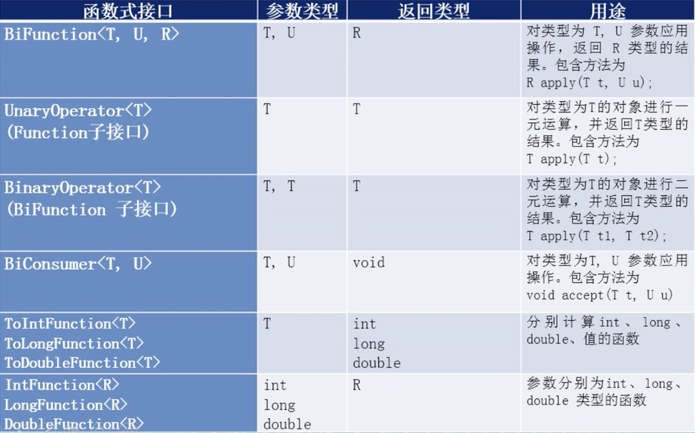

### 一.Lambda表达式

#### 1)Lambda简介

	 Java8引入了一个新的操作符"==->==",该操作符称为尖头操作符或Lambda操作符。箭头操作符把Lambda表达式分成两部分:

1. Lambda左侧:表达式的参数列表
2. Lambda右侧:表达式中所需执行的功能，即Lambda体

#### 2)Lambda基础语法

1. 无参数，无返回值

   ```java
   () -> lambda体
   ```

   ```java
   @Test
   public void test01(){
   
       Runnable runnable = ()-> System.out.println("sada");
       runnable.run();
   }
   ```

   tips：==若Lambd体中只有一条语句时，return和大括号可以省略==

2. 有一个参数，无返回值

   ```java
   (T)-> lambda体
   ```

   ```java
   @Test
   public void test02(){
   
       Consumer<String> consumer = (name)-> System.out.println(name);
       consumer.accept("张三");
   }
   ```

   tips:

   - ==如参数只有一个，则参数的小括号可以省略==

     ```
     Consumer<String> consumer = name -> System.out.println(name);
     ```

3. 有两个以上参数，有返回值，并且lambda体中有多条语句

   ```
   (x,y) -> {
       
      方法体
   }
   ```

   ```java
   @Test
   public void test03(){
   
       List<Integer> list = Arrays.asList(3,4,1,2,6,9,8);
       Comparator<Integer> comparator = (t1,t2) ->{
   
           return  Integer.compare(t1,t2);
       };
       list.sort(comparator);
       System.out.println(list);
   }
   ```

   tips：==lambda表达式的参数列表的数据类型可以省略不写，因为JVM编译器可以通过上下文推断出数据类型。==

#### 3) Lambda表达式需要 函数式接口 的支持

1. 函数式接口的定义

   接口中只有==一个抽象方法==的接口，称为函数式接口。

   可以使用==@FunctionalInterface==修饰，表明该接口是函数式接口

2. 例子

   - 定义

     ```java
     @FunctionalInterface
     public interface MyLamdbaInterface<T> {
     
         public T compare(T t1, T t2);
     
     }
     ```

   - 使用

     ```java
     @Test
     public void test04(){
     
         MyLamdbaInterface<Integer> myLamdbaInterface = (t1,t2)-> {
     
             return  t1 - t2;
         };
     
         useTest04(myLamdbaInterface);
     }
     
     public void useTest04(MyLamdbaInterface myLamdbaInterface){
     
         System.out.println(myLamdbaInterface.compare(10, 20));;
     }
     ```

#### 4)内置的函数式接口

1. 消费型接口(Consumer)

   ```java
   @FunctionalInterface
   public interface Consumer<T> {
   
       /**
        * Performs this operation on the given argument.
        *
        * @param t the input argument
        */
       void accept(T t);
   
   }
   ```

2. 供给型接口(Supplier)

   ```java
   @FunctionalInterface
   public interface Supplier<T> {
   
       /**
        * Gets a result.
        *
        * @return a result
        */
       T get();
   }
   ```

3. 函数型接口(Function)

   ```java
   @FunctionalInterface
   public interface Function<T, R> {
   
       /**
        * Applies this function to the given argument.
        *
        * @param t the function argument
        * @return the function result
        */
       R apply(T t);
   
       /**
        * Returns a function that always returns its input argument.
        *
        * @param <T> the type of the input and output objects to the function
        * @return a function that always returns its input argument
        */
       static <T> Function<T, T> identity() {
           return t -> t;
       }
   }
   
   ```

4. 断言型接口(Predicate)

   ```java
   @FunctionalInterface
   public interface Predicate<T> {
   
       /**
        * Evaluates this predicate on the given argument.
        *
        * @param t the input argument
        * @return {@code true} if the input argument matches the predicate,
        * otherwise {@code false}
        */
       boolean test(T t);
   
       /**
        * Returns a predicate that tests if two arguments are equal according
        * to {@link Objects#equals(Object, Object)}.
        *
        * @param <T> the type of arguments to the predicate
        * @param targetRef the object reference with which to compare for equality,
        *               which may be {@code null}
        * @return a predicate that tests if two arguments are equal according
        * to {@link Objects#equals(Object, Object)}
        */
       static <T> Predicate<T> isEqual(Object targetRef) {
           return (null == targetRef)
                   ? Objects::isNull
                   : object -> targetRef.equals(object);
       }
   }
   ```

5. 其他函数式接口

   


#### 5)使用方法或者构造器创建lambda表达式

##### (1)使用方法

1. ==对象::实例方法名==

   ```java
   @Test
   public void instancMethodTest(){
   
       Person person = new Person("zhangsan","pppp",23);
       Consumer<Integer> consumer = person::setAge;
   
       consumer.accept(25);
       System.out.println(person.getAge());
   
       Supplier<String> supplier = person::getUsername;
   
       System.out.println(supplier.get());
   
       Function<Integer,String> function = person::toStr;
   
       System.out.println(function.apply(34));
       
       Consumer<String> consumer01 = System.out::println;
       consumer01.accept('asdad');
   }
   ```

2. ==类名::静态方法名==

   ```java
   Comparator<Integer> comparator = Integer::compareTo;
   ```

3. ==类名::实例方法名==

   ```sql
   BiPredicate<String,String> biPredicate = (x,y)-> x.equals(y); 
   
   BiPredicate<String,String> biPredicate1 = String::equals;
   
   Function<Person,String> function1 = Person::getUsername;
   //单个参数没有返回值
   Consumer<Person> consumer = Person::toString;
   
   /**
    *  person 实例调用toStr参数类型是Integer类型的方法，
    *  返回值是String类型
    */
   BiFunction<Person,Integer,String> biFunction = Person::toStr;
   ```

   这种类型的规律:

   	 ==第一个泛型类型调用该实例的 等于号(=) 右边的 ::后面的方法，方法的参数类型是第二个泛型类型，返回值类型是第三个泛型类型==

##### (2)构造器引用

1. 格式

   ==类名:new==

2. 使用

   ```java
   //调用的无参构造器
   Supplier<Person> supplier = Person::new;
   supplier.get();
   //调用参数类型为Integer类型的构造器
   Function<Integer,Person> function = Person::new;
   function.apply(23);
   ```

3. 规律

   ==返回类型是要创建的类型，前面的参数类型是对应构造器的要的参数类型==

##### (3)数组引用

1. 格式

   ==类名[]:new==

2. 使用

   ```java
   Function<Integer,String[]> function01 = String[]::new;
   //等同于
   Function<Integer,String[]> function02 = (x) -> new String[x];
   System.out.println(function02.apply(10).length);
   ```


### 二.stream的api

#### 1)说明

1. 创建Stream

   一个数据源(数组，集合)，获取一个流

2. 中间操作

   对数据源的数据进行的操作

3. 终止操作(终端操作)

   执行中间操作链，产生结果

#### 2)创建Stream

##### 1.collection系列集合的stream

```java
List<Integer> list = Arrays.asList(1,2,3,4,5);
list.stream().forEach(System.out::println);
```

##### 2.Arrays里面的静态方法stream()获取数组流

```java
Integer []ints = {1,2,4};
Stream<Integer> integerStream = Arrays.stream(ints);
integerStream.forEach(System.out::println);
```

##### 3.Stream类的静态方法of()获取流

```
Stream<Integer> integerStream1 = Stream.of(1,2,4,5);
integerStream1.forEach(System.out::println);
```

##### 4.Stream类创建无限流

1. 迭代(iterate)

   ```java
   stream<Integer> integerStream2 =  Stream.iterate(0,x-> x + 2);
   integerStream2.forEach(System.out::println);
   ```

2. 生成(generate)

   ```java
   Stream<Person> stream = Stream.generate(Person::new);
   List<Person> peoples = stream.limit(10).collect(Collectors.toList());
   for (Person people : peoples) {
       System.out.println(people);
   }
   ```

#### 2)中间操作

##### 1.筛选与切片

1. filter:从流中排除某些元素。

2. limit-截断流， 使其元素不超过给定数量。

3. skip(n)一跳过元素，返回一个扔掉了前n个元素的流。若流中元素不足n个，则返回一个空流。与limit(n)互补

4. distinct-筛选， 通过流所生成元素的==hashCode()和equals( )==去除重复元素

   ```java
    List<Person> peoples = Arrays.asList(new Person("zhangsan","ssss",23),
                                       new Person("lisi","opsdasd",28),
                                       new Person("wangwu","sasda",25),
                                       new Person("zhaoliu","kondsfsdf",21),
                                       new Person("田七","ghsdasd",27),
                                       new Person("田七","ghsdasd",27),
                                       new Person("田七","ghsdasd",27),
                                       new Person("田七","ghsdasd",27));
   
   peoples.stream()
          .filter((x)->x.getAge()> 25).limit(1)
          .forEach(System.out::println);
   System.out.println("-------------------------------");
   peoples.stream()
          .skip(2)
          .distinct()
          .forEach(System.out::println);
   ```

5. 注意点

   - 惰性求值

     多个中间操作可以连接起来形成一个流水线，除非流水线上触发终止操作，否则中间操作不会执行任何的处理!而在终止操作时一次性全部处理。

##### 2.映射

1. map

   接收Lambda，将元素转换成其他形式或提取信息。接收一个函数作作为参数，该函数会被应用到毎个元素上,并将其映射成一个新的元素。

   ```java
   peoples.stream()
           .map(Person::getUsername)
           .distinct()
           .forEach(System.out::println);
   ```

2. flatMap

   接收一个函数作为参数，将流中的毎个值都换成另一个流，然后把所有流连接成一个流

   ```java
   List<String> names = Arrays.asList("zhangsan","lisi","wangwu");
   //不使用flatMap
   names.stream().map(x->x.chars().mapToObj(y->new Character((char)y))).forEach((x)->x.forEach(System.out::print));
   
   System.out.println("\n------------------");
   //使用了flatMap
   names.stream().flatMap(x->x.chars().mapToObj(y->new Character((char)y))).forEach(System.out::print);
   ```

##### 3.排序

1. sorted

   ```java
   peoples.stream().sorted((x,y)->{
   
       int age_rst = x.getAge().compareTo(y.getAge());
       if (age_rst != 0){
           return age_rst;
       }
       return x.getUsername().compareTo(y.getUsername());
   }).forEach(System.out::println);
   ```

#### 3)终止操作

##### 1.reduce

	将流中元素反复结合起来，得到一个值。

```java
Integer sum01 = peoples.stream().map(Person::getAge).reduce(0,Integer::sum);
Optional<Integer> sum02 = peoples.stream().map(Person::getAge).reduce(Integer::sum);

System.out.println(sum01);
System.out.println(sum02.get());
```

##### 2.査找与匹配

1. allMatch一检査是否匹配所有元素

   ```java
   peoples.stream().allMatch(x->x.getAge() > 25);
   ```

2. anyMatch一检査是否至少匹配- -个元素

   ```java
   peoples.stream().anyMatch(x->x.getAge() > 25);
   ```

3. noneMatch一检査是否没有匹配所有元素

   ```java
   peoples.stream().noneMatch(x->x.getAge() < 20);
   ```

4. findrirst-返回第- - 个元素

   ```java
    peoples.stream().findFirst();
   ```

5. findAny一返回当前流中的任意元素

   ```java
   peoples.stream().findAny().get()
   ```

6. count -返回流中元素的总个数

   ```java
   peoples.stream().count()
   ```

7. max-返回流中最大值

   ```
   peoples.stream().max((x, y) -> {
       int res = x.getUsername().compareTo(y.getUsername());
   
       if (res != 0) {
       	return res;
       }
       return x.getAge().compareTo(y.getAge());
   }).orElse(null)
   ```

8. min-返回流中最小值

   ```java
   peoples.stream().min((x, y) -> {
       int res = x.getUsername().compareTo(y.getUsername());
   
       if (res != 0) {
           return res;
       }
       return x.getAge().compareTo(y.getAge());
   }).orElse(null)
   ```

##### 3.收集(collect)

	collect一将 流转换为其他形式。接收一一个Collector接口的实现,

1. 集合(list,set)

   - 常用集合

   - 特殊集合

2. 