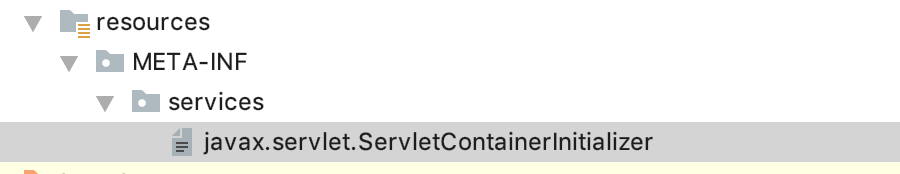
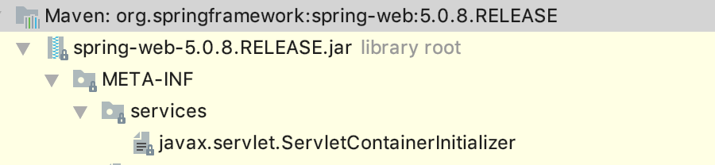
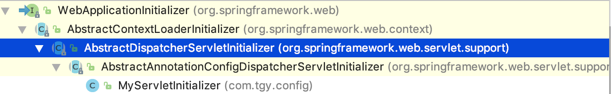

### 一.IOC容器

#### 1.@ComponentScan注解

根据给的包名，扫描包下的bean到spring容器中 。

##### (1) excludeFilters

排除扫描的bean，根据FilterType得知有如下方式

1. FilterType.ANNOTATION

   根据annotation排除

   ```java
   excludeFilters = {@ComponentScan.Filter(type=FilterType.ANNOTATION,classes = Controller.class)}
   ```

2. FilterType.ASSIGNABLE_TYPE

   根据类的类型排除

   ```java
   excludeFilters = {@ComponentScan.Filter(type = FilterType.ASSIGNABLE_TYPE,classes = Person.class)}
   ```

3. FilterType.CUSTOM

   实现TypeFilter接口，自定义排除规则

   ```
   excludeFilters = {@ComponentScan.Filter(type = FilterType.CUSTOM,classes = MyTypeFilter.class)},
   ```

   ```java
   public class MyTypeFilter implements TypeFilter {
       @Override
       public boolean match(MetadataReader metadataReader, MetadataReaderFactory metadataReaderFactory) throws IOException {
   
           System.out.println(metadataReader.getClassMetadata().getClassName());
   
           if (metadataReader.getClassMetadata().getClassName().contains("My")){
   
               return true;
           }
   
           return false;
       }
   }
   ```

##### (2)includeFilters

​	包含扫描的bean，与排除类型一样，都有三种主要的保护方式，但是要使其起作用，必须设置ComponentScan的==use-default-Filters==为false

```java
@ComponentScan(value = "com.tgy.spring.annotation",
               includeFilters = {@ComponentScan.Filter(type = FilterType.CUSTOM,classes = MyTypeFilter.class)},
               useDefaultFilters = false)
```

#### 2.@Scope注解

1. ConfigurableBeanFactory.SCOPE_PROTOTYPE

   表示bean为多例，==每次获取创建一个新的bean==

   ```java
   @Scope(value = ConfigurableBeanFactory.SCOPE_PROTOTYPE)
    @Bean
    public Person person(){
   
   	System.out.println("person创建");
   	return new Person();
    }
   ```

   ```java
   AnnotationConfigApplicationContext applicationContext = new AnnotationConfigApplicationContext(MyConfig01.class);
   
   Person person01 = applicationContext.getBean(Person.class);
   Person person02 = applicationContext.getBean(Person.class);
   //多例，下面输出false
   System.out.println(person01 == person02);
   ```

2. ConfigurableBeanFactory.SCOPE_SINGLETON

   表示bean为单例，在spring容器==初始化==的时候创建，以后每次获取都从缓存中获取。spring默认的bean都是该选项。即==默认不写就是单例==。

   ```java
    @Scope(value = ConfigurableBeanFactory.SCOPE_SINGLETON)
    @Bean
    public Person person(){
   
   	System.out.println("person创建");
   	return new Person();
    }
   ```

   ```java
   AnnotationConfigApplicationContext applicationContext = new AnnotationConfigApplicationContext(MyConfig01.class);
   
   Person person01 = applicationContext.getBean(Person.class);
   Person person02 = applicationContext.getBean(Person.class);
   //单例，下面输出true
   System.out.println(person01 == person02);
   ```

#### 3.@Lazy注解

​	由于spring默认bean是在Spring容器==初始化==的时候创建，为了把bean的创建推迟到==获取bean的时候创建==，可以使用该注解

```java
@Lazy
@Bean
public Person person(){

    System.out.println("person创建");
    return new Person();
}
```

```java
//在这里创建bean
Person person01 = applicationContext.getBean(Person.class);
```

#### 4.@Condition注解

 通过实现@Condition注解指定的Condition接口，对当前类是否加入spring容器做判断

##### (1)使用方式

1. 实现Condition接口

   ```java
   public class MyConditionImp implements Condition {
   
   
       public boolean matches(ConditionContext context, AnnotatedTypeMetadata metadata) {
           //获取自定义的注解的参数信息
           Map<String, Object> myCondition = metadata.getAnnotationAttributes("con.tgy.annotation.MyCondition");
           System.out.println(myCondition);
           
           return false;
       }
   }
   ```

2. 在对应的方法上面加上该注解

   ```java
   @Conditional(MyConditionImp.class)
   @Bean
   public Animal animal(){
   
   	return new Animal();
   }
   ```

##### (2)springboot中的应用

###### 1.@ConditionalOnProperty

​	具体操作是通过其两个属性name以及havingValue来实现的，其中name用来从application.properties中读取某个属性值，如果该值为空，则返回false;如果值不为空，则将该值与havingValue指定的值进行比较，如果一样则返回true;否则返回false。如果返回值为false，则该configuration不生效；为true则生效。

```java
@Retention(RetentionPolicy.RUNTIME)
@Target({ ElementType.TYPE, ElementType.METHOD })
@Documented
@Conditional(OnPropertyCondition.class)
public @interface ConditionalOnProperty {

    //数组，获取对应property名称的值，与name不可同时使用  
    String[] value() default {}; 
  
    //property名称的前缀，可有可无  
    String prefix() default "";
    
  //数组，property完整名称或部分名称（可与prefix组合使用，组成完整的property名称），与value不可同时使用 
    String[] name() default {}; 
  
    //可与name组合使用，比较获取到的属性值与havingValue给定的值是否相同，相同才加载配置  
    String havingValue() default "";
  
    //缺少该property时是否可以加载。如果为true，没有该property也会正常加载；反之报错  
    boolean matchIfMissing() default false;
  
    //是否可以松散匹配，至今不知道怎么使用的  
    boolean relaxedNames() default true;
} 
}
```

==注意:==

- 这样实现方式不能在注解里面带参数，做判断。要想带参数，需要自定义自己的annotation

  1. 定义注解,在自定义的注解上面加上@Conditional注解，同时指定对应的实现了Condition注解的类。

     ```java
     @Target({ElementType.TYPE, ElementType.METHOD})
     @Retention(RetentionPolicy.RUNTIME)
     @Conditional(MyConditionImp.class)
     public @interface MyCondition {
     
         String className() default "";
     }
     ```

  2. 实现的Condition接口类与上面的一致

  3. 使用只是把@Condition换成自定义的@MyCondition

     ```java
     @MyCondition(className = "animal")
     @Bean
     public Animal animal(){
     
     	return new Animal();
     }
     ```

  4. 这里只是简单的演示，要想自定义condition注解，可以参考springBoot里面的==@ConditionalOnClass==和==@ConditionalOnBean==等待

- ==@Condition在spring源码中的处理==

  ==ConditionEvaluator==类的方法

  ```java
  public boolean shouldSkip(@Nullable AnnotatedTypeMetadata metadata, @Nullable ConfigurationPhase phase) {
  	if (metadata == null || !metadata.isAnnotated(Conditional.class.getName())) {
  		return false;
  	}
  
  	if (phase == null) {
  		if (metadata instanceof AnnotationMetadata &&
  				ConfigurationClassUtils.isConfigurationCandidate((AnnotationMetadata) metadata)) {
  			return shouldSkip(metadata, ConfigurationPhase.PARSE_CONFIGURATION);
  		}
  		return shouldSkip(metadata, ConfigurationPhase.REGISTER_BEAN);
  	}
  
      
  	List<Condition> conditions = new ArrayList<>();
  	for (String[] conditionClasses : getConditionClasses(metadata)) {
  		for (String conditionClass : conditionClasses) {
              //获取所有实现了Condition接口的类
  			Condition condition = getCondition(conditionClass, this.context.getClassLoader());
  			conditions.add(condition);
  		}
  	}
  
  	AnnotationAwareOrderComparator.sort(conditions);
  
  	for (Condition condition : conditions) {
  		ConfigurationPhase requiredPhase = null;
  		if (condition instanceof ConfigurationCondition) {
  			requiredPhase = ((ConfigurationCondition) condition).getConfigurationPhase();
  		}
          //定义Condition对应的接口
  		if ((requiredPhase == null || requiredPhase == phase) && !condition.matches(this.context, metadata)) {
  			return true;
  		}
  	}
  
  	return false;
  }
  ```


#### 5.@Import注解

1. 直接把要注册的bean放入到该注解中

   ```java
   //把Person加到Spring容器中
   @Configuration
   @Import({Person.class,MyImportSelector.class,MyImportBeanDefinitionRegistrar.class})
   @EnableAsync
   public class SpringConfig {
       
   }
   ```

2. 把实现了ImportSelector接口的类加入到注解中

   ```java
   //把实现了ImportSelect接口的MyImportSelector的selectImports返回的bean加到Spring容器中
   @Configuration
   @Import({MyImportSelector.class,MyImportBeanDefinitionRegistrar.class})
   @EnableAsync
   public class SpringConfig {
       
   }
   ```

   ```java
   public class MyImportSelector implements ImportSelector {
       @Override
       public String[] selectImports(AnnotationMetadata importingClassMetadata) {
   
   
           return new String[]{"con.tgy.bean.Red"};
       }
   }
   ```

3. 把实现了ImportBeanDefinitionRegistrar接口的类加入到注解中

   ```java
   //把实现了MyImportBeanDefinitionRegistrar接口的MyImportBeanDefinitionRegistrar的registerBeanDefinitions方法里面注册要加入的bean
   @Configuration
   @Import({MyImportBeanDefinitionRegistrar.class})
   @EnableAsync
   public class SpringConfig {
       
   }
   ```

   ```java
   public class MyImportBeanDefinitionRegistrar implements ImportBeanDefinitionRegistrar {
       @Override
       public void registerBeanDefinitions(AnnotationMetadata importingClassMetadata, BeanDefinitionRegistry registry) {
   
           RootBeanDefinition rootBeanDefinition  = new RootBeanDefinition();
           rootBeanDefinition.setBeanClass(Green.class);
           registry.registerBeanDefinition("green",rootBeanDefinition);
       }
   }
   
   ```

#### 6.FactoryBean接口

​	该接口的作用是实现把bean加入到spring容器中

```java
public interface FactoryBean<T> {

	/**
	 *	返回需要加入Spring容器的实例
	 */
	@Nullable
	T getObject() throws Exception;

	/**
	 *	返回需要加入Spring容器的类型
	 */
	@Nullable
	Class<?> getObjectType();

	/**
	 *	创建的bean是否是单列
	 */
	default boolean isSingleton() {
		return true;
	}
}

```


#### 7.bean的初始化和销毁

​	bean的初始化指的是bean所有的属性都装配完成之后调用的方法。销毁指的是容器关闭(调用ApplicationContext的close方法)的时候调用的方法。

##### (1)在@Bean中指定

1. 使用方式

   (1). 定义两个方法init,destroy，分别对应初始化与销毁

   ```java
   public class Person {
   
      
       public void init(){
   
           //InitDestroyAnnotationBeanPostProcessor 处理的@PostConstruct注解
           //初始化在类创建同时属性赋值好之后调用
           System.out.println(getClass().getName() + "初始化");
       }
   
       public void destroy(){
   
           //在spring容器停止之前调用
           System.out.println(getClass().getName() + "容器销毁");
       }
   }
   ```

   (2). 在@bean中分别指定initMethod和destroyMethod

   ```java
   @Bean(initMethod = "init",destroyMethod = "destroy")
   public Person animal(@Value("${person.name}") String name){
   
       System.out.println(name);
       return new Person();
   }
   ```

2. 源码分析

   在AbstractAutowireCapableBeanFactory类的invokeInitMethods方法调用初始化方法

   ```java
   if (mbd != null && bean.getClass() != NullBean.class) {
   String initMethodName = mbd.getInitMethodName();
   	if (StringUtils.hasLength(initMethodName) &&
   			!(isInitializingBean && "afterPropertiesSet".equals(initMethodName)) &&
   			!mbd.isExternallyManagedInitMethod(initMethodName)) {
           //执行初始化方法
   		invokeCustomInitMethod(beanName, bean, mbd);
       }
   }
   ```

##### (2)使用@PostConstruct和@PreDestroy

1. 使用方式

   在对应的初始化方法和销毁方法上分别加上对应的注解即可

   ```
   public class Person {
   
       @PostConstruct
       public void init(){
   
           //InitDestroyAnnotationBeanPostProcessor 处理的@PostConstruct注解
           //初始化在类创建同时属性赋值好之后调用
           System.out.println(getClass().getName() + "初始化");
       }
   
       @PreDestroy
       public void destroy(){
   
           //在spring容器停止之前调用
           System.out.println(getClass().getName() + "容器销毁");
       }
   
   }
   
   ```

2. 源码分析

   spring定义了一个proccessor来处理该注解 InitDestroyAnnotationBeanPostProcessor

```java
@Override
public void postProcessBeforeDestruction(Object bean, String beanName) throws BeansException {
	
    //获取metadata
	LifecycleMetadata metadata = findLifecycleMetadata(bean.getClass());
    //调用init方法
	metadata.invokeDestroyMethods(bean, beanName);
}
```

##### (3)实现InitializingBean和DisposableBean接口

1. 使用

   InitializingBean接口对应初始化方法是：afterPropertiesSet，DisposableBean销毁方法是destroy

   ```java
   public class Green implements InitializingBean,DisposableBean {
   
       /**
        * invokeInitMethods 方法的
        *((InitializingBean) bean).afterPropertiesSet();
        *
        * @throws Exception
        */
       @Override
       public void afterPropertiesSet() throws Exception {
   
   
           System.out.println(getClass().getName() + "初始化");
       }
   
       @Override
       public void destroy() throws Exception {
   
           System.out.println(getClass().getName() + "销毁");
       }
   }
   ```

2. 源码

   在AbstractAutowireCapableBeanFactory类的invokeInitMethods方法调用初始化方法

   ```java
   ((InitializingBean) bean).afterPropertiesSet();
   ```

#### 8.bean的后置处理器(BeanPostProcessor)

在BeanPostProcessor接口中有两个方法，

1. 初始化方法调用之前调用

   ```java
   @Nullable
   default Object postProcessBeforeInitialization(Object bean, String beanName) throws BeansException {
   	return bean;
   }
   ```

2. 初始化方法调用之后调用

   ```java
   @Nullable
   default Object postProcessAfterInitialization(Object bean, String beanName) throws BeansException {
   	return bean;
   }
   ```

#### 9.@Value

通过@Value将外部的值动态注入到Bean中，使用的情况有：

- 注入普通字符串
- 注入操作系统属性
- 注入表达式结果
- 注入其他Bean属性：注入beanInject对象的属性another
- 注入文件资源
- 注入URL资源

```java
@Value("normal")
private String normal; // 注入普通字符串

@Value("#{systemProperties['os.name']}")
private String systemPropertiesName; // 注入操作系统属性

@Value("#{ T(java.lang.Math).random() * 100.0 }")
private double randomNumber; //注入表达式结果

@Value("#{beanInject.another}")
private String fromAnotherBean; // 注入其他Bean属性：注入beanInject对象的属性another，类具体定义见下面
@Value("classpath:com/hry/spring/configinject/config.txt")
private Resource resourceFile; // 注入文件资源

@Value("http://www.baidu.com")
private Resource testUrl; // 注入URL资源
```

#### 10.@PropertySource

​	通过@PropertySource注解将properties配置文件中的值存储到Spring的 Environment中，Environment接口提供方法去读取配置文件中的值，参数是properties文件中定义的key值。

在对应的Config类头部标上

```java
@PropertySource("classpath:/source.properties")
```

##### (1)@Value对属性进行赋值

```java
//@Value("${name}")
private String name;
```

##### (2)EnvironmentAware接口对属性进行赋值

1. 实现对应的接口方法

   ```java
   /**
   * Set the {@code Environment} that this component runs in.
   */
   void setEnvironment(Environment environment);
   ```

2. 使用方法传过来的Environment对象对属性进行赋值

   ```java
   @Override
   public void setEnvironment(Environment environment) {
   
   	setName(environment.getProperty("name"));
   }
   ```

##### (3)EmbeddedValueResolverAware接口对属性进行赋值

1. 实现对应接口方法

   ```java
   /**
    * Set the StringValueResolver to use for resolving embedded definition values.
    */
   void setEmbeddedValueResolver(StringValueResolver resolver);
   ```

2. 使用方法传过来的StringValueResolver对象对属性进行赋值

   ```java
   @Override
   public void setEmbeddedValueResolver(StringValueResolver resolver) {
   
       setName(resolver.resolveStringValue("${name}"));
   }
   ```

#### 11.@Autowired,@Qualifier,@Primary

##### (1)@Autowired,@Qualifier,@Primary协作运行规则

1. @Autowired自动注入,默认是先以**byType**的方式,如果有多个类型相匹配,那么使用**byName**进行注入。
2. 如果想**直接使用byName的注入方式**，那么需要在@Autowired注解的下面加上注解**@Qualifier**(“userService”),括号里面为要注入的bean的name。
3. 如果在spring容器中有多个bean，可以通过**@Primary指定某个bean为主要的**，在使用@Autowired的时候注入的就是标记了@Primary的bean。

##### (2)@Autowired可以使用的位置

1. 属性

2. 普通方法

   ```java
   @Bean
   @Autowired
   //也可以在方法的参数列表中，可以默认不写
   public Dog dog(/*@Autowired*/ Person person){ 
       
       return new Dog();
   }
   ```

3. 构造方法

   ```java
   @Autowired
   public Animal(Person person) {
       
   	this.person = person;
   }
   ```

**注意:**

1. 使用@Autowired放在方法或者构造方法上面时，也可以把它放在**参数列表**中。
2. @Autowired放在方法或者构造方法上面时一般会**省略掉**其本身。

#### 12.@Profile

​	@profile注解是spring提供的一个用来标明当前运行环境的注解。我们正常开发的过程中经常遇到的问题是，开发环境是一套环境，测试是一套环境，线上部署又是一套环境。这样从开发到测试再到部署，会对程序中的配置修改多次，尤其是从测试到上线这个环节，让测试的也不敢保证改了哪个配置之后能不能在线上运行。
为了解决上面的问题，我们一般会使用一种方法，就是配置文件，然后通过不同的环境读取不同的配置文件，从而在不同的场景中跑我们的程序。

​	那么，spring中的@Profile注解的作用就体现在这里。在spring使用DI来依赖注入的时候，能够根据当前制定的运行环境来注入相应的bean。最常见的就是使用不同的DataSource了。

1. 配置不同环境的bean

   ```java
   @Configuration
   public class MyConfig02 {
   
       @Bean
       @Profile("dev")
       public PersonInteface personIntefaceDev(){
   
           return new PersonDev();
       }
       
       @Bean
       @Profile("prod")
       public PersonInteface personIntefaceProd(){
   
           return new PersonProd();
       }
   }
   
   ```

2. 设置对应的环境

   ```java
   @RunWith(SpringRunner.class)
   @SpringBootTest
   //从指定的Config文件读取配置
   @ContextConfiguration(classes = MyConfig02.class)
   //指定环境
   @ActiveProfiles(value = "prod")
   public class ValueTest01 {
   
   
       //自动注入ApplicationContext对象
       @Autowired
       private ApplicationContext applicationContext;
       
       @Test
       public void test01(){
   
           PersonInteface personInteface = applicationContext.getBean(PersonInteface.class);
   
           System.out.println(personInteface.getName());
   
       }
   
   }
   ```

**注意:**

1. @Profile可以放在对应的配置文件上面。对应@Profile设置的环境加载对应配置文件中的bean

   ```java
   @Configuration
   @Profile(value = "dev")
   public class MyConfig02 {
   
       @Bean
       public PersonInteface personIntefaceDev(){
   
           return new PersonDev();
       }
   
       @Bean
       public Person person02(){
   
           return new Person();
       }
   
       @Bean
       public PersonInteface personIntefaceProd(){
   
           return new PersonProd();
       }
   }
   ```

   **上面表示只有在dev环境下面，才注册配置文件中的bean**。

### 二.AOP

#### 1.aop概念

1. 横切关注点

   对哪些方法进行拦截，拦截后怎么处理，这些关注点称之为横切关注点

2. 切面（aspect）

   类是对物体特征的抽象，切面就是对横切关注点的抽象

3. 连接点（joinpoint）

   被拦截到的点，因为Spring只支持方法类型的连接点，所以在Spring中连接点指的就是被拦截到的方法，实际上连接点还可以是字段或者构造器

4. 切入点（pointcut）

   对连接点进行拦截的定义

5. 通知（advice）

   所谓通知指的就是指拦截到连接点之后要执行的代码，通知分为前置、后置、异常、最终、环绕通知五类

6. 目标对象

   代理的目标对象

7. 织入（weave）

   将切面应用到目标对象并导致代理对象创建的过程

8. 引入（introduction）

   在不修改代码的前提下，引入可以在**运行期**为类动态地添加一些方法或字段

#### 2.Spring对AOP的支持

​	**Spring中AOP代理由Spring的IOC容器负责生成、管理，其依赖关系也由IOC容器负责管理**。因此，AOP代理可以直接使用容器中的其它bean实例作为目标，这种关系可由IOC容器的依赖注入提供。Spring创建代理的规则为：

1. **默认使用Java动态代理来创建AOP代理**，这样就可以为任何接口实例创建代理了

2. **当需要代理的类不是代理接口的时候，Spring会切换为使用CGLIB代理**，也可强制使用CGLIB

AOP编程其实是很简单的事情，纵观AOP编程，程序员只需要参与三个部分：

1. 定义普通业务组件

2. 定义切入点，一个切入点可能横切多个业务组件

   ```java
   @Pointcut("execution(* com.tgy.spring.annotation.entity.Animal.* (..))")
   private void pointCut(){
   
   }
   ```

3. 定义增强处理，增强处理就是在AOP框架为普通业务组件织入的处理动作

   - 前置通知

     ```java
     @Before("pointCut()")
     public void before(JoinPoint joinPoint){
     
         //获取切入的方法名
         String methodName  = joinPoint.getSignature().getName();
     	//获取切人的方法参数
         List<Object> params = Arrays.asList(joinPoint.getArgs());
         System.out.println(methodName + "开始执行");
     }
     ```

   - 后置通知

     ```java
     @After(value = "pointCut()")
     public void after(JoinPoint joinPoint){
     
         String methodName  = joinPoint.getSignature().getName();
         System.out.println(methodName + "执行了");
     }
     ```

   - 异常通知

     ```java
     @AfterThrowing(value = "pointCut()",throwing = "exp")
     public void afterThrow(JoinPoint joinPoint,Exception exp){
     
     
         String methodName  = joinPoint.getSignature().getName();
         System.out.println(methodName + "发生了异常，异常为" + exp);
     }
     ```

     **注意:** JoinPoint变量必须写在第一位，不然报错

   - 最终通知

     ```java
     @AfterReturning(value = "pointCut()",returning = "param")
     public void afterReturn(JoinPoint joinPoint,Object param){
     
         String methodName  = joinPoint.getSignature().getName();
         System.out.println(methodName + "返回了,结果为:" + param);
     }
     ```

     **注意:** JoinPoint变量必须写在第一位，不然报错

   - 环绕通知

     ```java
     @Around("pointCut()")
     public Object around(ProceedingJoinPoint joinPoint) throws Throwable{
     
     
         System.out.println("around执行前");
         Object o = joinPoint.proceed(joinPoint.getArgs());
         System.out.println("around执行后");
         return o;
     
     }
     ```

所以进行AOP编程的关键就是定义切入点和定义增强处理，一旦定义了合适的切入点和增强处理，AOP框架将自动生成AOP代理，即：**代理对象的方法=增强处理+被代理对象**的方法。

完整的一个切面类:

```java
@Aspect
@Component
public class MyAspect {
    
    @Pointcut("execution(* com.tgy.spring.annotation.entity.Animal.* (..))")
    private void pointCut(){

    }

    @Before("pointCut()")
    public void before(JoinPoint joinPoint){

        String methodName  = joinPoint.getSignature().getName();

        List<Object> params = Arrays.asList(joinPoint.getArgs());

        System.out.println(methodName + "开始执行");
    }

    @After(value = "pointCut()")
    public void after(JoinPoint joinPoint){

        String methodName  = joinPoint.getSignature().getName();
        System.out.println(methodName + "执行了");
    }

    @AfterReturning(value = "pointCut()",returning = "param")
    public void afterReturn(JoinPoint joinPoint,Object param){


        String methodName  = joinPoint.getSignature().getName();

        System.out.println(methodName + "返回了,结果为:" + param);
    }

    @AfterThrowing(value = "pointCut()",throwing = "exp")
    public void afterThrow(JoinPoint joinPoint,Exception exp){


        String methodName  = joinPoint.getSignature().getName();
        System.out.println(methodName + "发生了异常，异常为" + exp);
    }

    @Around("pointCut()")
    public Object around(ProceedingJoinPoint joinPoint) throws Throwable{


        System.out.println("around执行前");
        Object o = joinPoint.proceed(joinPoint.getArgs());
        System.out.println("around执行后");
        return o;

    }

}
```

#### 3.SpringBoot的AOP自动装配

(1) 导入AOP对应的starter

```
<!-- spring boot aop starter依赖 -->
<dependency>
    <groupId>org.springframework.boot</groupId>
    <artifactId>spring-boot-starter-aop</artifactId>
</dependency>
```

(2)由于导入了对应的包，在spring的自动配置包(org.springframework.boot.autoconfigure.aop.AopAutoConfiguration)中就会在springBoot启动的时候自动加载对应的配置文件类。

```java
@Configuration
@ConditionalOnClass({ EnableAspectJAutoProxy.class, Aspect.class, Advice.class,
		AnnotatedElement.class })
@ConditionalOnProperty(prefix = "spring.aop", name = "auto", havingValue = "true", matchIfMissing = true)
public class AopAutoConfiguration {

	@Configuration
	@EnableAspectJAutoProxy(proxyTargetClass = false)
	@ConditionalOnProperty(prefix = "spring.aop", name = "proxy-target-class", havingValue = "false", matchIfMissing = false)
	public static class JdkDynamicAutoProxyConfiguration {

	}

	@Configuration
	@EnableAspectJAutoProxy(proxyTargetClass = true)
	@ConditionalOnProperty(prefix = "spring.aop", name = "proxy-target-class", havingValue = "true", matchIfMissing = true)
	public static class CglibAutoProxyConfiguration {

	}

}
```

@EnableAspectJAutoProxy注解

```java
@Target(ElementType.TYPE)
@Retention(RetentionPolicy.RUNTIME)
@Documented
@Import(AspectJAutoProxyRegistrar.class)
public @interface EnableAspectJAutoProxy {

	boolean proxyTargetClass() default false;

	boolean exposeProxy() default false;
}
```

通过AspectJAutoProxyRegistrar向spring容器中注入AOP处理对象。

(3)定义切面类

**注意点:**

1. 把切面类加到spring容器中
2. 在切面类上面加上@Aspect注解，告诉spring该类是一个切面。


### 三.事件

#### 1.事件监听

##### (1)实现ApplicationListener接口

```java
@Slf4j
@Component
public class MyEventListener implements ApplicationListener<ApplicationEvent> {
    @Override
    public void onApplicationEvent(ApplicationEvent event) {

      log.info("接收到事件:{}",event);
    }
}
```

##### (2)使用@EventListener注解

```java
@Service
@Slf4j
public class MyService {

    @EventListener()
    public void event(ApplicationEvent applicationEvent){

        log.info("event,接收到事件:{}",applicationEvent);
    }
}
```

**@EventListener原理**

EventListenerMethodProcessor实现了**SmartInitializingSingleton**

```java
public interface SmartInitializingSingleton {

	/**
	 * 本方法是在单实例bean创建之后调用
	 */
	void afterSingletonsInstantiated();

}
```

在EventListenerMethodProcessor的afterSingletonsInstantiated方法中调用了processBean(final String beanName, final Class<?> targetType)，在该方法中创建了ApplicationListenerMethodAdaptor类 ，把对应的用@EventListener装饰的类中的方法设置到ApplicationListenerMethodAdaptor实例中，

```java
ConfigurableApplicationContext context = this.applicationContext;
Assert.state(context != null, "No ApplicationContext set");
List<EventListenerFactory> factories = this.eventListenerFactories;
Assert.state(factories != null, "EventListenerFactory List not initialized");
for (Method method : annotatedMethods.keySet()) {
    for (EventListenerFactory factory : factories) {
        if (factory.supportsMethod(method)) {
            Method methodToUse = AopUtils.selectInvocableMethod(method, context.getType(beanName));
            ApplicationListener<?> applicationListener =
                    factory.createApplicationListener(beanName, targetType, methodToUse);
            if (applicationListener instanceof ApplicationListenerMethodAdapter) {
                ((ApplicationListenerMethodAdapter) applicationListener).init(context, this.evaluator);
            }
            context.addApplicationListener(applicationListener);
            break;
        }
    }
}
```

#### 2.事件触发

##### (1)自定义事件

```java
public class MyEvent extends ApplicationEvent {
    /**
     * Create a new ApplicationEvent.
     *
     * @param source the object on which the event initially occurred (never {@code null})
     */
    public MyEvent(Object source) {
        super(source);
    }
}
```

##### (2)发布事件

```java
applicationContext.publishEvent(new MyEvent(new Object()));
```

#### 3.定义异步事件

在spring容器启动的时候向容器中加入**SimpleApplicationEventMulticaster**,设置taskExecutor

```java
@Bean("applicationEventMulticaster")
public SimpleApplicationEventMulticaster simpleApplicationEventMulticaster(@Autowired BeanFactory beanFactory){

    SimpleApplicationEventMulticaster multicaster = new SimpleApplicationEventMulticaster(beanFactory);
    multicaster.setTaskExecutor(Executors.newScheduledThreadPool(10));
    return multicaster;
}
```

### 四.servlet3.0新规范

#### 1.为servlet，listener，filter添加注解方式

```
@WebServlet
@WebFilter
@WebListener
```

```java
@WebServlet("/name")
public class MyServlet01 extends HttpServlet {

    @Override
    protected void doGet(HttpServletRequest req, HttpServletResponse resp) throws ServletException, IOException {

        resp.getWriter().write("sadasd");
    }
}
```

#### 2.去除web.xml

##### 1)在类路径下创建 META-INF/services 目录

​	再该路径下创建javax.servlet.ServletContainerInitializer文件，里面写上实现了ServletContainerInitializer类的全路径。



```
com.tgy.config.MyServletContainerInitializer
```

##### 2)实现ServletContainerInitializer接口

```java
@HandlesTypes(MyServletInitializer.class)
public class MyServletContainerInitializer implements ServletContainerInitializer {
    @Override
    public void onStartup(Set<Class<?>> set, ServletContext servletContext) throws ServletException {


        //set里面就是实现了MyServletInitializer接口的对象
        
        //添加servlet
        ServletRegistration.Dynamic servlet02 = servletContext.addServlet("myServlet02", new MyServlet02());
        servlet02.addMapping("/name02");

        //添加filter
        FilterRegistration.Dynamic filter01 = servletContext.addFilter("filter01", "com.tgy.filter.MyFilter");

        //添加filter拦截的路径
        filter01.addMappingForUrlPatterns(EnumSet.of(DispatcherType.REQUEST),true,"/");

        //添加listener
        servletContext.addListener(new MyServletContextListener());
    }
}
```

**注意:**

1. @HandlesTypes注解

   该注解里面填写要收集的类或者接口，在执行onStartup时，会把该类及其子类的类定义回传到方法的set参数中。方便我们定义自己逻辑代码。

   以下是springWeb自定义的实现ServletContainerListener接口的类

   ```java
   @HandlesTypes(WebApplicationInitializer.class)
   public class SpringServletContainerInitializer implements ServletContainerInitializer {
   
   	@Override
   	public void onStartup(@Nullable Set<Class<?>> webAppInitializerClasses, ServletContext servletContext)
   			throws ServletException {
   
   		List<WebApplicationInitializer> initializers = new LinkedList<>();
   
   		if (webAppInitializerClasses != null) {
   			for (Class<?> waiClass : webAppInitializerClasses) {
   				// Be defensive: Some servlet containers provide us with invalid classes,
   				// no matter what @HandlesTypes says...
   				if (!waiClass.isInterface() && !Modifier.isAbstract(waiClass.getModifiers()) &&
   						WebApplicationInitializer.class.isAssignableFrom(waiClass)) {
   					try {
   						initializers.add((WebApplicationInitializer)
   								ReflectionUtils.accessibleConstructor(waiClass).newInstance());
   					}
   					catch (Throwable ex) {
   						throw new ServletException("Failed to instantiate WebApplicationInitializer class", ex);
   					}
   				}
   			}
   		}
   
   		if (initializers.isEmpty()) {
   			servletContext.log("No Spring WebApplicationInitializer types detected on classpath");
   			return;
   		}
   
   		servletContext.log(initializers.size() + " Spring WebApplicationInitializers detected on classpath");
   		AnnotationAwareOrderComparator.sort(initializers);
   		for (WebApplicationInitializer initializer : initializers) {
   			initializer.onStartup(servletContext);
   		}
   	}
   
   }
   ```

2. 为web容器添加servlet，filter，listener

   使用servletContext注册servlet，filter，listener对象

   - 添加servlet

     ```java
     //添加servlet
     ServletRegistration.Dynamic servlet02 = servletContext.addServlet("myServlet02", new MyServlet02());
     servlet02.addMapping("/name02");
     ```

   - 添加filter

     ```java
     //添加filter
     FilterRegistration.Dynamic filter01 = servletContext.addFilter("filter01", "com.tgy.filter.MyFilter");
     
     //添加filter拦截的路径
     filter01.addMappingForUrlPatterns(EnumSet.of(DispatcherType.REQUEST),true,"/");    
     ```

   - 添加listener

     ```java
     //添加listener
     servletContext.addListener(new MyServletContextListener());
     ```

#### 3.接入springMVC

##### 1)接入原理

1. 在spring-web包中有javax.servlet.ServletContainerInitializer,里面有SpringServletContainerInitializer

   

   ```java
   @HandlesTypes(WebApplicationInitializer.class)
   public class SpringServletContainerInitializer implements ServletContainerInitializer {
   
   	@Override
   	public void onStartup(@Nullable Set<Class<?>> webAppInitializerClasses, ServletContext servletContext)
   			throws ServletException {
   
   		List<WebApplicationInitializer> initializers = new LinkedList<>();
   
   		if (webAppInitializerClasses != null) {
   			for (Class<?> waiClass : webAppInitializerClasses) {
   				// Be defensive: Some servlet containers provide us with invalid classes,
   				// no matter what @HandlesTypes says...
   				if (!waiClass.isInterface() && !Modifier.isAbstract(waiClass.getModifiers()) &&
   						WebApplicationInitializer.class.isAssignableFrom(waiClass)) {
   					try {
   						initializers.add((WebApplicationInitializer)
   								ReflectionUtils.accessibleConstructor(waiClass).newInstance());
   					}
   					catch (Throwable ex) {
   						throw new ServletException("Failed to instantiate WebApplicationInitializer class", ex);
   					}
   				}
   			}
   		}
   
   		if (initializers.isEmpty()) {
   			servletContext.log("No Spring WebApplicationInitializer types detected on classpath");
   			return;
   		}
   
   		servletContext.log(initializers.size() + " Spring WebApplicationInitializers detected on classpath");
   		AnnotationAwareOrderComparator.sort(initializers);
   		for (WebApplicationInitializer initializer : initializers) {
   			initializer.onStartup(servletContext);
   		}
   	}
   
   }
   ```

   只要实现了WebApplicationInitializer接口，就可以被springMVC获取到，然后调用里面的onStartup方法，实现初始化

   

2. 在AbstractContextLoaderInitializer类中有**registerContextLoaderListener**方法，注册spring的容器

   ```
   protected void registerContextLoaderListener(ServletContext servletContext) {
   	WebApplicationContext rootAppContext = createRootApplicationContext();
   	if (rootAppContext != null) {
   		ContextLoaderListener listener = new ContextLoaderListener(rootAppContext);
   		listener.setContextInitializers(getRootApplicationContextInitializers());
   		servletContext.addListener(listener);
   	}
   	else {
   		logger.debug("No ContextLoaderListener registered, as " +
   				"createRootApplicationContext() did not return an application context");
   	}
   }
   ```

   在**createRootApplicationContext()**方法中创建spring容器,在AbstractAnnotationConfigDispatcherServletInitializer类中重写了该方法。

   ```java
   protected WebApplicationContext createRootApplicationContext() {
   	Class<?>[] configClasses = getRootConfigClasses();
   	if (!ObjectUtils.isEmpty(configClasses)) {
   		AnnotationConfigWebApplicationContext context = new AnnotationConfigWebApplicationContext();
   		context.register(configClasses);
   		return context;
   	}
   	else {
   		return null;
   	}
   }
   ```

   在**getRootConfigClasses();**方法中获取springMVC配置文件，只需要在子类复古该方法。

3. 在**AbstractDispatcherServletInitializer**类的registerDispatcherServlet方法中注册servlet，filter，listener。

   ```java
   protected void registerDispatcherServlet(ServletContext servletContext) {
   		String servletName = getServletName();
   		Assert.hasLength(servletName, "getServletName() must not return null or empty");
   
       
   		WebApplicationContext servletAppContext = createServletApplicationContext();
   		Assert.notNull(servletAppContext, "createServletApplicationContext() must not return null");
   
       //创建dispatchServlet
   		FrameworkServlet dispatcherServlet = createDispatcherServlet(servletAppContext);
   		Assert.notNull(dispatcherServlet, "createDispatcherServlet(WebApplicationContext) must not return null");
   		dispatcherServlet.setContextInitializers(getServletApplicationContextInitializers());
   		//注册dispatchServlet
   		ServletRegistration.Dynamic registration = servletContext.addServlet(servletName, dispatcherServlet);
   		if (registration == null) {
   			throw new IllegalStateException("Failed to register servlet with name '" + servletName + "'. " +
   					"Check if there is another servlet registered under the same name.");
   		}
   
   		registration.setLoadOnStartup(1);
   		registration.addMapping(getServletMappings());
   		registration.setAsyncSupported(isAsyncSupported());
   
   		Filter[] filters = getServletFilters();
   		if (!ObjectUtils.isEmpty(filters)) {
   			for (Filter filter : filters) {
   				registerServletFilter(servletContext, filter);
   			}
   		}
   
   		customizeRegistration(registration);
   	}
   
   ```

   创建springMVC容器:

   ```java
   WebApplicationContext servletAppContext = createServletApplicationContext();
   ```

   在子类AbstractAnnotationConfigDispatcherServletInitializer重写

   ```java
   @Override
   protected WebApplicationContext createServletApplicationContext() {
   	AnnotationConfigWebApplicationContext context = new AnnotationConfigWebApplicationContext();
   	Class<?>[] configClasses = getServletConfigClasses();
   	if (!ObjectUtils.isEmpty(configClasses)) {
   		context.register(configClasses);
   	}
   	return context;
   }
   ```

   而通过**getServletConfigClasses();**方法获取配置文件，只要定制了子类，实现该方法即可。


##### 2).定义AbstractAnnotationConfigDispatcherServletInitializer的子类MyServletInitializer

```java
public class MyServletInitializer extends AbstractAnnotationConfigDispatcherServletInitializer {


    @Override
    protected Class<?>[] getRootConfigClasses() {
        //spring  配置文件，扫描的service,dao
        return new Class[]{SpringConfig.class};
    }

    @Override
    protected Class<?>[] getServletConfigClasses() {

        //spring mvc 配置文件，扫描的controller，配置静态路径
        return new Class[]{SpringMVCConfig.class};
    }

    @Override
    protected String[] getServletMappings() {
        //DispatchServlet的mapping
        return new String[]{"/"};
    }
}
```

- SpringConfig文件为spring配置文件

  ```java
  @Configuration
  @ComponentScan(basePackages = "com.tgy",
                  excludeFilters = {@ComponentScan.Filter(type = FilterType.ANNOTATION,classes = Controller.class)})
  public class SpringConfig {
  }
  ```

- SpringMVCConfig为springMVC的文件

  ```java
  @Configuration
  @ComponentScan(basePackages = "com.tgy.web",
                  includeFilters = {@ComponentScan.Filter(type = FilterType.ANNOTATION,classes = Controller.class)},
                  useDefaultFilters = false)
  @EnableWebMvc
  public class SpringMVCConfig implements WebMvcConfigurer {
      
      @Override
      public void configureMessageConverters(List<HttpMessageConverter<?>> converters) {
  
          converters.add(new MappingJackson2HttpMessageConverter());
      }
  }
  ```

  **注意:**

  在springMVC中要加上其他类似xml的配置，则要加上@EnableWebMvc，同时实现WebMvcConfigurer接口，实现接口里面的对应方法即可。