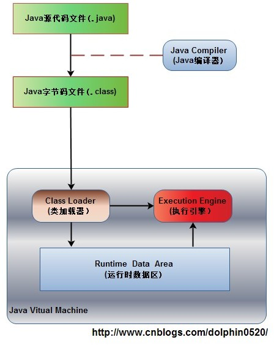

### 一.Java内存管理

#### (1)JVM的内存区域划分

##### 1.Java程序具体执行的过程：



##### 2.运行时数据区域

​	Java虚拟机在执行Java程序的过程中会把它所管理的内存划分为若干个不同的数据区域。这些区域都有各自的用途，以及创建和销毁的时间，有的区域随着虚拟机进程的启动而存在，有些区域则是依赖用户线程的启动和结束而建立和销毁。


###### -1.程序计数器

​	程序计数器（Program Counter Register）是一块较小的内存空间，它的作用可以看做是当前线程所执行的字节码的行号指示器。在虚拟机的概念模型里（仅是概念模型，各种虚拟机可能会通过一些更高效的方式去实现），字节码解释器工作时就是通过改变这个计数器的值来选取下一条需要执行的字节码指令，分支、循环、跳转、异常处理、线程恢复等基础功能都需要依赖这个计数器来完成。 **由于Java虚拟机的多线程**是通过线程轮流切换并分配处理器执行时间的方式来实现的，在任何一个确定的时刻，一个处理器（对于多核处理器来说是一个内核）**只会执行一条线程中的指令。因此，为了线程切换后能恢复到正确的执行位置，每条线程都需要有一个独立的程序计数器，各条线程之间的计数器互不影响，独立存储，我们称这类内存区域为“线程私有”的内存。** 如果线程正在执行的是一个Java方法，这个计数器记录的是正在执行的虚拟机字节码指令的地址；如果正在执行的是Natvie方法，这个计数器值则为空（Undefined）。**此内存区域是唯一一个在**Java虚拟机规范中没有规定任何OutOfMemoryError情况的区域.

###### -2.Java虚拟机栈

​	与程序计数器一样，Java虚拟机栈（Java Virtual Machine Stacks）也是线程私有的，它的生命周期与线程相同。虚拟机栈描述的是Java方法执行的内存模型：每个方法被执行的时候都会同时创建一个栈帧（Stack Frame）**用于存储局部变量表、操作栈、动态链接、方法出口等信息。**每一个方法被调用直至执行完成的过程，就对应着一个栈帧在虚拟机栈中从入栈到出栈的过程。

　　经常有人把Java内存区分为堆内存（Heap）和栈内存（Stack），这种分法比较粗糙，Java内存区域的划分实际上远比这复杂。这种划分方式的流行只能说明大多数程序员最关注的、与对象内存分配关系最密切的内存区域是这两块。其中所指的“堆”在后面会专门讲述，而所指的“栈”就是现在讲的虚拟机栈，或者说是虚拟机栈中的局部变量表部分。

​	局部变量表存放了编译期可知的各种基本数据类型（boolean、byte、char、short、int、float、long、double）、对象引用（reference类型），它不等同于对象本身，根据不同的虚拟机实现，它可能是一个指向对象起始地址的引用指针，也可能指向一个代表对象的句柄或者其他与此对象相关的位置）和returnAddress类型（指向了一条字节码指令的地址）。

　　**其中64位长度的long和double类型的数据会占用2个局部变量空间**（Slot），其余的数据类型只占用1个。**局部变量表所需的内存空间在编译期间完成分配**，当进入一个方法时，这个方法需要在帧中分配多大的局部变量空间是完全确定的，在方法运行期间不会改**变局部变**量表的大小。在Java虚拟机规范中，对这个区域规定了两种异常状况：如果线程请求的栈深度大于虚拟机所允许的深度，将抛出StackOverflowError异常；如果虚拟机栈可以动态扩展（当前大部分的Java虚拟机都可动态扩展，只不过Java虚拟机规范中也允许固定长度的虚拟机栈），当扩展时无法申请到足够的内存时会抛出OutOfMemoryError异常。

###### -3.本地方法栈

　　本地方法栈（Native Method Stacks）与虚拟机栈所发挥的作用是非常相似的，其区别不过是虚拟机栈为虚拟机执行Java方法（也就是字节码）服务，而本地方法栈则是为虚拟机使用到的Native方法服务。虚拟机规范中对本地方法栈中的方法使用的语言、使用方式与数据结构并没有强制规定，因此具体的虚拟机可以自由实现它。甚至有的虚拟机（譬如Sun HotSpot虚拟机）直接就把本地方法栈和虚拟机栈合二为一。与虚拟机栈一样，本地方法栈区域也会抛出StackOverflowError和OutOfMemoryError异常。

###### -4.Java堆

　　对于大多数应用来说，Java堆（Java Heap）是Java虚拟机所管理的内存中最大的一块。Java堆是被所有线程共享的一块内存区域，在虚拟机启动时创建。**此内存区域的唯一目的就是存放对象实例**，几乎所有的对象实例都在这里分配内存。这一点在Java虚拟机规范中的描述是：所有的对象实例以及数组都要在堆上分配，但是随着JIT编译器的发展与逃逸分析技术的逐渐成熟，栈上分配、标量替换优化技术将会导致一些微妙的变化发生，所有的对象都分配在堆上也渐渐变得不是那么“绝对”了。

　　Java堆是垃圾收集器管理的主要区域，因此很多时候也被称做“GC堆”（Garbage Collected Heap，幸好国内没翻译成“垃圾堆”）。如果从内存回收的角度看，由于现在收集器基本都是采用的**分代收集算法**，所以Java堆中还可以细分为：新生代和老年代；再细致一点的有Eden空间、From Survivor空间、To Survivor空间等。如果**从内存分配的角度看，线程共享的Java堆中可能划分出多个线程私有的分配缓冲区**（Thread Local Allocation Buffer，TLAB）。不过，无论如何划分，都与存放内容无关，无论哪个区域，存储的都仍然是对象实例，进一步划分的目的是为了更好地回收内存，或者更快地分配内存。在本章中，我们仅仅针对内存区域的作用进行讨论，Java堆中的上述各个区域的分配和回收等细节将会是下一章的主题。

​	根据Java虚拟机规范的规定，Java堆可以处于物理上不连续的内存空间中，只要逻辑上是连续的即可，就像我们的磁盘空间一样。在实现时，既可以实现成固定大小的，也可以是可扩展的，不过当前主流的虚拟机都是按照可扩展来实现的（通过-Xmx和-Xms控制）。如果在堆中没有内存完成实例分配，并且堆也无法再扩展时，将会抛出OutOfMemoryError异常。

###### -5.方法区

　　方法区（Method Area）与Java堆一样，是各个线程共享的内存区域，它**用于存储已被虚拟机加载的类信息、常量、静态变量、即时编译器编译后的代码等数据**。虽然Java虚拟机规范把方法区描述为堆的一个逻辑部分，但是它却有一个别名叫做Non-Heap（非堆），目的应该是与Java堆区分开来。

　　对于习惯在HotSpot虚拟机上开发和部署程序的开发者来说，很多人愿意把方法区称为“永久代”（Permanent Generation），本质上两者并不等价，仅仅是因为HotSpot虚拟机的设计团队选择把GC分代收集扩展至方法区，或者说使用永久代来实现方法区而已。对于其他虚拟机（如BEA JRockit、IBM J9等）来说是不存在永久代的概念的。即使是HotSpot虚拟机本身，根据官方发布的路线图信息，现在也有放弃永久代并“搬家”至Native Memory来实现方法区的规划了。

　　Java虚拟机规范对这个区域的限制非常宽松，除了和Java堆一样不需要连续的内存和可以选择固定大小或者可扩展外，还可以选择不实现垃圾收集。相对而言，垃圾收集行为在这个区域是比较少出现的，但并非数据进入了方法区就如永久代的名字一样“永久”存在了。这个区域的内存回收目标主要是针对常量池的回收和对类型的卸载，一般来说这个区域的回收“成绩”比较难以令人满意，尤其是类型的卸载，条件相当苛刻，但是这部分区域的回收确实是有必要的。在Sun公司的BUG列表中，

　　曾出现过的若干个严重的BUG就是由于低版本的HotSpot虚拟机对此区域未完全回收而导致内存泄漏。 根据Java虚拟机规范的规定，当方法区无法满足内存分配需求时，将抛出OutOfMemoryError异常。

###### -6.运行时常量池

　　**运行时常量池（Runtime Constant Pool）是方法区的一部分**。Class文件中除了有类的版本、字段、方法、接口等描述等信息外，还有一项信息是常量池（Constant Pool Table），**用于存放编译期生成的各种字面量和符号引用****，这部分内容将在类加载后存放到方法区的运行时常量池中。** Java虚拟机对Class文件的每一部分（自然也包括常量池）的格式都有严格的规定，每一个字节用于存储哪种数据都必须符合规范上的要求，这样才会被虚拟机认可、装载和执行。但对于运行时常量池，Java虚拟机规范没有做任何细节的要求，不同的提供商实现的虚拟机可以按照自己的需要来实现这个内存区域。不过，一般来说，除了保存Class文件中描述的符号引用外，还会把翻译出来的直接引用也存储在运行时常量池中。 运行时常量池相对于Class文件常量池的另外一个重要特征是具备动态性，Java语言并不要求常量一定只能在编译期产生，也就是并非预置入Class文件中常量池的内容才能进入方法区运行时常量池，运行期间也可能将新的常量放入池中，这种特性被开发人员利用得比较多的便是String类的intern()方法。 既然运行时常量池是方法区的一部分，自然会受到方法区内存的限制，当常量池无法再申请到内存时会抛出OutOfMemoryError异常。

#### (2)对象的内存布局

​	HotSpot虚拟机中，对象在内存中存储的布局可以分为三块区域：**对象头**（Header）、**实例数据**（Instance Data）和**对齐填充**（Padding）。


从上面的这张图里面可以看出，对象在内存中的结构主要包含以下几个部分：

- Mark Word(标记字段)：对象的Mark Word部分占4个字节，其内容是一系列的标记位，比如轻量级锁的标记位，偏向锁标记位等等。
- Klass Pointer（Class对象指针）：Class对象指针的大小也是4个字节，其指向的位置是对象对应的Class对象（其对应的元数据对象）的内存地址
- 对象实际数据：这里面包括了对象的所有成员变量，其大小由各个成员变量的大小决定，比如：byte和boolean是1个字节，short和char是2个字节，int和float是4个字节，long和double是8个字节，reference是4个字节
- 对齐：最后一部分是对齐填充的字节，按8个字节填充。

##### 1.对象头

###### (1)Mark Word（标记字段）

​	HotSpot虚拟机的**对象头**包括两部分信息，第一部分是**“Mark Word**”，用于存储对象自身的运行时数据， 如哈希码（HashCode）、GC分代年龄、锁状态标志、线程持有的锁、偏向线程ID、偏向时间戳等等，这部分数据的长度在32位和64位的虚拟机（暂 不考虑开启压缩指针的场景）中分别为32个和64个Bits，官方称它为“Mark Word”。对象需要存储的运行时数据很多，其实已经超出了32、64位Bitmap结构所能记录的限度，但是对象头信息是与对象自身定义的数据无关的额 外存储成本，考虑到虚拟机的空间效率，Mark Word被设计成一个非固定的数据结构以便在极小的空间内存储尽量多的信息，它会根据对象的状态复用自己的存储空间。例如在32位的HotSpot虚拟机 中对象未被锁定的状态下，Mark Word的32个Bits空间中的25Bits用于存储对象哈希码（HashCode），4Bits用于存储对象分代年龄，2Bits用于存储锁标志 位，1Bit固定为0，在其他状态（轻量级锁定、重量级锁定、GC标记、可偏向）下对象的存储内容如下表所示。


​	但是如果对象是数组类型，则需要三个机器码，因为JVM虚拟机可以通过Java对象的元数据信息确定Java对象的大小，但是无法从数组的元数据来确认数组的大小，所以用一块来记录数组长度。

 对象头信息是与对象自身定义的数据无关的额外存储成本，但是考虑到虚拟机的空间效率，Mark Word被设计成一个非固定的[数据结构](http://lib.csdn.net/base/datastructure)以便在极小的空间内存存储尽量多的数据，它会根据对象的状态复用自己的存储空间，也就是说，Mark Word会随着程序的运行发生变化，变化状态如下（32位虚拟机）： 


注意偏向锁、轻量级锁、重量级锁等都是jdk 1.6以后引入的。


​	其中轻量级锁和偏向锁是[Java ](http://lib.csdn.net/base/java)6 对 synchronized 锁进行优化后新增加的，稍后我们会简要分析。这里我们主要分析一下重量级锁也就是通常说synchronized的对象锁，锁标识位为10，其中指针指向的是monitor对象（也称为管程或监视器锁）的起始地址。**每个对象都存在着一个 monitor 与之关联**，对象与其 monitor 之间的关系有存在多种实现方式，如monitor可以与对象一起创建销毁或当线程试图获取对象锁时自动生成，但当一个 monitor 被某个线程持有后，它便处于锁定状态。在Java虚拟机(HotSpot)中，monitor是由ObjectMonitor实现的，其主要数据结构如下（位于HotSpot虚拟机源码ObjectMonitor.hpp文件，C++实现的）

```c++
ObjectMonitor() {
    _header       = NULL;
    _count        = 0; //记录个数
    _waiters      = 0,
    _recursions   = 0;
    _object       = NULL;
    _owner        = NULL;
    _WaitSet      = NULL; //处于wait状态的线程，会被加入到_WaitSet
    _WaitSetLock  = 0 ;
    _Responsible  = NULL ;
    _succ         = NULL ;
    _cxq          = NULL ;
    FreeNext      = NULL ;
    _EntryList    = NULL ; //处于等待锁block状态的线程，会被加入到该列表
    _SpinFreq     = 0 ;
    _SpinClock    = 0 ;
    OwnerIsThread = 0 ;
  }
```

​	ObjectMonitor中有两个队列，_WaitSet 和 _EntryList，用来保存ObjectWaiter对象列表( 每个等待锁的线程都会被封装成ObjectWaiter对象)，_owner指向持有ObjectMonitor对象的线程，当多个线程同时访问一段同步代码时，首先会进入 _EntryList 集合，当线程获取到对象的monitor 后进入 _Owner 区域并把monitor中的owner变量设置为当前线程同时monitor中的计数器count加1，若线程调用 wait() 方法，将释放当前持有的monitor，owner变量恢复为null，count自减1，同时该线程进入 WaitSe t集合中等待被唤醒。若当前线程执行完毕也将释放monitor(锁)并复位变量的值，以便其他线程进入获取monitor(锁)。如下图所示


​	**对象头**的**另外一部分是类型指针**，即是对象指向它的类的元数据的指针，虚拟机通过这个指针来确定这个对象是哪个类的实例。并不是所有的虚拟机实现都必须在对象数据上保留类型指针，换句话说查找对象的元数据信息并不一定要经过对象本身。另外，如果对象是一个Java数组，那在对象头中还必须有一块用于记录数组长度的数据，因为虚拟机可以通过普通Java对象的元数据信息确定Java对象的大小，但是从数组的元数据中无法确定数组的大小。 

以下是HotSpot虚拟机markOop.cpp中的C++代码（注释）片段，它描述了32bits下MarkWord的存储状态：

```c++
// Bit-format of an object header (most significant first, big endian layout below):  
//  
//  32 bits:  
//  --------  
//  hash:25 ------------>| age:4    biased_lock:1 lock:2 (normal object)  
//  JavaThread*:23 epoch:2 age:4    biased_lock:1 lock:2 (biased object)  
//  size:32 ------------------------------------------>| (CMS free block)  
//  PromotedObject*:29 ---------->| promo_bits:3 ----->| (CMS promoted object)
```

##### 2.实例数据（Instance Data）

​	接下来实例数据部分是对象真正存储的有效信息，也既是我们在程序代码里面所定义的各种类型的字段内容，无论是从父类继承下来的，还是在子类中定义的都需要记录下来。 这部分的存储顺序会受到虚拟机分配策略参数（FieldsAllocationStyle）和字段在Java源码中定义顺序的影响。HotSpot虚拟机 默认的分配策略为longs/doubles、ints、shorts/chars、bytes/booleans、oops（Ordinary Object Pointers），从分配策略中可以看出，相同宽度的字段总是被分配到一起。在满足这个前提条件的情况下，在父类中定义的变量会出现在子类之前。如果 CompactFields参数值为true（默认为true），那子类之中较窄的变量也可能会插入到父类变量的空隙之中。

##### 3.对齐填充（Padding）

​	第三部分对齐填充并不是必然存在的，也没有特别的含义，它仅仅起着占位符的作用。由于HotSpot VM的自动内存管理系统要求对象起始地址必须是8字节的整数倍，换句话说就是对象的大小必须是8字节的整数倍。对象头正好是8字节的倍数（1倍或者2倍），因此当对象实例数据部分没有对齐的话，就需要通过对齐填充来补全。

#### (3)对象的创建过程

​	Java是一门面向对象的编程语言，Java程序运行过程中无时无刻都有对象被创建出来。在语言层面上，创建对象通常（例外：克隆、反序列化）仅仅是一个 new关键字而已，而在虚拟机中，对象（本文中讨论的对象限于普通Java对象，不包括数组和Class对象等）的创建又是怎样一个过程呢？ 
虚拟机遇到一条new指令时，

1. 首先jvm要检查类A是否已经被加载到了内存，即类的符号引用是否已经在常量池中，并且检查这个符号引用代表的类是否已被加载、解析和初始化过的。如果还没有，需要先触发类的加载、解析、初始化。然后在堆上创建对象。

2. 为新生对象分配内存。

   ​	对象所需内存的大小在类加载完成后便可完全确定，为对象分配空间的任务具体便等同于一块确定大小 的内存从Java堆中划分出来，怎么划呢？假设Java堆中内存是绝对规整的，所有用过的内存都被放在一边，空闲的内存被放在另一边，中间放着一个指针作 为分界点的指示器，那所分配内存就仅仅是把那个指针向空闲空间那边挪动一段与对象大小相等的距离，这种分配方式称为“**指针碰撞**”（Bump The Pointer）。如果Java堆中的内存并不是规整的，已被使用的内存和空闲的内存相互交错，那就没有办法简单的进行指针碰撞了，虚拟机就必须维护一个列表，记录上哪些内存块是可用的，在分配的时候从列表中找到一块足够大的空间划分给对象实例，并更新列表上的记录，这种分配方式称为“**空闲列表**”（Free List）。选择哪种分配方式由Java堆是否规整决定，而Java堆是否规整又由所采用的垃圾收集器是否带有压缩整理功能决定。因 此在使用Serial、ParNew等带Compact过程的收集器时，系统采用的分配算法是指针碰撞，而使用CMS这种基于Mark-Sweep算法的 收集器时（说明一下，CMS收集器可以通过UseCMSCompactAtFullCollection或 CMSFullGCsBeforeCompaction来整理内存），就通常采用空闲列表。 
   ​	除如何划分可用空间之外，还有另外一个需要考虑的问题是对象创建在虚拟机中是非常频繁的行为，即使是仅仅修改一个指针所指向的位置，在并发情况下也并不是 线程安全的，可能出现正在给对象A分配内存，指针还没来得及修改，对象B又同时使用了原来的指针来分配内存。解决这个问题有两个方案：

   ​	一种是对分配内存空间的动作进行同步——实际上虚拟机是采用CAS配上失败重试的方式保证更新操作的原子性；

   ​	一种是把内存分配的动作按照线程划分在不同的空间之中进行， 即每个线程在Java堆中预先分配一小块内存，称为本地线程分配缓冲区，（TLAB ，Thread Local Allocation Buffer），哪个线程要分配内存，就在哪个线程的TLAB上分配，只有TLAB用完，分配新的TLAB时才需要同步锁定。

   ​	虚拟机是否使用TLAB，可以通过-XX:+/-UseTLAB参数来设定。

3. 完成实例数据部分的初始化工作（初始化为0值）

   ​	内存分配完成之后，虚拟机需要将分配到的内存空间都初始化为零值（不包括对象头），如果使用TLAB的话，这一个工作也可以提前至TLAB分配时进行。这步操作保证了对象的实例字段在Java代码中可以不赋初始值就直接使用，程序能访问到这些字段的数据类型所对应的零值。

4. 完成对象头的填充：如对象自身的运行时数据、类型指针等。

   ​	接下来，虚拟机要对对象进行必要的设置，例如这个对象是哪个类的实例、如何才能找到类的元数据信息、对象的哈希码、对象的GC分代年龄等信息。这些信息存放在对象的对象头（Object Header）之中。根据虚拟机当前的运行状态的不同，如是否启用偏向锁等，对象头会有不同的设置方式。

在上面工作都完成之后，在虚拟机的视角来看，一个新的对象已经产生了。但是在Java程序的视角看来，初始化才正式开始，开始调用<init>方法完成初始复制和构造函数，所有的字段都为零值。因此一般来说（由字节码中是否跟随有invokespecial指令所决定），new指令之后会接着就是执 行<init>方法，把对象按照程序员的意愿进行初始化，这样一个真正可用的对象才算完全创建出来。

下面代码是HotSpot虚拟机bytecodeInterpreter.cpp中的代码片段（这个解释器实现很少机会实际使用，大部分平台上都使用模板 解释器；当代码通过JIT编译器执行时差异就更大了。不过这段代码用于了解HotSpot的运作过程是没有什么问题的）。

```c++
// 确保常量池中存放的是已解释的类
    if (!constants->tag_at(index).is_unresolved_klass()) {
      // 断言确保是klassOop和instanceKlassOop（这部分下一节介绍）
      oop entry = (klassOop) *constants->obj_at_addr(index);
      assert(entry->is_klass(), "Should be resolved klass");
      klassOop k_entry = (klassOop) entry;
      assert(k_entry->klass_part()->oop_is_instance(), "Should be instanceKlass");
      instanceKlass* ik = (instanceKlass*) k_entry->klass_part();
      // 确保对象所属类型已经经过初始化阶段
      if ( ik->is_initialized() && ik->can_be_fastpath_allocated() ) {
        // 取对象长度
        size_t obj_size = ik->size_helper();
        oop result = NULL;
        // 记录是否需要将对象所有字段置零值
        bool need_zero = !ZeroTLAB;
        // 是否在TLAB中分配对象
        if (UseTLAB) {
          result = (oop) THREAD->tlab().allocate(obj_size);
        }
        if (result == NULL) {
          need_zero = true;
          // 直接在eden中分配对象
    retry:
          HeapWord* compare_to = *Universe::heap()->top_addr();
          HeapWord* new_top = compare_to + obj_size;
          // cmpxchg是x86中的CAS指令，这里是一个C++方法，通过CAS方式分配空间，并发失败的话，转到retry中重试直至成功分配为止
          if (new_top <= *Universe::heap()->end_addr()) {
            if (Atomic::cmpxchg_ptr(new_top, Universe::heap()->top_addr(), compare_to) != compare_to) {
              goto retry;
            }
            result = (oop) compare_to;
          }
        }
        if (result != NULL) {
          // 如果需要，为对象初始化零值
          if (need_zero ) {
            HeapWord* to_zero = (HeapWord*) result + sizeof(oopDesc) / oopSize;
            obj_size -= sizeof(oopDesc) / oopSize;
            if (obj_size > 0 ) {
              memset(to_zero, 0, obj_size * HeapWordSize);
            }
          }
          // 根据是否启用偏向锁，设置对象头信息
          if (UseBiasedLocking) {
            result->set_mark(ik->prototype_header());
          } else {
            result->set_mark(markOopDesc::prototype());
          }
          result->set_klass_gap(0);
          result->set_klass(k_entry);
          // 将对象引用入栈，继续执行下一条指令
          SET_STACK_OBJECT(result, 0);
          UPDATE_PC_AND_TOS_AND_CONTINUE(3, 1);
        }
      }
    }
```

#### (4)对象访问

对象访问在Java语言中无处不在，是最普通的程序行为，但即使是最简单的访问，也会却涉及Java栈、Java堆、方法区这三个最重要内存区域之间的关联关系，如下面的这句代码：

```java
Object obj = new Object();
```

假设这句代码出现在方法体中，那“Object obj”这部分的语义将会反映到Java栈的本地变量表中，作为一个reference类型数据出现。而“new Object()”这部分的语义将会反映到Java堆中，形成一块存储了Object类型所有实例数据值（Instance Data，对象中各个实例字段的数据）的结构化内存，根据具体类型以及虚拟机实现的对象内存布局（Object Memory Layout）的不同，这块内存的长度是不固定的。另外，在Java堆中还必须包含能查找到此对象类型数据（如对象类型、父类、实现的接口、方法等）的地址信息，这些类型数据则存储在方法区中。

**由于reference类型在Java虚拟机规范里面只规定了一个指向对象的引用，并没有定义这个引用应该通过哪种方式去定位，以及访问到Java堆中的对象的具体位**置，因此不同虚拟机实现的对象访问方式会有所不同，主流的访问方式有两种：**使用句柄和直接指针**。

##### 1.使用句柄

​	**如果使用句柄访问方式，Java堆中将会划分出一块内存来作为句柄池，reference中存储的就是对象的句柄地址，而句柄中包含了对象实例数据和类型数据各自的具体地址信息**，如下图所示：


##### 2.直接指针

**如果使用的是直接指针访问方式，Java 堆对象的布局中就必须考虑如何放置访问类型数据的相关信息，reference中直接存储的就是对象地址**，如下图所示：


**两种方式的对比**

​	**这两种对象的访问方式各有优势，使用句柄访问方式的最大好处就是reference中存储的是稳定的句柄地址，在对象被移动（垃圾收集时移动对象是非常普遍的行为）时只会改变句柄中的实例数据指针，而reference本身不需要被修改。使用直接指针访问方式的最大好处就是速度更快，它节省了一次指针定位的时间开销，由于对象的访问在Java中非常频繁，因此这类开销积少成多后也是一项非常可观的执行成本。**就本书讨论的主要虚拟机Sun HotSpot而言，它是使用第二种方式进行对象访问的，但从整个软件开发的范围来看，各种语言和框架使用句柄来访问的情况也十分常见。

### 二.垃圾回收器与垃圾回收算法

#### 1)垃圾回收算法

##### (1)标记算法

###### 1.引用计数算法

​	给对象中添加一个引用计数器，每当有一个地方引用它时，计数器值加1；当引用失效时，计数器减1；任何时刻计数器都为0的对象就是不可能再被使用的。 

​	引用计数算法的实现简单，判断效率也很高，在大部分情况下它都是一个不错的算法。但是JVM中没有选用引用计数算法来管理内存，其中最主要的一个原因是它很难解决对象之间相互循环引用的问题。 

###### 2.可达性分析法

​	在主流的商用程序语言中(Java和C#)，都是使用可达性分析算法判断对象是否存活的。这个算法的基本思路就是通过一系列名为”GC Roots”的对象作为起始点，从这些节点开始向下搜索，搜索所走过的路径称为引用链(Reference Chain)，当一个对象到GC Roots没有任何引用链相连时，则证明此对象是不可用的，下图对象object5, object6, object7虽然有互相判断，但它们到GC Roots是不可达的，所以它们将会判定为是可回收对象。


在Java语言里，可作为GC Roots对象的包括如下几种： 

- 虚拟机栈(栈桢中的本地变量表)中的引用的对象 
- 方法区中的类静态属性引用的对象 
- 方法区中的常量引用的对象 
- 本地方法栈中JNI的引用的对象

##### (2)回收算法

###### 1.标记-清除算法Mark-Sweep

​	先标记出哪些对象需要回收，再做清理。没啥突出优点，缺点是，清除后会产生大量的内存碎片。具体如下：


###### 2.标记-整理算法Mark-Compact

先标记，再把所有存活的对象向一端移动，然后直接清理端边界意外的内存。 


###### 3.复制算法

“复制”（Copying）的收集算法，它将可用内存按需要分成两块（实际情况不一定2块，块的大小比例不一定），每次只使用其中的一块。当这一块的内存用完了，就将还存活着的对象复制到另外一块上面，然后再把已使用过的内存空间一次清理掉。

复制算法一般是使用在新生代中，因为新生代中的对象一般都是朝生夕死的，存活对象的数量并不多，这样使用复制算法进行拷贝时效率比较高。

突然说个新生代，可能有点懵逼，其实是2.6要说的分代回收算法，会对内存区域做一个划分：

将Heap 内存划分为新生代(Young Generation)与老年代(Tenured Generation); 
此时又把方法区称为永久代Perm Generation);


新生代的目标就是尽可能快速的手机掉那些生命周期短的对象。老年代的目标是存大对象或声明周期长的对象。

将新生代划分为Eden(伊甸园) 与2块Survivor Space(幸存者区，分别叫From Survivor Space 和 To Survivor Space) 。

然后在Eden –>Survivor Space 以及From Survivor Space 与To Survivor Space 之间实行Copying 算法。 不过jvm在应用复制算法时，并不是把内存按照1:1来划分的，这样太浪费内存空间了。

实际情况是，按照8：1：1来划分，每次GC，把Eden 和某一个 Survivor的存活对象，复制到另一个Survivor，然后把Eden和那个Survivor清空。这样，意味着每次GC后，可以有90%的内存会被利用，只有10%浪费。

如果万一存活对象放不下那个Survivor，会找老年代借一下，称为分配担保。

下图给出内存的具体划分：


具体工作流程如下：

在GC开始的前，对象只会存在于Eden区和From Survivor区，To Survivor区是空的。紧接着进行GC，Eden区中所有存活的对象都会被复制到“To”，而在“From”区中，仍存活的对象会根据他们的年龄值来决定去向。年龄达到一定值(年龄阈值，可以通过-XX:MaxTenuringThreshold来设置，默认15)的对象会被移动到年老代中，没有达到阈值的对象会被复制到“To”区域。经过这次GC后，Eden区和From区已经被清空。这个时候，“From”和“To”会交换他们的角色，也就是新的“To”就是上次GC前的“From”，新的“From”就是上次GC前的“To”。不管怎样，都会保证名为To的Survivor区域是空的。Minor GC会一直重复这样的过程，直到“To”区被填满，“To”区被填满之后，会将所有对象移动到年老代中。

对象年龄计算：没经过1次GC，年龄+1。

**复制算法的优缺点：** 
优点：

​	避免内存碎片产生，实现简单，运行高效。 
缺点：

1. 会浪费一部分内存空间; 

2. 持续复制长生存期的对象则导致效率降低。

###### 4 分代回收算法

​	当前商业虚拟机的垃圾收集器，大多支持分代收集算法（Generational Collection），这种算法其实没有新的思想，无非是利用前面的算法组合一下。

​	如上文所说，这种综合算法，把堆内存分为新生代和老年代。新生代用上面说的复制算法，老年代，因对象存活率高，也没有额外空间进行分配担保，就必须使用“标记-清理”或“标记-整理”算法。

#### 2)垃圾回收器

​	垃圾收集器是垃圾回收算法的具体实现，Java虚拟机规范中对垃圾收集器应该如何实现并没有任何规定，因此不同厂商、不同版本的虚拟机所提供的垃圾收集器都可能会有很大的差别。 

​	Sun HotSpot虚拟机1.6版包含了如下收集器：Serial、ParNew、Parallel Scavenge、CMS、Serial Old、Parallel Old。这些收集器以不同的组合形式配合工作来完成不同分代区的垃圾收集工作。1.7增加了G1收集器，可以说是收集器的最新研究成果。

##### 1.Serial收集器(串行)

​	用于新生代的单线程收集器。用复制算法；垃圾收集的过程中会Stop The World（服务暂停） 
​	优点：简单高效 
​	缺点：垃圾收集的过程中会Stop The World（服务暂停），停顿时间长。

##### 2.Serial Old收集器(串行)

​	用于老年代的单线程收集器。用标记-整理算法。

##### 3.ParNew收集器(并行)

​	ParNew收集器其实就是Serial收集器的多线程版本。用于新生代，也是复制算法。

##### 4.Parallel Scavenge收集器(并行)

​	**新生代**收集器，**复制算法**，几乎和ParNew没啥区别。但是，他主要追求高吞吐量，高效利用CPU。吞吐量一般为99%， 吞吐量= 用户线程时间/(用户线程时间+GC线程时间)。适合后台应用等对交互相应要求不高的场景。

##### 5 Parallel Old收集器(并行)

​	Parallel Scavenge收集器的**老年代**版本，并行收集器，吞吐量优先。用**标记-整理算法**。

##### 6.CMS(Concurrent Mark Sweep)收集器(并发)

​	高并发、低停顿，追求最短GC回收停顿时间。适合重视服务响应速度的应用（如网站），和 Parallel Old的追求目标相反。基于**标记-清除算法**。

​	优点：并发收集、低停顿 
​	缺点：产生大量空间碎片、并发阶段会降低吞吐量

##### 7.G1(Garbage First)收集器(并发)

​	G1是目前技术发展的最前沿成果之一，HotSpot开发团队赋予它的使命是未来可以替换掉JDK1.5中发布的CMS收集器。与CMS收集器相比G1收集器有以下特点：

1. 并行并发，

   充分利用硬件的多核硬件优势，大大缩短Stop-The-World时间，使得GC时，Java程序可以继续执行。

2. 空间整合，

   G1收集器从整理看，是基于标记整理算法，从局部(两个Region)看，是基于复制算法，但无论如何，都不会产生内存空间碎片。分配大对象时不会因为无法找到连续空间而提前触发下一次GC。

3. 可预测停顿，

   这是G1的另一大优势，降低停顿时间是G1和CMS的共同关注点，但G1除了追求低停顿外，还能建立可预测的停顿时间模型，能让使用者明确指定在一个长度为N毫秒的时间片段内，消耗在垃圾收集上的时间不得超过N毫秒，这几乎已经是实时Java（RTSJ）的垃圾收集器的特征了。

4. 分代收集，

   上面提到的垃圾收集器，收集的范围都是整个新生代或者老年代，而G1不再是这样。使用G1收集器时，Java堆的内存布局与其他收集器有很大差别，它将整个Java堆划分为多个大小相等的独立区域（Region），虽然还保留有新生代和老年代的概念，但新生代和老年代不再是物理隔阂了，它们都是一部分（可以不连续）Region的集合。