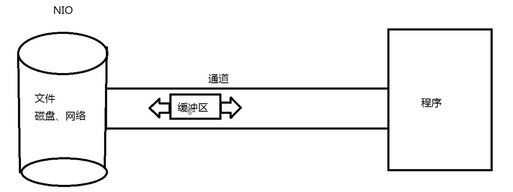

#### 一.NIO简介

##### 1)简介

	Java NIO ( New IO Non Blocking IO)是从Java 1.4版本开始引入的一个新的IO API,可以替代标准的JavaIOAPI。NIO与原来的IO有同样的作用和目的，但是使用的方式完全不同，NIO支持面向缓冲区的、基于通道的IO操作。NIO将以更加高效的方式进行文件的读写操作。

##### 2)NIO与IO的区别

| IO                      | NIO                         |
| ----------------------- | --------------------------- |
| 面向流(Stream Oriented) | 面向缓冲区(Buffer Oriented) |
| 阻塞I0(Blocking IO)     | 非阻塞I0(Non Blocking I0)   |
| 无                      | 选择器(Selectors)           |

#### 二.通道(channel)与缓冲区(buffer)

##### 1)通道与缓冲区的关系



通道:通道是链接文件，磁盘，网络的管道，而缓冲区就是数据流的载体，数据通过缓冲区在通道中传输，同时通道是双向的。

##### 2)缓冲区

1. 作用

   在Java NIO 中负责数据的存取。缓冲区就是数组, 用于存储不同数据类型的数据

2. 类型

   根据数据类型不同(boolean除外)，提供了相应类型的缓冲区:
   ByteBuffer，CharBuffer，ShortBuffer，IntBuffer，LongBuffer，FloatBuffer，DoubleBuffer
   上述缓冲区的管理方式几乎一致，通过allocate()获取缓冲区

3. api

   - 缓冲区存取数据的两个核心方法:

     - put( ): 存入数据到缓冲区中
     - get() : 获取缓冲区中的数据
     - flip(): 把缓冲区变成读模式
     - rewind()： 设置position的位置到头部
     - clear(); 清空数据,把limit设置为capacity，position设置为0,

   - 缓冲区中的四个核心属性:

     - capacity :
       容量，表示缓冲区中最大存储数据的容量。一旦声明不能改变。

     - limit :界限，

       表示缓冲区中可以操作数据的大小。(limit 后数据不能进行读写)

     - position :位置

       表示缓冲区中正在操作数据的位置

     - mark :标记

       表示记录当前position的位置。可以通过reset( )恢复到mark的位置

     - 总结

       0 <= mark <= position <= limit <= capacity

   - 代码

     ```java
     //创建ByteBuffer
     ByteBuffer buffer = ByteBuffer.allocate(1024);
     
     System.out.println(buffer.position());
     System.out.println(buffer.capacity());
     System.out.println(buffer.limit());
     
     
     String name = "zhangsan";
     
     buffer.put(name.getBytes());
     System.out.println("---------------------------");
     System.out.println(buffer.position());
     System.out.println(buffer.capacity());
     System.out.println(buffer.limit());
     
     //flip:把容器变成读模式
     buffer.flip();
     System.out.println("---------------------------");
     System.out.println(buffer.position());
     System.out.println(buffer.capacity());
     System.out.println(buffer.limit());
     
     byte [] read_tmp = new byte[buffer.limit()];
     //获取数据
     buffer.get(read_tmp);
     System.out.println("---------------------------");
     System.out.println(read_tmp);
     System.out.println(buffer.position());
     System.out.println(buffer.capacity());
     System.out.println(buffer.limit());
     
     //重新设置position的位置
     buffer.rewind();
     System.out.println("---------------------------");
     System.out.println(buffer.position());
     System.out.println(buffer.capacity());
     System.out.println(buffer.limit());
     
     byte readBF[] = new byte[buffer.limit()];
     buffer.get(readBF,0,2);
     System.out.println("---------------------------");
     System.out.println(new String(readBF,0,2));
     //记住当前的position的位置
     buffer.mark();
     buffer.get(readBF,0,2);
     System.out.println(new String(readBF,0,2));
     //回到上次mark的position的位置
     buffer.reset();
     buffer.get(readBF,0,2);
     System.out.println(new String(readBF,0,2));
     
     /**
      * 清空缓冲区(设置为写模式),把limit设置为capacity，position设置为0,
      * 但是里面的数据还在，处于"被遗忘状态"
      */
     buffer.clear();
     System.out.println("---------------------------");
     System.out.println(buffer.position());
     System.out.println(buffer.capacity());
     System.out.println(buffer.limit());
     ```

4. 直接缓冲区与非直接缓冲区

   - 非直接缓冲区

     通过allocate()方法分配缓冲区，将缓冲区建立在JVM的内存中

   - 直接缓冲区:

     通过allocateDirect()方法分配直接缓冲区，将缓冲区建立在物理内存中。可以提高效率

   ```java
   //创建直接缓冲区 
   ByteBuffer buffer = ByteBuffer.allocateDirect(1024);
   //是否是直接缓冲区与非直接缓冲区
   buffer.isDirect();
   ```

##### 3)通道

1. 通道(Channel) 

   用于源节点与目标节点的连接。在Java NIO中负责缓冲区中数据的传输。Channel本身不存储数据，因此需要配合缓冲区进行传输。

2. 通道的主要实现类

   实现java.nio.channels包下的: Channel接口

   - 本地文件

     FileChannel

   - TCP

     SocketChannel, ServerSocketChannel

   - UDP

     DategramChannel

3. 获取通道

   - Java 针对支持通道的类提供了getChannel() 方法

     - 本地IO

       FileInputStream/FileOutputStream/RandomAccessFile

     - 网络IO

       Socket/ServerSocket/DategramSocket

   - 在JDK 1.7中的NI0.2 针对各个通道提供了静态方法open()

   - 在JDK 1.7中的NI0.2的Files 工具类的newByteChannel()

4. 读取文件

   - 使用非直接缓冲区

     ```java
     @Test
     public void  test03() throws Exception{
     
         FileInputStream fileInputStream = new FileInputStream("/Users/tgy/Documents/firsttest/class-dump");
         FileOutputStream fileOutputStream = new FileOutputStream("/Users/tgy/Documents/firsttest/class-dump02");
         Channel inputStreamChannel = fileInputStream.getChannel();
         FileChannel outputStreamChannel = fileOutputStream.getChannel();
     
         ByteBuffer buffer = ByteBuffer.allocate(1024);
     
         while (((FileChannel) inputStreamChannel).read(buffer) != -1){
     
             //转换成读模式
             buffer.flip();
             outputStreamChannel.write(buffer);
             //转化成写模式
             buffer.clear();
         }
         fileInputStream.close();
         fileOutputStream.close();
     }
     ```

   - 使用直接缓冲区

     ```java
     @Test
     public void test4() throws Exception {
     
     
         FileChannel inputChannel = FileChannel.open(Paths.get("/Users/tgy/Documents/firsttest/class-dump"), StandardOpenOption.READ);
     
         //CREATE_NEW:文件存在就报错
         FileChannel outputChannel = FileChannel.open(Paths.get("/Users/tgy/Documents/firsttest/class-dump03"), StandardOpenOption.WRITE,StandardOpenOption.READ, StandardOpenOption.CREATE_NEW);
         
         //内存映射文件
         MappedByteBuffer inputMap = inputChannel.map(FileChannel.MapMode.READ_ONLY, 0, inputChannel.size());
         MappedByteBuffer outputMap = outputChannel.map(FileChannel.MapMode.READ_WRITE, 0, inputChannel.size());
     
         //直接读文件
         byte buf[] = new byte[inputMap.limit()];
         inputMap.get(buf);
         outputMap.put(buf);
     
         inputChannel.close();
         outputChannel.close();
     
     }
     ```

     使用==transferTo/transferFrom==

     ```java
     @Test
     public void test05() throws  Exception{
     
         FileChannel inFileChannel = FileChannel.open(Paths.get("/Users/tgy/Documents/firsttest/class-dump"), StandardOpenOption.READ);
         FileChannel outFileChannel = FileChannel.open(Paths.get("/Users/tgy/Documents/firsttest/class-dump04"), StandardOpenOption.READ,StandardOpenOption.WRITE,StandardOpenOption.CREATE_NEW);
     
         //使用transferTo/transferFrom
         inFileChannel.transferTo(0,inFileChannel.size(),outFileChannel);
         inFileChannel.close();
         outFileChannel.close();
     }
     ```

5. 分散(Scatter )与聚集(Gather)

   - 分散填取Scattering Reads)

     将通道中的数据分散到多个缓冲区中

   - 聚集写入(Gathering Writes)

     将多个缓冲区中的数据聚集到通道中

   ```java
   @Test
   public void test06() throws Exception{
   
   
       FileInputStream fileInputStream = new FileInputStream("/Users/tgy/Documents/firsttest/web/vue/vue01/vue.js");
       FileOutputStream fileOutputStream = new FileOutputStream("/Users/tgy/Documents/firsttest/web/vue/vue01/vue01.js");
   
       FileChannel inputStreamChannel = fileInputStream.getChannel();
       FileChannel outputStreamChannel = fileOutputStream.getChannel();
   
   
       ByteBuffer bfs[] = {ByteBuffer.allocate(100),ByteBuffer.allocate(100)};
       //按照数组序号以此把数据读到缓冲区中
       inputStreamChannel.read(bfs);
   	//改成写模式
       Arrays.stream(bfs).forEach(ByteBuffer::flip);
       //输出里面的数据
       Arrays.stream(bfs).forEach(x->{
   
           System.out.println(new String(x.array(), 0, x.limit()));;
       });
   
       //以次从缓冲区中把数据读出来
       outputStreamChannel.write(bfs);
   
       fileInputStream.close();
       fileOutputStream.close();
   }
   ```

#### 三.字符串集(charset)

1. 支持的字符集

   ```java
   Map<String,Charset> map = Charset.availableCharsets();
    map.keySet().stream().forEach(x->{
   
       Charset charset = map.get(x);
       System.out.println(x + "---->" + charset.name());
    });
   ```

2. 编码(encode)与解码(decode)

   ```java
    Charset charset = Charset.forName("UTF-8");
    //编码
    ByteBuffer byteBuffer01 = charset.encode("呵呵呵");
   //解码
    CharBuffer charBuffer1 = charset.decode(byteBuffer01);
   ```

#### 四.非阻塞NIO

​	同步非阻塞式IO，服务器实现模式为一个请求一个线程，即客户端发送的连接请求都会注册到多路复用器上，多路复用器轮询到连接有I/O请求时才启动一个线程进行处理。

```java
public class ServerSocketHandle {

    private Integer port;
    private String charsetName;
    private int bufferSize;

    private ServerSocketChannel serverSocketChannel;

    private Selector selector;


    public ServerSocketHandle() {

        this(5010,"utf-8",1024);
    }

    public ServerSocketHandle(Integer port, String charsetName, int bufferSize) {
        this.port = port;
        this.charsetName = charsetName;
        this.bufferSize = bufferSize;

        init();
    }

    public Integer getPort() {
        return port;
    }

    public void setPort(Integer port) {
        this.port = port;
    }

    public String getCharsetName() {
        return charsetName;
    }

    public void setCharsetName(String charsetName) {
        this.charsetName = charsetName;
    }

    private void init(){

        try {

            serverSocketChannel = ServerSocketChannel.open();
            serverSocketChannel.socket().bind(new InetSocketAddress(this.port));
            serverSocketChannel.configureBlocking(false);
            selector = Selector.open();
            //把当前服务放到selector中
            serverSocketChannel.register(selector,SelectionKey.OP_ACCEPT);
        }catch (Exception e){

            System.out.println(e);
        }

    }

    private void acceptHandle(SelectionKey selectionKey) throws Exception{

        //这里的ServerSocketChannel其实就是上面init方法中的serverSocketChannel
        ServerSocketChannel ssChannel = (ServerSocketChannel) selectionKey.channel();
        SocketChannel socketChannel = ssChannel.accept();
        socketChannel.configureBlocking(false);
        //注册读事件到选则器中
        socketChannel.register(selector,SelectionKey.OP_READ,ByteBuffer.allocate(bufferSize));
    }

    private void readHandle(SelectionKey selectionKey) throws Exception{


       SocketChannel socketChannel = (SocketChannel) selectionKey.channel();

       ByteBuffer buffer = (ByteBuffer) selectionKey.attachment();
       buffer.clear();

       if (socketChannel.read(buffer) == -1){

           selectionKey.cancel();
           return;
       }

       buffer.flip();
       CharBuffer charBuffer = Charset.forName(charsetName).decode(buffer);
       System.out.println(new String(charBuffer.array(), 0, charBuffer.limit()));

       buffer.clear();
       buffer.put("哈哈，连接了\n".getBytes());
       buffer.flip();
       socketChannel.write(buffer);
    }

    public void  run() throws Exception{

        while (true){

            System.out.println("run......");
            //超时时间3秒
           if (selector.select(3000) == 0){

               System.out.println("超时");
               continue;
           }

           Iterator<SelectionKey> iterator = selector.selectedKeys().iterator();

           while (iterator.hasNext()){

               SelectionKey selectionKey = iterator.next();
               try {

                   if (selectionKey.isAcceptable()){

                       acceptHandle(selectionKey);
                   }else if (selectionKey.isReadable()) {

                       readHandle(selectionKey);
                   }

                   iterator.remove();
               }catch (Exception e){

                   iterator.remove();
               }
           }
        }
    }
}
```

selector在不同的操作系统都选用不同的技术

- 在macos中使用KQueue
- 在低于2.6版本的linux中使用poll，高于2.6使用的是epoll