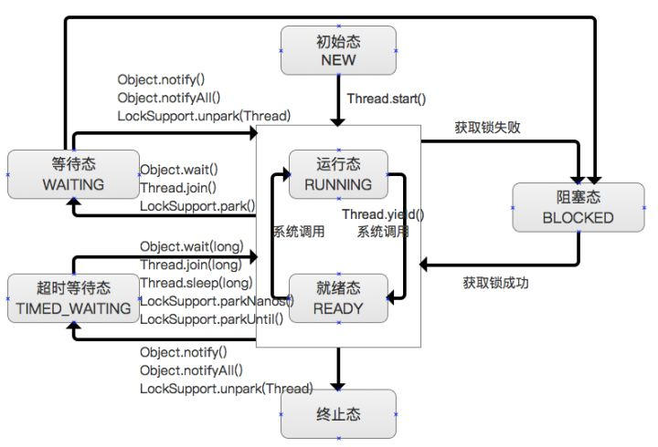
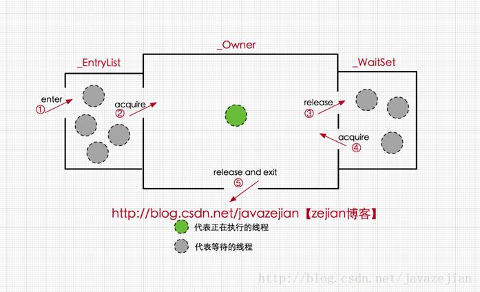
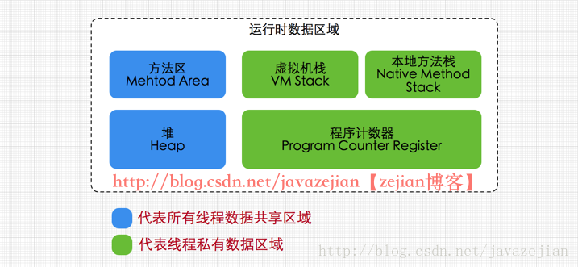
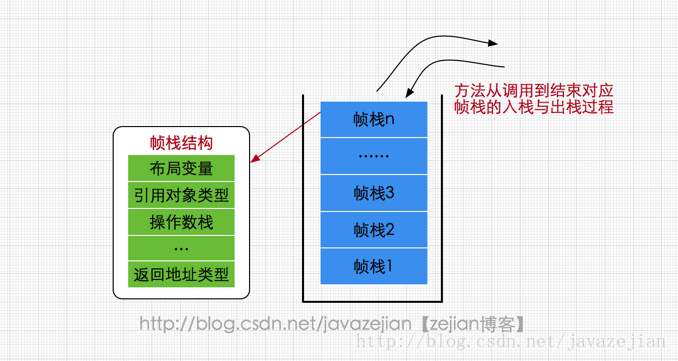
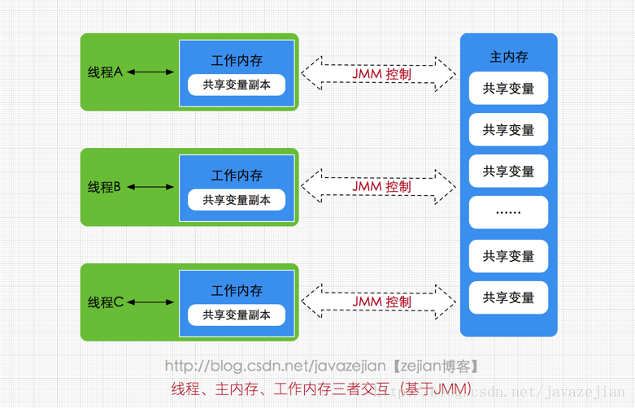
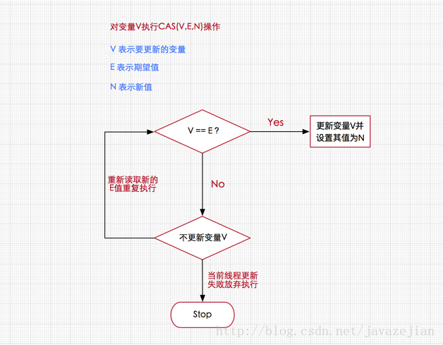
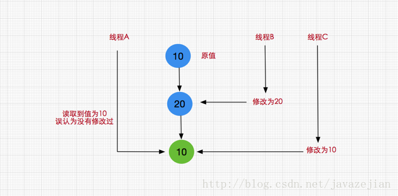
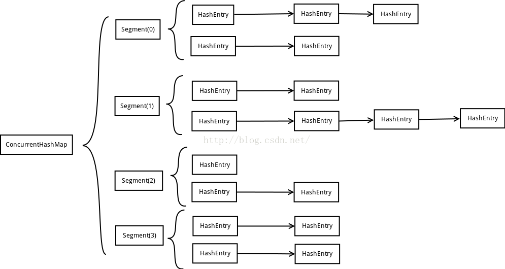

### 一.线程

#### 1).线程的状态

在Java中线程的状态一共被分成6种：



1. 初始态：NEW

   创建一个Thread对象，但还未调用start()启动线程时，线程处于初始态。

2. 运行态：RUNNABLE

   在Java中，运行态包括就绪态 和 运行态。

   - 就绪态
     - 该状态下的线程已经获得执行所需的所有资源，只要CPU分配执行权就能运行。
     - 所有就绪态的线程存放在就绪队列中。
   - 运行态
     - 获得CPU执行权，正在执行的线程。
     - 由于一个CPU同一时刻只能执行一条线程，因此每个CPU每个时刻只有一条运行态的线程。

3. 阻塞态

   - 当一条正在执行的线程请求某一资源失败时，就会进入阻塞态。
   - 而在Java中，阻塞态专指请求锁失败时进入的状态。
   - 由一个阻塞队列存放所有阻塞态的线程。
   - 处于阻塞态的线程会不断请求资源，一旦请求成功，就会进入就绪队列，等待执行。

   PS：锁、IO、Socket等都资源。

4. 等待态

   - 当前线程中调用wait、join、park函数时，当前线程就会进入等待态。
   - 也有一个等待队列存放所有等待态的线程。
   - 线程处于等待态表示它需要等待其他线程的指示才能继续运行。
   - 进入等待态的线程会释放CPU执行权，并释放资源（如：锁）

5. 超时等待态

   - 当运行中的线程调用sleep(time)、wait、join、parkNanos、parkUntil时，就会进入该状态；
   - 它和等待态一样，并不是因为请求不到资源，而是主动进入，并且进入后需要其他线程唤醒；
   - 进入该状态后释放CPU执行权 和 占有的资源。
   - 与等待态的区别：到了超时时间后自动进入阻塞队列，开始竞争锁。

6. 终止态

   线程执行结束后的状态。

#### 2).创建线程的方式

##### 1.继承Thread类

```java
class MyThread extends Thread{

    @Override
    public void run() {

        for (int i = 0; i < 30; i++) {

            System.out.println("子线程执行 +" + i);
        }
    }
}
```


```java
//调用
new MyThread().start();
```

##### 2.Runnable接口

1. 实现Runnable接口

   ```java
   class MyRunnable implements Runnable{
   
   	@Override
       public void run() {
           for (int i = 0; i < 30; i++) {
   
               System.out.println("子线程Runnable执行 +" + i);
           }
       }
   }
   ```

   ```java
   //调用
   new Thread(new MyRunnable()).start();
   ```

2. 内部类

   ```java
   new Thread(new Runnable() {
       @Override
       public void run() {
   
           for (int i = 0; i < 30; i++) {
   
           	System.out.println("子线程Runnable执行 +" + i);
           }
       }
   });
   ```

3. lambda表达式

   ```java
   new Thread(()->{
   
       for (int i = 0; i < 30; i++) {
   
       	System.out.println("子线程Runnable执行 +" + i);
       }
   }).start();
   ```

##### 3.有返回值和异常

继承Callable接口，实现call方法

```java
public class ReturnValueThread implements Callable<Integer> {


    @Override
    public Integer call() throws Exception {

        System.out.println("等待中.....");
        Thread.sleep(1000);
        return 3;
    }

    public static void main(String[] args) throws Exception {

        //创建未来任务
        FutureTask<Integer> futureTask = new FutureTask<>(new ReturnValueThread());
        
        //执行未来任务
        new Thread(futureTask).start();

        System.out.println("我先做点别的");
        //获取现场执行的返回值
        int num = futureTask.get();

        System.out.println(num);

    }
}
```

##### 4.定时器

```java
ScheduledExecutorService ses = Executors.newSingleThreadScheduledExecutor();
/**
  * @param command the task to execute
  * @param initialDelay the time to delay first execution
  * @param period the period between successive executions
  * @param unit the time unit of the initialDelay and period parameters
*/
ses.scheduleAtFixedRate(new Runnable() {
    public void run() {

        System.out.println("哈哈哈。。。。");
    }
},1,1,TimeUnit.SECONDS);
```

##### 5.线程池

```java
ExecutorService executorService = Executors.newFixedThreadPool(10);

for ( int i = 0; i < 100; i++) {

    final  int j = i;
    executorService.submit(new Runnable() {
        @Override
        public void run() {

            System.out.println(Thread.currentThread().getName() + ",哈哈"  + j);
        }
    });
}

executorService.shutdown();
```


##### 6.spring

1. 在配置文件中开启异步配置(@EnableAsync)

   ```java
   @Configuration
   @Import(Person.class)
   @EnableAsync
   public class SpringConfig{
       
   }
   ```

2. 在bean的方法中加上@Async注解

   ```java
   public class Animal {
   
       @Async
       public void run(){
   
           System.out.println(Thread.currentThread().getName());
       }
   }
   ```

3. 直接在spring中获取该类，进行调用

##### 7.lambda表达式

```java
@Test
public void test02(){

    List<String> strings = Arrays.asList("asd","option","ssasd");

    //ForkJoin技术,
    // forEachOrdered:按照顺序遍历
    strings.parallelStream().forEachOrdered(x->{

        System.out.println(Thread.currentThread().getName() + ": " + x);
    });
}
```

#### 3).ThreadLocal

​	首先，在每个线程Thread内部有一个ThreadLocal.ThreadLocalMap类型的成员变量threadLocals，这个threadLocals就是用来存储实际的变量副本的，键值为当前ThreadLocal变量，value为变量副本（即T类型的变量）。

　　初始时，在Thread里面，threadLocals为空，当通过ThreadLocal变量调用get()方法或者set()方法，就会对Thread类中的threadLocals进行初始化，并且以当前ThreadLocal变量为键值，以ThreadLocal要保存的副本变量为value，存到threadLocals。

　　然后在当前线程里面，如果要使用副本变量，就可以通过get方法在threadLocals里面查找。

**总结一下：**

1. 实际的通过ThreadLocal创建的副本是存储在每个线程自己的threadLocals中的；

2. 为何threadLocals的类型ThreadLocalMap的键值为ThreadLocal对象，因为每个线程中可有多个threadLocal变量，就像上面代码中的longLocal和stringLocal；

3. 在进行get之前，必须先set，否则会报空指针异常；

   如果想在get之前不需要调用set就能正常访问的话，必须重写initialValue()方法。

   因为在上面的代码分析过程中，我们发现如果没有先set的话，即在map中查找不到对应的存储，则会通过调用setInitialValue方法返回i，而在setInitialValue方法中，有一个语句是T value = initialValue()， 而默认情况下，initialValue方法返回的是null。

#### 4)线程池ThreadPoolExecutor

##### (1)线程池的优点

1. 线程是稀缺资源，使用线程池可以减少创建和销毁线程的次数，每个工作线程都可以重复使用。

2. 可以根据系统的承受能力，调整线程池中工作线程的数量，防止因为消耗过多内存导致服务器崩溃。

##### (2)线程池的创建

```java
public ThreadPoolExecutor(int corePoolSize,
                               int maximumPoolSize,
                               long keepAliveTime,
                               TimeUnit unit,
                               BlockingQueue<Runnable> workQueue,
                               RejectedExecutionHandler handler) 
```

- corePoolSize：线程池核心线程数量

- maximumPoolSize:线程池最大线程数量

- keepAliverTime：当活跃线程数大于核心线程数时，空闲的多余线程最大存活时间

- unit：存活时间的单位

- workQueue：存放任务的队列

- handler：超出线程范围和队列容量的任务的处理程序

##### (3)线程池的实现原理

提交一个任务到线程池中，线程池的处理流程如下：

1. 判断**线程池里的核心线程**是否都在执行任务，如果不是（核心线程空闲或者还有核心线程没有被创建）则创建一个新的工作线程来执行任务。如果核心线程都在执行任务，则进入下个流程。

2. 线程池判断工作队列是否已满，如果工作队列没有满，则将新提交的任务存储在这个工作队列里。如果工作队列满了，则进入下个流程。

3. 判断**线程池里的线程**是否都处于工作状态，如果没有，则创建一个新的工作线程来执行任务。如果已经满了，则交给饱和策略来处理这个任务。

```java
@Test
public void test01(){


    ArrayBlockingQueue<Runnable> queue = new ArrayBlockingQueue<>(5);
    ThreadPoolExecutor poolExecutor = new ThreadPoolExecutor(5, 10, 60,
            TimeUnit.SECONDS, queue);

    for (int i = 0; i < 16; i++) {

        poolExecutor.execute(()->{

            try {
                System.out.println(Thread.currentThread().getName());
                Thread.sleep(10000);
            } catch (InterruptedException e) {
                e.printStackTrace();
            }
        });

        System.out.println("线程数:" + poolExecutor.getPoolSize());
        if (queue.size() > 0){

            System.out.println("阻塞队列长度:" + queue.size());
        }
    }

    poolExecutor.shutdown();

}
```

从结果可以观察出：

1、创建的线程池具体配置为：核心线程数量为5个；全部线程数量为10个；工作队列的长度为5。

2、我们通过queue.size()的方法来获取工作队列中的任务数。

3、运行原理：

​      **刚开始都是在创建新的线程，达到核心线程数量5个后，新的任务进来后不再创建新的线程，而是将任务加入工作队列，任务队列到达上线5个后，新的任务又会创建新的普通线程，直到达到线程池最大的线程数量10个，后面的任务则根据配置的饱和策略来处理。我们这里没有具体配置，使用的是默认的配置AbortPolicy:直接抛出异常。**

　　**当然，为了达到我需要的效果，上述线程处理的任务都是利用休眠导致线程没有释放！！！**

##### (4)RejectedExecutionHandler：饱和策略

当队列和线程池都满了，说明线程池处于饱和状态，那么必须对新提交的任务采用一种特殊的策略来进行处理。这个策略默认配置是AbortPolicy，表示无法处理新的任务而抛出异常。

- JAVA提供了4中策略：

  1. AbortPolicy：直接抛出异常
  2. CallerRunsPolicy：只用调用所在的线程运行任务
  3. DiscardOldestPolicy：丢弃队列里最近的一个任务，并执行当前任务。
  4. DiscardPolicy：不处理，丢弃掉。

- 设置策略有两种方式

  1. 初始化的时候设置

     ```java
     RejectedExecutionHandler handler = new ThreadPoolExecutor.DiscardPolicy();
     ThreadPoolExecutor threadPool = new ThreadPoolExecutor(2, 5, 60, TimeUnit.SECONDS, queue,handler);
     ```

  2. 使用set方法设置

     ```java
     ThreadPoolExecutor threadPool = new ThreadPoolExecutor(2, 5, 60, TimeUnit.SECONDS, queue);
     threadPool.setRejectedExecutionHandler(new ThreadPoolExecutor.AbortPolicy());
     ```


### 二.synchronized关键字

#### 1)Synchronized应用的三种方式

1. 作用于实例方法

   锁的是当前对象(synchronized(this))

   ```java
   public synchronized int increment(){
   
       try {
           Thread.sleep(new Random().nextInt(2));
       } catch (InterruptedException e) {
           e.printStackTrace();
       }
       return index++;
   }
   ```

2. 作用于同步代码块

   锁的是synchronized括号后面的实例

   ```java
   public  int increment(){
   
      synchronized (this){
   
          try {
              Thread.sleep(new Random().nextInt(2));
          } catch (InterruptedException e) {
              e.printStackTrace();
          }
          return index++;
      }
   }
   ```

3. 作用于静态方法

   锁的是当前类的字节码文件，即：类.class, 

   ```java
   //synchronized(SynchronizedTest.class)
   public static synchronized void fun(){
           
           indexStatic++;
   }
   ```

#### 2)synchronized底层语义原理

​	Java 虚拟机中的同步(Synchronization)基于进入和退出管程(Monitor)对象实现， 无论是显式同步(有明确的 monitorenter 和 monitorexit 指令,即同步代码块)还是隐式同步都是如此。在 Java 语言中，同步用的最多的地方可能是被 synchronized 修饰的同步方法。同步方法 并不是由 monitorenter 和 monitorexit 指令来实现同步的，而是由方法调用指令读取运行时常量池中方法的 ACC_SYNCHRONIZED 标志来隐式实现的，关于这点，稍后详细分析。下面先来了解一个概念Java对象头，这对深入理解synchronized实现原理非常关键。

##### (1)理解Java对象头与Monitor

在JVM中，对象在内存中的布局分为三块区域：对象头、实例数据和对齐填充。如下：


- 实例变量

  存放类的属性数据信息，包括父类的属性信息，如果是数组的实例部分还包括数组的长度，这部分内存按4字节对齐。

- 填充数据

  由于虚拟机要求对象起始地址必须是8字节的整数倍。填充数据不是必须存在的，仅仅是为了字节对齐，这点了解即可。

- 而对于顶部，则是Java头对象，它实现synchronized的锁对象的基础，这点我们重点分析它，一般而言，synchronized使用的锁对象是存储在Java对象头里的，jvm中采用2个字来存储对象头(如果对象是数组则会分配3个字，多出来的1个字记录的是数组长度)，其主要结构是由Mark Word 和 Class Metadata Address 组成，其结构说明如下表：

  | 虚拟机位数 | 头对象结构             | 说明                                                         |
  | ---------- | ---------------------- | ------------------------------------------------------------ |
  | 32/64bit   | Mark Word              | 存储对象的hashCode、锁信息或分代年龄或GC标志等信息           |
  | 32/64bit   | Class Metadata Address | 类型指针指向对象的类元数据，JVM通过这个指针确定该对象是哪个类的实例。 |

  其中Mark Word在默认情况下存储着对象的HashCode、分代年龄、锁标记位等以下是32位JVM的Mark Word默认存储结构

  | 锁状态   | 25bit        | 4bit         | 1bit是否是偏向锁 | 2bit锁标志位 |
  | -------- | ------------ | ------------ | ---------------- | ------------ |
  | 无锁状态 | 对象HashCode | 对象分代年龄 | 0                | 01           |

  由于对象头的信息是与对象自身定义的数据没有关系的额外存储成本，因此考虑到JVM的空间效率，Mark Word 被设计成为一个非固定的数据结构，以便存储更多有效的数据，它会根据对象本身的状态复用自己的存储空间，如32位JVM下，除了上述列出的Mark Word默认存储结构外，还有如下可能变化的结构：

  

  其中轻量级锁和偏向锁是Java 6 对 synchronized 锁进行优化后新增加的，稍后我们会简要分析。这里我们主要分析一下重量级锁也就是通常说synchronized的对象锁，锁标识位为10，其中指针指向的是monitor对象（也称为管程或监视器锁）的起始地址。每个对象都存在着一个 monitor 与之关联，对象与其 monitor 之间的关系有存在多种实现方式，如monitor可以与对象一起创建销毁或当线程试图获取对象锁时自动生成，但当一个 monitor 被某个线程持有后，它便处于锁定状态。在Java虚拟机(HotSpot)中，monitor是由ObjectMonitor实现的，其主要数据结构如下（位于HotSpot虚拟机源码ObjectMonitor.hpp文件，C++实现的）

  ```c++
  ObjectMonitor() {
      _header       = NULL;
      _count        = 0; //记录个数
      _waiters      = 0,
      _recursions   = 0;
      _object       = NULL;
      _owner        = NULL;
      _WaitSet      = NULL; //处于wait状态的线程，会被加入到_WaitSet
      _WaitSetLock  = 0 ;
      _Responsible  = NULL ;
      _succ         = NULL ;
      _cxq          = NULL ;
      FreeNext      = NULL ;
      _EntryList    = NULL ; //处于等待锁block状态的线程，会被加入到该列表
      _SpinFreq     = 0 ;
      _SpinClock    = 0 ;
      OwnerIsThread = 0 ;
    }
  ```

  ObjectMonitor中有两个队列，\_WaitSet 和 \_EntryList，用来保存ObjectWaiter对象列表( 每个等待锁的线程都会被封装成ObjectWaiter对象)，_owner指向持有ObjectMonitor对象的线程，当多个线程同时访问一段同步代码时，首先会进入 _EntryList 集合，当线程获取到对象的monitor 后进入 _Owner 区域并把monitor中的owner变量设置为当前线程同时monitor中的计数器count加1，若线程调用 wait() 方法，将释放当前持有的monitor，owner变量恢复为null，count自减1，同时该线程进入 WaitSe t集合中等待被唤醒。若当前线程执行完毕也将释放monitor(锁)并复位变量的值，以便其他线程进入获取monitor(锁)。如下图所示

  

  由此看来，monitor对象存在于每个Java对象的对象头中(存储的指针的指向)，synchronized锁便是通过这种方式获取锁的，也是为什么Java中任意对象可以作为锁的原因，同时也是notify/notifyAll/wait等方法存在于顶级对象Object中的原因(关于这点稍后还会进行分析)，ok~，有了上述知识基础后，下面我们将进一步分析synchronized在字节码层面的具体语义实现。

##### (2)synchronized代码块底层原理

现在我们重新定义一个synchronized修饰的同步代码块，在代码块中操作共享变量i，如下

```java
public class SyncCodeBlock {

   public int i;

   public void syncTask(){
       //同步代码库
       synchronized (this){
           i++;
       }
   }
}
```

编译上述代码并使用javap反编译后得到字节码如下(这里我们省略一部分没有必要的信息)：

```java
Classfile /Users/zejian/Downloads/Java8_Action/src/main/java/com/zejian/concurrencys/SyncCodeBlock.class
  Last modified 2017-6-2; size 426 bytes
  MD5 checksum c80bc322c87b312de760942820b4fed5
  Compiled from "SyncCodeBlock.java"
public class com.zejian.concurrencys.SyncCodeBlock
  minor version: 0
  major version: 52
  flags: ACC_PUBLIC, ACC_SUPER
Constant pool:
  //........省略常量池中数据
  //构造函数
  public com.zejian.concurrencys.SyncCodeBlock();
    descriptor: ()V
    flags: ACC_PUBLIC
    Code:
      stack=1, locals=1, args_size=1
         0: aload_0
         1: invokespecial #1                  // Method java/lang/Object."<init>":()V
         4: return
      LineNumberTable:
        line 7: 0
  //===========主要看看syncTask方法实现================
  public void syncTask();
    descriptor: ()V
    flags: ACC_PUBLIC
    Code:
      stack=3, locals=3, args_size=1
         0: aload_0
         1: dup
         2: astore_1
         3: monitorenter  //注意此处，进入同步方法
         4: aload_0
         5: dup
         6: getfield      #2             // Field i:I
         9: iconst_1
        10: iadd
        11: putfield      #2            // Field i:I
        14: aload_1
        15: monitorexit   //注意此处，退出同步方法
        16: goto          24
        19: astore_2
        20: aload_1
        21: monitorexit //注意此处，退出同步方法
        22: aload_2
        23: athrow
        24: return
      Exception table:
      //省略其他字节码.......
}
```

我们主要关注字节码中的如下代码

```assembly
3: monitorenter  //进入同步方法
//..........省略其他  
15: monitorexit   //退出同步方法
16: goto          24
//省略其他.......
21: monitorexit //退出同步方法
```

字节码中可知同步语句块的实现使用的是monitorenter 和 monitorexit 指令，其中monitorenter指令指向同步代码块的开始位置，monitorexit指令则指明同步代码块的结束位置，当执行monitorenter指令时，当前线程将试图获取 objectref(即对象锁) 所对应的 monitor 的持有权，当 objectref 的 monitor 的进入计数器为 0，那线程可以成功取得 monitor，并将计数器值设置为 1，取锁成功。如果当前线程已经拥有 objectref 的 monitor 的持有权，那它可以重入这个 monitor (关于重入性稍后会分析)，重入时计数器的值也会加 1。倘若其他线程已经拥有 objectref 的 monitor 的所有权，那当前线程将被阻塞，直到正在执行线程执行完毕，即monitorexit指令被执行，执行线程将释放 monitor(锁)并设置计数器值为0 ，其他线程将有机会持有 monitor 。值得注意的是编译器将会确保无论方法通过何种方式完成，方法中调用过的每条 monitorenter 指令都有执行其对应 monitorexit 指令，而无论这个方法是正常结束还是异常结束。为了保证在方法异常完成时 monitorenter 和 monitorexit 指令依然可以正确配对执行，编译器会自动产生一个异常处理器，这个异常处理器声明可处理所有的异常，它的目的就是用来执行 monitorexit 指令。从字节码中也可以看出多了一个monitorexit指令，它就是异常结束时被执行的释放monitor 的指令。

1. synchronized方法底层原理

   方法级的同步是隐式，即无需通过字节码指令来控制的，它实现在方法调用和返回操作之中。JVM可以从方法常量池中的方法表结构(method_info Structure) 中的 ACC_SYNCHRONIZED 访问标志区分一个方法是否同步方法。当方法调用时，调用指令将会 检查方法的 ACC_SYNCHRONIZED 访问标志是否被设置，如果设置了，执行线程将先持有monitor（虚拟机规范中用的是管程一词）， 然后再执行方法，最后再方法完成(无论是正常完成还是非正常完成)时释放monitor。在方法执行期间，执行线程持有了monitor，其他任何线程都无法再获得同一个monitor。如果一个同步方法执行期间抛 出了异常，并且在方法内部无法处理此异常，那这个同步方法所持有的monitor将在异常抛到同步方法之外时自动释放。下面我们看看字节码层面如何实现：

   ```java
   public class SyncMethod {
   
      public int i;
   
      public synchronized void syncTask(){
              i++;
      }
   }
   ```

   使用javap反编译后的字节码如下：

   ```java
   Classfile /Users/zejian/Downloads/Java8_Action/src/main/java/com/zejian/concurrencys/SyncMethod.class
     Last modified 2017-6-2; size 308 bytes
     MD5 checksum f34075a8c059ea65e4cc2fa610e0cd94
     Compiled from "SyncMethod.java"
   public class com.zejian.concurrencys.SyncMethod
     minor version: 0
     major version: 52
     flags: ACC_PUBLIC, ACC_SUPER
   Constant pool;
   
      //省略没必要的字节码
     //==================syncTask方法======================
     public synchronized void syncTask();
       descriptor: ()V
       //方法标识ACC_PUBLIC代表public修饰，ACC_SYNCHRONIZED指明该方法为同步方法
       flags: ACC_PUBLIC, ACC_SYNCHRONIZED
       Code:
         stack=3, locals=1, args_size=1
            0: aload_0
            1: dup
            2: getfield      #2                  // Field i:I
            5: iconst_1
            6: iadd
            7: putfield      #2                  // Field i:I
           10: return
         LineNumberTable:
           line 12: 0
           line 13: 10
   }
   ```

   从字节码中可以看出，synchronized修饰的方法并没有monitorenter指令和monitorexit指令，取得代之的确实是ACC_SYNCHRONIZED标识，该标识指明了该方法是一个同步方法，JVM通过该ACC_SYNCHRONIZED访问标志来辨别一个方法是否声明为同步方法，从而执行相应的同步调用。这便是synchronized锁在同步代码块和同步方法上实现的基本原理。同时我们还必须注意到的是在Java早期版本中，synchronized属于重量级锁，效率低下，因为监视器锁（monitor）是依赖于底层的操作系统的Mutex Lock来实现的，而操作系统实现线程之间的切换时需要从用户态转换到核心态，这个状态之间的转换需要相对比较长的时间，时间成本相对较高，这也是为什么早期的synchronized效率低的原因。庆幸的是在Java 6之后Java官方对从JVM层面对synchronized较大优化，所以现在的synchronized锁效率也优化得很不错了，Java 6之后，为了减少获得锁和释放锁所带来的性能消耗，引入了轻量级锁和偏向锁，接下来我们将简单了解一下Java官方在JVM层面对synchronized锁的优化。

2. Java虚拟机对synchronized的优化

   锁的状态总共有四种，无锁状态、偏向锁、轻量级锁和重量级锁。随着锁的竞争，锁可以从偏向锁升级到轻量级锁，再升级的重量级锁，但是锁的升级是单向的，也就是说只能从低到高升级，不会出现锁的降级，关于重量级锁，前面我们已详细分析过，下面我们将介绍偏向锁和轻量级锁以及JVM的其他优化手段，这里并不打算深入到每个锁的实现和转换过程更多地是阐述Java虚拟机所提供的每个锁的核心优化思想，毕竟涉及到具体过程比较繁琐，如需了解详细过程可以查阅《深入理解Java虚拟机原理》。

   - 偏向锁

     偏向锁是Java 6之后加入的新锁，它是一种针对加锁操作的优化手段，经过研究发现，在大多数情况下，锁不仅不存在多线程竞争，而且总是由同一线程多次获得，因此为了减少同一线程获取锁(会涉及到一些CAS操作,耗时)的代价而引入偏向锁。偏向锁的核心思想是，如果一个线程获得了锁，那么锁就进入偏向模式，此时Mark Word 的结构也变为偏向锁结构，当这个线程再次请求锁时，无需再做任何同步操作，即获取锁的过程，这样就省去了大量有关锁申请的操作，从而也就提供程序的性能。所以，对于没有锁竞争的场合，偏向锁有很好的优化效果，毕竟极有可能连续多次是同一个线程申请相同的锁。但是对于锁竞争比较激烈的场合，偏向锁就失效了，因为这样场合极有可能每次申请锁的线程都是不相同的，因此这种场合下不应该使用偏向锁，否则会得不偿失，需要注意的是，偏向锁失败后，并不会立即膨胀为重量级锁，而是先升级为轻量级锁。下面我们接着了解轻量级锁。

   - 轻量级锁

     倘若偏向锁失败，虚拟机并不会立即升级为重量级锁，它还会尝试使用一种称为轻量级锁的优化手段(1.6之后加入的)，此时Mark Word 的结构也变为轻量级锁的结构。轻量级锁能够提升程序性能的依据是“对绝大部分的锁，在整个同步周期内都不存在竞争”，注意这是经验数据。需要了解的是，轻量级锁所适应的场景是线程交替执行同步块的场合，如果存在同一时间访问同一锁的场合，就会导致轻量级锁膨胀为重量级锁。

   - 自旋锁

     轻量级锁失败后，虚拟机为了避免线程真实地在操作系统层面挂起，还会进行一项称为自旋锁的优化手段。这是基于在大多数情况下，线程持有锁的时间都不会太长，如果直接挂起操作系统层面的线程可能会得不偿失，毕竟操作系统实现线程之间的切换时需要从用户态转换到核心态，这个状态之间的转换需要相对比较长的时间，时间成本相对较高，因此自旋锁会假设在不久将来，当前的线程可以获得锁，因此虚拟机会让当前想要获取锁的线程做几个空循环(这也是称为自旋的原因)，一般不会太久，可能是50个循环或100循环，在经过若干次循环后，如果得到锁，就顺利进入临界区。如果还不能获得锁，那就会将线程在操作系统层面挂起，这就是自旋锁的优化方式，这种方式确实也是可以提升效率的。最后没办法也就只能升级为重量级锁了。

3. 锁消除

   消除锁是虚拟机另外一种锁的优化，这种优化更彻底，Java虚拟机在JIT编译时(可以简单理解为当某段代码即将第一次被执行时进行编译，又称即时编译)，通过对运行上下文的扫描，去除不可能存在共享资源竞争的锁，通过这种方式消除没有必要的锁，可以节省毫无意义的请求锁时间，如下StringBuffer的append是一个同步方法，但是在add方法中的StringBuffer属于一个局部变量，并且不会被其他线程所使用，因此StringBuffer不可能存在共享资源竞争的情景，JVM会自动将其锁消除。

   ```java
   public class StringBufferRemoveSync {
   
       public void add(String str1, String str2) {
           //StringBuffer是线程安全,由于sb只会在append方法中使用,不可能被其他线程引用
           //因此sb属于不可能共享的资源,JVM会自动消除内部的锁
           StringBuffer sb = new StringBuffer();
           sb.append(str1).append(str2);
       }
   
       public static void main(String[] args) {
           StringBufferRemoveSync rmsync = new StringBufferRemoveSync();
           for (int i = 0; i < 10000000; i++) {
               rmsync.add("abc", "123");
           }
       }
   
   }
   ```

4. synchronized的可重入性

   从互斥锁的设计上来说，当一个线程试图操作一个由其他线程持有的对象锁的临界资源时，将会处于阻塞状态，但当一个线程再次请求自己持有对象锁的临界资源时，这种情况属于重入锁，请求将会成功，在java中synchronized是基于原子性的内部锁机制，是可重入的，因此在一个线程调用synchronized方法的同时在其方法体内部调用该对象另一个synchronized方法，也就是说一个线程得到一个对象锁后再次请求该对象锁，是允许的，这就是synchronized的可重入性。如下：

   ```java
   public class AccountingSync implements Runnable{
       static AccountingSync instance=new AccountingSync();
       static int i=0;
       static int j=0;
       @Override
       public void run() {
           for(int j=0;j<1000000;j++){
   
               //this,当前实例对象锁
               synchronized(this){
                   i++;
                   increase();//synchronized的可重入性
               }
           }
       }
   
       public synchronized void increase(){
           j++;
       }
   
   
       public static void main(String[] args) throws InterruptedException {
           Thread t1=new Thread(instance);
           Thread t2=new Thread(instance);
           t1.start();t2.start();
           t1.join();t2.join();
           System.out.println(i);
       }
   }
   ```

   正如代码所演示的，在获取当前实例对象锁后进入synchronized代码块执行同步代码，并在代码块中调用了当前实例对象的另外一个synchronized方法，再次请求当前实例锁时，将被允许，进而执行方法体代码，这就是重入锁最直接的体现，需要特别注意另外一种情况，当子类继承父类时，子类也是可以通过可重入锁调用父类的同步方法。注意由于synchronized是基于monitor实现的，因此每次重入，monitor中的计数器仍会加1。

##### (3)单例模式

1. 饿汉模式

   ==由于饿汉模式不存在非原子操作，所以不存在线程安全问题==

   ```java
   public class HungrySingleton {
   
       //饿汉式
       private static HungrySingleton instance = new HungrySingleton();
       private HungrySingleton() {
       }
   
       public static HungrySingleton getInstance(){
   
           return  instance;
       }
   
       public static void main(String[] args) {
   
   
           ExecutorService executorService = Executors.newFixedThreadPool(10);
   
           for (int i = 0; i < 10; i++) {
   
               executorService.submit(()->{
   
                   System.out.println(HungrySingleton.getInstance());;
               });
           }
   
           executorService.shutdown();
   
       }
   }
   
   ```

2. 懒汉模式

   ```java
   /**
    * 懒汉式单例模式
    */
   public class LazySingleton {
   
   
       //加上volatile防止jvm重排序
       private static volatile LazySingleton instance;
       private LazySingleton() {
   
   
       }
   
       public static LazySingleton getInstance(){
   
           if (instance == null){
   
               synchronized (LazySingleton.class){
   
                   if (instance == null){
   
                       instance = new LazySingleton();
                   }
               }
           }
   
           return  instance;
       }
   }
   ```

##### (4)自定义锁

1. 要求

   - 使用synchronized关键字
   - 锁是可重入的

2. 代码

   ```java
   public class MyLock implements Lock {
   
       private boolean flag = false;
   
       //记录当前线程进入次数。为可重入锁做准备
       private int threadCount = 0;
       //记录当前线程，为可重入锁做准备
       private Thread thread = null;
   
       @Override
       public synchronized void lock() {
   
           
           while (flag && thread != Thread.currentThread()){
   
               try {
                   System.out.println("阻塞：" + Thread.currentThread().getName());
                   wait();
                   System.out.println("运行的：" + Thread.currentThread().getName());
   
               } catch (InterruptedException e) {
                   e.printStackTrace();
               }
           }
   
           threadCount ++;
           thread = Thread.currentThread();
           flag = true;
       }
   
       @Override
       public synchronized void unlock() {
   
           threadCount--;
           if (threadCount != 0){
   
               return;
           }
           thread = null;
           flag = false;
           notify();
       }
   
       @Override
       public void lockInterruptibly() throws InterruptedException {
   
       }
   
       @Override
       public boolean tryLock() {
           return false;
       }
   
       @Override
       public boolean tryLock(long time, TimeUnit unit) throws InterruptedException {
           return false;
       }
   
       @Override
       public Condition newCondition() {
           return null;
       }
   
   }
   
   ```


### 三.Java内存模型(JMM)

##### (1)Java内存区域



​	Java虚拟机在运行程序时会把其自动管理的内存划分为以上几个区域，每个区域都有的用途以及创建销毁的时机，其中蓝色部分代表的是所有线程共享的数据区域，而绿色部分代表的是每个线程的私有数据区域。

- 方法区（Method Area）

  方法区属于线程共享的内存区域，又称Non-Heap（非堆），主要用于存储已被虚拟机加载的类信息、常量、静态变量、即时编译器编译后的代码等数据，根据Java 虚拟机规范的规定，当方法区无法满足内存分配需求时，将抛出OutOfMemoryError 异常。值得注意的是在方法区中存在一个叫运行时常量池(Runtime Constant Pool）的区域，它主要用于存放编译器生成的各种字面量和符号引用，这些内容将在类加载后存放到运行时常量池中，以便后续使用。

- JVM堆（Java Heap）：

  Java 堆也是属于线程共享的内存区域，它在虚拟机启动时创建，是Java 虚拟机所管理的内存中最大的一块，主要用于存放对象实例，几乎所有的对象实例都在这里分配内存，注意Java 堆是垃圾收集器管理的主要区域，因此很多时候也被称做GC 堆，如果在堆中没有内存完成实例分配，并且堆也无法再扩展时，将会抛出OutOfMemoryError 异常。

- 程序计数器(Program Counter Register)：

  属于线程私有的数据区域，是一小块内存空间，主要代表当前线程所执行的字节码行号指示器。字节码解释器工作时，通过改变这个计数器的值来选取下一条需要执行的字节码指令，分支、循环、跳转、异常处理、线程恢复等基础功能都需要依赖这个计数器来完成。

- 虚拟机栈(Java Virtual Machine Stacks)：

  属于线程私有的数据区域，与线程同时创建，总数与线程关联，代表Java方法执行的内存模型。每个方法执行时都会创建一个栈桢来存储方法的的变量表、操作数栈、动态链接方法、返回值、返回地址等信息。每个方法从调用直结束就对于一个栈桢在虚拟机栈中的入栈和出栈过程，如下（图有误，应该为栈桢）：

  

- 本地方法栈(Native Method Stacks)：

  本地方法栈属于线程私有的数据区域，这部分主要与虚拟机用到的 Native 方法相关，一般情况下，我们无需关心此区域。

这里之所以简要说明这部分内容，注意是为了区别Java内存模型与Java内存区域的划分，毕竟这两种划分是属于不同层次的概念。

##### (2)Java内存模型概述

​	Java内存模型(即Java Memory Model，简称JMM)本身是一种抽象的概念，并不真实存在，它描述的是一组规则或规范，通过这组规范定义了程序中各个变量（包括实例字段，静态字段和构成数组对象的元素）的访问方式。由于JVM运行程序的实体是线程，而每个线程创建时JVM都会为其创建一个工作内存(有些地方称为栈空间)，用于存储线程私有的数据，而Java内存模型中规定所有变量都存储在主内存，主内存是共享内存区域，所有线程都可以访问，但线程对变量的操作(读取赋值等)必须在工作内存中进行，首先要将变量从主内存拷贝的自己的工作内存空间，然后对变量进行操作，操作完成后再将变量写回主内存，不能直接操作主内存中的变量，工作内存中存储着主内存中的变量副本拷贝，前面说过，工作内存是每个线程的私有数据区域，因此不同的线程间无法访问对方的工作内存，线程间的通信(传值)必须通过主内存来完成，其简要访问过程如下图



需要注意的是，JMM与Java内存区域的划分是不同的概念层次，更恰当说JMM描述的是一组规则，通过这组规则控制程序中各个变量在共享数据区域和私有数据区域的访问方式，JMM是围绕原子性，有序性、可见性展开的(稍后会分析)。JMM与Java内存区域唯一相似点，都存在共享数据区域和私有数据区域，在JMM中主内存属于共享数据区域，从某个程度上讲应该包括了堆和方法区，而工作内存数据线程私有数据区域，从某个程度上讲则应该包括程序计数器、虚拟机栈以及本地方法栈。或许在某些地方，我们可能会看见主内存被描述为堆内存，工作内存被称为线程栈，实际上他们表达的都是同一个含义。关于JMM中的主内存和工作内存说明如下

- 主内存

  主要存储的是Java实例对象，所有线程创建的实例对象都存放在主内存中，不管该实例对象是成员变量还是方法中的本地变量(也称局部变量)，当然也包括了共享的类信息、常量、静态变量。由于是共享数据区域，多条线程对同一个变量进行访问可能会发现线程安全问题。

- 工作内存

  主要存储当前方法的所有本地变量信息(工作内存中存储着主内存中的变量副本拷贝)，每个线程只能访问自己的工作内存，即线程中的本地变量对其它线程是不可见的，就算是两个线程执行的是同一段代码，它们也会各自在自己的工作内存中创建属于当前线程的本地变量，当然也包括了字节码行号指示器、相关Native方法的信息。注意由于工作内存是每个线程的私有数据，线程间无法相互访问工作内存，因此存储在工作内存的数据不存在线程安全问题。

弄清楚主内存和工作内存后，接了解一下主内存与工作内存的数据存储类型以及操作方式，根据虚拟机规范，对于一个实例对象中的成员方法而言，如果方法中包含本地变量是基本数据类型(boolean,byte,short,char,int,long,float,double)将直接存储在工作内存的帧栈结构中，但倘若本地变量是引用类型，那么该变量的引用会存储在功能内存的帧栈中，而对象实例将存储在主内存(共享数据区域，堆)中。但对于实例对象的成员变量，不管它是基本数据类型或者包装类型(Integer、Double等)还是引用类型，都会被存储到堆区。至于static变量以及类本身相关信息将会存储在主内存中。需要注意的是，在主内存中的实例对象可以被多线程共享，倘若两个线程同时调用了同一个对象的同一个方法，那么两条线程会将要操作的数据拷贝一份到自己的工作内存中，执行完成操作后才刷新到主内存，简单示意图如下所示：


https://blog.csdn.net/javazejian/article/details/72772461#volatile%E5%86%85%E5%AD%98%E8%AF%AD%E4%B9%89

### 四.volatile关键字

volatile在并发编程中很常见，但也容易被滥用，现在我们就进一步分析volatile关键字的语义。volatile是Java虚拟机提供的轻量级的同步机制。volatile关键字有如下两个作用

- 保证被volatile修饰的共享变量对所有线程总数可见的，也就是当一个线程修改了一个被volatile修饰共享变量的值，新值总数可以被其他线程立即得知。
- 禁止指令重排序优化。

##### (1)volatile的可见性

​	关于volatile的可见性作用，我们必须意识到被volatile修饰的变量对所有线程总数立即可见的，对volatile变量的所有写操作总是能立刻反应到其他线程中，但是对于volatile变量运算操作在多线程环境并不保证安全性，如下

```java
public class VolatileVisibility {
    public static volatile int i =0;

    public static void increase(){
        i++;
    }
}
```

​	正如上述代码所示，i变量的任何改变都会立马反应到其他线程中，但是如此存在多条线程同时调用increase()方法的话，就会出现线程安全问题，毕竟i++;操作并不具备原子性，该操作是先读取值，然后写回一个新值，相当于原来的值加上1，分两步完成，如果第二个线程在第一个线程读取旧值和写回新值期间读取i的域值，那么第二个线程就会与第一个线程一起看到同一个值，并执行相同值的加1操作，这也就造成了线程安全失败，因此对于increase方法必须使用synchronized修饰，以便保证线程安全，需要注意的是一旦使用synchronized修饰方法后，由于synchronized本身也具备与volatile相同的特性，即可见性，因此在这样种情况下就完全可以省去volatile修饰变量。

```java
public class VolatileVisibility {
    public static int i =0;

    public synchronized static void increase(){
        i++;
    }
}
```

现在来看另外一种场景，可以使用volatile修饰变量达到线程安全的目的，如下

```java
public class VolatileSafe {

    volatile boolean close;

    public void close(){
        close=true;
    }

    public void doWork(){
        while (!close){
            System.out.println("safe....");
        }
    }
}
```

​	由于对于boolean变量close值的修改属于原子性操作，因此可以通过使用volatile修饰变量close，使用该变量对其他线程立即可见，从而达到线程安全的目的。那么JMM是如何实现让volatile变量对其他线程立即可见的呢？实际上，当写一个volatile变量时，JMM会把该线程对应的工作内存中的共享变量值刷新到主内存中，当读取一个volatile变量时，JMM会把该线程对应的工作内存置为无效，那么该线程将只能从主内存中重新读取共享变量。volatile变量正是通过这种写-读方式实现对其他线程可见（但其内存语义实现则是通过内存屏障，稍后会说明）。

##### (2)volatile禁止重排优化

​	volatile关键字另一个作用就是禁止指令重排优化，从而避免多线程环境下程序出现乱序执行的现象，关于指令重排优化前面已详细分析过，这里主要简单说明一下volatile是如何实现禁止指令重排优化的。先了解一个概念，内存屏障(Memory Barrier）。 

​	内存屏障，又称内存栅栏，是一个CPU指令，它的作用有两个，一是保证特定操作的执行顺序，二是保证某些变量的内存可见性（利用该特性实现volatile的内存可见性）。由于编译器和处理器都能执行指令重排优化。如果在指令间插入一条Memory Barrier则会告诉编译器和CPU，不管什么指令都不能和这条Memory Barrier指令重排序，也就是说通过插入内存屏障禁止在内存屏障前后的指令执行重排序优化。Memory Barrier的另外一个作用是强制刷出各种CPU的缓存数据，因此任何CPU上的线程都能读取到这些数据的最新版本。总之，volatile变量正是通过内存屏障实现其在内存中的语义，即可见性和禁止重排优化。下面看一个非常典型的禁止重排优化的例子DCL，如下：

```java
public class DoubleCheckLock {

    private static DoubleCheckLock instance;

    private DoubleCheckLock(){}

    public static DoubleCheckLock getInstance(){

        //第一次检测
        if (instance==null){
            //同步
            synchronized (DoubleCheckLock.class){
                if (instance == null){
                    //多线程环境下可能会出现问题的地方
                    instance = new DoubleCheckLock();
                }
            }
        }
        return instance;
    }
}
```

​	上述代码一个经典的单例的双重检测的代码，这段代码在单线程环境下并没有什么问题，但如果在多线程环境下就可以出现线程安全问题。原因在于某一个线程执行到第一次检测，读取到的instance不为null时，instance的引用对象可能没有完成初始化。因为instance = new DoubleCheckLock();可以分为以下3步完成(伪代码)

```java
memory = allocate(); //1.分配对象内存空间
instance(memory);    //2.初始化对象
instance = memory;   //3.设置instance指向刚分配的内存地址，此时instance！=null
```

​	由于步骤1和步骤2间可能会重排序，如下：

```java
memory = allocate(); //1.分配对象内存空间
instance = memory;   //3.设置instance指向刚分配的内存地址，此时instance！=null，但是对象还没有初始化完成！
instance(memory);    //2.初始化对象
```

​	由于步骤2和步骤3不存在数据依赖关系，而且无论重排前还是重排后程序的执行结果在单线程中并没有改变，因此这种重排优化是允许的。但是指令重排只会保证串行语义的执行的一致性(单线程)，但并不会关心多线程间的语义一致性。

​	由于有一个『instance已经不为null但是仍没有完成初始化』的中间状态，而这个时候，如果有其他线程刚好运行到第一层if (instance == null)这里，这里读取到的instance已经不为null了，所以就直接把这个中间状态的instance拿去用了，就会产生问题。

那么该如何解决呢，很简单，我们使用volatile禁止instance变量被执行指令重排优化即可。

```java
 //禁止指令重排优化
  private volatile static DoubleCheckLock instance;
```

**注意:**

​	volatile关键字的一个作用是禁止指令重排，把instance声明为volatile之后，对它的写操作就会有一个内存屏障（什么是内存屏障？），这样，在它的赋值完成之前，就不用会调用读操作。

​	volatile阻止的不是singleton = new Singleton()这句话内部[1-2-3]的指令重排，而是保证了在一个写操作（[1-2-3]）完成之前，不会调用读操作（if (instance == null)）。

### 五.CAS(Compare And Swap)无锁机制

#### 1)CAS概念内容

##### (1)无锁的概念

​	在谈论无锁概念时，总会关联起乐观派与悲观派，对于乐观派而言，他们认为事情总会往好的方向发展，总是认为坏的情况发生的概率特别小，可以无所顾忌地做事，但对于悲观派而已，他们总会认为发展事态如果不及时控制，以后就无法挽回了，即使无法挽回的局面几乎不可能发生。这两种派系映射到并发编程中就如同加锁与无锁的策略，即加锁是一种悲观策略，无锁是一种乐观策略，因为对于加锁的并发程序来说，它们总是认为每次访问共享资源时总会发生冲突，因此必须对每一次数据操作实施加锁策略。而无锁则总是假设对共享资源的访问没有冲突，线程可以不停执行，无需加锁，无需等待，一旦发现冲突，无锁策略则采用一种称为CAS的技术来保证线程执行的安全性，这项CAS技术就是无锁策略实现的关键，下面我们进一步了解CAS技术的奇妙之处。

##### (2)无锁的执行者-CAS

1. CAS的全称是`Compare And Swap` 即比较交换，其算法核心思想如下

   ```
   执行函数：CAS(V,E,N)
   ```

   其包含3个参数

   - V表示要更新的变量
   - E表示预期值
   - N表示新值

   如果V值等于E值，则将V的值设为N。若V值和E值不同，则说明已经有其他线程做了更新，则当前线程什么都不做。通俗的理解就是CAS操作需要我们提供一个期望值，当期望值与当前线程的变量值相同时，说明还没线程修改该值，当前线程可以进行修改，也就是执行CAS操作，但如果期望值与当前线程不符，则说明该值已被其他线程修改，此时不执行更新操作，但可以选择重新读取该变量再尝试再次修改该变量，也可以放弃操作，原理图如下

   

   ​	由于CAS操作属于乐观派，它总认为自己可以成功完成操作，当多个线程同时使用CAS操作一个变量时，只有一个会胜出，并成功更新，其余均会失败，但失败的线程并不会被挂起，仅是被告知失败，并且允许再次尝试，当然也允许失败的线程放弃操作，这点从图中也可以看出来。基于这样的原理，CAS操作即使没有锁，同样知道其他线程对共享资源操作影响，并执行相应的处理措施。同时从这点也可以看出，由于无锁操作中没有锁的存在，因此不可能出现死锁的情况，也就是说无锁操作天生免疫死锁。

2. CPU指令对CAS的支持

   ​	或许我们可能会有这样的疑问，假设存在多个线程执行CAS操作并且CAS的步骤很多，有没有可能在判断V和E相同后，正要赋值时，切换了线程，更改了值。造成了数据不一致呢？答案是否定的，因为CAS是一种系统原语，原语属于操作系统用语范畴，是由若干条指令组成的，用于完成某个功能的一个过程，并且原语的执行必须是连续的，在执行过程中不允许被中断，也就是说CAS是一条CPU的原子指令，不会造成所谓的数据不一致问题。

##### (3)CAS的ABA问题及其解决方案

​	假设这样一种场景，当第一个线程执行CAS(V,E,U)操作，在获取到当前变量V，准备修改为新值U前，另外两个线程已连续修改了两次变量V的值，使得该值又恢复为旧值，这样的话，我们就无法正确判断这个变量是否已被修改过，如下图



​	这就是典型的CAS的ABA问题，一般情况这种情况发现的概率比较小，可能发生了也不会造成什么问题，比如说我们对某个做加减法，不关心数字的过程，那么发生ABA问题也没啥关系。但是在某些情况下还是需要防止的，那么该如何解决呢？在Java中解决ABA问题，我们可以使用以下两个原子类

1. AtomicStampedReference类

   AtomicStampedReference原子类是一个带有时间戳的对象引用，在每次修改后,AtomicStampedReference不仅会设置新值而且还会记录更改的时间。当AtomicStampedReference设置对象值时，对象值以及时间戳都必须满足期望值才能写入成功，这也就解决了反复读写时，无法预知值是否已被修改的窘境

   底层实现为： 

   ​	通过Pair私有内部类存储数据和时间戳, 并构造volatile修饰的私有实例,接着看AtomicStampedReference类的compareAndSet（）方法的实现：同时对当前数据和当前时间进行比较，只有两者都相等是才会执行casPair()方法，单从该方法的名称就可知是一个CAS方法，最终调用的还是Unsafe类中的compareAndSwapObject方法。 到这我们就很清晰AtomicStampedReference的内部实现思想了，通过一个键值对Pair存储数据和时间戳，在更新时对数据和时间戳进行比较，只有两者都符合预期才会调用Unsafe的compareAndSwapObject方法执行数值和时间戳替换，也就避免了ABA的问题。

2. AtomicMarkableReference类

   AtomicMarkableReference与AtomicStampedReference不同的是，

   AtomicMarkableReference维护的是一个boolean值的标识，也就是说至于true和false两种切换状态，

   经过博主测试，这种方式并不能完全防止ABA问题的发生，只能减少ABA问题发生的概率。

AtomicMarkableReference的实现原理与AtomicStampedReference类似，这里不再介绍。到此，我们也明白了如果要完全杜绝ABA问题的发生，我们应该使用AtomicStampedReference原子类更新对象，而对于AtomicMarkableReference来说只能减少ABA问题的发生概率，并不能杜绝。

#### 2)CAS的应用

##### (1)Unsafe类

​	Unsafe类存在于sun.misc包中，其内部方法操作可以像C的指针一样直接操作内存，单从名称看来就可以知道该类是非安全的，毕竟Unsafe拥有着类似于C的指针操作，因此总是不应该首先使用Unsafe类，Java官方也不建议直接使用的Unsafe类，但我们还是很有必要了解该类，因为Java中CAS操作的执行依赖于Unsafe类的方法，注意Unsafe类中的所有方法都是native修饰的，也就是说Unsafe类中的方法都直接调用操作系统底层资源执行相应任务，关于Unsafe类的主要功能点如下：

1. 基本操作

   ```java
   //分配内存指定大小的内存
   public native long allocateMemory(long bytes);
   
   //根据给定的内存地址address设置重新分配指定大小的内存
   public native long reallocateMemory(long address, long bytes);
   
   //用于释放allocateMemory和reallocateMemory申请的内存
   public native void freeMemory(long address);
   
   //将指定对象的给定offset偏移量内存块中的所有字节设置为固定值
   public native void setMemory(Object o, long offset, long bytes, byte value);//设置给定内存地址的值public native void putAddress(long address, long x);
   
   //获取指定内存地址的值
   public native long getAddress(long address);
   
   //设置给定内存地址的long值
   public native void putLong(long address, long x);
   
   //获取指定内存地址的long值
   public native long getLong(long address);
   
   //设置或获取指定内存的byte值
   //其他基本数据类型(long,char,float,double,short等)的操作与putByte及getByte相同
   public native byte getByte(long address);
   public native void putByte(long address, byte x);
   
   //操作系统的内存页大小
   public native int pageSize();
   
   //提供实例对象新途径：
   //传入一个对象的class并创建该实例对象，但不会调用构造方法
   public native Object allocateInstance(Class cls) throws InstantiationException;
   ```

2. Unsafe里的CAS 操作相关

   ```java
   //第一个参数o为给定对象，offset为对象内存的偏移量，通过这个偏移量迅速定位字段并设置或获取该字段的值，
   //expected表示期望值，x表示要设置的值，下面3个方法都通过CAS原子指令执行操作。
   public final native boolean compareAndSwapObject(Object o, long offset,Object expected, Object x);                                                                                                  
    
   public final native boolean compareAndSwapInt(Object o, long offset,int expected,int x);
    
   public final native boolean compareAndSwapLong(Object o, long offset,long expected,long x);
   ```

3. 挂起与恢复

   ​	将一个线程进行挂起是通过park方法实现的，调用 park后，线程将一直阻塞直到超时或者中断等条件出现。unpark可以终止一个挂起的线程，使其恢复正常。Java对线程的挂起操作被封装在 `LockSupport`类中，LockSupport类中有各种版本pack方法，其底层实现最终还是使用`Unsafe.park()`方法和`Unsafe.unpark()`方法

   ```java
   //线程调用该方法，线程将一直阻塞直到超时，或者是中断条件出现。  
   public native void park(boolean isAbsolute, long time);  
    
   //终止挂起的线程，恢复正常.java.util.concurrent包中挂起操作都是在LockSupport类实现的，其底层正是使用这两个方法，  
   public native void unpark(Object thread); 
   ```

##### (2)并发包中的原子操作类(Atomic系列)

​	从JDK 1.5开始提供了`java.util.concurrent.atomic`包，在该包中提供了许多基于CAS实现的原子操作类，用法方便，性能高效，主要分以下4种类型。

- AtomicBoolean：原子更新布尔类型
- AtomicInteger：原子更新整型
- AtomicLong：原子更新长整型

这3个类的实现原理和使用方式几乎是一样的，这里我们以AtomicInteger为例进行分析，AtomicInteger主要是针对int类型的数据执行原子操作，它提供了原子自增方法、原子自减方法以及原子赋值方法等，鉴于AtomicInteger的源码不多，我们直接看源码

```java
public class AtomicInteger extends Number implements java.io.Serializable {
    private static final long serialVersionUID = 6214790243416807050L;
 
    // 获取指针类Unsafe
    private static final Unsafe unsafe = Unsafe.getUnsafe();
 
    //下述变量value在AtomicInteger实例对象内的内存偏移量
    private static final long valueOffset;
 
    static {
        try {
           //通过unsafe类的objectFieldOffset()方法，获取value变量在对象内存中的偏移
           //通过该偏移量valueOffset，unsafe类的内部方法可以获取到变量value对其进行取值或赋值操作
            valueOffset = unsafe.objectFieldOffset
                (AtomicInteger.class.getDeclaredField("value"));
        } catch (Exception ex) { throw new Error(ex); }
    }
   //当前AtomicInteger封装的int变量value
    private volatile int value;
 
    public AtomicInteger(int initialValue) {
        value = initialValue;
    }
    public AtomicInteger() {
    }
   //获取当前最新值，
    public final int get() {
        return value;
    }
    //设置当前值，具备volatile效果，方法用final修饰是为了更进一步的保证线程安全。
    public final void set(int newValue) {
        value = newValue;
    }
    //最终会设置成newValue，使用该方法后可能导致其他线程在之后的一小段时间内可以获取到旧值，有点类似于延迟加载
    public final void lazySet(int newValue) {
        unsafe.putOrderedInt(this, valueOffset, newValue);
    }
   //设置新值并获取旧值，底层调用的是CAS操作即unsafe.compareAndSwapInt()方法
    public final int getAndSet(int newValue) {
        return unsafe.getAndSetInt(this, valueOffset, newValue);
    }
   //如果当前值为expect，则设置为update(当前值指的是value变量)
    public final boolean compareAndSet(int expect, int update) {
        return unsafe.compareAndSwapInt(this, valueOffset, expect, update);
    }
    //当前值加1返回旧值，底层CAS操作
    public final int getAndIncrement() {
        return unsafe.getAndAddInt(this, valueOffset, 1);
    }
    //当前值减1，返回旧值，底层CAS操作
    public final int getAndDecrement() {
        return unsafe.getAndAddInt(this, valueOffset, -1);
    }
   //当前值增加delta，返回旧值，底层CAS操作
    public final int getAndAdd(int delta) {
        return unsafe.getAndAddInt(this, valueOffset, delta);
    }
    //当前值加1，返回新值，底层CAS操作
    public final int incrementAndGet() {
        return unsafe.getAndAddInt(this, valueOffset, 1) + 1;
    }
    //当前值减1，返回新值，底层CAS操作
    public final int decrementAndGet() {
        return unsafe.getAndAddInt(this, valueOffset, -1) - 1;
    }
   //当前值增加delta，返回新值，底层CAS操作
    public final int addAndGet(int delta) {
        return unsafe.getAndAddInt(this, valueOffset, delta) + delta;
    }
   //省略一些不常用的方法....
}
```

​	通过上述的分析，可以发现AtomicInteger原子类的内部几乎是基于前面分析过Unsafe类中的CAS相关操作的方法实现的，这也同时证明AtomicInteger是基于无锁实现的，这里重点分析自增操作实现过程，其他方法自增实现原理一样。

​	我们发现AtomicInteger类中所有自增或自减的方法都间接调用Unsafe类中的getAndAddInt()方法实现了CAS操作，从而保证了线程安全，关于getAndAddInt其实前面已分析过，它是Unsafe类中1.8新增的方法，源码如下

```java
//Unsafe类中的getAndAddInt方法
public final int getAndAddInt(Object o, long offset, int delta) {
    int v;
    do {
        v = getIntVolatile(o, offset);
    } while (!compareAndSwapInt(o, offset, v, v + delta));
    return v;
}
```

​	可看出getAndAddInt通过一个while循环不断的重试更新要设置的值，直到成功为止，调用的是Unsafe类中的compareAndSwapInt方法，是一个CAS操作方法。这里需要注意的是，上述源码分析是基于JDK1.8的，如果是1.8之前的方法，AtomicInteger源码实现有所不同，是基于for死循环的，如下

```java
//JDK 1.7的源码，由for的死循环实现，并且直接在AtomicInteger实现该方法，
//JDK1.8后，该方法实现已移动到Unsafe类中，直接调用getAndAddInt方法即可
public final int incrementAndGet() {
    for (;;) {
        int current = get();
        int next = current + 1;
        if (compareAndSet(current, next))
            return next;
    }
}
```

##### (3)自旋锁

​	自旋锁是一种假设在不久将来，当前的线程可以获得锁，因此虚拟机会让当前想要获取锁的线程做几个空循环(这也是称为自旋的原因)，在经过若干次循环后，如果得到锁，就顺利进入临界区。如果还不能获得锁，那就会将线程在操作系统层面挂起，这种方式确实也是可以提升效率的。但问题是当线程越来越多竞争很激烈时，占用CPU的时间变长会导致性能急剧下降，因此Java虚拟机内部一般对于自旋锁有一定的次数限制，可能是50或者100次循环后就放弃，直接挂起线程，让出CPU资源。

如下通过AtomicReference可实现简单的自旋锁。

```java
public class SpinLock {
  private AtomicReference<Thread> sign =new AtomicReference<>();
 
  public void lock(){
    Thread current = Thread.currentThread();
    while(!sign.compareAndSet(null, current)){
    }
  }
 
  public void unlock (){
    Thread current = Thread.currentThread();
    sign.compareAndSet(current, null);
  }
}
```

​	使用CAS原子操作作为底层实现，lock()方法将要更新的值设置为当前线程，并将预期值设置为null。unlock()函数将要更新的值设置为null，并预期值设置为当前线程。然后我们通过lock()和unlock来控制自旋锁的开启与关闭，注意这是一种非公平锁。事实上AtomicInteger(或者AtomicLong)原子类内部的CAS操作也是通过不断的自循环(while循环)实现，不过这种循环的结束条件是线程成功更新对于的值，但也是自旋锁的一种。

##### (4)AQS(AbstractQueuedSynchronizer)

AQS通过CAS + Queue来实现锁的机制

AQS应用:

######  1.ReentrantLock

 通过实现Lock接口，完成类似synchronized锁机制.

```java
public class ReentrantLockTest {

    private int index = 0;
    private Lock lock = new ReentrantLock(true);

    public int increment(){


        //线程进来了，发现是0，则继续执行
        //如果发现不是0，则保存进程信息，同时中断线程，等待唤醒
        lock.lock();
        //...
        int tmp = index++;
        decrement();
        try {
            Thread.sleep(100);
        } catch (InterruptedException e) {
            e.printStackTrace();
        }finally {

            //改成0，同时通知其他等待线程启动
            lock.unlock();
        }

        return tmp;
    }

    public int decrement(){
        
        try {
            lock.lock();
            int tmp = index--;
            return tmp;
            
        }finally {
            
            lock.unlock();
        }
        
    }

    public static void main(String[] args) {

        ReentrantLockTest rt = new ReentrantLockTest();

        ExecutorService executorService = Executors.newFixedThreadPool(10);

        for (int i = 0; i < 10; i++) {

            executorService.submit(()->{

                System.out.println(rt.increment());
            });
        }


    }
}
```

###### 2.ReentrantReadWriteLock

　读写锁是一种特殊的自旋锁，它把对共享资源对访问者划分成了读者和写者，读者只对共享资源进行访问，写者则是对共享资源进行写操作。读写锁在ReentrantLock上进行了拓展使得该锁更适合读操作远远大于写操作对场景。一个读写锁同时只能存在一个写锁但是可以存在多个读锁，但不能同时存在写锁和读锁。

　如果读写锁当前没有读者，也没有写者，那么写者可以立刻获的读写锁，否则必须自旋，直到没有任何的写锁或者读锁存在。如果读写锁没有写锁，那么读锁可以立马获取，否则必须等待写锁释放。(但是有一个例外，就是读写锁中的锁降级操作，当同一个线程获取写锁后，在写锁没有释放的情况下可以获取读锁再释放读锁这就是锁降级的一个过程)

```
package cn.memedai;

import java.util.Random;
import java.util.concurrent.ExecutorService;
import java.util.concurrent.Executors;
import java.util.concurrent.locks.ReadWriteLock;

/**
 * 读写锁Demo
 */
public class ReentrantReadWriteLockDemo {

    class MyObject {
        private Object object;

        private ReadWriteLock lock = new java.util.concurrent.locks.ReentrantReadWriteLock();

        public void get() throws InterruptedException {
            lock.readLock().lock();//上读锁
            try {
                System.out.println(Thread.currentThread().getName() + "准备读取数据");
                Thread.sleep(new Random().nextInt(1000));
                System.out.println(Thread.currentThread().getName() + "读数据为：" + this.object);
            } finally {
                lock.readLock().unlock();
            }
        }

        public void put(Object object) throws InterruptedException {
            lock.writeLock().lock();
            try {
                System.out.println(Thread.currentThread().getName() + "准备写数据");
                Thread.sleep(new Random().nextInt(1000));
                this.object = object;
                System.out.println(Thread.currentThread().getName() + "写数据为" + this.object);
            } finally {
                lock.writeLock().unlock();
            }
        }
    }

    public static void main(String[] args) {
        final MyObject myObject = new ReentrantReadWriteLockDemo().new MyObject();
        ExecutorService executorService = Executors.newCachedThreadPool();
        for (int i = 0; i < 3; i++) {
            executorService.execute(new Runnable() {
                @Override
                public void run() {
                    for (int j = 0; j < 3; j++) {

                        try {
                            myObject.put(new Random().nextInt(1000));//写操作
                        } catch (InterruptedException e) {
                            e.printStackTrace();
                        }
                    }
                }
            });
        }

        for (int i = 0; i < 3; i++) {
            executorService.execute(new Runnable() {
                @Override
                public void run() {
                    for (int j = 0; j < 3; j++) {
                        try {
                            myObject.get();//多个线程读取操作
                        } catch (InterruptedException e) {
                            e.printStackTrace();
                        }
                    }
                }
            });
        }

        executorService.shutdown();
    }
}
```

**锁降级**

锁降级指的是写锁降级成为读锁。锁降级是指把持住当前拥有的写锁的同时，再获取到读锁，随后释放写锁的过程。

```java
class CachedData {
   Object data;
   volatile boolean cacheValid;
   final ReentrantReadWriteLock rwl = new ReentrantReadWriteLock();

   void processCachedData() {
     rwl.readLock().lock();
     if (!cacheValid) {
        // Must release read lock before acquiring write lock
        rwl.readLock().unlock();
        rwl.writeLock().lock();
        try {
          // Recheck state because another thread might have
          // acquired write lock and changed state before we did.
          if (!cacheValid) {
            data = ...
            cacheValid = true;
          }
          // Downgrade by acquiring read lock before releasing write lock
          rwl.readLock().lock();
        } finally {
          rwl.writeLock().unlock(); // Unlock write, still hold read
        }
     }

     try {
       use(data);
     } finally {
       rwl.readLock().unlock();
     }
   }
 }
```

代码中声明了一个volatile类型的cacheValid变量，保证其可见性。首先获取读锁，如果cache不可用，则释放读锁，获取写锁，在更改数据之前，再检查一次cacheValid的值，然后修改数据，将cacheValid置为true，然后在**释放写锁前获取读锁**；此时，cache中数据可用，处理cache中数据，最后释放读锁。这个过程就是一个完整的锁降级的过程，目的是保证数据可见性，如果当前的线程*C*在修改完cache中的数据后，没有获取读锁而是直接释放了写锁，那么假设此时另一个线程*T*获取了写锁并修改了数据，那么*C*线程无法感知到数据已被修改，则数据出现错误。如果遵循锁降级的步骤，线程*C*在释放写锁之前获取读锁，那么线程*T*在获取写锁时将被阻塞，直到线程*C*完成数据处理过程，释放读锁。

###### 3.Condition

condition与Object类中的wait，notify/notifyAll功能类似。里面有await方法和signal/signalAll方法

| 对比项                                                     | Object Monitor Methods     | Condition                                                    |
| ---------------------------------------------------------- | -------------------------- | ------------------------------------------------------------ |
| 前置条件                                                   | 在使用之前获取对象的锁     | 调用Lock.lock获取锁；<br>调用Lock.newCondition获取Condition对象； |
| 调用方式                                                   | 直接调用，如:object.wait() | 直接调用，如condition.await()                                |
| 等待队列个数                                               | 一个                       | 多个                                                         |
| 当前线程释放锁并进入等待状态                               | 支持                       | 支持                                                         |
| 当前线程释放锁并进入等待状态，在等待状态不响应中断         | 不支持                     | 支持                                                         |
| 当前线程释放锁并进入超时等待状态                           | 支持                       | 支持                                                         |
| 当前线程释放锁并进入超时等待状态，在超时等待状态不响应中断 | 不支持                     | 支持                                                         |
| 唤醒等待队列中的一个线程                                   | 支持                       | 支持                                                         |
| 唤醒等待队列中的全部线程                                   | 支持                       | 支持                                                         |

```java
class Resource01{

    private Integer count = 0;

    public Integer getCount() {
        return count;
    }

    public void setCount(Integer count) {
        this.count = count;
    }
}

public class SynchronizationRunTest01 {

    private Lock lock = new ReentrantLock();

    private Condition condition01 = lock.newCondition();
    private Condition condition02 = lock.newCondition();
    private Condition condition03 = lock.newCondition();


    @Test
    public void test() throws InterruptedException {

        Resource01 resource01 = new Resource01();


            new Thread(new Runnable() {

                @Override
                public void run() {
                    while (true){

                        lock.lock();

                        while (resource01.getCount() != 0){

                            try {
                                condition01.await();
                            } catch (InterruptedException e) {
                                e.printStackTrace();
                            }
                        }
                        System.out.println("A");
                        resource01.setCount(1);
                        condition02.signalAll();
                        lock.unlock();
                    }
                }
            }).start();
        new Thread(new Runnable() {

            @Override
            public void run() {
                while (true){

                    lock.lock();

                    while (resource01.getCount() != 1){

                        try {
                            condition02.await();
                        } catch (InterruptedException e) {
                            e.printStackTrace();
                        }
                    }
                    System.out.println("B");
                    resource01.setCount(2);
                    condition03.signalAll();
                    System.out.println("condition03 唤醒");
                    lock.unlock();
                    System.out.println("condition03 唤醒1111");

                }
            }
        }).start();
        new Thread(new Runnable() {

            @Override
            public void run() {
                while (true){

                    lock.lock();

                    while (resource01.getCount() != 2){

                        try {
                            condition03.await();
                            System.out.println("condition03 执行。。。");
                        } catch (InterruptedException e) {
                            e.printStackTrace();
                        }

                    }

//                    notifyAll();
                    System.out.println("C");
                    resource01.setCount(0);
                    condition01.signalAll();
                    lock.unlock();


                }
            }
        }).start();
        Thread.sleep(10000);
    }

}
```

注意事项**

1. condition必须在lock和unlock之间使用。
2. condition中signalAll/signal唤醒其他等待线程是在unlock之后唤醒。

###### 4.CountDownLatch

​	CountDownLatch是一个同步工具类，它允许一个或多个线程一直等待，直到其他线程执行完后再执行。例如，应用程序的主线程希望在负责启动框架服务的线程已经启动所有框架服务之后执行。

**在实时系统中的使用场景**

1. 实现最大的并行性：有时我们想同时启动多个线程，实现最大程度的并行性。例如，我们想测试一个单例类。如果我们创建一个初始计数器为1的CountDownLatch，并让其他所有线程都在这个锁上等待，只需要调用一次countDown()方法就可以让其他所有等待的线程同时恢复执行。
2. 开始执行前等待N个线程完成各自任务：例如应用程序启动类要确保在处理用户请求前，所有N个外部系统都已经启动和运行了。
3. 死锁检测：一个非常方便的使用场景是你用N个线程去访问共享资源，在每个测试阶段线程数量不同，并尝试产生死锁。

```java
/**
 *子线程等所有其他子线程创建完成后，一起执行，
 *主线程等待子线程执行完在结束
 */
public class CountDownTest {

    @Test
    public void test() throws InterruptedException {

        int n = 10;
        CountDownLatch countDownLatch = new CountDownLatch(1);
        CountDownLatch downLatch = new CountDownLatch(n);

        for (int i = 0; i < n; i++) {

            new Thread(()->{

                try {
					//子线程等待
                    System.out.println(Thread.currentThread().getName() + "开始等待");
                    countDownLatch.await();
                    System.out.println(Thread.currentThread().getName() + "开始执行");
                } catch (InterruptedException e) {
                    e.printStackTrace();
                }finally {

                    downLatch.countDown();

                }

            }).start();

        }

        countDownLatch.countDown();
        System.out.println(Thread.currentThread().getName() + "开始等待");
        //主线程等待
        downLatch.await();

    }
}
```

###### 5.CyclicBarrier

​	CyclicBarrier 的字面意思是可循环使用(Cyclic)的屏障(Barrier)。它要做的事情是，让一组线程到达一个屏障(也可以叫同步点)时被阻塞，直到最后一个线程到达屏障时，屏障才会开门，所有被屏障拦截的线程才会继续干活。CyclicBarrier默认的构造方法是CyclicBarrier(int parties)，其参数表示屏障拦截的线程数量，每个线程调用await方法告诉CyclicBarrier我已经到达了屏障，然后当前线程被阻塞。

```java
class Player implements Runnable {
  private CyclicBarrier cyclicBarrier;
  private int id;

  public Player(int id, CyclicBarrier cyclicBarrier) {
    this.cyclicBarrier = cyclicBarrier;
    this.id = id;
  }

  @Override
  public void run() {
    try {
      System.out.println("玩家" + id + "正在玩第一关...");
      cyclicBarrier.await();
      System.out.println("玩家" + id + "进入第二关...");
    } catch (InterruptedException e) {
      e.printStackTrace();
    } catch (BrokenBarrierException e) {
      e.printStackTrace();
    }
  }
}


public class CyclicBarrierTest {
  public static void main(String[] args) {
    // CyclicBarrier cyclicBarrier = new CyclicBarrier(4);
    CyclicBarrier cyclicBarrier = new CyclicBarrier(4,
        new Runnable() {
          @Override
          public void run() {
            System.out.println("所有玩家进入第二关！");
          }
        });

    for (int i = 0; i < 4; i++) {
      new Thread(new Player(i, cyclicBarrier)).start();
    }
  }
}
```

**CyclicBarrier和CountDownLatch的区别**

- CountDownLatch: 一个线程(或者多个)， 等待另外N个线程完成某个事情之后才能执行。
- CyclicBarrier: N个线程相互等待，任何一个线程完成之前，所有的线程都必须等待。
- CountDownLatch的计数器只能使用一次。而CyclicBarrier的计数器可以使用reset() 方法重置。所以CyclicBarrier能处理更为复杂的业务场景，比如如果计算发生错误，可以重置计数器，并让线程们重新执行一次。
- CountDownLatch：减计数方式，CyclicBarrier：加计数方式

###### 6.Semaphore

​	Semaphore是一种基于计数的信号量。它可以设定一个阈值，基于此，多个线程竞争获取许可信号，做完自己的申请后归还，超过阈值后，线程申请许可信号将会被阻塞。Semaphore可以用来构建一些对象池，资源池之类的，比如数据库连接池，我们也可以创建计数为1的Semaphore，将其作为一种类似互斥锁的机制，这也叫二元信号量，表示两种互斥状态。

```java
class SemTask implements Runnable{

    private int num;
    private Semaphore semaphore;

    public SemTask(int num, Semaphore semaphore) {
        this.num = num;
        this.semaphore = semaphore;
    }

    @Override
    public void run() {

        try {
            semaphore.acquire();
            System.out.println(Thread.currentThread().getName() + "执行" + num);
            Thread.sleep(1000);
            System.out.println(Thread.currentThread().getName() + "释放" + num);
            semaphore.release();
        } catch (InterruptedException e) {
            e.printStackTrace();
        }

    }
}

public class SemaphoreTest01 {

    @Test
    public void test() throws InterruptedException {

        int num = 5;
        Semaphore semaphore = new Semaphore(num);

        for (int i = 0; i < 10; i++) {

            new Thread(new SemTask(i,semaphore)).start();
        }

        Thread.sleep(100000);
    }
}
```

### 六.同步容器和并发容器

#### 1)同步容器

在Java中，同步容器主要包括2类：

##### (1).Vector、Stack、HashTable

1. Vector实现了List接口，Vector实际上就是一个数组，和ArrayList类似，但是Vector中的方法都是synchronized方法，即进行了同步措施。
2. Stack也是一个同步容器，它的方法也用synchronized进行了同步，它实际上是继承于Vector类。
3. HashTable实现了Map接口，它和HashMap很相似，但是HashTable使用synchronized进行了同步处理，而HashMap没有。

##### (2).Collections类中提供的静态工厂方法创建的类

​	Collections类是一个工具提供类，注意，它和Collection不同，Collection是一个顶层的接口。在Collections类中提供了大量的方法，比如对集合或者容器进行排序、查找等操作。最重要的是，在它里面提供了几个静态工厂方法来创建同步容器类

```java
 //把线程不安全的容器变成线程安全的
Collection<String> strings = Collections.synchronizedCollection(new ArrayList<String>());
List list = Collections.synchronizedList(new ArrayList<>());
Map synMap = Collections.synchronizedMap(map);
Set synSet = Collections.synchronizedSortedSet(new TreeSet<>());
```

​	从同步容器的具体实现源码可知，同步容器中的方法采用了synchronized进行了同步，那么很显然，这必然会影响到执行性能，另外，同步容器就一定是真正地完全线程安全吗？不一定，这个在下面会讲到。

##### (3)同步容器真的是安全的吗

```java
public class Test {
    static Vector<Integer> vector = new Vector<Integer>();
    public static void main(String[] args) throws InterruptedException {
        while(true) {
            for(int i=0;i<10;i++)
                vector.add(i);
            Thread thread1 = new Thread(){
                public void run() {
                    for(int i=0;i<vector.size();i++)
                        vector.remove(i);
                };
            };
            Thread thread2 = new Thread(){
                public void run() {
                    for(int i=0;i<vector.size();i++)
                        vector.get(i);
                };
            };
            thread1.start();
            thread2.start();
            while(Thread.activeCount()>10)   {
                 
            }
        }
    }
}
```

上面可能通过get获取到的是已经删除的对象，要解决这个问题，必须在外面再加上一个锁。

```java
@Test
public void vectorTest(){

    Lock lock = new ReentrantLock();
    Vector<Integer> vector = new Vector<>();
    while(true) {
        for(int i=0;i<10;i++)
            vector.add(i);
        Thread thread1 = new Thread(){
            public void run() {

                try {
                    lock.lock();
                    for(int i=0;i<vector.size();i++){

                        Integer tmp = vector.remove(i);
                        System.out.println("删除" + tmp);
                    }

                }finally {

                    lock.unlock();
                }

            };
        };
        Thread thread2 = new Thread(){
            public void run() {

                try {
                    lock.lock();
                    for(int i=0;i<vector.size();i++){

                        Integer tmp = vector.get(i);
                        System.out.println("取到" + tmp);
                    }

                }finally {

                    lock.unlock();
                }

            };
        };
        thread1.start();
        thread2.start();
        while(Thread.activeCount()>10)   {

        }
    }
}
```

#### 2).并发容器

​	JDK5中添加了新的concurrent包，相对同步容器而言，并发容器通过一些机制改进了并发性能。因为同步容器将所有对容器状态的访问都串行化了，这样保证了线程的安全性，所以这种方法的代价就是严重降低了并发性，当多个线程竞争容器时，吞吐量严重降低。因此Java5.0开始针对多线程并发访问设计，提供了并发性能较好的并发容器，引入了java.util.concurrent包。与Vector和Hashtable、Collections.synchronizedXxx()同步容器等相比，util.concurrent中引入的并发容器主要解决了两个问题：

1. 根据具体场景进行设计，尽量避免synchronized，提供并发性。 
2. 定义了一些并发安全的复合操作，并且保证并发环境下的迭代操作不会出错。

==util.concurrent中容器在迭代时，可以不封装在synchronized中，可以保证不抛异常，但是未必每次看到的都是"最新的、当前的"数据。==

- ConcurrentHashMap代替同步的Map（Collections.synchronized（new HashMap()）），众所周知，HashMap是根据散列值分段存储的，同步Map在同步的时候锁住了所有的段，而ConcurrentHashMap加锁的时候根据散列值锁住了散列值锁对应的那段，因此提高了并发性能。

- ConcurrentHashMap也增加了对常用复合操作的支持，比如"若没有则添加"：putIfAbsent()，替换：replace()。这2个操作都是原子操作。

- CopyOnWriteArrayList和CopyOnWriteArraySet分别代替List和Set，主要是在遍历操作为主的情况下来代替同步的List和同步的Set，这也就是上面所述的思路：迭代过程要保证不出错，除了加锁，另外一种方法就是"克隆"容器对象。
- ConcurrentLinkedQuerue是一个先进先出的队列。它是非阻塞队列。
- ConcurrentSkipListMap可以在高效并发中替代SoredMap（例如用Collections.synchronzedMap包装的TreeMap）。
- ConcurrentSkipListSet可以在高效并发中替代SoredSet（例如用Collections.synchronzedSet包装的TreeMap)。

##### (1).ConcurrentHashMap

 	HashMap是非线程安全的，Hashtable是线程安全的，但是由于Hashtable是采用synchronized进行同步，相当于所有线程进行读写时都去竞争一把锁，导致效率非常低下。

​	ConcurrentHashMap可以做到读取数据不加锁，并且其内部的结构可以让其在进行写操作的时候能够将锁的粒度保持地尽量地小，不用对整个ConcurrentHashMap加锁。ConcurrentHashMap为了提高本身的并发能力，在内部采用了一个叫做Segment的结构，一个Segment其实就是一个类Hash Table的结构，Segment内部维护了一个链表数组，我们用下面这一幅图来看下ConcurrentHashMap的内部结构：



​	从上面的结构我们可以了解到，ConcurrentHashMap定位一个元素的过程需要进行两次Hash操作，第一次Hash定位到Segment，第二次Hash定位到元素所在的链表的头部，因此，这一种结构的带来的副作用是Hash的过程要比普通的HashMap要长，但是带来的好处是写操作的时候可以只对元素所在的Segment进行加锁即可，不会影响到其他的Segment，这样，在最理想的情况下，ConcurrentHashMap可以最高同时支持Segment数量大小的写操作（刚好这些写操作都非常平均地分布在所有的Segment上），所以，通过这一种结构，ConcurrentHashMap的并发能力可以大大的提高。

**Segment的数据结构**:

```java
static final class Segment<K,V> extends ReentrantLock implements Serializable {
    transient volatile int count;
    transient int modCount;
    transient int threshold;
    transient volatile HashEntry<K,V>[] table;
    final float loadFactor;
}
```

详细解释一下Segment里面的成员变量的意义：

- count：Segment中元素的数量
- modCount：对table的大小造成影响的操作的数量（比如put或者remove操作）
- threshold：阈值，Segment里面元素的数量超过这个值依旧就会对Segment进行扩容
- table：链表数组，数组中的每一个元素代表了一个链表的头部
- loadFactor：负载因子，用于确定threshold

Segment中的元素是以HashEntry的形式存放在链表数组中的，看一下HashEntry的结构：

```java
static final class HashEntry<K,V> {
    final K key;
    final int hash;
    volatile V value;
    final HashEntry<K,V> next;
}
```

​	可以看到HashEntry的一个特点，除了value以外，其他的几个变量都是final的，这样做是为了防止链表结构被破坏，出现ConcurrentModification的情况。

下面我们来结合源代码来具体分析一下ConcurrentHashMap的实现，先看下初始化方法：

```java
public ConcurrentHashMap(int initialCapacity,
                         float loadFactor, int concurrencyLevel) {
    if (!(loadFactor > 0) || initialCapacity < 0 || concurrencyLevel <= 0)
        throw new IllegalArgumentException();
  
    if (concurrencyLevel > MAX_SEGMENTS)
        concurrencyLevel = MAX_SEGMENTS;
  
    // Find power-of-two sizes best matching arguments
    int sshift = 0;
    int ssize = 1;
    while (ssize < concurrencyLevel) {
        ++sshift;
        ssize <<= 1;
    }
    segmentShift = 32 - sshift;
    segmentMask = ssize - 1;
    this.segments = Segment.newArray(ssize);
  
    if (initialCapacity > MAXIMUM_CAPACITY)
        initialCapacity = MAXIMUM_CAPACITY;
    int c = initialCapacity / ssize;
    if (c * ssize < initialCapacity)
        ++c;
    int cap = 1;
    while (cap < c)
        cap <<= 1;
  
    for (int i = 0; i < this.segments.length; ++i)
        this.segments[i] = new Segment<K,V>(cap, loadFactor);
}

```

以上是jdk7.0的实现。jdk8.0对ConcurrentHashMap重新写了，使用了CAS + Synchronized 对线程同步作处理，其中Synchronized的个数的最大值也不是16个，可以自己定义。

```java
private final Node<K,V>[] initTable() {
    Node<K,V>[] tab; int sc;
    while ((tab = table) == null || tab.length == 0) {
        if ((sc = sizeCtl) < 0)
            Thread.yield(); // lost initialization race; just spin
        else if (U.compareAndSwapInt(this, SIZECTL, sc, -1)) {
            try {
                if ((tab = table) == null || tab.length == 0) {
                    int n = (sc > 0) ? sc : DEFAULT_CAPACITY;
                    @SuppressWarnings("unchecked")
                    Node<K,V>[] nt = (Node<K,V>[])new Node<?,?>[n];
                    table = tab = nt;
                    sc = n - (n >>> 2);
                }
            } finally {
                sizeCtl = sc;
            }
            break;
        }
    }
    return tab;
}
```

这里详细说明了ConcurrentHashMap在jdk7和jdk8中的不同http://www.importnew.com/28263.html

