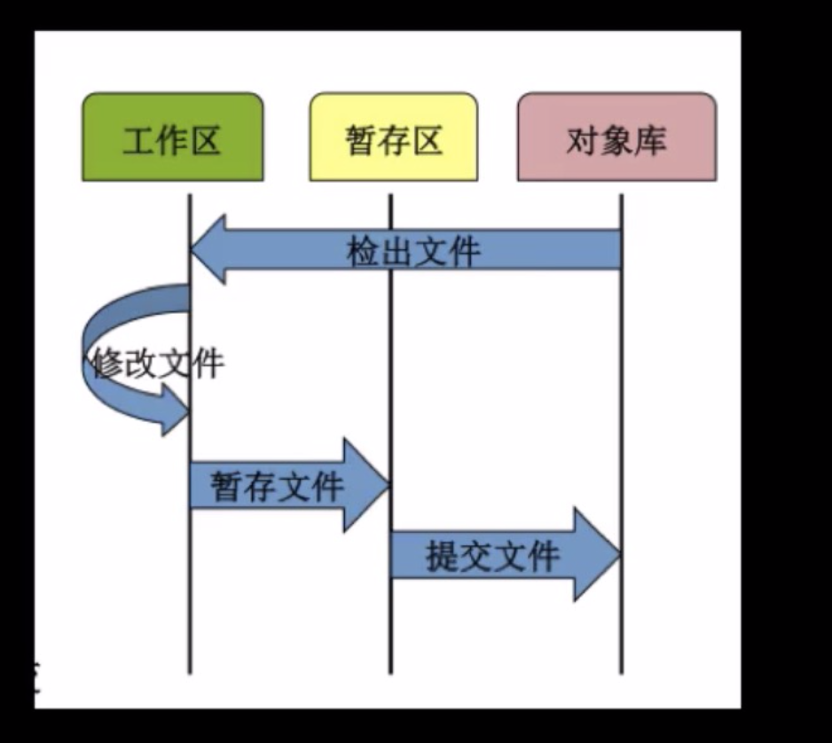
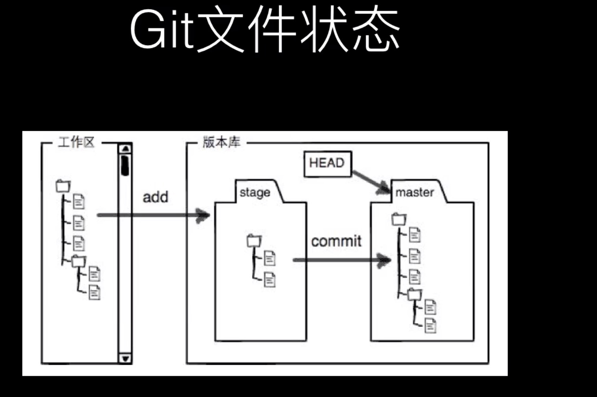

### 一.git文件状态

#### 1.Git文件

​	已被版本库管理的文件

#### 2.已修改

​	在工作目录修改git文件

#### 3.已暂存

​	对已修改的文件执行Git暂存操作，将文件存入暂存区

```
git add .
```

#### 4已提交

​	将已暂存的文件执行Git提交操作，将文件存入版本库

```
git commit -m '注释'
```





### 二.常用的git命令

#### 1) git init 

​	初始化本地git环境

#### 2) git clone 

​	克隆一份代码到本地仓库

#### 3) git pull 

​	把远程库的代码更新到工作台

#### 4) git pull --rebase origin master 

​	强制把远程库的代码跟新到当前分支上面

#### 5) git fetch 

​	把远程库的代码更新到本地库

#### 6) git add . 

​	把本地的修改加到stage中

#### 7) git commit -m 'comments here' 

​	把stage中的修改提交到本地库

#### 8) git push 

​	把本地库的修改提交到远程库中

#### 9) git branch -r/-a  

​	查看远程分支/全部分支

#### 10) git checkout master/branch 

​	切换到某个分支

#### 11) git checkout -b test 

​	新建test分支

#### 12) git checkout -d test 

​	删除test分支

#### 13) git merge master 

​	假设当前在test分支上面，把master分支上的修改同步到test分支上

#### 14) git merge tool 

​	调用merge工具

#### 15) git stash 

​	把未完成的修改缓存到栈容器中

#### 16) git stash list 

​	查看所有的缓存

#### 17) git stash pop 

​	恢复本地分支到缓存状态

#### 18) git blame someFile 

​	查看某个文件的每一行的修改记录（）谁在什么时候修改的）

#### 19) git status 

​	查看当前分支有哪些修改

#### 20) git log 

​	查看当前分支上面的日志信息

#### 21) git diff 

​	查看当前没有add的内容

#### 22) git diff --cache 

​	查看已经add但是没有commit的内容

#### 23) git diff HEAD 

​	上面两个内容的合并

#### 24) git reset --hard HEAD 

​	撤销本地修改

#### 25) echo $HOME 

​	查看git config的HOME路径

#### 26) export $HOME=/c/gitconfig 

​	配置git config的HOME路径

**注意**

1. 通常我们修改一个文件并且将文件提交到本地的分支并且推送到远程服务器的操作如下：

   ```perl
   git add .
   git commit -m "some str"
   git push
   ```

   我们也可以将上面的三大步简化一下：

   ```perl
   git commit -am "some str"
   git push
   ```

   针对第一步中的git  add .命令的作用就是将本地修改过的文件且已经追踪的文件添加到本地的暂存区，然后使用git commit -m "str"命令将暂存区的代码提交到本地仓库，最后将本地仓库的代码推送到远程服务器端；

   第二部其实就相当于第一步的结合，但是有区别的是**git commit -am 'str'**命令只能提交**已经存在于暂存区过且修改了的文件**，**新增文件就必须使用第一步**的命令；

### 三.修改用户名与邮箱

#### 1)修改方式

1. /etc/gitconfig (几乎不会使用)

   ```
   git config --system  user.name 'xxx'
   ```

2. ~/.gitconfig (很常用) 

  ```
  git config --global user.name 'xx'
  git config --global user.email 'xx'
  ```

3. 针对于特定项目的，在.git/config文件中

  ```
  git config --local user.name 'xx'
  git config --local user.email 'xx'
  ```

### 四. .gitignore 文件

### 五.分支管理


