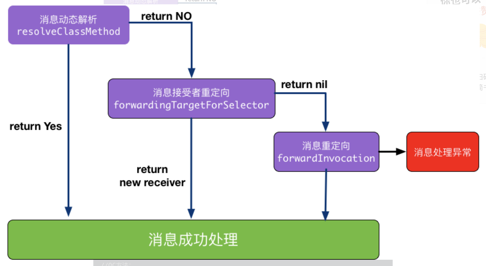
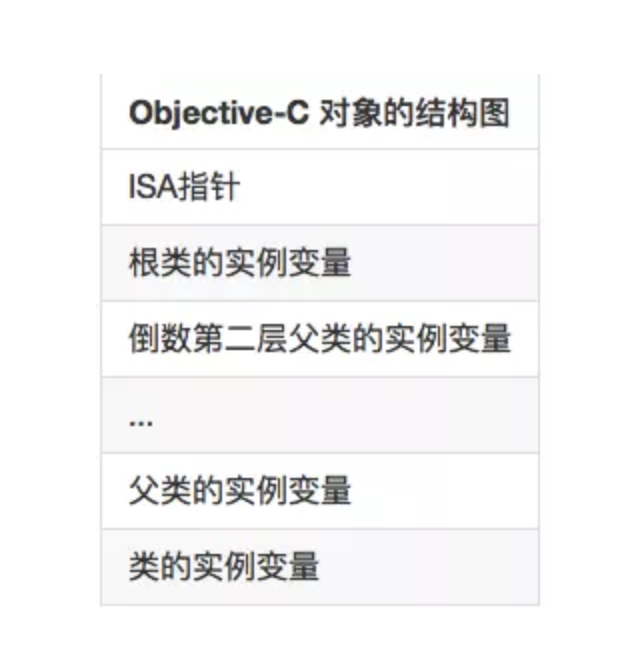
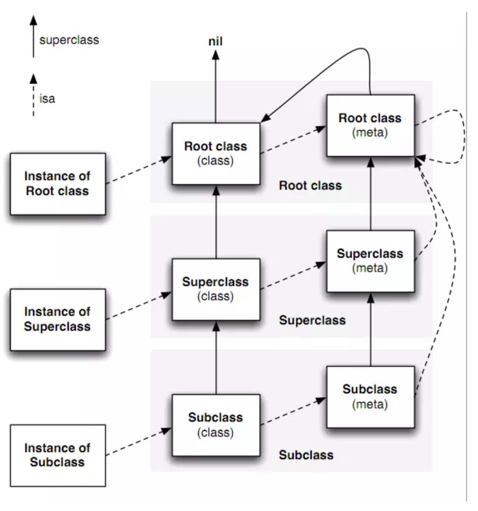
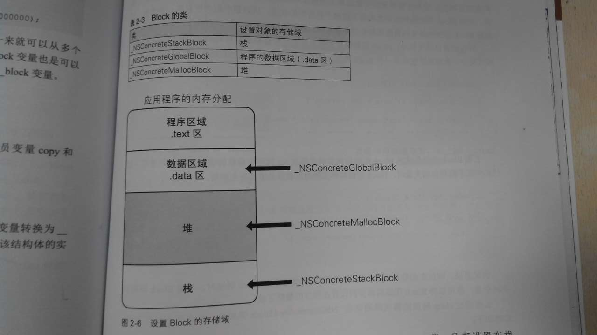

## iOS面试题

#### 1.@property中有哪些属性关键字？

#### 2.什么情况使用 weak 关键字，相比 assign 有什么不同？

1. 首先说说在什么情况下使用 weak 关键字
   - ARC中，在有可能出现循环引用的时候，往往要通过让其中一端使用weak来解决，比如：delegate 的代理属性。
   - 自身已经对它有过一次强引用，所以没有必要再强引用一次。这个时候也会使用weak；还有就是自定义IBOutlet控件属性一般也使用weak，一般情况也可以使用strong。

2. 那么weak和assign有什么不同呢？

   - weak的特质表明，该属性定义了一种“非拥有关系” (nonowning relationship)。为这种属性设置新值时，设置方法既不保留新值，也不释放旧值。此特质同assign类似， 但是在属性所指向的对象被摧毁时，属性值也会清空(nil out)。 但是assign的“设置方法”只会执行针对“纯量类型” (scalar type，例如 CGFloat 或 NSlnteger 等)的简单赋值操作。
   - assigin可以用于非OC对象，但是weak必须用于OC对象。

3. 注意:

   ​	assign修饰的对象（一般编译的时候会产生警告：Assigning retained object to unsafe property; object will be released after assignment）在释放之后，指针的地址还是存在的，也就是说指针并没有被置为nil，造成野指针。对象一般分配在堆上的某块内存，如果在后续的内存分配中，刚好分到了这块地址，程序就会崩溃掉。

   那为什么可以用assign修饰基本数据类型？因为基础数据类型一般分配在栈上，栈的内存会由系统自己自动处理，不会造成野指针。
   weak修饰的对象在释放之后，指针地址会被置为nil。所以现在一般弱引用就是用weak。

| 项目                     | weak      | assign                       |
| ------------------------ | --------- | ---------------------------- |
| 修饰对象                 | 对象      | 基本数据类型（也可以是对象） |
| 赋值方式                 | 复制引用  | 复制数据                     |
| 对对象的引用计数器的影响 | 无影响    | 无影响                       |
| 对象销毁后               | 自动为nil | 不变                         |


#### 3.怎么用 copy 关键字？

1. copy的使用场景

   当多个指针指向同一个对象时,为避免一个指针对对象的改动对其他指针的使用产生影响,使用copy来创建对象的副本
    如页面间传值使用copy,A向B控制器传属性(属性为自定义对象),为避免因A的属性变化对B的属性产生影响
    再如多人开发或封装库,在不明确传入值为可变还是不可变的情况下,使用copy更安全

2. 什么是深拷贝浅拷贝

   对于非容器类对象,不可变对象进行copy操作为浅拷贝,引用计数器加1,其他三种为深拷贝

   对于容器类对象,基本和非容器类对象一致,但注意其深拷贝是对象本身是对象复制,其中元素仍为指针复制,系统将initWithArray方法归为了元素深拷贝,但其实如果元素为不可变元素,仍为指针复制,使用归解档可以实现真正的深拷贝,元素也是对象拷贝

   ```objective-c
   NSArray* trueDeepCopyArray = [NSKeyedUnarchiver unarchiveObjectWithData:[NSKeyedArchiver archivedDataWithRootObject: array]];
   ```

3. 字符串什么时候使用copy,strong

   属性引用的对象由两种情况,可变和不可变字符串

   - 引用对象不可变情况下,copy和strong一样,copy为浅拷贝
   - 引用对象可变情况下,如果希望属性跟随引用对象变化,使用strong,希望不跟随变化使用copy

4. 字符串所在内存区域

   | 字符串           | 区域   |
   | ---------------- | ------ |
   | @“abc”           | 常量区 |
   | stringwithformat | 堆区   |

5. mutablecopy和copy 

   @property(copy) NSMutableArray arr;这样写有什么问题

   mutablecopy返回可变对象,copy返回不可变对象

6. 如何让自定义类可以使用copy修饰符。如何重写带 copy 关键字的 setter？

   实现<NSCopying>协议,重写copyWithZone方法

   ```objective-c
   - (void)setName:(NSString *)name {
   
       //不用release ,使用copy
       //[_name release];
       _name = [name copy];
   }
   ```


#### 4.@property 的本质是什么？

> @property = ivar(实例变量)+getter + setter（存取方法）
>

​	“属性” (property)作为 Objective-C 的一项特性，主要的作用就在于封装对象中的数据。 Objective-C 对象通常会把其所需要的数据保存为各种实例变量。实例变量一般通过“存取方法”(access method)来访问。其中，“获取方法” (getter)用于读取变量值，而“设置方法” (setter)用于写入变量值。这个概念已经定型，并且经由“属性”这一特性而成为 Objective-C 2.0 的一部分。 而在正规的 Objective-C 编码风格中，存取方法有着严格的命名规范。 正因为有了这种严格的命名规范，所以 Objective-C 这门语言才能根据名称自动创建出存取方法。

也可以说:

> @property = getter + setter;

#### 5.ivar、getter、setter 是如何生成并添加到这个类中的

​	完成属性定义后，编译器会自动编写访问这些属性所需的方法，此过程叫做“自动合成”(autosynthesis)。除了生成方法代码 getter、setter 之外，编译器还要自动向类中添加适当类型的实例变量，并且在属性名前面加下划线，以此作为实例变量的名字。

#### 6.@protocol 和 category 中如何使用 @property

1. 在 protocol 中使用 property 只会生成 setter 和 getter 方法声明,我们使用属性的目的,是希望遵守该协议的对象能实现该属性。
2. category 使用 @property 也是只会生成 setter 和 getter 方法的声明,如果我们真的需要给 category 增加属性的实现,需要借助于运行时的两个函数：
   - objc_setAssociatedObject
   - objc_getAssociatedObject

#### 7.ARC下，不显式指定任何属性关键字时，默认的关键字都有哪些？

1. 对应基本数据类型默认关键字是

   atomic,readwrite,assign

2. 对于普通的 Objective-C 对象

   atomic,readwrite,strong

#### 8.runtime 如何实现 weak 属性

​	runtime 对注册的类， 会进行布局，对于 weak 对象会放入一个 hash 表中。 用 weak 指向的对象内存地址作为 key，当此对象的引用计数为0的时候会 dealloc，假如 weak 指向的对象内存地址是a，那么就会以a为键， 在这个 weak 表中搜索，找到所有以a为键的 weak 对象，从而设置为 nil。


#### 9.weak属性需要在dealloc中置nil么？

不需要	

#### 10.@synthesize和@dynamic分别有什么作用？

1. @property有两个对应的词，一个是 @synthesize，一个是 @dynamic。如果 @synthesize和 @dynamic都没写，那么默认的就是@syntheszie var = _var;
2. @synthesize 的语义是如果你没有手动实现 setter 方法和 getter 方法，那么编译器会自动为你加上这两个方法。
3. @dynamic 告诉编译器：属性的 setter 与 getter 方法由用户自己实现，不自动生成。（当然对于 readonly 的属性只需提供 getter 即可）。假如一个属性被声明为 @dynamic var，然后你没有提供 @setter方法和 @getter 方法，编译的时候没问题，但是当程序运行到 instance.var = someVar，由于缺 setter 方法会导致程序崩溃；或者当运行到 someVar = var 时，由于缺 getter 方法同样会导致崩溃。编译时没问题，运行时才执行相应的方法，这就是所谓的动态绑定。

#### 11.用@property声明的NSString（或NSArray，NSDictionary）经常使用copy关键字，为什么？如果改用strong关键字，可能造成什么问题？

1. 因为父类指针可以指向子类对象,使用copy的目的是为了让本对象的属性不受外界影响,使用copy无论给我传入是一个可变对象还是不可对象,我本身持有的就是一个不可变的副本.

2. 如果我们使用是strong,那么这个属性就有可能指向一个可变对象,如果这个可变对象在外部被修改了,那么会影响该属性.
3. copy此特质所表达的所属关系与strong类似。然而设置方法并不保留新值，而是将其“拷贝” (copy)。 当属性类型为NSString时，经常用此特质来保护其封装性，因为传递给设置方法的新值有可能指向一个NSMutableString类的实例。这个类是NSString的子类，表示一种可修改其值的字符串，此时若是不拷贝字符串，那么设置完属性之后，字符串的值就可能会在对象不知情的情况下遭人更改。所以，这时就要拷贝一份“不可变” (immutable)的字符串，确保对象中的字符串值不会无意间变动。只要实现属性所用的对象是“可变的” (mutable)，就应该在设置新属性值时拷贝一份。

#### 6.@synthesize合成实例变量的规则是什么？假如property名为foo，存在一个名为_foo的实例变量，那么还会自动合成新变量么？

1. 如果指定了成员变量的名称,会生成一个指定的名称的成员变量,

2. 如果这个成员已经存在了就不再生成了.

3. 如果是 @synthesize foo;
  还会生成一个名称为foo的成员变量，也就是说：
  如果没有指定成员变量的名称会自动生成一个属性同名的成员变量,

4. 如果是 @synthesize foo = _foo;
   就不会生成成员变量了.

#### 7.在有了自动合成属性实例变量之后，@synthesize还有哪些使用场景？

1. ##### 读写属性的自定义 getter 和 setter

   当提供一个自定义的getter 和setter 实现时，属性不会自动合成

2. ##### 只读属性的自定义getter

   当给只读属性提供一个自定义getter 实现时，不会自动合成

3. ##### @dynamic

   当使用@dynamic propertyName， 属性不会自动合成 （很明显，@dynamic 和 @synthesize 是互斥的）

#### 8.objc中向一个nil对象发送消息将会发生什么？

​    什么都不发生

#### 9.objc中向一个对象发送消息[obj foo]和objc_msgSend()函数之间有什么关系？

1. objc_msgSend()是[obj foo]的具体实现。
2. 在runtime中，objc_msgSend()是一个c函数，[obj foo]会被翻译成这样的形式objc_msgSend(obj, foo)。
3. 查找步骤
   - 去obj的对应的类中找方法
   - 先找缓存，找不到再去找方法列表，
   - 再找父类，如此向上传递。
   - 最后再找不到就要转发。

#### 10.什么时候会报unrecognized selector的异常？

```objective-c
+ (BOOL)resolveInstanceMethod:(SEL)sel {
    return YES;//返回YES，进入下一步转发
}

- (id)forwardingTargetForSelector:(SEL)aSelector {
    return nil;//返回nil，进入下一步转发
}

- (NSMethodSignature *)methodSignatureForSelector:(SEL)aSelector {
    if ([NSStringFromSelector(aSelector) isEqualToString:@"foo"]) {
        return [NSMethodSignature signatureWithObjCTypes:"v@:"];//签名，进入forwardInvocation
    }
    
    return [super methodSignatureForSelector:aSelector];
}

- (void)forwardInvocation:(NSInvocation *)anInvocation {
    SEL sel = anInvocation.selector;
    
    Person *p = [Person new];
    if([p respondsToSelector:sel]) {
        [anInvocation invokeWithTarget:p];
    }
    else {
        [self doesNotRecognizeSelector:sel];
    }
    
}

```



#### 11.一个objc对象如何进行内存布局？（考虑有父类的情况）

1. 所有父类的成员变量和自己的成员变量都会存放在该对象所对应的存储空间中。

2. 每个对象内部都有一个isa指针，指向他的类对象，类对象中存放着本身对象的a,对象方法列表（对象能够接收的消息列表，保存在它所对应的类对象中）b,成员变量的列表。c,属性列表。类对象内也有一个isa指针指向元对象（meta class），元对象内部存放的是类方法列表，类对象内部还有哦一个superclass的指针，指向他的父类对象

3. 每个Objective-C对象都有相同的结构 ：如下图:

   

4. 根对象就是NSObject，他的superclass指针指向nil

5. 类对象既然称为对象，那它也是一个实例，类对象中也有一个isa指针指向他的元类（meta class）,即类对象是元类的实例，元类内部存放的是类方法列表，根元类的isa指针指向自己，superclass指针指向NSObject类。

#### 12.一个objc对象的isa的指针指向什么？有什么作用？

​	指向所属的类，用于查找方法和实例变量



#### 13.下面的代码输出什么？

```objective-c
@implementation Son : Father
- (id)init
{
    self = [super init];
    if (self) {
        NSLog(@"%@", NSStringFromClass([self class]));
        NSLog(@"%@", NSStringFromClass([super class]));
    }
    return self;
}
@end
```

都输出 Son

self 是类的隐藏参数，指向当前调用方法的这个类的实例。而 super 是一个 Magic Keyword， 它本质是一个编译器标示符，和 self 是指向的同一个消息接受者。

上面的例子不管调用[self class]还是[super class]，接受消息的对象都是当前 Son ＊xxx 这个对象。而不同的是，super是告诉编译器，调用 class 这个方法时，要去父类的方法，而不是本类里的。

当使用 self 调用方法时，会从当前类的方法列表中开始找，如果没有，就从父类中再找；而当使用 super 时，则从父类的方法列表中开始找。然后调用父类的这个方法。

当调用 ［self class] 时，实际先调用的是 objc_msgSend函数，第一个参数是 Son当前的这个实例，然后在 Son 这个类里面去找 - (Class)class这个方法，没有，去父类 Father里找，也没有，最后在 NSObject类中发现这个方法。而 - (Class)class的实现就是返回self的类别，故上述输出结果为 Son。

而当调用 [super class]时，会转换成objc_msgSendSuper函数。第一步先构造 objc_super 结构体，结构体第一个成员就是 self 。 第二个成员是 (id)class_getSuperclass(objc_getClass(“Son”)) , 实际该函数输出结果为 Father。 第二步是去 Father这个类里去找 - (Class)class，没有，然后去NSObject类去找，找到了。最后内部是使用 objc_msgSend(objc_super->receiver, @selector(class))去调用， 此时已经和[self class]调用相同了，故上述输出结果仍然返回 Son。

#### 14.runtime如何通过selector找到对应的IMP地址？（分别考虑类方法和实例方法）[※※※※]

#### 15.使用runtime Associate方法关联的对象，需要在主对象dealloc的时候释放么？[※※※※]

1. `Associate`政策其实是一组枚举值：

   ```objective-c
   enum {
      OBJC_ASSOCIATION_ASSIGN  = 0,
      OBJC_ASSOCIATION_RETAIN_NONATOMIC  = 1,
      OBJC_ASSOCIATION_COPY_NONATOMIC  = 3,
      OBJC_ASSOCIATION_RETAIN  = 01401,
      OBJC_ASSOCIATION_COPY  = 01403
   };
   ```

   无论在MRC下还是ARC下均不需要在主对象dealloc的时候释放，<u>**被**关联</u>的对象在生命周期内要比对象本身释放的晚很多，它们会在被 `NSObject -dealloc` 调用的`object_dispose()`方法中释放

2. 对象的内存销毁时间表，分四个步骤

   1. 调用 -release ：引用计数变为零
      - 对象正在被销毁，生命周期即将结束. 
      - 不能再有新的 __weak 弱引用，否则将指向 nil.
      - 调用 [self dealloc]

   2. 父类调用 -dealloc 

      - 继承关系中最直接继承的父类再调用 -dealloc 

      - 如果是 MRC 代码 则会手动释放实例变量们（iVars）
      - 继承关系中每一层的父类 都再调用 -dealloc

   3. NSObject 调 -dealloc 
      - 只做一件事：调用 Objective-C runtime 中object_dispose() 方法
   4. 调用 object_dispose()
      - 为 C++ 的实例变量们（iVars）调用 destructors
      - 为 ARC 状态下的 实例变量们（iVars） 调用 -release 
      - 解除所有使用 runtime Associate方法关联的对象 
      - 解除所有 __weak 引用 
      - 调用 free()

#### 16.objc中的类方法和实例方法有什么本质区别和联系？[※※※※※]

1. **类方法：**
   - 类方法是属于类对象的
   - 类方法只能通过类对象调用
   - 类方法中的self是类对象
   - 类方法可以调用其他的类方法
   - 类方法中不能访问成员变量
   - 类方法中不定直接调用对象方法

2. **实例方法：**
   - 实例方法是属于实例对象的
   - 实例方法只能通过实例对象调用
   - 实例方法中的self是实例对象
   - 实例方法中可以访问成员变量
   - 实例方法中直接调用实例方法
   - 实例方法中也可以调用类方法(通过类名)

#### 17._objc_msgForward函数是做什么的，直接调用它将会发生什么？[※※※※※]

`_objc_msgForward`是 IMP 类型，用于消息转发的：当向一个对象发送一条消息，但它并没有实现的时候，`_objc_msgForward`会尝试做消息转发。

```objective-c
//  objc-runtime-new.mm 文件里与 _objc_msgForward 有关的三个函数使用伪代码展示
//  Created by https://github.com/ChenYilong
//  Copyright (c)  微博@iOS程序犭袁(http://weibo.com/luohanchenyilong/). All rights reserved.
//  同时，这也是 obj_msgSend 的实现过程

id objc_msgSend(id self, SEL op, ...) {
    if (!self) return nil;
	IMP imp = class_getMethodImplementation(self->isa, SEL op);
	imp(self, op, ...); //调用这个函数，伪代码...
}
 
//查找IMP
IMP class_getMethodImplementation(Class cls, SEL sel) {
    if (!cls || !sel) return nil;
    IMP imp = lookUpImpOrNil(cls, sel);
    //在类中没有找到实现
    if (!imp) return _objc_msgForward; //_objc_msgForward 用于消息转发
    return imp;
}
 
IMP lookUpImpOrNil(Class cls, SEL sel) {
    if (!cls->initialize()) {
        _class_initialize(cls);
    }
 
    Class curClass = cls;
    IMP imp = nil;
    do { //先查缓存,缓存没有时重建,仍旧没有则向父类查询
        if (!curClass) break;
        if (!curClass->cache) fill_cache(cls, curClass);
        imp = cache_getImp(curClass, sel);
        if (imp) break;
    } while (curClass = curClass->superclass);
 
    return imp;
}
```

#### 19.能否向编译后得到的类中增加实例变量？能否向运行时创建的类中添加实例变量？为什么？[※※※※※]

1. 不能向编译后得到的类增加实例变量
2. 能向运行时创建的类中添加实例变量
3. 原因
   - 编译后的类已经注册在runtime中,类结构体中的objc_ivar_list实例变量的链表和instance_size实例变量的内存大小已经确定,runtime会调用class_setvarlayout或class_setWeaklvarLayout来处理strong weak引用.所以不能向存在的类中添加实例变量
   - 运行时创建的类是可以添加实例变量,调用class_addIvar函数.但是的在调用objc_allocateClassPair之后,objc_registerClassPair之前,原因同上.

#### 20.runloop和线程有什么关系？[※※※]

1. 总的说来，Run loop，正如其名，loop表示某种循环，和run放在一起就表示一直在运行着的循环。实际上，run loop和线程是紧密相连的，可以这样说run loop是为了线程而生，没有线程，它就没有存在的必要。Run loops是线程的基础架构部分， Cocoa 和 CoreFundation 都提供了 run loop 对象方便配置和管理线程的 run loop （以下都以 Cocoa 为例）。每个线程，包括程序的主线程（ main thread ）都有与之相应的 run loop 对象。

2. runloop 和线程的关系：

   主线程的run loop默认是启动的。

   iOS的应用程序里面，程序启动后会有一个如下的main()函数

   ```c
   int main(int argc, char * argv[]) {
       @autoreleasepool {
           return UIApplicationMain(argc, argv, nil, NSStringFromClass([AppDelegate class]));
       }
   }
   ```

   重点是UIApplicationMain()函数，这个方法会为main thread设置一个NSRunLoop对象，这就解释了：为什么我们的应用可以在无人操作的时候休息，需要让它干活的时候又能立马响应。

   对其它线程来说，run loop默认是没有启动的，如果你需要更多的线程交互则可以手动配置和启动，如果线程只是去执行一个长时间的已确定的任务则不需要。

   在任何一个 Cocoa 程序的线程中，都可以通过以下代码来获取到当前线程的 run loop 。

   ```objective-c
   NSRunLoop *runloop = [NSRunLoop currentRunLoop];
   ```

#### 21.runloop的mode作用是什么？[※※※]

1. model 主要是用来指定事件在运行循环中的优先级的

   - NSDefaultRunLoopMode（kCFRunLoopDefaultMode）：默认，空闲状
   - UITrackingRunLoopMode：ScrollView滑动时
   - UIInitializationRunLoopMode：启动时
   - NSRunLoopCommonModes（kCFRunLoopCommonModes）：Mode集合

2. 苹果公开提供的 Mode 有两个：

   - NSDefaultRunLoopMode（kCFRunLoopDefaultMode）

   - NSRunLoopCommonModes（kCFRunLoopCommonModes）

#### 22.以`+ scheduledTimerWithTimeInterval...`的方式触发的timer，在滑动页面上的列表时，timer会暂定回调，为什么？如何解决？[※※※※]

#### 23.猜想runloop内部是如何实现的？[※※※※※]

```java
//
// http://weibo.com/luohanchenyilong/ (微博@iOS程序犭袁)
// https://github.com/ChenYilong
int main(int argc, char * argv[]) {
    //程序一直运行状态
    while (AppIsRunning) {
        //睡眠状态，等待唤醒事件
        id whoWakesMe = SleepForWakingUp();
        //得到唤醒事件
        id event = GetEvent(whoWakesMe);
        //开始处理事件
        HandleEvent(event);
    }
    return 0;
}
```


#### 24.objc使用什么机制管理对象内存？[※]

自动引用计数器

#### 25.ARC通过什么方式帮助开发者管理内存？[※※※※]

​	ARC是Objective-C编译器的特性，而不是运行时特性或者垃圾回收机制，ARC所做的只不过是在代码编译时为你自动在合适的位置插入release或autorelease，只要没有强指针指向对象，对象就会被释放。

#### 26.不手动指定autoreleasepool的前提下，一个autorealese对象在什么时刻释放？（比如在一个vc的viewDidLoad中创建）[※※※※]

​	Autorelease对象出了作用域之后，会被添加到最近一次创建的自动释放池中，并会在当前的 runloop 迭代结束时释放。

​	如果在一个vc的viewDidLoad中创建一个 Autorelease对象，那么该对象会在 viewDidAppear 方法执行前就被销毁了。

#### 27.BAD_ACCESS在什么情况下出现？[※※※※]

1. 访问了野指针，比如对一个已经释放的对象执行了release、访问已经释放对象的成员变量或者发送消息。

2. 死循环。

#### 28.苹果是如何实现autoreleasepool的？[※※※※※]


#### 29.使用block时什么情况会发生引用循环，如何解决？[※※]

一个对象中强引用了block，在block中又强引用了该对象，就会发射循环引用。
解决方法是将该对象使用`__weak`或者`__block`修饰符修饰之后再在block中使用。

1. 在MRC 时代，__block 修饰，可以避免循环引用；ARC时代，__block 修饰，同样会引起循环引用问题；

2. __block不管是ARC还是MRC模式下都可以使用，可以修饰对象，还可以修饰基本数据类型；

3. __weak只能在ARC模式下使用，也只能修饰对象，不能修饰基本数据类型；

4. __block对象可以在block中被重新赋值，__weak不可以；

5. __unsafe_unretained修饰符可以被视为iOS SDK 4.3以前版本的__weak的替代品，不过不会被自动置空为nil。所以尽可能不要使用这个修饰符。(__weak 会自动置为nil)

#### 30.在block内如何修改block外部变量？[※※]

使用__block

#### 31.使用系统的某些block api（如`UIView`的block版本写动画时），是否也考虑引用循环问题？[※※※]

​	系统的某些block api中，UIView的block版本写动画时不需要考虑，但也有一些api 需要考虑：所谓“引用循环”是指双向的强引用，所以那些“单向的强引用”（block 强引用 self ）没有问题，比如这些：

```objective-c
[UIViewanimateWithDuration:durationanimations:^{ [self.superviewlayoutIfNeeded]; }];

[[NSOperationQueuemainQueue]addOperationWithBlock:^{ self.someProperty= xyz; }];

[[NSNotificationCenterdefaultCenter]addObserverForName:@"someNotification"object:nilqueue:[NSOperationQueuemainQueue]usingBlock:^(NSNotification* notification) {                                                    self.someProperty= xyz; }];
```

​	这些情况不需要考虑“引用循环”。

但如果你使用一些参数中可能含有 ivar 的系统 api ，如 GCD 、NSNotificationCenter就要小心一点：比如GCD 内部如果引用了 self，而且 GCD 的其他参数是 ivar，则要考虑到循环引用：

```objective-c
__weak__typeof__(self) weakSelf = self;
dispatch_group_async(_operationsGroup, _operationsQueue, 
					^{
						__typeof__(self) strongSelf = weakSelf;
						[strongSelf doSomething];
						[strongSelf doSomethingElse];
					 } );
```

类似的：

```objective-c
__weak__typeof__(self) weakSelf = self; 
_observer = [[NSNotificationCenter defaultCenter] addObserverForName:@"testKey" object:nilqueue:nilusingBlock:^(NSNotification*note) {
	__typeof__(self) strongSelf = weakSelf;
	[strongSelf dismissModalViewControllerAnimated:YES];
}];
```

self --> _observer --> block --> self 显然这也是一个循环引用。

检测代码中是否存在循环引用问题，可使用 Facebook 开源的一个检测工具[**FBRetainCycleDetector**](https://github.com/facebook/FBRetainCycleDetector)。

#### 32.GCD的队列（dispatch_queue_t）分哪两种类型？[※※]

1. 串行队列Serial Dispatch Queue(默认)，可以写null

   ```c
   #define DISPATCH_QUEUE_SERIAL NULL
   ```

2. 并行队列Concurrent Dispatch Queue

#### 33.如何用GCD同步若干个异步调用？（如根据若干个url异步加载多张图片，然后在都下载完成后合成一张整图）[※※※※]

使用Dispatch Group追加block到Global Group Queue,这些block如果全部执行完毕，就会执行Main Dispatch Queue中的结束处理的block

```objective-c
dispatch_queue_t queue = dispatch_get_global_queue(DISPATCH_QUEUE_PRIORITY_DEFAULT, 0);
dispatch_group_t group = dispatch_group_create();
dispatch_group_async(group, queue, ^{ /*加载图片1 */ });
dispatch_group_async(group, queue, ^{ /*加载图片2 */ });
dispatch_group_async(group, queue, ^{ /*加载图片3 */ });
dispatch_group_notify(group, dispatch_get_main_queue(), ^{
    // 合并图片
});
```

#### 34.dispatch_barrier_async的作用是什么？[※※※※]

在并行队列中，为了保持某些任务的顺序，需要等待一些任务完成后才能继续进行，使用 barrier 来等待之前任务完成，避免数据竞争等问题。

dispatch_barrier_async 函数会等待追加到Concurrent Dispatch Queue并行队列中的操作全部执行完之后，然后再执行 dispatch_barrier_async 函数追加的处理，等 dispatch_barrier_async 追加的处理执行结束之后，Concurrent Dispatch Queue才恢复之前的动作继续执行。

#### 35.苹果为什么要废弃dispatch_get_current_queue？[※※※※※]

block是不可重入的，容易产生死锁

#### 36以下代码运行结果如何？[※※※※※]

```objective-c
- (void)viewDidLoad
{
    [super viewDidLoad];
    NSLog(@"1");
    dispatch_sync(dispatch_get_main_queue(), ^{
        NSLog(@"2");
    });
    NSLog(@"3");
}
```

死锁

#### 37.addObserver:forKeyPath:options:context:各个参数的作用分别是什么，observer中需要实现哪个方法才能获得KVO回调？[※※]

#### 38.如何手动触发一个value的KVO[※※※]

1、重写监听属性的set、get方法

2、重写 +(BOOL)automaticallyNotifiesObserverForKey:(NSString *)key

3、在set方法中在赋值的前后分别调用：willChangeValueForKey和didChangeValueForKey

4、实现willChangeValueForKey和didChangeValueForKey方法

```objective-c
@interface ViewController ()

@property(nonatomic,strong)Person *p;

@end
@implementation ViewController
- (void)fun05{
    
    self.p = [Person new];
    [self addObserver:self forKeyPath:@"p" options:NSKeyValueObservingOptionNew|NSKeyValueObservingOptionOld context:nil];


    [self willChangeValueForKey:@"p"];//运行1
	//运行2，在didChangeValueForKey的方法中调用observeValueForKeyPath，
    //这里就相当于手动调用了observeValueForKeyPath方法
    [self didChangeValueForKey:@"p"];
}

- (void)observeValueForKeyPath:(NSString*)keyPath ofObject:(id)object change:(NSDictionary*)change context:(void*)context{
    
    NSLog(@"%@", change);
}
@end
```


#### 39.若一个类有实例变量NSString *_foo，调用setValue:forKey:时，可以以foo还是_foo作为key？[※※※]

当调用setValue：<id>value forKey：@"key"的代码时，底层的执行机制如下：

- 程序优先调用setKey:(或者setIskey：)方法，代码通过setter方法完成设置。注意，这里的key是指成员变量名，首字母大写要符合KVC的全名规则，下同
- 如果没有找到setKey：方法，KVC机制会检查+ (BOOL)accessInstanceVariablesDirectly方法有没有返回YES，默认该方法会返回YES，如果你重写了该方法让其返回NO的话，那么在这一步KVC会执行setValue：forUNdefinedKey：方法，不过一般开发者不会这么做。所以KVC机制会搜索该类里面有没有名为_key的成员变量，无论该变量是在类接口部分定义，还是在类实现部分定义，也无论用了什么样的访问修饰符，只要存在以_key命名的变量，KVC都可以对该成员变量赋值。
- 如果该类即没有setKey:(或者setIskey：)方法，也没有_key成员变量，KVC机制会搜索_isKey的成员变量，
  和上面一样，如果该类即没有setKey:(或者setIskey：)方法，也没有_key和_isKey的成员变量，KVC机制会在继续搜索和isKey的成员变量。再给它们赋值。
- 如果上面列出的方法或者成员变量都不存在，系统将会执行该对象的setValue：forUNdefinedKey：方法，默认是抛出异常。

kvc可以复制的成员变量:==key, _key, isKey, _isKey==

#### 40.KVC的keyPath中的集合运算符如何使用？[※※※※]

```objective-c
[employees valueForKeyPath:@"@avg.salary"];
```


#### 41.KVC和KVO的keyPath一定是属性么？[※※※※]

#### 42.如何关闭默认的KVO的默认实现，并进入自定义的KVO实现？[※※※※※]

#### 43.apple用什么方式实现对一个对象的KVO？[※※※※※]

#### 44.IBOutlet连出来的视图属性为什么可以被设置成`weak`?[※※]

#### 45.IB中`User Defined Runtime Attributes`如何使用？[※※※※※]

User Defined Runtime Attributes 是一个不被看重但功能非常强大的的特性，它能够配置一些你在interface builder 中不能配置的属性。当你希望在IB中作尽可能多得事情，这个特性能够帮助你编写更加轻量级的viewcontroller。

#### 46.如何调试BAD_ACCESS错误[※※※]

1.重写object的respondsToSelector方法，现实出现EXEC_BAD_ACCESS前访问的最后一个object
2.通过 Zombie

3.设置全局断点快速定位问题代码所在行

4.Xcode 7 已经集成了BAD_ACCESS捕获功能：**Address Sanitizer**。 用法如下：在配置中勾选✅Enable Address Sanitizer

#### 47.lldb（gdb）常用的调试命令？[※※※]

Po 

#### 48、说一下OC的反射机制；

#### 49、block的实质是什么？有几种block？分别是怎样产生的？

block有三种类型的存储域，分别是：

- _NSConcreteStackBlock
- _NSConcreteGlobalBlock
- _NSConcreteMallocBlock

```objective-c
//栈Block，定义在函数之内，系统自动回收
-(void)block{
    void (^stackBlock) () = ^{
        NSLog(@"this is a block");
    };
}

//堆Block，定义在函数之内，引用计数加1，非ARC环境由开发者释放
-(void)block{
    void (^stackBlock) () = [^{
        NSLog(@"this is a block");
    } copy];
}

//全局Block，定义在函数之外，相当于一个单例
void (^globalBlock) () = ^{
    NSLog(@"this is a block");
};
```



| Block的类              | 副本源的配置存储域 | 复制效果     |
| ---------------------- | ------------------ | ------------ |
| _NSConcreteStackBlock  | 栈                 | 从复制到堆   |
| _NSConcreteGlobalBlock | 程序的数据区域     | 什么也不做   |
| _NSConcreteMallocBlock | 堆                 | 引用计数增加 |


#### 50.__block修饰的变量为什么能在block里面能改变其值？

```objective-c
  __block NSInteger num = 10;
    NSLog(@"111-%p", &num);
    void (^ myb)() = ^{
        
        num = 20;
        NSLog(@"222--%p", &num);
    };
    myb();
    NSLog(@"333--%p", &num);
```

#### 51、说一下线程之间的通信。

#### 52、你们应用的崩溃率是多少？

#### 53、说一下hash算法。

#### 54、NSDictionary的实现原理是什么？

​	在oc中每一个对象创建时，都默认生成一个hashCode,也就是经过hash算法生成的一串数字，当利用key去取字典中的value时，若是使用遍历或者二分查找等方法，效率相对较低，于是出现了根据每一个key生成的hashCode将键值对放到hasCode对应的数组中的指定位置，这样当用key去取值时，便不必遍历去获取，既可以根据hashCode直接取出。因为hashCode的值过大，或许经过取余获取一个较小的数字，假如是对999进行取余运算，那么得到的结果始终处于0-999之间。但是，这样做的弊端在于取余所得到的值，可能是相同的，这样可能导致完全不相干的键值对被新的键值对（取余后值key相等）所覆盖，于是出现了数组中套链表实现的数组。这样，key值取余得到值相等的键值对，都将保存在同一个链表数组中，当查找key对应的值时，首先获取到该链表数组，然后遍历数组，取正确的key所对应的值即可。8、你们的App是如何处理本地数据安全的（比如用户名的密码）？

### 55、遇到过BAD_ACCESS的错误吗？你是怎样调试的？

#### 56、什么是指针常量和常量指针？

#### 57、不借用第三个变量，如何交换两个变量的值？要求手动写出交换过程。

#### 58、若你去设计一个通知中心，你会怎样设计？

#### 59、如何去设计一个方案去应对后端频繁更改的字段接口？

#### 60、KVO、KVC的实现原理

KVC键值查找原理

1. setValue:forKey:搜索方式

   ```objective-c
   1、首先搜索setKey:方法.(key指成员变量名, 首字母大写)
   2、上面的setter方法没找到, 如果类方法accessInstanceVariablesDirectly返回YES. 那么按 _key, _isKey，key, iskey的顺序搜索成员名.(NSKeyValueCodingCatogery中实现的类方法, 默认实现为返回YES)
   3、如果没有找到成员变量, 调用setValue:forUnderfinedKey:
   ```

2. valueForKey:的搜索方式

   ```
   1、首先按getKey, key, isKey的顺序查找getter方法, 找到直接调用. 如果是BOOL、int等内建值类型, 会做NSNumber的转换.
   2、上面的getter没找到, 查找countOfKey, objectInKeyAtindex, KeyAtindexes格式的方法. 如果countOfKey和另外两个方法中的一个找到, 那么就会返回一个可以响应NSArray所有方法的代理集合的NSArray消息方法.
   3、还没找到, 查找countOfKey, enumeratorOfKey, memberOfKey格式的方法. 如果这三个方法都找到, 那么就返回一个可以响应NSSet所有方法的代理集合.
   4、还是没找到, 如果类方法accessInstanceVariablesDirectly返回YES. 那么按 _key, _isKey, key, iskey的顺序搜索成员名.
   5、再没找到, 调用valueForUndefinedKey.
   ```

#### 61、用递归算法求1到n的和

#### 62、category为什么不能添加属性？

1. 既然要探究的是分类，那么我们先看一下分类的定义

   ```
   //Category表示一个结构体指针的类型
   typedef struct objc_category *Category;
   
   struct objc_category {
       char * _Nonnull category_name                            OBJC2_UNAVAILABLE;
       char * _Nonnull class_name                               OBJC2_UNAVAILABLE;
       struct objc_method_list * _Nullable instance_methods     OBJC2_UNAVAILABLE;
       struct objc_method_list * _Nullable class_methods        OBJC2_UNAVAILABLE;
       struct objc_protocol_list * _Nullable protocols          OBJC2_UNAVAILABLE;
   }   
   ```

2. 再看下Class的定义

   ```
   //Class也表示一个结构体指针的类型
   typedef struct objc_class *Class;
   
   struct objc_class {
       Class _Nonnull isa  OBJC_ISA_AVAILABILITY;
   
   #if !__OBJC2__
       Class _Nullable super_class                              OBJC2_UNAVAILABLE;
       const char * _Nonnull name                               OBJC2_UNAVAILABLE;
       long version                                             OBJC2_UNAVAILABLE;
       long info                                                OBJC2_UNAVAILABLE;
       long instance_size                                       OBJC2_UNAVAILABLE;
       struct objc_ivar_list * _Nullable ivars                  OBJC2_UNAVAILABLE;
       struct objc_method_list * _Nullable * _Nullable methodLists                    OBJC2_UNAVAILABLE;
       struct objc_cache * _Nonnull cache                       OBJC2_UNAVAILABLE;
       struct objc_protocol_list * _Nullable protocols          OBJC2_UNAVAILABLE;
   #endif
   
   } OBJC2_UNAVAILABLE;
   ```

3. 对比可以发现category中少了 `struct objc_ivar_list * _Nullable ivars`也就是说没有ivar数组

4. 分类并不会改变原有类的内存分布的情况，它是在运行期间决定的，此时内存的分布已经确定，若此时再添加实例会改变内存的分布情况，这对编译性语言是灾难，是不允许的。反观扩展(extension)，作用是为一个已知的类添加一些私有的信息，必须有这个类的源码，才能扩展，它是在编译器生效的，所以能直接为类添加属性或者实例变量。


#### 63、说一下runloop和线程的关系。

1. runloop与线程是一一对应的，一个runloop对应一个核心的线程，为什么说是核心的，是因为runloop是可以嵌套的，但是核心的只能有一个，他们的关系保存在一个全局的字典里。
2. runloop是来管理线程的，当线程的runloop被开启后，线程会在执行完任务后进入休眠状态，有了任务就会被唤醒去执行任务。
3. runloop在第一次获取时被创建，在线程结束时被销毁。
4. 对于主线程来说，runloop在程序一启动就默认创建好了。
5. 对于子线程来说，runloop是懒加载的，只有当我们使用的时候才会创建，所以在子线程用定时器要注意：确保子线程的runloop被创建，不然定时器不会回调。

#### 64、说一下autoreleasePool的实现原理。

#### 65、说一下简单工厂模式，工厂模式以及抽象工厂模式？

#### 66、如何设计一个网络请求库？

#### 67、说一下多线程，你平常是怎么用的？

#### 68、说一下UITableViewCell的卡顿你是怎么优化的？

#### 69、看过哪些三方库？说一下实现原理以及好在哪里？

#### 70、说一下HTTP协议以及经常使用的code码的含义。

#### 71、设计一套缓存策略。

#### 72、设计一个检测主线和卡顿的方案。

#### 73、说一下runtime，工作是如何使用的？看过runtime源码吗？

#### 74、说几个你在工作中使用到的线程安全的例子。

#### 75、用过哪些锁？哪些锁的性能比较高？

#### 76、说一下HTTP和HTTPs的请求过程？

#### 77、说一下TCP和UDP

#### 78、说一下静态库和动态库之间的区别

#### 79、load和initialize方法分别在什么时候调用的？

1. load和initialize方法都会在实例化对象之前调用，以main函数为分水岭，前者在main函数之前调用，后者在之后调用。这两个方法会被自动调用，不能手动调用它们。
2. load和initialize方法都不用显示的调用父类的方法而是自动调用，即使子类没有initialize方法也会调用父类的方法，而load方法则不会调用父类。
3. load方法通常用来进行Method Swizzle，initialize方法一般用于初始化全局变量或静态变量。
4. load和initialize方法内部使用了锁，因此它们是线程安全的。实现时要尽可能保持简单，避免阻塞线程，不要再使用锁。

#### 80、NSNotificationCenter是在哪个线程发送的通知？

在哪个线程post，就在哪个线程add

#### 81、用过swift吗？如果没有，平常有学习吗？

#### 82、说一下你对架构的理解？

#### 83、为什么一定要在主线程里面更新UI？

1、在子线程中是不能进行UI 更新的，而可以立刻更新的原因是：子线程代码执行完毕了，又自动进入到了主线程，这中间的时间非常的短，让我们误以为子线程可以更新UI。如果子线程一直在运行，则无法更新UI,因为无法进入到主线程.
 2、程序一开始运行就进入了主线程
 3、处理某些数据太过费时，影响用户交互，可以开辟子线程处理，处理完之后，然后通知主线程进行界面更新。
 4.iOS中只有主线程 才能立即刷新UI。主线程中用于显示\刷新UI界面,处理UI事件（比如点击事件、滚动事件、拖拽事件等）.耗时操作会卡住主线程，严重影响UI的流畅度，给用户一种“卡”的坏体验,所以解决办法是：异步开启一条子线程，让耗时操作在子线程中完成，这样又不会影响主线程的任务。当子线程中的任务完成之后，回到主线程刷新UI，显示UI即可。类比，1个人同时做两件事和2个人分别做一件事哪种效率高呢。
 5.如果是通过侦听异步消息，触发回调函数，或者调用异步方法，请求刷新UI，都会产生线程阻塞和延迟的问题。
 6.可以通过下面的方式解决线程阻塞:

#### 84.Category和Extension的区别

- Category的小括号中有名字,而Extension没有;
- Category只能扩充方法,不能扩充成员变量和属性;
- 如果Category声明了声明了一个属性,**那么Category只会生成这个属性的set,get方法的声明**,也就不是会实现.

#### 85.SDWebImage看源码

##### (1)文件删除时机

```objective-c
[[NSNotificationCenter defaultCenter] addObserver:self
                                      selector:@selector(deleteOldFiles)
                                      name:UIApplicationWillTerminateNotification
									  object:nil];

        [[NSNotificationCenter defaultCenter] addObserver:self                                              								selector:@selector(backgroundDeleteOldFiles)
                                name:UIApplicationDidEnterBackgroundNotification
                                                  object:nil];
```

1.应用在前台,双击 Home 键 ,终止应用 , UIApplicationWillTerminateNotification 调用 

2.应用在前台,单击 Home 键,进入桌面 , 再终止应用 UIApplicationWillTerminateNotification 会被调用.

##### (2)文件删除过程

先获取文件的修改时间，对比计算出来的过期时间对过去的文件删除，然后统计没有过期的缓存文件的大小，如果超出了缓存设置的最大值，按照修改时间顺序排序，然后循环删除文件，直到最后剩余文件等于最大缓存的一半为止。

##### (3)存储key

图片在内存中存的key是url，在硬盘上存的是文件名是url md5之后的值。