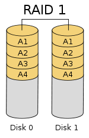
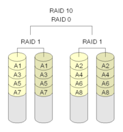
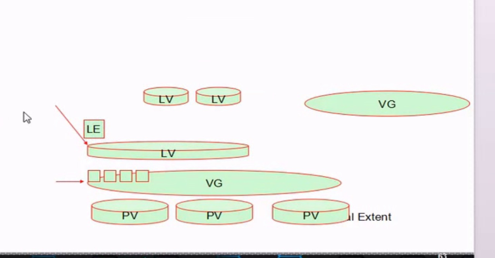

### 一. linux磁盘管理

​	I/O Ports:  I/O设备地址;

#### 1). 一切皆文件 

​	open()，read(), write(), close()

##### (1)设备类型

- 块设备: block, 存取单位“块” :磁盘
- 字符设备: char, 存取单位“字符” :键盘

##### (2). 设备文件:

​	关联至一个设备驱动程序，进而能够跟与之对应硬件设备进行通信;

##### (3). 设备号码

- 主设备号: major number,标识设备类型
- 次设备号: minor number, 标识同一类型下的不同设备

##### (4). 硬盘接口类型:

- 并行
  - IDE: 133MB/s
  - SCSI: 640MB/s 
- 串口:
  - SATA: 6Gbps
  - SAS: 6Gbps
  - USB: 480MB/s

##### (5). 磁盘设备的设备文件命名:

 /dev/DEV_FILE

- IDE: /dev/hd
- SCSI, SATA, SAS, USB: /dev/sd
  - 不同设备: a-z
    /dev/sda, /dev/sdb, ...
  - 同一设备上的不同分区; 1,2, ....
    /dev/sda1, /dev/sda5

##### (6). 机械式硬盘: 

- track: 磁道
- cylinder: 柱面
- secotr:扇区
  512bytes
- 如何分区:
  按柱面
- 0磁道0扇区: 512bytes
  - MBR: Master Boot Record
    - 446bytes: boot loader
    - 64bytes:分区表
      16bytes:标识一个分区
    - 2bytes: 55AA
    - 4个主分区;
      3主分区+1扩展(N个逻辑分区)
            逻辑分区

##### (7). 分区管理工具: fdisk, parted, sfdisk

###### ①. fdisk:

​	对于一块硬盘来讲，最多只能管理15分区; 

fdisk -l [-u] [device...]

1. fdisk device

   子命令:管理功能

   - p: print, 显示已有分区;
   - n: new,创建
   - d: delete, 删除
   - w: write, 写入磁盘并退出
   - q: quit, 放弃更新并退出
   - m:获取帮助
   - l:列表所分区id
   - t:调整分区id

2. 查看内核是否已经识别新的分区:

   cat /proc/partations

3. 通知内核重新读取硬盘分区表:

   - partx -a /dev/DEVICE
     -n M:N
   - kpartx -a /dev/DEVICE
     -f: force
   - Centos 5:使用partprobe
     partprobe [ /dev/DEVICE]

练习:

1.根据输入，列出一级目录下的文件

```shell
#! /bin/bash

path='.'

if [ -n "$1" ];then
    path=$1;
fi

content=$(ls -l $path | wc -l);
if [  $content -eq 0 ];then
    echo "文件夹为空";
    exit 0;
fi

if ls -l $path | egrep "^[[:space:]]*$" &> /dev/null ; then
    line=$( ls -l $path | egrep -n "^[[:space:]]*$" | head -n 1| cut -d":" -f1);
    ls -l $path | head -n $[$line - 1];
else 
    ls -l $path;
fi
```

使用:

```shell
./no_num_start.sh "/proc/[^[:digit:]]*"
```


### 二.文件系统分类:

#### 1)Linux文件系统: 

​	ext2, ext3, ext4, xfs, btrfs, reiserfs, jfs, swap

- swap:交换分区
- 光盘: iso9660

#### 2)Windows文件系统:

​	 fat32, ntfs

#### 3)Unix: 

​	FFS, UFS, JFS2

#### 4)网络文件系統: 

​	NFS, CIFS

#### 5)集群文件系统: 

​	GFS2, 0CFS2

#### 6)分布式文件系统: 

​	ceph,moosefs, mogilefs, GlusterFS, Lustre 

#### 7)根据其是否支持"journal"功能:

##### (1).日志型文件系统: 

​	ext3, ext4, xfs ,

##### (2).非日志型文件系统: 

​	ext2, vfat

#### 8)文件系统的组成部分:

##### (1).内核中的模抉: 

​	ext4, xfs, vfat

##### (2).用户空同的管理工具: 

​	mkfs.ext4, mkfs.xfs, mkfs .vfat

注意: 

Windows 与linux通用的文件系统为：vfat

### 三.Linux的虚拟文件系统: VFS

#### 1)创建文件系统: 

##### (1)mkfs命令:

######  ①.\# mkfs.FS_TYPE  /dev/DEVICE

- FS_TYPE分类: ext4, xfs,btrfs, vfat

###### ②.# mkfs -t FS_TYPE  /dev/DEVICE

- -L "LABEL': 设定卷标
- -t (fs -type ) :指定文件系统，

##### (2)mke2fs

 ext系列文件系统专用管理工具

- -t  {ext2 | ext3| ext4}
- -b {1024 | 2048| 4096 }
- -L 'LABEL': 卷标
- -j: 相当于-t ext3
  - mkfs.ext3 = mkfs -t ext3 = mke2fs -j = mke2fs -t ext3
- -i #:为数据空间中每多少个字节创建一个inode; 此大小不应该小于block的大小;
- -N #:为数据空间创建个多少个inode;
- m #:为管理人员预留的空间占据的百分比;man 
- -O FEATURE[,...]: 启用指定特性
  - -O ^FEATURE: 关闭指定特性

##### (3).mkswap:创建交换分区

mkswap [ options ] device

- -L "LABEL'

  前提:调整其分区的ID为82;

#### 2)其他工具

##### (1).blkid块设备属性信息查看

blkid [OPTION... [DEVICE]

​	locate/print block device attributes

- -U UUID: 根据指定的UUID来查找对应的设备
- -L LABEL: 根据指定的LABEL来查找对应的设备

##### (2).e2label:管理ext系列文件系统的LABEL

​	\#e2Label DEVICE [LABEL]

```shell
e2label /dev/sdb1 MYEXT-Three
```

##### (3).tune2fs:重新设定ext系列文件系统可调整参数的值

- -l:查看指定文件系统超级块信息: super block
- -L 'LABEL': 修改卷标
- -m #修预留给管理员的空间百分比
- j: 将ext2升级为ext3
- -O:文件系统属性启用或禁用
- -o ^:调整文件系统的默认挂载选项
- -U UUID: 修改UUID号:

##### (4).dumpe2fs:

- -h:查看超级块信息

#### 3)文件系统检测:

##### (1).fsck: File System Check

fsck.FS_TYPE
fsck -t FS_TYPE

- -a :自动修复错误
- -r: 交互式修复错误

Note: FS TYPE一 定要与分区上已经文件类型相同:

##### (2).e2fsck: 

​	ext系列文件专用的检测修复工具

- -y:自动回答为yes ;
- -f:强制修复:

### 四.文件系统管理

- 将额外文件系统与根文件系统某现存的目录建立起关联关系，进而使得此目录做为其它文件访问入口的行为称之为挂载:
- 解除此关联关系的过程称之为卸载:
- 把设备关联挂载点: mount point

**注意:**

1. 卸载时:可使用设备，也可以使用挂载点
2. 挂载点下原有文件在挂载完成后会被临时隐藏;

#### 1)挂载:mount

​	mount DEVICE MOUNT_ POINT
​	mount [ fnrsvw] [-t vfstype] [-o options] device dir

**mount命令的结果是通过查看/etc/mtab文件显示当前系统已挂载的所有设备**

1. device:指明要挂载的设备;

   - 设备文件:

     例如/dev/sda5

   - 卷标: -L 'LABEL', 

     例如-L 'MYDATA"

   - UUID: -U UUID*:

     例如-U 'Bc50523c - 43f1-45e7- 85c8- a126711d406e'

   - -s :伪文件系统名称: proc, sysfs, devtmpfs, configfs

2. dir:  挂载点

   - 事先存在:建议使用空目录:
   - 进程正在使用中的设备无法被卸载:

   **注意:挂载点下原有文件在挂载完成后会被临时隐藏;**

3. 常用命令选项:

   - -t vsftype:指定要挂载的设备上的文件系统类型;

   - -r: readonly, 只读挂载;

   - -w: read and write, 读写挂载;

   - -n:不更新/etc/mtab;

   - -a:自动挂载所有支持自动挂载的设备; (定义在/etc/fstab文件中，且挂 载选项中有“自动挂载"功能)

   - -L "LABEL': 以卷标指定挂载设备; 

   - -U "UUID': 以UUID指定要挂载的设备: 

   - **-B, --bind: 绑定目录到另一个目录上:**

     注意:查看内核追踪到的已挂载的所有设备: cat /proc/mounts 

   - -o options: (挂载文件系统的选项)

     - async:异步模式,文件发起写命令内核立即把内容写到挂载的硬盘中

     - sync:同步模式, 文件发起写命令内核不立即把内容写到挂载的硬盘中

     - atime/noatime: 包含目录和文件: 对文件的访问改不改变文件的访问时间

     - diratime/nodiratime:目录的访问时间戳，对目录的访问改不改变文件的访问时间

     - auto/noauto;是否支持自动挂载

     - exec/noexec:是否支持将文件系统上应用程序运行为进程

     - dev/nodev:是否支持在此文件系统上使用设备文件:

     - suid/nosuid: 是否支持在此文件系统上使用suid

     - remount:重新挂载

     - ro: 只读

     - rw:读写

     - user/nouser:是否允许普通用户挂载此设备

     - acl:启用此文件系统上的acl功能

       ```shell
       mount -o remount,acl /dev/sdb1 /mnt/xx
       ```

     - defaults: 默认挂载选项
       包含：rw, suid, dev, exec, auto, nouser, and async

     注意:上述选项可多个同时使用， 彼此使用逗号分隔:

4. 挂载指定目录

   - --bind 

   ```shell
   #挂载
   mount --bind /home/tgy01/facl /mnt/dir01
   #卸载
   umount /mnt/dir01
   ```

5. 光盘挂载

6. ```
   mount -r /dev/cdrom mount_point
   ```

   光盘设备文件: /dev/cdrom , /dev/dvd

7. U盘挂载

   找到U盘的设备文件，使用mount进行挂载即可

8. 本地回环设备挂载

   ```
   mount -o loop path mount_point
   ```

9. 查看当前系统已经挂载的设备

   - mount
   - cat /etc/mtab
   - cat /proc/mounts

#### 2)umount:卸载

\#umount DEVICE

\# umount MOUNT POINT

#### 3)查看正在访问指定文件系统的进程

​	fuser -v MOUNT_POINT

#### 4)终止所有在正访问指定的文件系统的进程:

​	fuser -km MOUNT_POINT

#### 5)挂载交换分区:

##### (1)启用: swapon

​	swapon [OPTION]... [DEVICE]

- -a:激活所有的交换分区: 
- -p PRIORITY: 指定优先级;

##### (2)禁用: swapoff

​	swapoff [ OPTION]... [DEVICE]

#### 6) 内存空间使用状态:free

​	free [OPTION]

- -m:以MB为单位
- -g: 以GB为单位

#### 7) 文件系统空间占用等信息的查看工具:df

- -h: human - readable

- -i:inodes instead of blocks

- -p: 以Posix兼容的格式输出;

  

#### 8)查看某个目录总体占用大小:du

​	du [OPTION]... DIR

- -h: human - readable
- -s: summary 目录总共大小

#### 9) 文件挂载的配置文件: /etc/fstab

每行定义一个要挂载的文件系统;

##### (1) fstab文件格式:

```
要挂载的设备或伪文件系统 挂载点文件 系统类型 挂载选项 转储频率 自检次序
```

##### (2) 要挂载的设备或伪文件系统:

- 设备文件、LABEL(LABEL="")、 UUID(UUID="")、 伪文件系统名称(proc, sysfs)

##### (3)挂载选项:

​	defaults

##### (4) 转储频率:

- 0:不做备份
- ​1:每天转储
- 2:每隔一天转储

##### (5)自检次序:

- 0:不自检
- 1:首先自检;一般只有rootfs才用1: 

#### 10) inode:

​	Index Node,索引节点

1. 地址指针:
   直接指针:
   间接指针:
   三级指针:
2. inode bitmap: 对位标识每个inode空闲与否的状态信息; 

#### 11) 链接文件:

##### (1) 硬链接:

​	指向同一个inode的多个不同路径:创建文件的硬链接即为为inode创建新的引用路径，因此会增加其引用计数:

​	不能够对目录进行:
​	不能跨分区进行

##### (2) 符号链接:

​	指向的是另一个文件的路径:其大小为指向的路径字符串的长度;不增加或减少目标文件inode的引用计数:

##### (3) 区别

|        | 对目录 | 是否可以跨分区 |
| ------ | ------ | -------------- |
| 硬链接 | 否     | 否             |
| 软链接 | 是     | 是             |

##### (4)使用方式

​	In [-sv] SRC DEST

- -s: symbolic link 
- -v: verbose

#### 12) 文件管理操作对文件的影响:

##### (1)文件删除

​	就是目录项删除对inode号的引用，同时在inode bitmap中标记该inode没有被使用，同时标记inode指向的内存空间的block bit没有被使用。

##### (2)文件复制: 

​	指定一个内存地址，里面保存文件名以及要复制内存的inode号

##### (3)文件移动:

​	在指定位置创建一个目录项，在目录项中的inode指向文件的inode，拷贝文件名到目录项中，删除之前的目录项。	

#### 13)练习:

1. 创建一个20G的文件系统，块大小为2048， 文件系统ext4,卷标为TEST,要求此分区开机后自动挂载至/testing目录，且默认有acl挂载选项;

2. 创建一个5G的文件系统，卷标HUGE,要求此分区开机自动挂载至/mogdata目录，文件系统类型为ext3;

3. 写一个脚本，完成如下功能:
   (1)列出当前系统识别到的所有磁盘设备:
   (2)如磁盘数量为1,则显示其空间使用信息:
   否则，则显示最后一个磁盘上的空间使用信息: 

   ```shell
   fdisk -l | egrep '^/dev/sd.*' | cut -d' ' -f1 | tail -n 1 | xargs df -h
   ```

#### 14) RAID 

​	Redundant Arrays of Inexpensive Disks ：廉价冗余磁盘阵列
​	Independent
​	Berkeley: A case for Redundent Arrays of Inexpensive Disks RAID

##### (1) 提高IO能力:

- 磁盘并行读写: 

##### (2) 提高耐用性:

- 磁盘冗余来实现

##### (3) 级别:

- 多块磁盘组织在一起的工作方式有所不同: 

##### (4) RAID实现的方式:

- 外接式磁盘阵列:通过扩展卡提供适配能力
- 内接式RAID:主板集成RAID控制器
- Software RAID:软RAID，通过软件模拟实现

##### (5) 级别: level

###### ①.RAID-0:日,条带卷，strip;

​	RAID0 是一种简单的、无数据校验的数据条带化技术。实际上不是一种真正的 RAID ，因为它并不提供任何形式的冗余策略。 RAID0 将所在磁盘条带化后组成大容量的存储空间（如图 2 所示），将数据分散存储在所有磁盘中，以独立访问方式实现多块磁盘的并读访问。由于可以并发执行 I/O 操作，总线带宽得到充分利用。再加上不需要进行数据校验，RAID0 的性能在所有 RAID 等级中是最高的。理论上讲，一个由 n 块磁盘组成的 RAID0 ，它的读写性能是单个磁盘性能的 n 倍，但由于总线带宽等多种因素的限制，实际的性能提升低于理论值。

　　RAID0 具有低成本、高读写性能、 100% 的高存储空间利用率等优点，但是它不提供数据冗余保护，一旦数据损坏，将无法恢复。 因此， RAID0 一般适用于对性能要求严格但对数据安全性和可靠性不高的应用，如视频、音频存储、临时数据缓存空间等。


RAID0 ：无冗错的数据条带

###### ②.RAID-1: 1,镜像卷，mirror;

​	RAID1 称为镜像，它将数据完全一致地分别写到工作磁盘和镜像 磁盘，它的磁盘空间利用率为 50% 。 RAID1 在数据写入时，响应时间会有所影响，但是读数据的时候没有影响。 RAID1 提供了最佳的数据保护，一旦工作磁盘发生故障，系统自动从镜像磁盘读取数据，不会影响用户工作。工作原理如图 3 所示。

　　RAID1 与 RAID0 刚好相反，是为了增强数据安全性使两块 磁盘数据呈现完全镜像，从而达到安全性好、技术简单、管理方便。 RAID1 拥有完全容错的能力，但实现成本高。 RAID1 应用于对顺序读写性能要求高以及对数据保护极为重视的应用，如对邮件系统的数据保护。



RAID1 ：无校验的相互镜像

###### ③.RAID-2

​	使用很少

###### ④.RAID-5:

 	RAID5 应该是目前最常见的 RAID 等级，它的原理与 RAID4 相似，区别在于校验数据分布在阵列中的所有磁盘上，而没有采用专门的校验磁盘。对于数据和校验数据，它们的写操作可以同时发生在完全不同的磁盘上。因此， RAID5 不存在 RAID4 中的并发写操作时的校验盘性能瓶颈问题。另外， RAID5 还具备很好的扩展性。当阵列磁盘 数量增加时，并行操作量的能力也随之增长，可比 RAID4 支持更多的磁盘，从而拥有更高的容量以及更高的性能。

　　RAID5 的磁盘上同时存储数据和校验数据，数据块和对应的校验信息存保存在不同的磁盘上，当一个数据盘损坏时，系统可以根据同一条带的其他数据块和对应的校验数据来重建损坏的数据。与其他 RAID 等级一样，重建数据时， RAID5 的性能会受到较大的影响。

　　RAID5 兼顾存储性能、数据安全和存储成本等各方面因素，它可以理解为 RAID0 和 RAID1 的折中方案，是目前综合性能最佳的数据保护解决方案。 RAID5 基本上可以满足大部分的存储应用需求，数据中心大多采用它作为应用数据的保护方案。


RAID5 ：带分散校验的数据条带

###### ⑤.RAID-6 

​	前面所述的各个 RAID 等级都只能保护因单个磁盘失效而造成的数据丢失。如果两个磁盘同时发生故障，数据将无法恢复。 RAID6 （如图 8 ）引入双重校验的概念，它可以保护阵列中同时出现两个磁盘失效时，阵列仍能够继续工作，不会发生数据丢失。 RAID6 等级是在 RAID5 的基础上为了进一步增强数据保护而设计的一种 RAID 方式，它可以看作是一种扩展的 RAID5 等级。

　　RAID6 不仅要支持数据的恢复，还要支持校验数据的恢复，因此实现代价很高，控制器的设计也比其他等级更复杂、更昂贵。 RAID6 思想最常见的实现方式是采用两个独立的校验算法，假设称为 P 和 Q ，校验数据可以分别存储在两个不同的校验盘上，或者分散存储在所有成员磁盘中。当两个磁盘同时失效时，即可通过求解两元方程来重建两个磁盘上的数据。

　　RAID6 具有快速的读取性能、更高的容错能力。但是，它的成本要高于 RAID5 许多，写性能也较差，并有设计和实施非常复杂。因此， RAID6 很少得到实际应用，主要用于对数据安全等级要求非常高的场合。它一般是替代 RAID10 方案的经济性选择。


RAID6 ：带双重分散校验的数据条带

###### ⑥.RAID10和RAID01

​	一些文献把这两种 RAID 等级看作是等同的，本文认为是不同的。 RAID01 是先做条带化再作镜像，本质是对物理磁盘实现镜像；而 RAID10 是先做镜像再作条带化，是对虚拟磁盘实现镜像。相同的配置下，通常 RAID01 比 RAID10 具有更好的容错能力，原理如图 9 所示。

　　RAID01 兼备了 RAID0 和 RAID1 的优点，它先用两块磁盘建立镜像，然后再在镜像内部做条带化。 RAID01 的数据将同时写入到两个磁盘阵列中，如果其中一个阵列损坏，仍可继续工作，保证数据安全性的同时又提高了性能。 RAID01 和 RAID10 内部都含有 RAID1 模式，因此整体磁盘利用率均仅为 50% 




典型的 RAID01 （上）和 RAID10 （下）模型

###### ⑦. JBOD

​	JBOD （ Just a Bunch Of Disks ）不是标准的 RAID 等级，它通常用来表示一个没有控制软件提供协调控制的磁盘集合。 JBOD 将多个物理磁盘串联起来，提供一个巨大的逻辑磁盘。 JBOD （如图 1 ）的数据存放机制是由第一块磁盘开始按顺序往后存储，当前磁盘存储空间用完后，再依次往后面的磁盘存储数据。 JBOD 存储性能完全等同于单块磁盘，而且也不提供数据安全保护。它只是简单提供一种扩展存储空间的机制， JBOD 可用存储容量等于所有成员磁盘的存储空间之和。目前 JBOD 常指磁盘柜，而不论其是否提供 RAID 功能


常用级别:
RAID-0, RAID-1, RAID-5, RAID-10, RAID-50, JBOD

##### (6)软RAID的实现

###### ①. 结合内核中的md(multi devices)

###### ②. mdadm:模式化的工具

- 命令的语法格式: 

  ​	mdadm [ mode ] \<raiddevice> [ options ] <component - devices> 

- 支持的RAID级别: L INear,RAIDO, rAID1 ,RAID4, RAID5, RAID6, rAID10;

- 模式(mode):

  - 创建: -C
  - 装配:-A
  - 监控: -F
  - 管理: -f, -r, -a

- \<raiddevice>: , dev/ md#

- \<component -devices>:任意块设备

###### ③. -C: 创建模式

- -n #:使用#个块设备来创建此RAID;
- -l #:指明要创建的RAID的级别: 
- -a {yes |no}:自动创建目标RAID设备的设备文件:
- -c CHUNK SIZE: 指明块大小: 
- -x #:指明空闲盘的个数:
  例如:创建一个10G可用空间的RAID5;

###### ④ -D: 显示raid的详细信息:

 	mdadm -D /dev /md#

######  ⑤. 管理模式:

- -f :标记指定磁盘为损坏;
- -a :添加磁盘
- -r: 移除磁盘

###### ⑥. 观察md的状态:

  	cat /proc/mdstat

######   ⑦. 停止md设备:

  	mdadm -S /dev/md#

#####   (7) watch命令:

- -n # :刷新间隔，单位是秒: 
    watch -n#  ’COMMAND’

#### 15) LVM2

​	LVM: logical volume manager , version:2

1. dm (device mapper) : 将一个或者多个底层块设备组织成逻辑设备的模块。

   组成的逻辑设备的位置:  /dev/md-# , 其中: #从 0开始 

2. 逻辑卷组与逻辑券的位置

   - /dev/mapper/VG_Name-LV_Name

     ```
     /dev/mapper/cl-home
     ```

   - /dev/VG_Name/LV_name

     ```
     /dev/cl/home
     ```

##### (1)基本术语

###### ①. VG (volume group)

​	卷组是LVM中使用的最高级别的抽象。 它将逻辑卷和物理卷集合在一起成为一个管理单元。

###### ②. PV (physical volume)

​	一个物理卷通常是一个硬盘，虽然它可能只是一个看起来像一个硬盘（如软件RAID设备）的设备。

###### ③. LV (logical volume)

​	相当于非LVM系统中的磁盘分区。 LV作为标准块设备可见; 因此LV可以包含文件系统（例如/ home）。

###### ④. PE (physical extent)

​	每个物理卷都被划分为数据块（称为物理扩展盘区），这些扩展盘区与卷组的逻辑盘区具有相同的大小。

###### ⑤. LE (logical extent)

​	每个逻辑卷都被分割成数据块，称为逻辑盘区。 卷组中的所有逻辑卷的区段大小都是相同的。

总图:



##### (2) pv管理工具

- pvs: 简要pv信息显示

- pvdisplay: 显示pv的详细信息

- pvcreate /dev/DEVICE : 创建pv

  使用fdisk 分区出一块硬盘，同时使用t修改硬盘的分区类型(partition type)为Linux LVM

- pmove /dev/DEVICE: 移出指定硬盘的数据到其他空间中

- pvremove /dev/DEVICE: 移出指定硬盘 

##### (3) vg 管理工具

- vgs : 简要显示vg

- vgdisplay: 显示vg的详细信息

- vgcreate -s  #[bBsSkKgG] vg_name physicalDevicePath ...

- vgextend  vg_name physicalDevicePath....(可以有多个物理设备)

- vgreduce  vg_name physicalDevicePath....(可以有多个物理设备)

  **减少之前先做 pvmove**

##### (4) lv 管理工具

- lvs
- lvdisplay
- lvcreate -L #[mMgG...] -n name vg_name

##### (5)扩展逻辑卷:

1. lvextend -L [+ ]# [mMgGtT] /dev/vg_name/lv_name

2. resize2fs /dev/vg_name/lv_name

   **在调整硬盘大小之前先umount硬盘，然后e2fsck -f 硬盘。最后resize**

##### (6)缩减逻辑卷

1. umount /dev/vg_name/lv_name

2. e2fsck -f /dev/vg_name/lv_name

   **e2fsck准对的是ext系列的文件系统，其他系统使用对应的命令**

3. resize2fs /dev/vg_name/lv_name #[ mMgGtT]

4. lvreduce -L [- ]#[mMgGtT] /dev/vg_name/lv_name

5. mount

(7) 快照: snapshot

​	快照就是将当时的系统信息记录下来，就好像照相一样，未来若有任何资料变动了，则**原始资料会被移动到快照区，没有被改动的区域则由快照区与档案系统共享**。


​	左图为最初建立系统快照区的状况，LVM 会预留一个区域 (左图的左侧三个PE 区块) 作为数据存放处。此时快照区内并没有任何数据，而快照区与系统区共享所有的PE 数据， 因此你会看到快照区的内容与文件系统是一模一样的。等到系统运作一阵子后，假设A 区域的数据被更动了 (上面右图所示)，则更动前系统会将该区域的数据移动到快照区，所以在右图的快照区被占用了一块PE 成为A，而其他B 到I 的区块则还是与文件系统共享！

快照区与被快照的LV 必须要在同一个VG 里。

###### ①. 创建快照

​	lvcreate -L #[mMgGtT] -p r -s -n snapshot_lv_name original_lv_name

```shell
#为/dev/vg0/lv1 创建一个大小为80M，名称为lv1snap 的快照。
lvcreate -L 80M -s -n lv1snap /dev/vg0/lv1
```

**总图:**


#### 16) dd 命令

​	dd - convert and copy a file

##### (1)用法

​	dd if=/PATH/FROM/SRC of=/PATH/TO/DEST

- bs

  一次拷贝的字节数

- count

  拷贝的次数

  总共拷贝量：bs * count

##### (2)应用

###### ①. 磁盘拷贝

```shell
dd if=/dev/sda of=/dev/sdb
```

###### ②.备份MBR

```shell
dd if=/dev/sda of=/dev/sdb bs=512 count=1
```

###### ③.破坏MBR中的bootloader

```shell
dd if=/dev/sda of=/dev/sdb bs=256 count=1
```

```shell
dd if=/etc/login.defs  of=./login.defs  bs=10 count=2
```

#### 17)压缩解压与归档

##### (1)压缩与解压

###### ①. gzip , gunzip,zcat

​	gzip, gunzip, zcat - compress or expand files

1. gzip / gunzip

   gzip [OPTION]- FILE.

   - -d: 解压缩，相当于gunzip;

   - -#:指定压缩比，默认是6; 数字越大压缩比越大(1-9);

   - -c: 将压缩结果输出至标准输出;

     gzip -C FILE > /PATH/TO/SOMEFILE.gz

     使用此选项和输出重定向可以解决压缩删除原文件

     ```shell
     gzip messages -c > messages.gz
     ```

2. zcat

   查看由gzip压缩的文件内容

   ```shell
   zcat messages.gz
   ```

###### ②. bzip2 , bunzip2,bzcat

1. bzip2/bunzip2

   bzip2 [OPTION]  FILE...

   - -d: 解压缩；
   - -#:指定压缩比; 默认是6;数字越大压缩比越大(1-9) ;
   - -k: keep,保留原文件; 

2. bzcat

###### ③. xz, unxz, xzcat

1. xz / unxz

   xz [OPTION].. FILE..

   - -d:解压缩
   - -#:指定压缩比;默人是6;数字越大压缩比越大( 1-9) ;
   - -k: 保留原文件;

2. xzcat

### 五.shell

#### 1) read

​	read [option].. [name ...]

- -p :提示信息
- -t time;超时时间

#### 2)shell技巧

##### (1)检查shell语法

```
bash -n script
```

(2)调试执行

```
bahs -x script
```

#### 3)练习:

输入硬盘位置，显示硬盘的使用情况

```shell
#! /bin/bash

read -p "设备地址:" dev_path

if [ -z $dev_path ]; then

    echo "请输入设备地址";
    exit 1;
fi

fdisk -l 2> /dev/null | egrep "^${dev_path}[[:space:]]" &>/dev/null && fdisk -l $dev_path || echo "$dev_path 不是设备地址";exit 1
```

