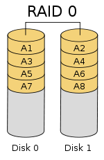
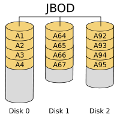

### 一. linux磁盘管理

​	I/O Ports:  I/O设备地址;

#### 1). 一切皆文件 

​	open()，read(), write(), close()

##### (1)设备类型

- 块设备: block, 存取单位“块” :磁盘
- 字符设备: char, 存取单位“字符” :键盘

##### (2). 设备文件:

​	关联至一个设备驱动程序，进而能够跟与之对应硬件设备进行通信;

##### (3). 设备号码

- 主设备号: major number,标识设备类型
- 次设备号: minor number, 标识同一类型下的不同设备

##### (4). 硬盘接口类型:

- 并行
  - IDE: 133MB/s
  - SCSI: 640MB/s 
- 串口:
  - SATA: 6Gbps
  - SAS: 6Gbps
  - USB: 480MB/s

##### (5). 磁盘设备的设备文件命名:

 /dev/DEV_FILE

- IDE: /dev/hd
- SCSI, SATA, SAS, USB: /dev/sd
  - 不同设备: a-z
    /dev/sda, /dev/sdb, ...
  - 同一设备上的不同分区; 1,2, ....
    /dev/sda1, /dev/sda5

##### (6). 机械式硬盘: 

- track: 磁道
- cylinder: 柱面
- secotr:扇区
  512bytes
- 如何分区:
  按柱面
- 0磁道0扇区: 512bytes
  - MBR: Master Boot Record
    - 446bytes: boot loader
    - 64bytes:分区表
      16bytes:标识一个分区
    - 2bytes: 55AA
    - 4个主分区;
      3主分区+1扩展(N个逻辑分区)
            逻辑分区

##### (7). 分区管理工具: fdisk, parted, sfdisk

###### ①. fdisk:

​	对于一块硬盘来讲，最多只能管理15分区; 

fdisk -l [-u] [device...]

1. fdisk device

   子命令:管理功能

   - p: print, 显示已有分区;
   - n: new,创建
   - d: delete, 删除
   - w: write, 写入磁盘并退出
   - q: quit, 放弃更新并退出
   - m:获取帮助
   - l:列表所分区id
   - t:调整分区id

2. 查看内核是否已经识别新的分区:

   cat /proc/partations

3. 通知内核重新读取硬盘分区表:

   - partx -a /dev/DEVICE
     -n M:N
   - kpartx -a /dev/DEVICE
     -f: force
   - Centos 5:使用partprobe
     partprobe [ /dev/DEVICE]

练习:

1.根据输入，列出一级目录下的文件

```shell
#! /bin/bash

path='.'

if [ -n "$1" ];then
    path=$1;
fi

content=$(ls -l $path | wc -l);
if [  $content -eq 0 ];then
    echo "文件夹为空";
    exit 0;
fi

if ls -l $path | egrep "^[[:space:]]*$" &> /dev/null ; then
    line=$( ls -l $path | egrep -n "^[[:space:]]*$" | head -n 1| cut -d":" -f1);
    ls -l $path | head -n $[$line - 1];
else 
    ls -l $path;
fi
```

使用:

```shell
./no_num_start.sh "/proc/[^[:digit:]]*"
```


### 二.文件系统分类:

#### 1)Linux文件系统: 

​	ext2, ext3, ext4, xfs, btrfs, reiserfs, jfs, swap

- swap:交换分区
- 光盘: iso9660

#### 2)Windows文件系统:

​	 fat32, ntfs

#### 3)Unix: 

​	FFS, UFS, JFS2

#### 4)网络文件系統: 

​	NFS, CIFS

#### 5)集群文件系统: 

​	GFS2, 0CFS2

#### 6)分布式文件系统: 

​	ceph,moosefs, mogilefs, GlusterFS, Lustre 

#### 7)根据其是否支持"journal"功能:

##### (1).日志型文件系统: 

​	ext3, ext4, xfs ,

##### (2).非日志型文件系统: 

​	ext2, vfat

#### 8)文件系统的组成部分:

##### (1).内核中的模抉: 

​	ext4, xfs, vfat

##### (2).用户空同的管理工具: 

​	mkfs.ext4, mkfs.xfs, mkfs .vfat

注意: 

Windows 与linux通用的文件系统为：vfat

### 三.Linux的虚拟文件系统: VFS

#### 1)创建文件系统: 

##### (1)mkfs命令:

######  ①.\# mkfs.FS_TYPE  /dev/DEVICE

- FS_TYPE分类: ext4, xfs,btrfs, vfat

###### ②.# mkfs -t FS_TYPE  /dev/DEVICE

- -L "LABEL': 设定卷标
- -t (fs -type ) :指定文件系统，

##### (2)mke2fs

 ext系列文件系统专用管理工具

- -t  {ext2 | ext3| ext4}
- -b {1024 | 2048| 4096 }
- -L 'LABEL': 卷标
- -j: 相当于-t ext3
  - mkfs.ext3 = mkfs -t ext3 = mke2fs -j = mke2fs -t ext3
- -i #:为数据空间中每多少个字节创建一个inode; 此大小不应该小于block的大小;
- -N #:为数据空间创建个多少个inode;
- m #:为管理人员预留的空间占据的百分比;man 
- -O FEATURE[,...]: 启用指定特性
  - -O ^FEATURE: 关闭指定特性

##### (3).mkswap:创建交换分区

mkswap [ options ] device

- -L "LABEL'

  前提:调整其分区的ID为82;

#### 2)其他工具

##### (1).blkid块设备属性信息查看

blkid [OPTION... [DEVICE]

​	locate/print block device attributes

- -U UUID: 根据指定的UUID来查找对应的设备
- -L LABEL: 根据指定的LABEL来查找对应的设备

##### (2).e2label:管理ext系列文件系统的LABEL

​	\#e2Label DEVICE [LABEL]

```shell
e2label /dev/sdb1 MYEXT-Three
```

##### (3).tune2fs:重新设定ext系列文件系统可调整参数的值

- -l:查看指定文件系统超级块信息: super block
- -L 'LABEL': 修改卷标
- -m #修预留给管理员的空间百分比
- j: 将ext2升级为ext3
- -O:文件系统属性启用或禁用
- -o ^:调整文件系统的默认挂载选项
- -U UUID: 修改UUID号:

##### (4).dumpe2fs:

- -h:查看超级块信息

#### 3)文件系统检测:

##### (1).fsck: File System Check

fsck.FS_TYPE
fsck -t FS_TYPE

- -a :自动修复错误
- -r: 交互式修复错误

Note: FS TYPE一 定要与分区上已经文件类型相同:

##### (2).e2fsck: 

​	ext系列文件专用的检测修复工具

- -y:自动回答为yes ;
- -f:强制修复:

### 四.文件系统管理

- 将额外文件系统与根文件系统某现存的目录建立起关联关系，进而使得此目录做为其它文件访问入口的行为称之为挂载:
- 解除此关联关系的过程称之为卸载:
- 把设备关联挂载点: mount point

**注意:**

1. 卸载时:可使用设备，也可以使用挂载点
2. 挂载点下原有文件在挂载完成后会被临时隐藏;

#### 1)挂载:mount

​	mount DEVICE MOUNT_ POINT
​	mount [ fnrsvw] [-t vfstype] [-o options] device dir

**mount命令的结果是通过查看/etc/mtab文件显示当前系统已挂载的所有设备**

1. device:指明要挂载的设备;

   - 设备文件:

     例如/dev/sda5

   - 卷标: -L 'LABEL', 

     例如-L 'MYDATA"

   - UUID: -U UUID*:

     例如-U 'Bc50523c - 43f1-45e7- 85c8- a126711d406e'

   - -s :伪文件系统名称: proc, sysfs, devtmpfs, configfs

2. dir:  挂载点

   - 事先存在:建议使用空目录:
   - 进程正在使用中的设备无法被卸载:

   **注意:挂载点下原有文件在挂载完成后会被临时隐藏;**

3. 常用命令选项:

   - -t vsftype:指定要挂载的设备上的文件系统类型;

   - -r: readonly, 只读挂载;

   - -w: read and write, 读写挂载;

   - -n:不更新/etc/mtab;

   - -a:自动挂载所有支持自动挂载的设备; (定义在/etc/fstab文件中，且挂 载选项中有“自动挂载"功能)

   - -L "LABEL': 以卷标指定挂载设备; 

   - -U "UUID': 以UUID指定要挂载的设备: 

   - **-B, --bind: 绑定目录到另一个目录上:**

     注意:查看内核追踪到的已挂载的所有设备: cat /proc/mounts 

   - -o options: (挂载文件系统的选项)

     - async:异步模式,文件发起写命令内核立即把内容写到挂载的硬盘中

     - sync:同步模式, 文件发起写命令内核不立即把内容写到挂载的硬盘中

     - atime/noatime: 包含目录和文件: 对文件的访问改不改变文件的访问时间

     - diratime/nodiratime:目录的访问时间戳，对目录的访问改不改变文件的访问时间

     - auto/noauto;是否支持自动挂载

     - exec/noexec:是否支持将文件系统上应用程序运行为进程

     - dev/nodev:是否支持在此文件系统上使用设备文件:

     - suid/nosuid: 是否支持在此文件系统上使用suid

     - remount:重新挂载

     - ro: 只读

     - rw:读写

     - user/nouser:是否允许普通用户挂载此设备

     - acl:启用此文件系统上的acl功能

       ```shell
       mount -o remount,acl /dev/sdb1 /mnt/xx
       ```

     - defaults: 默认挂载选项
       包含：rw, suid, dev, exec, auto, nouser, and async

     注意:上述选项可多个同时使用， 彼此使用逗号分隔:

4. 挂载指定目录

   - --bind 

   ```shell
   #挂载
   mount --bind /home/tgy01/facl /mnt/dir01
   #卸载
   umount /mnt/dir01
   ```

5. 光盘挂载

6. ```
   mount -r /dev/cdrom mount_point
   ```

   光盘设备文件: /dev/cdrom , /dev/dvd

7. U盘挂载

   找到U盘的设备文件，使用mount进行挂载即可

8. 本地回环设备挂载

   ```
   mount -o loop path mount_point
   ```

9. 查看当前系统已经挂载的设备

   - mount
   - cat /etc/mtab
   - cat /proc/mounts

#### 2)umount:卸载

\#umount DEVICE

\# umount MOUNT POINT

#### 3)查看正在访问指定文件系统的进程

​	fuser -v MOUNT_POINT

#### 4)终止所有在正访问指定的文件系统的进程:

​	fuser -km MOUNT_POINT

#### 5)挂载交换分区:

##### (1)启用: swapon

​	swapon [OPTION]... [DEVICE]

- -a:激活所有的交换分区: 
- -p PRIORITY: 指定优先级;

##### (2)禁用: swapoff

​	swapoff [ OPTION]... [DEVICE]

#### 6) 内存空间使用状态:free

​	free [OPTION]

- -m:以MB为单位
- -g: 以GB为单位

#### 7) 文件系统空间占用等信息的查看工具:df

- -h: human - readable

- -i:inodes instead of blocks

- -p: 以Posix兼容的格式输出;

  

#### 8)查看某个目录总体占用大小:du

​	du [OPTION]... DIR

- -h: human - readable
- -s: summary 目录总共大小

#### 9) 文件挂载的配置文件: /etc/fstab

每行定义一个要挂载的文件系统;

##### (1) fstab文件格式:

```
要挂载的设备或伪文件系统 挂载点文件 系统类型 挂载选项 转储频率 自检次序
```

##### (2) 要挂载的设备或伪文件系统:

- 设备文件、LABEL(LABEL="")、 UUID(UUID="")、 伪文件系统名称(proc, sysfs)

##### (3)挂载选项:

​	defaults

##### (4) 转储频率:

- 0:不做备份
- 1:每天转储
- 2:每隔一天转储

##### (5)自检次序:

- 0:不自检
- 1:首先自检;一般只有rootfs才用1: 

#### 10) inode:

​	Index Node,索引节点

1. 地址指针:
   直接指针:
   间接指针:
   三级指针:
2. inode bitmap: 对位标识每个inode空闲与否的状态信息; 

#### 11) 链接文件:

##### (1) 硬链接:

​	指向同一个inode的多个不同路径:创建文件的硬链接即为为inode创建新的引用路径，因此会增加其引用计数:

​	不能够对目录进行:
​	不能跨分区进行

##### (2) 符号链接:

​	指向的是另一个文件的路径:其大小为指向的路径字符串的长度;不增加或减少目标文件inode的引用计数:

##### (3) 区别

|        | 对目录 | 是否可以跨分区 |
| ------ | ------ | -------------- |
| 硬链接 | 否     | 否             |
| 软链接 | 是     | 是             |

##### (4)使用方式

​	In [-sv] SRC DEST

- -s: symbolic link 
- -v: verbose

#### 12) 文件管理操作对文件的影响:

##### (1)文件删除

​	就是目录项删除对inode号的引用，同时在inode bitmap中标记该inode没有被使用，同时标记inode指向的内存空间的block bit没有被使用。

##### (2)文件复制: 

​	指定一个内存地址，里面保存文件名以及要复制内存的inode号

##### (3)文件移动:

​	在指定位置创建一个目录项，在目录项中的inode指向文件的inode，拷贝文件名到目录项中，删除之前的目录项。	

#### 13)练习:

1. 创建一个20G的文件系统，块大小为2048， 文件系统ext4,卷标为TEST,要求此分区开机后自动挂载至/testing目录，且默认有acl挂载选项;

2. 创建一个5G的文件系统，卷标HUGE,要求此分区开机自动挂载至/mogdata目录，文件系统类型为ext3;

3. 写一个脚本，完成如下功能:
   (1)列出当前系统识别到的所有磁盘设备:
   (2)如磁盘数量为1,则显示其空间使用信息:
   否则，则显示最后一个磁盘上的空间使用信息: 

   ```shell
   fdisk -l | egrep '^/dev/sd.*' | cut -d' ' -f1 | tail -n 1 | xargs df -h
   ```

#### 14) RAID 

​	Redundant Arrays of Inexpensive Disks ：廉价冗余磁盘阵列
​	Independent
​	Berkeley: A case for Redundent Arrays of Inexpensive Disks RAID

##### (1) 提高IO能力:

- 磁盘并行读写: 

##### (2) 提高耐用性:

- 磁盘冗余来实现

##### (3) 级别:

- 多块磁盘组织在一起的工作方式有所不同: 

##### (4) RAID实现的方式:

- 外接式磁盘阵列:通过扩展卡提供适配能力
- 内接式RAID:主板集成RAID控制器
- Software RAID:软RAID，通过软件模拟实现

##### (5) 级别: level

###### ①.RAID-0:日,条带卷，strip;

​	RAID0 是一种简单的、无数据校验的数据条带化技术。实际上不是一种真正的 RAID ，因为它并不提供任何形式的冗余策略。 RAID0 将所在磁盘条带化后组成大容量的存储空间（如图 2 所示），将数据分散存储在所有磁盘中，以独立访问方式实现多块磁盘的并读访问。由于可以并发执行 I/O 操作，总线带宽得到充分利用。再加上不需要进行数据校验，RAID0 的性能在所有 RAID 等级中是最高的。理论上讲，一个由 n 块磁盘组成的 RAID0 ，它的读写性能是单个磁盘性能的 n 倍，但由于总线带宽等多种因素的限制，实际的性能提升低于理论值。

　　RAID0 具有低成本、高读写性能、 100% 的高存储空间利用率等优点，但是它不提供数据冗余保护，一旦数据损坏，将无法恢复。 因此， RAID0 一般适用于对性能要求严格但对数据安全性和可靠性不高的应用，如视频、音频存储、临时数据缓存空间等。



RAID0 ：无冗错的数据条带

###### ②.RAID-1: 1,镜像卷，mirror;

​	RAID1 称为镜像，它将数据完全一致地分别写到工作磁盘和镜像 磁盘，它的磁盘空间利用率为 50% 。 RAID1 在数据写入时，响应时间会有所影响，但是读数据的时候没有影响。 RAID1 提供了最佳的数据保护，一旦工作磁盘发生故障，系统自动从镜像磁盘读取数据，不会影响用户工作。工作原理如图 3 所示。

　　RAID1 与 RAID0 刚好相反，是为了增强数据安全性使两块 磁盘数据呈现完全镜像，从而达到安全性好、技术简单、管理方便。 RAID1 拥有完全容错的能力，但实现成本高。 RAID1 应用于对顺序读写性能要求高以及对数据保护极为重视的应用，如对邮件系统的数据保护。


RAID1 ：无校验的相互镜像

###### ③.RAID-2

​	使用很少

###### ④.RAID-5:

 	RAID5 应该是目前最常见的 RAID 等级，它的原理与 RAID4 相似，区别在于校验数据分布在阵列中的所有磁盘上，而没有采用专门的校验磁盘。对于数据和校验数据，它们的写操作可以同时发生在完全不同的磁盘上。因此， RAID5 不存在 RAID4 中的并发写操作时的校验盘性能瓶颈问题。另外， RAID5 还具备很好的扩展性。当阵列磁盘 数量增加时，并行操作量的能力也随之增长，可比 RAID4 支持更多的磁盘，从而拥有更高的容量以及更高的性能。

　　RAID5 的磁盘上同时存储数据和校验数据，数据块和对应的校验信息存保存在不同的磁盘上，当一个数据盘损坏时，系统可以根据同一条带的其他数据块和对应的校验数据来重建损坏的数据。与其他 RAID 等级一样，重建数据时， RAID5 的性能会受到较大的影响。

　　RAID5 兼顾存储性能、数据安全和存储成本等各方面因素，它可以理解为 RAID0 和 RAID1 的折中方案，是目前综合性能最佳的数据保护解决方案。 RAID5 基本上可以满足大部分的存储应用需求，数据中心大多采用它作为应用数据的保护方案。


RAID5 ：带分散校验的数据条带

###### ⑤.RAID-6 

​	前面所述的各个 RAID 等级都只能保护因单个磁盘失效而造成的数据丢失。如果两个磁盘同时发生故障，数据将无法恢复。 RAID6 （如图 8 ）引入双重校验的概念，它可以保护阵列中同时出现两个磁盘失效时，阵列仍能够继续工作，不会发生数据丢失。 RAID6 等级是在 RAID5 的基础上为了进一步增强数据保护而设计的一种 RAID 方式，它可以看作是一种扩展的 RAID5 等级。

　　RAID6 不仅要支持数据的恢复，还要支持校验数据的恢复，因此实现代价很高，控制器的设计也比其他等级更复杂、更昂贵。 RAID6 思想最常见的实现方式是采用两个独立的校验算法，假设称为 P 和 Q ，校验数据可以分别存储在两个不同的校验盘上，或者分散存储在所有成员磁盘中。当两个磁盘同时失效时，即可通过求解两元方程来重建两个磁盘上的数据。

　　RAID6 具有快速的读取性能、更高的容错能力。但是，它的成本要高于 RAID5 许多，写性能也较差，并有设计和实施非常复杂。因此， RAID6 很少得到实际应用，主要用于对数据安全等级要求非常高的场合。它一般是替代 RAID10 方案的经济性选择。


RAID6 ：带双重分散校验的数据条带

###### ⑥.RAID10和RAID01

​	一些文献把这两种 RAID 等级看作是等同的，本文认为是不同的。 RAID01 是先做条带化再作镜像，本质是对物理磁盘实现镜像；而 RAID10 是先做镜像再作条带化，是对虚拟磁盘实现镜像。相同的配置下，通常 RAID01 比 RAID10 具有更好的容错能力，原理如图 9 所示。

　　RAID01 兼备了 RAID0 和 RAID1 的优点，它先用两块磁盘建立镜像，然后再在镜像内部做条带化。 RAID01 的数据将同时写入到两个磁盘阵列中，如果其中一个阵列损坏，仍可继续工作，保证数据安全性的同时又提高了性能。 RAID01 和 RAID10 内部都含有 RAID1 模式，因此整体磁盘利用率均仅为 50% 


典型的 RAID01 （上）和 RAID10 （下）模型

###### ⑦. JBOD

​	JBOD （ Just a Bunch Of Disks ）不是标准的 RAID 等级，它通常用来表示一个没有控制软件提供协调控制的磁盘集合。 JBOD 将多个物理磁盘串联起来，提供一个巨大的逻辑磁盘。 JBOD （如图 1 ）的数据存放机制是由第一块磁盘开始按顺序往后存储，当前磁盘存储空间用完后，再依次往后面的磁盘存储数据。 JBOD 存储性能完全等同于单块磁盘，而且也不提供数据安全保护。它只是简单提供一种扩展存储空间的机制， JBOD 可用存储容量等于所有成员磁盘的存储空间之和。目前 JBOD 常指磁盘柜，而不论其是否提供 RAID 功能



常用级别:
RAID-0, RAID-1, RAID-5, RAID-10, RAID-50, JBOD

##### (6)软RAID的实现

###### ①. 结合内核中的md(multi devices)

###### ②. mdadm:模式化的工具

- 命令的语法格式: 

  ​	mdadm [ mode ] \<raiddevice> [ options ] <component - devices> 

- 支持的RAID级别: L INear,RAIDO, rAID1 ,RAID4, RAID5, RAID6, rAID10;

- 模式(mode):

  - 创建: -C
  - 装配:-A
  - 监控: -F
  - 管理: -f, -r, -a

- \<raiddevice>: , dev/ md#

- \<component -devices>:任意块设备

###### ③. -C: 创建模式

- -n #:使用#个块设备来创建此RAID;
- -l #:指明要创建的RAID的级别: 
- -a {yes |no}:自动创建目标RAID设备的设备文件:
- -c CHUNK SIZE: 指明块大小: 
- -x #:指明空闲盘的个数:
  例如:创建一个10G可用空间的RAID5;

###### ④ -D: 显示raid的详细信息:

 	mdadm -D /dev /md#

######  ⑤. 管理模式:

- -f :标记指定磁盘为损坏;
- -a :添加磁盘
- -r: 移除磁盘

###### ⑥. 观察md的状态:

  	cat /proc/mdstat

######   ⑦. 停止md设备:

  	mdadm -S /dev/md#

#####   (7) watch命令:

- -n # :刷新间隔，单位是秒: 
    watch -n#  ’COMMAND’

#### 15) LVM2

​	LVM: logical volume manager , version:2

1. dm (device mapper) : 将一个或者多个底层块设备组织成逻辑设备的模块。

   组成的逻辑设备的位置:  /dev/md-# , 其中: #从 0开始 

2. 逻辑卷组与逻辑券的位置

   - /dev/mapper/VG_Name-LV_Name

     ```
     /dev/mapper/cl-home
     ```

   - /dev/VG_Name/LV_name

     ```
     /dev/cl/home
     ```

##### (1)基本术语

###### ①. VG (volume group)

​	卷组是LVM中使用的最高级别的抽象。 它将逻辑卷和物理卷集合在一起成为一个管理单元。

###### ②. PV (physical volume)

​	一个物理卷通常是一个硬盘，虽然它可能只是一个看起来像一个硬盘（如软件RAID设备）的设备。

###### ③. LV (logical volume)

​	相当于非LVM系统中的磁盘分区。 LV作为标准块设备可见; 因此LV可以包含文件系统（例如/ home）。

###### ④. PE (physical extent)

​	每个物理卷都被划分为数据块（称为物理扩展盘区），这些扩展盘区与卷组的逻辑盘区具有相同的大小。

###### ⑤. LE (logical extent)

​	每个逻辑卷都被分割成数据块，称为逻辑盘区。 卷组中的所有逻辑卷的区段大小都是相同的。

总图:


##### (2) pv管理工具

- pvs: 简要pv信息显示

- pvdisplay: 显示pv的详细信息

- pvcreate /dev/DEVICE : 创建pv

  使用fdisk 分区出一块硬盘，同时使用t修改硬盘的分区类型(partition type)为Linux LVM

- pmove /dev/DEVICE: 移出指定硬盘的数据到其他空间中

- pvremove /dev/DEVICE: 移出指定硬盘 

##### (3) vg 管理工具

- vgs : 简要显示vg

- vgdisplay: 显示vg的详细信息

- vgcreate -s  #[bBsSkKgG] vg_name physicalDevicePath ...

- vgextend  vg_name physicalDevicePath....(可以有多个物理设备)

- vgreduce  vg_name physicalDevicePath....(可以有多个物理设备)

  **减少之前先做 pvmove**

##### (4) lv 管理工具

- lvs
- lvdisplay
- lvcreate -L #[mMgG...] -n name vg_name

##### (5)扩展逻辑卷:

1. lvextend -L [+ ]# [mMgGtT] /dev/vg_name/lv_name

2. resize2fs /dev/vg_name/lv_name

   **在调整硬盘大小之前先umount硬盘，然后e2fsck -f 硬盘。最后resize**

##### (6)缩减逻辑卷

1. umount /dev/vg_name/lv_name

2. e2fsck -f /dev/vg_name/lv_name

   **e2fsck准对的是ext系列的文件系统，其他系统使用对应的命令**

3. resize2fs /dev/vg_name/lv_name #[ mMgGtT]

4. lvreduce -L [- ]#[mMgGtT] /dev/vg_name/lv_name

5. mount

(7) 快照: snapshot

​	快照就是将当时的系统信息记录下来，就好像照相一样，未来若有任何资料变动了，则**原始资料会被移动到快照区，没有被改动的区域则由快照区与档案系统共享**。


​	左图为最初建立系统快照区的状况，LVM 会预留一个区域 (左图的左侧三个PE 区块) 作为数据存放处。此时快照区内并没有任何数据，而快照区与系统区共享所有的PE 数据， 因此你会看到快照区的内容与文件系统是一模一样的。等到系统运作一阵子后，假设A 区域的数据被更动了 (上面右图所示)，则更动前系统会将该区域的数据移动到快照区，所以在右图的快照区被占用了一块PE 成为A，而其他B 到I 的区块则还是与文件系统共享！

快照区与被快照的LV 必须要在同一个VG 里。

###### ①. 创建快照

​	lvcreate -L #[mMgGtT] -p r -s -n snapshot_lv_name original_lv_name

```shell
#为/dev/vg0/lv1 创建一个大小为80M，名称为lv1snap 的快照。
lvcreate -L 80M -s -n lv1snap /dev/vg0/lv1
```

**总图:**


#### 16) dd 命令

​	dd - convert and copy a file

##### (1)用法

​	dd if=/PATH/FROM/SRC of=/PATH/TO/DEST

- bs

  一次拷贝的字节数

- count

  拷贝的次数

  总共拷贝量：bs * count

##### (2)应用

###### ①. 磁盘拷贝

```shell
dd if=/dev/sda of=/dev/sdb
```

###### ②.备份MBR

```shell
dd if=/dev/sda of=/dev/sdb bs=512 count=1
```

###### ③.破坏MBR中的bootloader

```shell
dd if=/dev/sda of=/dev/sdb bs=256 count=1
```

```shell
dd if=/etc/login.defs  of=./login.defs  bs=10 count=2
```

#### 17)压缩解压与归档

##### (1)压缩与解压

###### ①. gzip , gunzip,zcat

​	gzip, gunzip, zcat - compress or expand files

1. gzip / gunzip

   gzip [OPTION]- FILE.

   - -d: 解压缩，相当于gunzip;

   - -#:指定压缩比，默认是6; 数字越大压缩比越大(1-9);

   - -c: 将压缩结果输出至标准输出;

     gzip -C FILE > /PATH/TO/SOMEFILE.gz

     使用此选项和输出重定向可以解决压缩删除原文件

     ```shell
     gzip messages -c > messages.gz
     ```

2. zcat

   查看由gzip压缩的文件内容

   ```shell
   zcat messages.gz
   ```

###### ②. bzip2 , bunzip2,bzcat

1. bzip2/bunzip2

   bzip2 [OPTION]  FILE...

   - -d: 解压缩；
   - -#:指定压缩比; 默认是6;数字越大压缩比越大(1-9) ;
   - -k: keep, 保留原文件; 

2. bzcat

###### ③. xz, unxz, xzcat

1. xz / unxz

   xz [OPTION].. FILE..

   - -d:解压缩
   - -#:指定压缩比;默人是6;数字越大压缩比越大( 1-9) ;
   - -k: 保留原文件;

2. xzcat

   查看xz压缩的文件内容

##### (2) 归档

###### ①.tar

1. 创建归档

   - -c  -f  /Path/To/Somewhere.tar FILE ... (file可以为多个)
   - -cf  /Path/To/Somewhere.tar FILE ... (file可以为多个)

2. 展开归档

   - -xf : /Path/to/someWhere.tar -C  /Path/To/anywher

   - -C : 解压到指定位置

     ```shell
     tar -xf qq.tar ^C qq1
     ```

3. 查看归档文件的文件列表

   - -tf /Path/to/someWhere.tar

     ```shell
     tar -tf qq.tar
     ```

归档完成后通常需要压缩，结合此前的压缩工具，就能实现压缩多个文件了;

4. 归档压缩

   - -z: gzip2

     - -zcf /PATH/TO/SOMEFILE.tar.gz FILE...

     - -zxf /PATH/TO/SOMEFILE.tar.gz 

       解压缩并展开归档,z选项可以省略

   - j: bzip2

     - -jcf : 使用 bzip2 压缩文件 
     - -jxf: 使用 bzip2 解压文件 

   - -J : xz

     - -Jcf ：使用 xz压缩文件 
     - -Jxf : 使用 xz 解压文件 

### 五.shell

#### 1) read

​	read [option].. [name ...]

- -p :提示信息
- -t time;超时时间

#### 2)shell技巧

##### (1)检查shell语法

```
bash -n script
```

(2)调试执行

```
bahs -x script
```

#### 3)练习:

输入硬盘位置，显示硬盘的使用情况

```shell
#! /bin/bash

read -p "设备地址:" dev_path

if [ -z $dev_path ]; then

    echo "请输入设备地址";
    exit 1;
fi

fdisk -l 2> /dev/null | egrep "^${dev_path}[[:space:]]" &>/dev/null && fdisk -l $dev_path || echo "$dev_path 不是设备地址";exit 1
```

#### 4) if练习

1. 写一个脚本，根据传入的参数判断文件类型

   ```shell
   #!/bin/bash
   
   if [ $# -lt 1 ];then
       
       echo "请输入一个参数;"
       exit 1;
   fi
   
   if ! [ -e $1 ]; then
   
       echo "文件不存在";
       exit 2;
   fi
   
   if [ -f $1 ];then
   
       echo "普通文件";
   elif [ -d $1 ];then
   
       echo "目录";
   elif [ -s $1 ];then
       echo "socket文件";
   else                                    
       echo "未知文件"                                           
   fi          
   ```

2. 提醒用户给出一下选择，根据选择做对应的输出

   ```
   disk) show disks info
   mem) show memory info free
   cpu) show cpu info
   ```

   ```shell
   #!/bin/bash
   
   cat<<EOF
   disk) show disks info
   mem) show memory info
   cpu) show cpu info
   EOF
   
   read -p "请选择:" select
   
   #echo $select
   
   if [ $select == "disk" ];then
   
       fdisk -l /dev/s[ad][a-z]
   elif [ $select == "mem" ];then
       
       free -lh 
   elif [ $select == "cpu" ];then
       
       lscpu
   else 
       echo "请输入上面提示的信息"
   fi
   ```

   

#### 5)循环控制

##### (1) for循环

###### ①.两种格式:

1. 遍历列表
2. 控制变量

###### ②. 遍万列表:

for VARAIBLE In LIST; do
	循坏体
done

1. 迸入条件:只要列表有元素,即可迸入循坏;

2. 退出条件:列表中的元素遍万完成;

3. list的生成方式:

   - 直接给出;

     param1 param2 param3 ….

   - 整数列表

     - {start..end}

       {2..5} ,两个.

     - seq [start [incremtal]] last

       seq 1 2 10: 输出1到10的奇数

   - 返回列表的命令

     ls ,cat 

   -  glob

     /etc/p* 路径

   - 变量引用
     \$@,  $*

```shell
# !/bln/bash
#
for username In user21 user22 user23; do
	If ld $username &> /dev/null; then
		echo "$username exists."
	else
		useradd $username && echo "Add user $username finished."
	fl				
done
```

###### ③.练习

1. 求1到100整数之和

   ```shell
   #!/bin/bash
   
   declare -i sum=0;
   
   for index in {1..100} ;do 
       
       #sum=$[$sum + $index]
       #sum=$(($sum + $index))
       let sum+=$index
   done
   
   echo $sum
   ```

2. 判断指定目录下的文件类型

3. 分别求100以内所有偶数之和,以及所有奇数之和;

4. 计算当前系统上的所有用户id之和;

5. 通过脚本参数传递一个目录给脚本，而后计算此目录下所有文本文件的行数之和;并说明此类文件的总数;

   

### 六. linux任务计划与周期任务

#### 1)命令介绍

- 未来的某时间点执行一次某任务: at, batch

- 周期性执行某任务: crontab

  执行结果以邮件的方式发送给用户

  查看是否可以接收到任务的命令:

  - netstat -tnl   

    - -t : tcp
    - -n: numeric
    - -l: listening

  - ss -tnl

    如果发现25端口被监听，就可以收邮件。

#### 2)本地邮件服务

- smtp: simple mall transmission protocol
- pop3: Post Office Procotol
- imap4: Internet Mail Access Procotol

##### (1) mail

​	mailx - send and recelve Internet mail

1. MUA

    mail user agent,用户收发邮件的工具

2. mailx

   - 使用格式

     mailx -s "Subject" username@hostname

     - -s : 邮件标题

   - 邮件正文的生成方式

     1. 交互式输入，使用点(.)或者ctrl+d结束

        ```shell
        mailx -s "hello word" tgy01
        ```

     2. 输入重定向

        ```shell
        # 把 separator.txt 的内容当作邮件正文发送
        mailx -s "separator" tgy01 < separator.txt
        ```

     3. 通过管道

     4. ```shell
        echo "jobs_spec" | mail -s "pool" tgy01
        ```

#### 3)任务计划: 

##### (1).at

​	at  [option ...] time

- Time

  - HH:MM [YYYY-mm-dd]

  - noon, minnight,tomorrow

  - now+#

    \#: 单位可以是 minutes,hours,day or weeks

  at的作业有队列，用单个字母表示，默认都使用a队列;

- 常用选项:

  - -l :查看作业队列, 相当于atq

  - -f /PATH/FROM/SOMEFILE:从指定文件中读取作业任务，而不用再交互式输入:

    ```shell
    at now+1minutes -f ./ats.sh
    ```

  - -d:删除指定的作业，相当于atrm;

    ```
    at -d 3
    ```

  - -c:查看指定作业的具体内容;

  - -q QUEUE:指明队列;

- 注意：

  任务执行结果是以邮件发送给提交作业的用户

##### (2) batch

​	batch与at类似，唯一区别就是batch会让系统自行选择在系统资源较空闲的时间去执行指定的任务;

#### 4).周期性任务cron

##### (1).服务程序:

​	cronie:主程序包，提供了crond守护进程及相关辅助工具;

##### (2)确保crond守护进程(daemon)处于运行状态的方式:

- CentOS 7: systemctl status crond.service
  出现:  **Actve: actlve (runnIng) …**
- CentOs 6: service crond status
  出现: **... is running-**

​	向crond提交作业的方式不同于at,它需要使用专用的配置文件，此文件有固定格式，不建议使用文本编辑器直接编辑此文件;要使用crontab命令;

##### (3).cron任务分类:

###### ①. 系统cron任务:

​	主要用于实现系统自身的维护,手动编辑 /etc/crontab文件

**/etc/crontab的配置格式:**

```shell
SHELL=/bin/bash
PATH=/sbin:/bin:/usr/sbin:/usr/bin
MAILTO=root

# For details see man 4 crontabs

# Example of job definition:
# .---------------- minute (0 - 59)
# |  .------------- hour (0 - 23)
# |  |  .---------- day of month (1 - 31)
# |  |  |  .------- month (1 - 12) OR jan,feb,mar,apr ...
# |  |  |  |  .---- day of week (0 - 6) (Sunday=0 or 7) OR sun,mon,tue,wed,thu,fri,sat
# |  |  |  |  |
# *  *  *  *  * user-name  command to be executed
```

**注意:**

注意:

1. 每一行定义一个周期性任务;
   - \*  *  *  *  *定义周期性时间
   - user-name :运行任务的用户身份
   - command to be executed:任务
2. 此处的环境变量不同于用户登录后获得的环境，因此,建议命令使用**绝对路径**，或者**自定义PATH环境变量**;
3. 执行结果邮件发送给MAILTO指定的用户

###### ②. 用户cron任务:

1. 命令:

    crontab命令

2. 用户cron的配置格式: /var/spool/cron/USERNAME

   ```
   SHELL=/bin/bash
   PATH=/sbin:/bin:/usr/sbin:/usr/bin
   MAILTO=root
   
   # For details see man 4 crontabs
   
   # Example of job definition:
   # .---------------- minute (0 - 59)
   # |  .------------- hour (0 - 23)
   # |  |  .---------- day of month (1 - 31)
   # |  |  |  .------- month (1 - 12) OR jan,feb,mar,apr ...
   # |  |  |  |  .---- day of week (0 - 6) (Sunday=0 or 7) OR sun,mon,tue,wed,thu,fri,sat
   # |  |  |  |  |
   # *  *  *  *  * user-name  command to be executed
   ```

3. 注意:

   - 每行定义一个cron任务，共6个字段;
   - 此处的环境变量不同于用户登录后获得的环境，因此，建议命令使用**绝对路径**，或者自定义PATH环境变量;
   - 邮件发送给当前用户;
   - month与week不同时使用

###### ③.时间表示

1. 特定值;
   给定时间点有效取值范围内的值;
   注意: day of week和day of month-般不同时使用;

2. \*给定时间点上有效取值范围内的所有值;表"每xxx"

3. 离散取值:,
   在时间点上使用逗号分隔的多个值; #,#

4. 连续取值: -
   在时间点上使用连接开头和结束

   \#-#

5. 在指定时间点上，定义步长: 
   /#: #即步长;

   **注意:**
   (1)指定的时间点不能被步长整除时，其意义将不复存在;
   (2)最小时间单位为“分钟”，想完成“秒”级任务，得需要额外借助于其它机制;
   定义成每分钟任务:而在利用脚本实现在每分钟之内，循环执行多次;

6. 示例:

   - 3\*\*\*\*: 每小时执行一次;每小时的第3分钟;
   - 34\*\*5:每周执行一次;每周5的4点3分;
   - 567\*\*:每月执行一-次;每月的7号的6点5分;
   - 789 10\*:每年执行一次;每年的10月9号8点7分;
   - 98\*\*3,7:每周三和周日的8点9分钟执行
   - 0 8,20 \*\* 3,7: 每个月周三和周日的8点和20点
   - 0 9-18 \*\* 1-5: 周1至周5的9点到18点每个点
   - \*/5\*\*\*\*:每5分钟执行一次某任务;
   -  */7 : 无意义

###### ④.crontab命令:

​	crontab \[-u user\] [-l| -r | -e]  [-l ]

- -e:编辑任务;

- -l : 列出所有任务;

- -r: 移除所有任务;即删除/var/spool/cron/USERNAME文件;

- -i:在使用-r选项移除所有任务时提示用户确认;

- -u user: root用户可为指定用户管理cron任务;

  **注意:运行结果以邮件通知给当前用户;如果拒绝接收邮件:**

  1. COMMAND > /dev/null
  2.  COMMAND &> /dev/null

  **注意:定义COMMAND时，如果命令需要用到%，需要对其转义;但放置于单引号中的%不用转义亦可;**

  思考:某任务在指定的时间因关机未能执行，下次开机会不会自动执行?
  	不会!
  如果期望某时间因故未能按时执行，下次开机后无论是否到了相应时间点都要执行一次，可使用anacron实现;
  课外作业: anacron及其应用;

```
#每两分钟执行: cat /etc/fstab
*/2 * * * * "/bin/cat /etc/fstab"
```

###### ⑤.练习:

1. 每12小时备份一次/etc目录至/backups目录中， 保存文件名称格式为“etc-yy-mm-dd-hh.tar.xz"

   ```shell
   */2 * * * * /usr/bin/tar -JcPf /home/tgy01/pp/pp_`date "+\%y\%m\%d:\%M\%H\%S"`.tar.xz /home/tgy01/pp/qq
   ```

2. 每周2、 4、7备份/var/log/secure文件至/logs目录中，文件名格式为“secure-yyyymmdd" ;

   ```shell
   0 0 * * 2,4,7 /usr/bin/cp -a /var/log/secure /logs/secure-$(date +\%Y\%m\%d)
   */2 * * * * /usr/bin/cp -a /home/tgy01/pp/shift.sh /home/tgy01/pp/qq/shift_$(date +\%Y\%m\%d:\%M).sh
   ```

3. 每两小时取出当前系统/proc/meminfo文件中以S或M开头的行信息追加至/tmp/meminfo.txt文件中;

   ```shell
   0 */2 * * * egrep "^[SM]" /proc/meminfo >> /tmp/meminfo.txt
   ```

### 七.Linux程序包管理

#### 1)序言

##### (1) 接口分类

- API : Application Program Interface

- ABI: Application Binary Interface

  - unix-like二进制文件类型(使用**file**命令查看):  

    ELF

  - windows二进制文件类型: 

    exe,msi

  - 库级别的虚拟化

    - Linux: WinE
    - Windows:Cywin

##### (2) 系统开发

​	c/c++: https,vsftpd, nginx

##### (3)应用级开发

​	Java/Python/perl/ruby/php:

- Java:Hadoop,HBase

  依赖于: JVM

- Python: openstack

  依赖于:PVM

##### (4) c/c++程序格式:

- 源代码 

  1. 文本格式的程序代码; ;

     编译环境: 编译器、头文件、开发库

  2. 二迸制格式:

     文本格式的程序代码—>编译器—>二进制格式(二进制程序、头文件、配置文件、帮助文件)

##### (5)java/python程序格式:

1. 源代码:

   编译成能够在其虚似机(jvm/pvm)运行的格式;
   幵发环境: 编译器，开发库

2. 二进制

##### (6)项目够建工具:

- c/c++: make
- java: maven
- python:pip

##### (7) 程序包管理器:

1. 源代码-->目标二进制格式(二进制程序、库文件、配置文件、帮助文件) --> 组织成为一个或有限几个“包”文件;
   可以实现程序包的: **安装、升级、卸载、查询、校验**
2. 程序包管理器:
   - debian: dpt, dpkg, ".deb"
   - redhat: redhat package manager, rpm, ".rpm"; rpm is package manager;
   - S.u.S.E: rpm, ".rpm",
   - Gentoo: ports
   - ArchLinux:

##### (8) 源代码 

   name-VERSION.tar.gz

- VERSION: major.minor.release

  ```
  linux-4.4.174.tar.xz
  ```

##### (9) rpm包命名格式:

​	name-VERSION-release.arch.rpm

- VERSION: major.minor.release

- release.arch: rpm包的发行号

  - release.os: 2.el7.l386.rpm

  - archetecture: i386, x64(amd64), ppc, noarch

    redis-3.0.2.tar.gz --> redis-3.0.2-1.centos7.x64.rpm

##### (10) 拆包

- 主包: name-VERSION-release.arch.rpm

- 支包: name-function-VERSION-release.arch.rpm

  function: devel, utils, libs, ....

##### (11) 依赖关系

###### ①.循环依赖

​	X->Y->Z->X

②.前端工具

​	自动解决依赖关系;

- yum: rhel系列系统上rpm包管理器的前端工具;
- apt-get (apt-cache): deb包管理器的前端工具;
- zypper: suse的rpm管理器前端工具;
- dnf: Fedora 22+系统上rpm包管理器的前端工具;

##### (12) 程序包管理器:

​	功能:将编译好的应用程序的各组成文件打包成一个或几个程序包文件，从而更方便地实现程序包的安装、升级、卸载和查询等管理操作;

1. 序包的组成清单(每个程序包都单独实现) ;

   - 文件清单
   - 安装或卸载时运行的脚本

2. 数据库(公共)
   程序包的名称和版本;
   依赖关系;
   功能说明;
   安装生成的各文件的文件路径及校验码信息;

   /var/lib/rpm/

##### (13)获取程序包的途径:

###### ①.系统发行版的光盘或官方的文件服务器(或镜像站点) :

- http://mirrors.aliyun.com,
- http://mirrors.sohu.com,
- http://mirrors.163.com

###### ②. 项目的官方站点

###### ③. 第三方组织:

- EPEL
- 搜索引擎
  - http://pkgs.org
  - http://rpmfind.net
  - http://rpm.pbone.net

###### ④. 自动动手，丰衣足食

**建议:检查其合法性**

- 来源合法性;
- 程序包的完整性;

#### 2). Centos系统上rpm命令管理程序包:

​	安装、升级、卸载、查询和校验、数据库维护

##### (1). rpm简介

​	rpm [OPTIONS] [PACKAGE_ FILE]

- 安装: -I, --Install
- 升级: -U, --update, -F, --freshen
- 卸载: -e, --erase
- 查询: -q, --query
- 校验: -V, --verify
- 数据库维护: - builddb, --Initdb

##### (2).安装:

​	rpm {-l|-Install} [Install-options] PACKAGE FILE -.

- rpm -ivh PACKAGE_ FILE - 

- GENERAL OPTIONS:
  -v: verbose, 详细信息
  -vv: 更详细的输出

- \[install-options\]: 

  - -h: hash marks输出进度条;毎个#表示2%的迸度;

  - --test: 测式安装，检査并报告依赖关系及冲突消息等;

  - --nodeps:忽略依赖关系;不建议;

  - --replacepkgs:重新安装

    **注意: rpm可以自带脚本;**
    四类: --noscripts

    - preinstall:安装过程开始之前运行的脚本，%pre，--nopre
    - postinstall:安装过程完成之后运行的脚本，%post , --nopost
    - preuninstall:卸载过程真正开始执行之前运行的脚本，%preun, --nopreun
    - postuninstall:卸载过程完成之后运行的脚本，%postun , --nopostun

  - --nosignature:不检査包签名信息，不检査来源合法性; 

  - --nodigest:不检査包完整性信息;

##### (3) 升级

​	rpm {-U l--upgrade} [install-options] PACKAGE_FILE ..
​	rpm {-Fl--freshen} [install-options] PACKAGE_FILE …

- -U:升级或安装;
- -F:升级
  rpm -Uvh PACKAGE_ FILE ...
  rpm -Fvh PACKAGE_ FILE ....
- --oldpackage:降级;
- --force: 强制升级;

注意: 

1. 不要对内核做升级操作; Linux支持多内核版本并存，因此，直接安装新版本内核;
2. 如果某原程序包的配置文件安装后曾被修改过，升级时，新版本的程序提供的同一个配置文件不会覆盖原有版本的配置文件，而是把新版本的配置文件重命名(**FILENAME.rpmnew**)后提供;

##### (4) 卸载:

​	rpm {-e |--erase} [--allmatches] [--nodeps] [--noscripts] (--test] PACKAGE NAME …

- --allmatches:卸载所有匹配指定名称的程序包的各版本;
- --nodeps:忽略依赖关系
- --test:测试卸载, dry run模式

##### (5) 查询:

​	rpm {-q|--query} [select-options] [query-options]

###### ①. [select-options]选项

​	PACKAGE_NAME:查询指定的程序包是否已经安装，及其版本;

- -a, --all: 查询所有已经安装过的包; 

- -f FILE:查询指定的文件由哪个程序包安装生成;

- -p, --package PACKAGE_ FILE: 用于实现对未安装的程序包执行查询操作;

- --whatprovides CAPABILITY:查询指定的CAPABILITY由哪个程序包提供;

- --whatrequires CAPABILITY:查询指定的CAPABILITY被哪个包所依赖;

  ```shell
  rpm -q --whatrequires "config(zsh)"
  ```

###### ②. [query-options]

- --changelog:查询rpm包的changlog;

- -I, -t:程序安装生成的所有文件列表;

- -i, --info:程序包相关的信息，版本号、大小、所属的包组，等;

- -c, --configfiles:查询指定的程序包提供的配置文件;

- -d, --docfiles:查询指定的程序包提供的文档;

- --provides:列出指定的程序包提供的所有的CAPABILITY;

- -R, --requires:查询指定的程序包的依赖关系;

- --scripts:查看程序包自带的脚本片断;

  ```shell
  rpm -q --scripts zs
  执行结果:
  postinstall scriptlet (using /bin/sh):
  if [ ! -f /etc/shells ] ; then
      echo "/bin/zsh" > /etc/shells
  else
      grep -q "^/bin/zsh$" /etc/shells || echo "/bin/zsh" >> /etc/shells
  fi
  
  if [ -f /usr/share/info/zsh.info.gz ]; then
  # This is needed so that --excludedocs works.
  /sbin/install-info /usr/share/info/zsh.info.gz /usr/share/info/dir \
    --entry="* zsh: (zsh).			An enhanced bourne shell."
  fi
  
  :
  preuninstall scriptlet (using /bin/sh):
  if [ "$1" = 0 ] ; then
      if [ -f /usr/share/info/zsh.info.gz ]; then
      # This is needed so that --excludedocs works.
      /sbin/install-info --delete /usr/share/info/zsh.info.gz /usr/share/info/dir \
        --entry="* zsh: (zsh).			An enhanced bourne shell."
      fi
  fi
  :
  postuninstall scriptlet (using /bin/sh):
  if [ "$1" = 0 ] ; then
      if [ -f /etc/shells ] ; then
          TmpFile=`/bin/mktemp /tmp/.zshrpmXXXXXX`
          grep -v '^/bin/zsh$' /etc/shells > $TmpFile
          cp -f $TmpFile /etc/shells
          rm -f $TmpFile
      fi
  fi
  ```

###### ③.用法:

-qi PACKAGE, -qf FILE, -qc PACKAGE, -qI PACKAGE, -qd PACKAGE
-qpl PACKAGE_FILE, -qpi PACKAGE_FILE, -qpc PACKAGE_FILE, ....

##### (6) 校验

​	rpm (-Vl--verify) [select-options] [verify-options]

- S : file Size differs
- M: Mode differs (includes permissions and file type)
- 5 digest (formerly MD5 sum) differs
- D Device major/minor number mismatch
- L readLink(2) path mismatch
- U User ownership differs
- G Group ownership differs
- T mTime differs
- P caPabilities differ

```shell
rpm -V zsh 
# S.5....T.    /usr/share/zsh/5.0.2/scripts/newuser
```

###### ①. 包来源合法性验正和完整性验正:

来源合法性验正:
完整性验正:
获取并导入信任的包制作者的密钥:
对于CentOS发行版来说: rpm --import /etc/pki/rpm-gpg/RPM-GPG-KEY-CentOS-7

###### ②. 验正:

(1)安装此组织签名的程序时，会自动执行验正;
(2)手动验正: rpm -K PACKAGE_FILE

##### (7).数据库重建:

​	rpm管理器数据库路径: /var/lib/rpm/
查询操作:通过此处的数据库进行;
获取帮助:
Centos 6: man rpm
CentOs 7: man rpmdb
rpm {--initdb | --rebuilddb} [--dbpath DIRECTORY] [--root DIRECTORY]
--initdb:初始化数据库，当前无任何数据库可实始化创建- - 个新的;当前有时不执行任何操作;
--rebuilddb:重新构建，通过读取当前系统上所有已经安装过的程序包进行重新创建;

#### 3)软件包管理工具yum

##### (1)yum简介

- CentOS: yum, dnf
- URL: ftp://172.16. 0.1/pub/
- YUM: yellow dog, Yellowdog Update Modifier
- yum repository: yum repo
  - 存储了余多rpm包，以及包的相关的元数据文件(放置于特定目录下: **repodata**) ;
  - 文件服努器:
    - ftp://xxx
    - http://xxx 
    - nfs://xxx
    - file:///xxx

##### (2)yum客户端

###### ①.配置文件

- /etc/yum.conf : 所有合庠提供公共配置

- /etc/yum.repos.d/xxx.repo: 为仓库的指向提供配置

  可以使用 **rpm -qc yum** 查看yum的配置文件路径

###### ②.仓库指向的定义

```
[repositoryID]
name-Some name for this repos itory
baseurl=ur1: //path/ to/ repos itory/
mirrorlist= url
enabled={1 |0}
gpgcheck={1 |0}
gpgkey =URL
enablegroups={1 0}
failovermethod={ roundrobin|priority}
```

- repositoryID :仓库id
- name-Some :指定仓库名
- baseurl: 仓库的url
- mirrorlist: 服务器镜像文件路径，该文件包含多个服务器url，与**baseurl互斥**
- enabled:是否开启当前配置(**默认开启**)
  - 1 : 开启
  - 0 : 不开启
- gpgcheck: 是否进行**包来源合法性检查**和**包完整性检查**(**默认开启**)
  - 1: 进行检查
  - 0: 不进行检查
- gpgkey : 公钥的路径
- enablegroups: 是否开启组配置(默认开启)
  - 1 : 开启
  - 0 : 不开启
- failovermethod: 有多个url时使用url的策略
  - roundrobin : 从上往下轮流使用
  - priority：按照url指定的优先级使用

###### ③. yum操作

1. 显示仓库列表

   repolist [all|enabled|disabled]

   - 默认是 **enabled**

2. 显示程序包

   list

   yum list [all | glob_exp1] [glob_exp2] [ ... ]

   yum list [available | installed | updates ] [glob_exp1] [...]

3. 安装程序包

   install package1 [pakage2 ...]

   reinstall package1 [package2 …]  (重新安装)

4. 升级程序包

   upadte  package1 []

   downgrade package1 [...]

5. 检查可用升级

   check-update

6. 卸载程序包

   remove | erase package1 [package2 …]

7. 查看程序包

   info  [...]

8. 查看指定的特性(可以是某文件)是由哪个程序包所提供:
   provides| whatprovides feature1 [feature2] [...] 

9. 清理本地缓存:
   clean [ packages| metadata| expire-cache| rpmdb | pluginsI all ]

10. 构建缓存: 
   makecache

11. 搜索:
    search string1 [string2] [...]
    以指定的关键字搜索程序包名及summary信息:

12. 查看指定包所依赖的capabilities:
    deplist package1 [package2] [...] 

13. 查看yum事务历史:
    history [info|list Ipackages-list Ipackages- info| summary I addon info lredo I undo lrollback Inewl sync|stats]

14. 安装及升级本地程序包: 
    localinstall rpmfile1 [rpmfile2] L...J
    maintained for legacy reasons only 一use instal1)
    ”Iocalupdate rpmfile1 [rpmfile2] L...]
    maintained for legacy reasons only 一use update)

15. 包组管理的相关命令:
    groupinstall group1 [group2] [.2.]
    groupupdate group1 [ group2] [-.. ]
    grouplist [hidden] groupwildcard Ey.-]
    groupremove group1 Lgroup2] [.. ]
    groupinfo group1 I 。..

###### ④.更换系统yum源为阿里云

1. 备份原来的yum源

   ```shell
   mv /etc/yum.repos.d/CentOS-Base.repo /etc/yum.repos.d/CentOS-Base.repo.backup
   ```

2. 下载阿里云的CentOS-Base.repo 到/etc/yum.repos.d/

   ```shell
   wget -O /etc/yum.repos.d/CentOS-Base.repo http://mirrors.aliyun.com/repo/Centos-7.repo
   #或者
   # -o/--output  把输出写到该文件中
   curl -o /etc/yum.repos.d/CentOS-Base.repo http://mirrors.aliyun.com/repo/Centos-7.repo
   ```

3. 清理缓存

   ```shell
   sudo yum clean all
   ```

4. 生成新的缓存

   ```shell
   sudo yum makecache
   ```


##### (3) 如何使用光盘当作本地yum仓库:

###### ①.挂载光盘至某目录，

例如/media/cdrom

 	\# mount -r -t iso9660 /dev/ cdrom , media/ cdrom

###### ②. 创建配置文件

​	在 /etc/yum.repo.d/ 目录下创建以repo结尾的配置文件，在文件中配置如下信息:

```shell
# repo id
[ CentOs7 ]
name=
baseurl=
gpgcheck=
enabled=
```

##### (4) yum的命令行选项:

- -- nogpgcheck: 禁止进行gpg check:
- -y :自动回答为"yes”;
- -q: 静默模式:
- --disablerepo=repoidglob:临时禁用此处指定的repo;
- -- enablerepo=repoidglob: 临时启用此处指定的repo;
- --noplugins: 禁用所有插件:

##### (5)yum的repo配置文件中可用的变量

- \$releasever:当前OS的发行版的主版本号:

- \$arch: 平台

- \$basearch:基础平台;

- \$YUMO- ​\$YUM9 : 可用的其他一些自定义变量

  ```shell
  http://xxxx.xx/centos/$releasever/$basearch/os 
  ```

##### (6) 创建yum仓库

​	create [operations]  directory

- --basedir

  Basedir for path to directories in the repodata, default is the current working directory.

  ```shell
  # 创建文件索引和签名,生成的datarepo文件放到 ../ 文件夹中
  createrepo --basedir ../ .
  ```

  ```shell
  [local]
  name=CentOS-$releasever - local-path
  baseurl=file:///root/centos-7
  gpgcheck=0
  enabled=1
  ```

  ```shell
  #使用repolist 查看可用repo
  yum repolist
  ```

#### 4) 程序包编译安装软件

##### (1) rpm 源码安装过程

- testapp-VERSIoN-release.src.rpm
- 安装后，使用rpmbuild命 令制作成二进制格式的rpm包，而后再安装;

源代码--> 预处理-->编译(gcc) -->汇编-->链接-->执行

##### (2) 源代码组织格式:

​	多文件:文件中的代码之间，很可能存在跨文件依赖关系:

- C、C++: make (configure --> Makefile.in --> makefile)
- java: maven

##### (3) 编译安装三步骤:

###### ① 执行 ./configure

1. 通过选项传递参数，指定启用特性、安装路径等:执行时会参考用户的指定以及Makefile . in文件生成makefile:
2. 检查依赖到的外部环境:

###### ②. make:

根据makefile文件， 构建应用程序:

###### ③. make install

开发工具:
autoconf:生成configure脚本
automake:生成Makefile. in
**建议:安装前查看INSTALL, README** 

##### (4)开源程序源代码的获取:

###### ①.官方自建站点:

- apache.org (ASF )
- mariadb.org

###### ②.代码托管:

- SourceForge

- Github. com

- code.google.com

  c/c++: gcc (GNU C Complier) 

##### (5) 编译C源代码:

###### ①. 前提:提供开发工具及开发环境

- 开发工具:make, gcc等
- 开发环境: 开发库，头文件
  glibc:标准库
- 通过“包组”提供开发组件
  Centos 6: "Development Tools", "Server Platform Development" ,

###### ②. 第一步: configure脚本

选项:指定安装位置、指定启用的特性

- --help: 获取其支持使用的选项
- 选项分类:
  - 安装路径设定:
    - --prefix=/PATH/ TO/SOMEWHERE: 指定默认安装位置:
    - -- sysconfdir=/PATH/ TO/SOMEWHERE:配置文件安装位置:
  - System types : 
    Optional Features: 可选特性
    - -- disable- FEATURe
    - -- enable- FEATURE [ =ARG ]
  - Optional Packages: 可选包
    - --with-PACKAGE [=ARG]
    - --without -PACKAGE

###### ③. 第二步: 

​	make

###### ④. 第三步: 

​	make install

##### (6) 安装后的配置:

###### ①. 导出二进制程序目录至PATH环境变量中;

​	生成文件/etc/profile.d/NANE. sh，在该文件中给Path添加程序安装路径

```shell
export PATH=/PATH/TO/Bin$path
```

###### ②.导出库文件路径

- 编辑/etc/Id.so.conf. d/NAME .conf，添加新的库文件所在目录至此文件中:
- 让系统重新生成缓在:ldconfig  [-v]

###### ③. 导出头文件

​	基于链接的方式实现: ln -sv

###### ④. 导出帮助手册

​	编辑/etc/man.config文件添加一个MANPATH

### 八. sed

​	sed [OPTION]... 'script' [input-file] .....

- script

  地址定界编辑命令

- **注意:使用单引号**

#### 1)常用选项

- -n :不输出模式空间中的内容至屏幕;
- -e script, --expression=script :多点编辑,多个编辑命令使用-e链接
- -f /PATH/TO/SED_SCRIPT FILE 每行一个编辑命令;
- -r, --regexp-extended :支持使用扩展正则表达式;
- -i [SUFFIX], --In-place[=SUFFIX] :直接编辑原文件;

#### 2)地址定界:

##### (1)空地址

​	对全文进行处理;

##### (2)单地址:

- \#:指定行;

- /pattern/ :被此模式所匹配到的每一行;

##### (3)地址范围

- \#1,#2: 从#1行到#2行

- \#1,+#2 :从第#1行往下加#2行

- \#, /pat1/ : 从第#行直到匹配到part1的行

- /part1/,/part2/ : 从匹配到part1到匹配到part2的行
- $ :最后一行，与前面的#和/part/联合起来用

##### (4)步进:~

- 1~2 :所有奇数行

  ```shell
  sed -n  '1~2p' filetype.sh
  ```

- 2~2 :所有偶数行

  ```shell
  sed -n  '2~2p' filetype.sh
  ```

#### 3)编辑命令:

- d:删除;

  删除模式匹配的行

  ```shell
  sed  '1,/^i/d' filetype.sh
  ```

- p :显示模式空间中的内容; 

- a \text :在行后面追加文本"text"，支持使用\n实现多行追加;

  ```shell
  #在第二行后面添加option
  sed '2a\option' filetype.sh
  ```

- i \text :在行前面插入文本"text" ,支持使用\n实现多行插入;

- c \text :把匹配到的行替换为此处指定的文本"text" ;

- w /PATH/TO/SOMEFILE :保存模式空间匹配到的行至指定的文件中;

- r /PATH/FROM/SOMEFILE :读取指定文件的内容至当前文件被模式匹配到的行后面;文件合并;

- = :为模式匹配到的行打印行号;

- !:条件取反;

  地址定界!编辑命令;

- s/// :查找替换,其分隔符可自行指定,常用的有s@@@, s###等;

  - 替换标记:
    - g:全局替换;
    - w /PATH/TO/SOMEFILE :将替换成功的结果保存至指定文件中;
    - p:显示替换成功的行;

#### 4)练习

1. 删除/boot/grub/grub2.cfg文件中所有以空白字符开头的行的行首的所有空白字符;

   ```shell
   sed 's/^[[:space:]]\+//g'grub.cfg
   ```

2. 删除/etc/fstab文件中所有以#开头的行的行首的#号及#后面的所有空白字符;

   ```shell
   sed -e 's/^#[[:space:]]*//g' -e '/^[[:space:]]*$/d' fstab
   ```

3. 输出一个绝对路径给sed命令,取出其目录,其行为类似于dirname ;

   ```shell
   echo "/home/tgy01/qq/pp/" | sed 's/[^\/]\+\/\?$//g'
   ```

#### 5)高级编辑命令:

- h :把模式空间中的内容覆盖至保持空间中;
- H :把模式空间中的内容追加至保持空间中;
- g :把保持空间中的内容覆盖至模式空间中;
- G :把保持空间中的内容追加至模式空间中; 
- x :把模式空间中的内容与保持空间中的内容互换;
- n :覆盖读取匹配到的行的下一行至模式空间中;
- N :追加读取匹配到的行的下一行至模式空间中;
- d :删除模式空间中的行;
- D :删除多行模式空间中的所有行;

#### 6)实例

- sed -n 'n;p' FILE :显示偶数行;
- sed '1!G;h;\$!d' FILE :逆序显示文件的内容;
- sed '\$!d' FILE :取出最后一行;
- sed '\$!N;\$!D' FILE :取出文件后两行;
- sed '/^$/d;G' FILE :删除原有的所有空白行，而后为所有的非空白行后添加一个空白行;
- sed 'n;d' FILE :显示奇数行;
- sed 'G' FILE :在原有的每行后方添加一个空白行;

### 九.linux网络

#### 1)计算机网络:

- TCP/IP:协议栈(使用)

  ISO , OSI :协议栈(学习)

- MAC : Media Access Control
  48bits :

  - ICANN (The Internet Corporation for Assigned Names and Numbers) : 24bits, 2^24,要买
  - 后面的地址块: 2^24

#### 2)IP(Internet protocol)地址:

##### (1)组成

​	ip地址由**网络号**和**主机号**组成
A<-->B
网络?
主机?

- IPv4 : 32bits, 8B组成
  8bits.8blts.8bits.8bits
  0-255
  0.0.0.0-255.255.255.255

##### (2)ip地址分类

###### ①.A类:

- 第一个字节为网络号，后三个字节为主机号
  网络号: 0000 0000-0111 1111 : **1-127**

- 网络数量: 126 , 127

- 每个网络中的主机数量: 2^24-2

- 默认子网掩码: 255.0.0.0 , /8
  用于与IP地址按位进行"与”运算,从而取出其网络地址; 
  1.3.2.1/255.0.0.0= 1.0.0.0
  1.3.2.1/255.255.0.0= 1.3.0.0

  子网掩码的作用: **获取网络号**

- 私网地址: 10.0.0.0

###### ②.B类:

- 前两段为网络号,后两段为主机号
  网络号:
  第一个字节的变化: 10 00 0000- 10 11 1111 : **128-191**
- 网络数: 2^14
- 每个网络中的主机数量: 2^16-2
- 默认子网掩码: 255.255.0.0 , /16
- 私网地址: 172.16.0.0-172.31.0.0

###### ③.C类:

- 前三段为网络号,最后一段为主机号
  网络号:
  110 0 0000- 110 1 1111 : **192-223**
- 网络数: 2^21
- 每个网络中的主机数量: 2^8-2
- 默认子网掩码: 255.255.255.0, /24

###### ④.D类:组播

11100000- 1110 1111 : 224-239

###### ⑤.E类:科研

240-255


##### (3)特殊ip地址

将这些特殊的IP地址分为三类，特殊源地址、环回地址以及广播地址。如下表所示：


##### (4)私网地址

　	与私有IP地址对应的是公有地址（Public address），由Inter NIC（Internet Network Information Center 因特网信息中心）负责。这些IP地址分配给注册并向Inter NIC提出申请的组织机构。通过它直接访问因特网。  　　

　　私有IP的出现是为了解决公有IP地址不够用的情况。从A、B、C三类IP地址中拿出一部分作为私有IP地址，这些IP地址不能被路由到Internet骨干网上，Internet路由器也将丢弃该私有地址。如果私有IP地址想要连至Internet，需要将私有地址转换为公有地址。这个转换过程称为网络地址转换（Network Address Translation，NAT），通常使用路由器来执行NAT转换。

范围如下：

- A: 10.0.0.0~10.255.255.255 即10.0.0.0/8
- B:172.16.0.0~172.31.255.255即172.16.0.0/12
- C:192.168.0.0~192.168.255.255 即192.168.0.0/16

#### 3)OS:多用户，多任务

- 多任务:多进程
  chrome :
  QQ :
  QQ Music :
  - 通信时,进程的数字标识:
    16bits :
    进程id的范围: 0-65535 : 1-65535
    - 1-1023 :固定分配，而且只有管理员有权限启用;
    - 1024-4W :半固定
    - 4W+:临时;
  - 进程地址:
    IP:PORT, socket

总结:

- MAC:本地通信;范围:本地局域网;
- IP:界定通信主机，源和目标;范围:互联网;
- Port:界定进程;范围:主机;

#### 4)将Linux主机接入到网络中:

- IP/NETMASK :本地通信
- 路由(网关) :跨网络通信
- DNS服务器地址:基于主机名的通信
  - 主DNS服务器地址
  - 备用DNS服务器地址
  - 第三备份DNS服务器地址

#### 5)网络的配置

##### (1)配置方式:

###### ①.静态指定:

1. 命令:

   - ifcfg家族:
     - ifconfig :配置IP , NETMASK(子网掩码)
     - route :路由
     - netstat :状态及统计数据查看
   - iproute2家族:
     ip OBJECT :
     - addr :地址和掩码;
     - link :接口
     - route :路由
     - ss :状态及统计数据查看
   - CentOS 7 : nm(Network Manager)家族
     - nmcll :命令行工具
     - nmtui : text window工具
   - 注意:
     1. DNS服务器指定
        - 配置文件: /etc/resolv.conf
     2. 本地主机名配置
        hostname
        - 配置文件: /etc/sysconfig/network
        - Centos 7 : hostnamectl-

   2. 配置文件:

   - RedHat及相关发行版
     /etc/sysconfig/network-scripts/ifcfg-NETCARD_ NAME

###### ②.动态分配:

- 依赖于本地网络中有DHCP服务
  DHCP : Dynamic Host Configure Procotol

##### (2)网络接口命名方式:

###### ①.传统命名:

- 以太网: ethX, [0,+oo) 

  例如eth0, eth1, ...

- PPP网络: pppx, [0...].. 

  例如, ppp0, ppp1, …

###### ②.可预测命名方案( CentOS )

支持多种不同的命名机制:
	Fireware,拓扑结构

1. 如果Firmware或BIOS为主板上集成的设备提供的索引信息可用,则根据此索引进行命名,如eno1, eno2, ...
2. 如果Firmware或BIOS为PCI-E扩展槽所提供的索引信息可用，且可预测,则根据此索引进行命名，如ens1, ens2, .....
3. 如果硬件接口的物理位置信息可用，则根据此信息命名,如enp2s0, ...
4. 如果用户显式定义,也可根据MAC地址命名.例如enx122161ab2e10, ....

上述均不可用,则仍使用传统方式命名

###### ③.命名格式的组成:

- en : ethernet
- wl : wlan
- ww : wwan
- 名称类型:
  - o\<index> :集成设备的设备索引号;
  - s\<slot> :扩展槽的索引号;
  - x\<MAC> :基于MAC地址的命名;
  - p\<bus>s\<slot> :基于总线及槽的拓扑结构进行命名;

#### 6)网络中数据传输的过程

##### (1)数据传输的背景

①. 现在互联网中使用的是基于OSI七层模型的TCP/IP模型。

​	TCP/IP模型包括五层，即物理层，数据链路层，网络层，传输层，应用层；其中数据链路层又可以分为两个子层，即LLC(逻辑链路控制层)和MAC(介质访问控制层)。这些层的分工合作是数据正确传输的基础。

②. ARP协议(地址解析协议)

1. 它的主要功能是将**网络层IP地址**转化为**数据链路层MAC地址**。

2. 从IP地址到物理地址的映射有两种方式：**表格方式**和**非表格方式**。

   在以太网中或者在同一局域网中，所有对IP地址的访问都转换为对数据链路层网卡MAC地址的寻找。如果主机A的ARP列表中没有主机B的IP地址和对应的MAC地址，那么在传输数据时是不可能到达主机B的。

③. DNS(域名服务器)

1. 它的主要功能是将域名转换为对应的IP地址。

2. 在不同网段的数据传输中，主机A要先根据主机B的IP地址与子网掩码做与运算所得的结果——主机B所在的网络号找到主机B所在的网络，再根据MAC地址找到主机B。

##### (2)同一网段的数据传输

​	假设在同一网段中的两台主机A和B想要通信，A如果想给B发送数据，必须先将B的IP地址与它的子网掩码做与运算得出B所在的网络号，A将所得的B的网络号和自己的做比较，以判断B和A是否在同一网段中，如果相同，则在同一网段，如果不同，则不在同一网段。如果A和B在同一网段，但是A没有B的IP地址所对应的MAC地址信息，则利用第二层**广播形式**发送ARP请求报文，在报文中包含了A（源主机）和B（目标主机）的IP地址信息。同一网段中的所有主机都可以收到并分析ARP报文，如果发现目标主机的IP地址和自己的不同，则丢弃报文，否则，就向A（源主机）发送ARP请求响应报文，报文的内容包括B（目标主机）的MAC地址。

​	为了减少广播量，网络设备通过ARP表在缓存中保存IP与MAC地址的映射信息。在一次 ARP的请求与响应过程中，通信双方都把对方的MAC地址与IP地址的对应关系保存在各自的ARP表中，以在后续的通信中使用。ARP表使用老化机制，删除在一段时间内没有使用过的IP与MAC地址的映射关系。

 	如果中间要经过交换机，交换机内部有一个数据库专门用来保存所有端口对应的网卡MAC地址。根据交换机的工作原理，它通过分析Ethernet包的包头信息（其中包含原MAC地址，目标MAC地址，信息的长度等），取得目标B的MAC地址后，查找交换机中存储的地址对照表（MAC地址对应的端口），确认具有此MAC地址的网卡连接在哪个端口上，然后将数据包发送到这个对应的端口，也就相应的发送到目标主机B上。

##### (3)不同网段的数据传输

​	在不同网段的数据传输中， 主机A并不需要获取远程主机C的MAC地址，而是将IP分组发给默认网关，由网关网络层完成转发过程。如果A（源主机）没有默认网关MAC地址的缓存记录，则它会通过ARP协议获取默认网关的MAC地址，因此在A的ARP表中只能观察到网关的MAC地址记录，而观察不到远程主机C的 MAC地址。

1. A要发送数据包到C，如果A没有C的IP地址，则A首先要发出一个DNS请求，路由器B或者DNS域名解析服务器会给A回应PC的IP地址，这样A关于数据包网络层和传输层的IP地址信息就全了：源IP地址：A，目的IP地址：C。
2. 接下来A要知道如何到达C，A会发送一个ARP的地址解析请求，发送这个地址解析请求，不是为了获得目标主机C的MAC地址，而是把请求发送到了路由器B中，然后路由器B会将自己的MAC地址会发送给源主机A，这样A的数据包的数据链路层信息也全了，源MAC地址：A的MAC地址，目的MAC地址：路由器B的MAC地址。
3. 然后数据会到达交换机A,交换机A看到数据包的数据链路层的目的MAC地址，是去往路由器B的，就把数据包发送到路由器B，路由器B收到数据包，首先查看数据包的网络层目的IP地址，根据**路由选择算法**得到一张路由表，如果在自己的路由表中有去往C的路由，说明这是一个可路由的数据包。
4. 接下来就要进行路由传送了，首先，由路由器B对报文进行IP重组或分组，修改数据链路层的报头——将源MAC地址改为自己的，将目的MAC地址改为下一跳路由器C的MAC地址。将数据报传送给路由器C，路由器C重复路由器B的工作，直至到达目的主机C所在的网络，再利用局域网通信，找到相应的主机C。
5. 从路由器B到路由器C再到主机C的过程在一个庞大的网络系统中，在这个网络中还要封装一系列的协议，以完成数据的正确传输。
6. 如果在传输期间丢包或者到达主机C的数据包有错误，此时就需要发挥传输层TCP协议的作用了，对丢失的数据包进行重传。

总结：数据传输的过程在主机A（源主机）中，就是利用遵循的某种协议逐层为数据添加报头，添加报头是为了找到目的主机并如何将数据安全正确的传输到目的主机。

在目的主机中，就是自下向上逐层解报头过程，根据传输来的报头决定将数据交给上层的哪一个协议，并正确的将报头和数据单元分离开，接收到正确的数据。

在网络中，由路由选择协议完成数据的跋山涉水。

##### (4) 几个关键问题

1. A和C的MAC地址如果是相同的话，会不会影响正常的通讯呢！答案是不会影响的，因为这两个主机所处的局域网被广域网分隔开了，通过对发包过程的分析可以看出来，不会有任何的问题。而如果在同一个局域网中的话，那么就会产生通讯的混乱。当数据发送到交换机，端口信息会有两个相同的MAC地址，而这时数据会发送到两个主机上，这样信息就会混乱。因此这也是保证MAC地址唯一性的一个理由。

2. 网关的含义：是说这样一种设备：如果主机要发包，就往这个设备发送。也就是说此设备要有路由功能或有去往外部网路的路径。在实际网络里，网关一般由路由器或server充当。

3. 标识网络中的一台计算机，一般至少有三种方法，最常用的是域名地址、IP地址和MAC地址，分别对应应用层、网络层、物理层。网络管理一般就是在网络层针对IP地址进行管理，但由于一台计算机的IP地址可以由用户自行设定，管理起来相对困难，MAC地址一般不可更改，所以把IP地址同MAC地址组合到一起管理就成为常见的管理方式。

#### 7)网络配置命令

##### (1) ifconfig

1. ifconfig [INTERFACE]

   - ifconfig-a :显示所有接口,包括inactive状态的接口;

2. ifconfig interface [aftype] options | address ....

   - ifconflg IFACE IP/MASK [up]
   -  ifconflg IFACE IP netmask NETMASK
     options :
     [-]promisc
   - **注意:立即送往内核中的TCP/IP协议栈,并生效;**

3. 管理IPv6地址:

   - add addr/prefixlen
   - del addr/prefixlen

4. ifconfig输出结果解释

   ```
   eth0: flags=4163<UP,BROADCAST,RUNNING,MULTICAST>  mtu 1500
           inet 10.211.55.6  netmask 255.255.255.0  broadcast 10.211.55.255
           inet6 fdb2:2c26:f4e4:0:d5a2:332c:f355:9ca0  prefixlen 64  scopeid 0x0<global>
           inet6 fe80::d41a:a6de:73c6:70fd  prefixlen 64  scopeid 0x20<link>
           ether 00:1c:42:29:79:d1  txqueuelen 1000  (Ethernet)
           RX packets 1098377  bytes 1516126521 (1.4 GiB)
           RX errors 0  dropped 0  overruns 0  frame 0
           TX packets 480671  bytes 37115081 (35.3 MiB)
           TX errors 0  dropped 0 overruns 0  carrier 0  collisions 0
   ```

   - eth0: 表示第一块网卡， 其中 HWaddr 表示网卡的物理地址，可以看到目前这个网卡的物理地址(MAC地址）是 00:50:56:BF:26:20

   - inet addr: 用来表示网卡的IP地址，此网卡的 IP地址是 192.168.120.204，广播地址， broadcast:192.168.120.255，掩码地址netmask 255.255.255.0

   - lo 是表示主机的本地回环地址，这个一般是用来测试一个网络程序，但又不想让局域网或外网的用户能够查看，只能在此台主机上运行和查看所用的网络接口。比如把 HTTPD服务器的指定到回坏地址，在浏览器输入 127.0.0.1 就能看到你所架WEB网站了。但只是您能看得到，局域网的其它主机或用户无从知道。

   - 连接类型：Ethernet（以太网）HWaddr（硬件mac地址）

   - UP（代表网卡开启状态）
   - RUNNING（代表网卡的网线被接上）
   - MULTICAST（支持组播）
   - MTU:1500（最大传输单元）：1500字节
   - RX: 接收的数据
   - TX: 传出的数据

5. 实例

   1. **显示网络设备信息（激活状态的）**

      ```
      ifconfig 
      ```

   2. **启动关闭指定网卡**

      - up: 开启指定网卡
      - down: 关闭指定网卡

      ```
      ifconfig eth0 up
      ```

   3. 用ifconfig修改MAC地址

      ```
      ifconfig eth0 hw ether 00:AA:BB:CC:DD:EE
      ```

   4. **配置IP地址**

      ```shell
      ifconfig eth0 192.168.120.56 
      ```

   5. **启用和关闭ARP协议**

      ```shell
      #开启
      ifconfig eth0 arp 
      #关闭
      ifconfig eth0 -arp
      ```

   6. **设置最大传输单元**

      ```
      ifconfig eth0 mtu 1488	
      ```

##### (2)route命令

​	路由查看及管理

###### ①.路由条目类型:

- 主机路由:目标地址为单个IP ;
- 网络路由:目标地址为IP网络;
- 默认路由:目标为任意网络, 0.0.0.0/0.0.0.0

###### ②.route命令的操作

1. 查看

   route -n

2. 添加:
   route add [-net|-host] target [netmask Nm] [gw GW] [[dev] If]

   ```shell
   route add -net 10.0.0.0/8 gw 192.168.10.1 dev eth1
   route add -net 0.0.0.0/0.0.0.0 gw 192.168.10.1
   route add default gw 192.168.10.1
   ```

3. 删除:
   route del [-net |-host] target [gw Gw] [netmask Nm] [[dev] If]

   ```shell
   route del -net 10.0.0.0/8 gw 192.168.10.1
   route del default
   ```


##### (3)netstat命令:

​	Print network connections, routing tables, interface statistics, masquerade connections, and multicast memberships

###### ①. 显示路由表: 

​	netstat -rn

- -r :显示内核路由表
- -n:数字格式

###### ②. 显示网络连接:

​	netstat [--tcp1-t] [--udp |-u] [--udplite|-U] [--sctpl-S] [--raw|-w] --istening |-I] --all|-a] [--numerlc |-n] [--extend l-e[--extend l-e]] [--program|-p]

- 常用选项
  - -t : TCP协议的相关连接,连接均有其状态; FSM ( Finate State Machine ) ;
  - -u : UDP相关的连接
  - -w : raw socket相关的连接
  - -l :处于监听状态的连接
  - -a :所有状态
  - -n :以数字格式显示IP和Port ;
  - -e :扩展格式
  - -p :显示相关的进程及PID ;
- 常用组合:
  -tan, -uan, -tnl, -unl, -tunlp
- 传输层协议:
  - tcp :面向连接的协议;通信开始之前,要建立一个虚链路;通信完成后还要拆除连接;
  - udp :无连接的协议;直接发送数据报文;

###### ③. 显示接口的统计数据:

netstat {--interfaces |-I|-} [face] --alll-] [--extend|-e] [--verbose |~V] [--program|-p] [--numeric|-n]

- 所有接口:
  netstat -i

- 指定接口:
  netstat -I\<IFace>

  ```shell
  netstat -Ieth0
  ```

- ifup/ifdown命令:
  注意:通过配置文件/etc/sysconfig/network-scripts/ifcfg-IFACE来识别接口并完成配置;

##### (4). 配置主机名:

###### ①.hostname命令:

- 查看: hostname

- 配置: hostname HOSTNAME

  当前系统有效,重启后无效;

###### ②.hostnamectl命令( CentOs 7 ) :

- hostnamectl status :显示当前主机名信息;
- hostnamectl set-hostname :设定主机名,永久有效;

###### ③. 配置文件: /etc/sysconfig/network

- HOSTNAME=\<HOSTNAME>

  注意:此方法的设置不会立即生效;但以后会一直有效;

##### (5).DNS配置

###### ①. 配置文件: 

​	/etc/resolv.conf

- 格式: nameserver DNS_SERVER_IP

  ```
  # Generated by NetworkManager
  search localdomain shared
  nameserver 10.211.55.1
  nameserver fe80::21c:42ff:fe00:18%eth0
  ```

###### ②.测试配置

1. dig -t A 域名

   domain -> IP

2. dig -x IP

   IP -> domain

##### (6) ip命令

show / manipulate routing, devices, policy routing and tunnels
ip [ OPTIONS ] OBJECT { COMMANDI help }

- OBJECT := {link | addr | route | netns }

  注意: OBJECT可简写,各OBJECT的子命令也可简写;

###### ①. ip link 

​	network device conflguration ,ip link set- change device attributes

- dev NAME (default) :指明要管理的设备, dev关键字可省略;

- up和down :

- multicast on或multicast off :启用或禁用多播功能;

- name NAME :重命名接口

- mtu NUMBER :设置MTU的大小,默认为1500 ;

- netns PID : ns为namespace ,用于将接口移动到指定的网络名称空间; 

  - ip netns : ip manage network namespaces.

  - ip netns list : 列出所有的 netns
  - ip netns add NAME : 创建指定的 netns
  - ip netns del NAME : 删除指定的 netns
  - ip netns exec NAME COMMAND : 在指定的netns中运行

- show 显示接口信息

  ```shell
  ip link show eth0
  ```


###### ②.ip address 

​	protocol address management.

- ip address add - add new protocol address
  ip addr add IFADDR dev IFACE
  - [label NAME] :为额外添加的地址指明接口别名;
  - [broadcast ADDRESS] :广播地址;会根据IP和NETMASK自动计算得到; 
  - [scope SCOPE. _VALUE] :
    - global :全局可用;
    - link :接口可用;
    - host :仅本机可用; 
- ip address delete - delete protocol address
  lp addr delete IFADDR dev IFACE
- ip address show - look at protocol addresses
  [IFACE] :仅显示指定接口的地址;

###### ③.ip route

​	routing table management

- ip route add  

  add new route

- ip route change 

  change route

- ip route replace  

  change or add new one

  ip route add TYPE PREFIX via GW [dev IFACE] [src SOURCE_ IP]

  - ip route add 192.1 68.0.0/24 via 10.0.0.1 dev eth1 src 10.0.20.100

  - ip route add default via GW-

- ip route delete 

  delete route
  lp route del TYPE PRIFIX

  实例

  ip route delete 192.168.1.0/24

- ip route show  list routes

- ip route flush - flush routing tables

- ip route get - get a single route
  ip route get TYPE PRIFIX
  ip route get 192.168.0.0/24

##### (7) ss命令

​	SS [optlons] [ FILTER ]

###### ①.选项:

- -t : TCP协议的相关连接
- -u : UDP相关的连接
- -w: raw socket相关的连接
- -l :监听状态的连接
- -a :所有状态的连接
- -n :数字格式
- -p :相关的程序及其PID
- -e :扩展格式信息
- -m :内存用量
- -o :计时器信息
  FILTER:= [ state TCP-STATE] [ EXPRESSION ]

###### ②.TCP的常见状态:

- LISTEN :监听

- ESTABLISHED :建立的连接

- FIN_WAIT\_1: 待远程TCP连接中断请求，或先前的连接中断请求的确认

- FIN\_WAIT\_2 :

- SYN_ SENT :

- SYN_ RECV :

- CLOSED :

  

  ###### ③. EXPRESSION :

  dport =
  sport =
   实例:  '( dport= :22 or sport= :22)'
  ~]#ss -tan '( dport= :22 or sport= :22 )'
  ~]#ss -tan state ESTABLISHED

#### 8) 网络配置文件

##### (1)IP/NETMASK/GW/DNS属性的配置文件

 	/etc/sysconfig/network-scripts/ifcfg-IFACE
	IFACE :接口名称;

###### ①.配置文件参数

- DEVICE :此配置文件对应的设备的名称;
- ONBOOT :在系统引导过程中,是否激活此接口;
- UUID:此设备的惟一标识;
- IPV6INIT :是否初始化IPv6 ;
- BOOTPROTO :激活此接口时使用什么协议来配置接口属性,常用的有dhcp、bootp、 static、 none ;
- TYPE :接口类型,常见的有Ethernet, Bridge ;
- DNS1 :第一DNS服务器指向;
- DNS2 :备用DNS服务器指向;，
- DOMAIN : DNS搜索域;
- IPADDR : IP地址;
- NETMASK :子网掩码; CentOs 7支持使用PREFIX以长度方式指明子网掩码;
- GATEWAY :默认网关;
- USERCTL :是否允许普通用户控制此设备;
- PEERDNS :如果BOOTPROTO的值为"dhcp" ,是否允许dhcp server分配的dns服务器指向覆盖本地手动指定的
- DNS服务器指向;默认为允许;
- NM_ CONTROLLED :表示该接口将通过该配置文件进行设置，而不是通过网络管理器进行管理
- HWADDR :设备的MAC地址;

###### ②.网络服务:

- network
- NetworkManager

###### ③. 管理网络服务:

- CentOs 6: service SERVICE {start|stop |restart|status}
- Centos 7 : systemctl {start|stop |restart|status} SERVICE[.service]
- 配置文件修改之后,如果要生效,需要重启网络服务;
  - CentOs6 : # service network restart
  - CentOs 7 : # systemctl restart network.service

##### (2)路由的相关配置文件: 

​	/etc/sysconfig/network-scripts/route-IFACE

用到非默认网关路由: /etc/sysconfig/network-scripts/route-IFACE 支持两种配置方式,但不可混用;

###### ①.每行一个路由条目:

- TARGET vla GW

###### ②.每三行一个路由条目:

- ADDRESS#= :TARGET
- NETMASK#=MASK
- GAT EWAY#=NEXTHOP

##### (3)给接口配置多个地址

###### ①. ifconfig IFACE\_\_LABEL IPADDR/NETMASK_

​	IFACE\_LABEL : eth0:O, eth0:1, …

###### ②. 为别名添加配置文件;

DEVICE=IFACE_ LABEL
BOOTPROTO :网上别名不支持动态获取地址;
static, none

### 十.linux进程管理

#### 1)进程概念

##### (1)内核的功用 

​	进程管理、文件系统、网络功能、内存管理、驱动程序、安全功能

##### (2) Process(进程)

- 运行中的程序的一个副本

- 存在生命周期

- Linux内核存储进程信息的固定格式: task struct
- 多个任务的的task struct组件的链表: task list

##### (3) 进程创建:

- init
  - 父子关系
  - 进程:都由其父进程创建
    - fork(), clone( )
- 进程优先级:
  0 - 139: 
  - 1-99:实时优先级:
    -  数字越大，优先级越高
  - 100-139:静态优先级;
    - 数字越小，优先级越高;
  - Nice值:  [-20, 19]，其中-20最高，19最低，只有系统管理者可以设置负数的等级。
  - Big 0
    - O(1)，O(logn), O(n), O(n^2), O(2^n)

- 进程内存:

  - Page Frame: 页框，用存储页面数据，真实内存单元
  - 存储Page:虚拟内存单元
  - MMU: Memory Management Unit, 是[中央处理器](https://baike.baidu.com/item/%E4%B8%AD%E5%A4%AE%E5%A4%84%E7%90%86%E5%99%A8/284033)（CPU）中用来管理[虚拟存储器](https://baike.baidu.com/item/%E8%99%9A%E6%8B%9F%E5%AD%98%E5%82%A8%E5%99%A8/944209)、物理存储器的控制线路，同时也负责[虚拟地址](https://baike.baidu.com/item/%E8%99%9A%E6%8B%9F%E5%9C%B0%E5%9D%80/1329947)映射为[物理地址](https://baike.baidu.com/item/%E7%89%A9%E7%90%86%E5%9C%B0%E5%9D%80/2129)，以及提供硬件机制的内存访问授权，多用户多进程操作系统。

  

- IPC: Inter Process Communication

  - 同一主机上:
    - signal
    - shm: shared memory
    - Semerphor
  - 不同主机上:
    - rpc :remote procecure cal1
    - socket :

##### (4) Linux内核: 抢占式多任务

###### ①. 进程类型:

- 守护进程: 在系统引导过程中启动的进程，跟终端无关的进程:
- 前台进程: 跟终端相关，通过终端启动的进程
  **注意:也可把在前台启动的进程送往后台，以守护模式运行:**

###### ②. 进程状态:

- 运行态: running
- 就绪态: ready
- 睡眠态:
  - 可中断: interruptable
  - 不可中断: uninterruptable
- 停止态:暂停于内存中，但不会被调度，除非手动启动之: stopped
- 僵死态: zombie

###### ③. 进程的分类:

- CPU - Bound :cpu密集型 
- IO - Bound : IO 密集型

#### 2)进程查看以及管理工具

linux系统启动第一个进程

- CentOS 5: SysV init
- CentOS6 : upstart
- CentOS 7 : systemd

##### (1) pstree

​	display a tree of processes

##### (2) ps 

​	proccess status

- /proc/ : 内核中的状态信息;

  - 内核参数:
    - 可设置其值从而调整内核运行特性的参数; /proc/sys/
    - 状态变量:其用于输出内核中统计信息或状态信息,仅用于查看;
  - 参数:模拟成文件系统类型;

- 进程:
  /proc/# :

  \#:PID

###### ①. ps参数选项的三种风格

1. UNIX options, which may be grouped and must be preceded by a dash.
2. BSD options, which may be grouped and must not be used with a dash.
3. GNU long options, which are preceded by two dashes.

###### ②.启动进程的方式:

- 系统启动过程中自动启动:与终端无关的进程; ,
- 用户通过终端启动:与终端相关的进程;

###### ③. 选项:

- 常用组合之一: aux

  - a :所有与终端相关的进程;
  - x :所有与终端无关的进程;
  - u :以用户为中心组织进程状态信息显示;
  - 显示结果项解释
    - VSZ :虚拟内存集;
    - RSS : Resident Size ,常驻内存集;
    - TTY: 终端
    - STAT : 进程运行状态
      - R : running
      - S : interruptable sleeping
      - D : uninterruptable sleeping
      - T : Stopped
      - Z : zomble
      - T : Stopped
      - Z : zomble
      - +:前台进程
      - l:多线程进程
      - N :低优先级进程
      - < :高优先级进程
      - s : session leader

- 常用组合之二: -ef
  - -e :显示所有进程
  - -f :显示完整格式的进程信息

- 常用组合之三: -eFH

  - -F :显示完整格式的进程信息;
    - C : cpu utillzation
    - PSR :运行于哪颗CPU之上
  - -H :以层级结构显示进程的相关信息;

- 常用组合之四: -eo, axo

  - o field1, field2.... :自定义要显示的字段列表,以逗号分隔;
    常用的fleld :pid, ni, pri, psr, pcpu, stat, comm, tty, ppld, rtprio
    - ni : nice值;
    - pri : priority, 优先级;
    - rtprio : real time priority ,实时优先级;

  ```shell
  ps -efo pid,ni,pri
  ps auxo pid,ni,pri
  ```


##### (3) pgrep, pkill 命令

​	look up or signal processes based on name and other attributes

###### ①. pgrep

​	pgrep [options] pattern

- -u uid : effective user
- -U uld : read user
- -t TERMINAL :与指定的终端相关的进程;
- -l:显示进程名;
- -a :显示完整格式的进程名;
- -P pld :显示此进程的子进程;

##### (4) pidof 命令

​	根据进程名获取进程id

##### (5)top命令

​	display linux processes

###### ①.top 显示设置

- s – 改变画面更新频率
- l – 关闭或开启第一部分第一行 top 信息的表示
- t – 关闭或开启第一部分第二行 Tasks 和第三行 Cpus 信息的表示
- m – 关闭或开启第一部分第四行 Mem 和 第五行 Swap 信息的表示
- N – 以 PID 的大小的顺序排列表示进程列表
- P – 以 CPU 占用率大小的顺序排列进程列表
- M – 以内存占用率大小的顺序排列进程列表
- h – 显示帮助
- n – 设置在进程列表所显示进程的数量
- q – 退出 top
- s – 改变画面更新周期

###### ②.显示结果说明

```
top - 17:12:28 up 17:22,  2 users,  load average: 0.02, 0.04, 0.05
Tasks: 230 total,   2 running, 228 sleeping,   0 stopped,   0 zombie
%Cpu(s):  1.8 us,  1.6 sy,  0.0 ni, 96.5 id,  0.0 wa,  0.0 hi,  0.0 si,  0.0 st
KiB Mem :  1877572 total,   116696 free,   826176 used,   934700 buff/cache
KiB Swap:  2097148 total,  2095612 free,     1536 used.   808948 avail Mem 

  PID USER      PR  NI    VIRT    RES    SHR S  %CPU %MEM     TIME+ COMMAND                                        
 1703 root      20   0  318704  62384   5428 S   2.4  3.3   8:57.51 X                                              
13953 tgy       20   0 1867928 120632  38684 S   2.0  6.4   2:08.00 gnome-shell                                    
13976 tgy       20   0  525036   5552   3304 S   0.8  0.3   0:06.85 ibus-daemon                                    
14273 tgy       20   0  506600   7404   4032 S   0.8  0.4   7:31.18 prlcc                                          
16227 tgy       20   0  837084  30288  16872 S   0.8  1.6   0:20.21 gnome-terminal-                                
    9 root      20   0       0      0      0 S   0.4  0.0   0:32.04 rcu_sched                                      
  872 root      20   0       0      0      0 S   0.4  0.0   0:02.66 xfsaild/dm-2                                   
 1128 root      20   0  164388   1628   1396 S   0.4  0.1   0:35.98 prlshprint                                     
 4228 root      20   0  157716   2312   1536 R   0.4  0.1   0:00.37 top                                            
14328 tgy       20   0  307552   3320   2688 S   0.4  0.2   0:29.65 prldnd                                         
14330 tgy       20   0  575296  14524   4104 S   0.4  0.8   0:44.23 prlsga                                         
16322 tgy       20   0  300136   3412   2840 S   0.4  0.2   0:01.02 ibus-engine-sim                                
    1 root      20   0  128116   6708   3932 S   0.0  0.4   0:08.93 systemd                                        
    2 root      20   0       0      0      0 S   0.0  0.0   0:00.09 kthreadd                                       
    3 root      20   0       0      0      0 S   0.0  0.0   0:00.35 ksoftirqd/0                                    
    5 root       0 -20       0      0      0 S   0.0  0.0   0:00.00 kworker/0:0H                                   
    7 root      rt   0       0      0      0 S   0.0  0.0   0:01.40 migration/0                                    
    8 root      20   0       0      0      0 S   0.0  0.0   0:00.00 rcu_bh                                         
   10 root       0 -20       0      0      0 S   0.0  0.0   0:00.00 lru-add-drain                                  
   11 root      rt   0       0      0      0 S   0.0  0.0   0:00.69 watchdog/0                                     
   12 root      rt   0       0      0      0 S   0.0  0.0   0:00.52 watchdog/1                                     
   13 root      rt   0       0      0      0 S   0.0  0.0   0:01.33 migration/1                                    
   14 root      20   0       0      0      0 S   0.0  0.0   0:00.82 ksoftirqd/1                                    
   16 root       0 -20       0      0      0 S   0.0  0.0   0:00.00 kworker/1:0H 
```

- 第一行

  ```
  top - 17:12:28 up 17:22,  2 users,  load average: 0.02, 0.04, 0.05
  ```

  系统当前时间 up 系统到目前为止运行的时间， 当前登陆系统的用户数量， load average后面的三个数字分别表示距离现在一分钟，五分钟，十五分钟的负载情况。 

  - 这行信息与命令**uptime**显示的信息相同 
  - 注意：load average数据是每隔5秒钟检查一次活跃的进程数，然后按特定算法计算出的数值。如果这个数除以逻辑CPU的数量，结果高于5的时候就表明系统在超负荷运转了。

- 第二行

  ```
  Tasks: 230 total,   2 running, 228 sleeping,   0 stopped,   0 zombie
  ```

  tasks表示任务（进程），240 total则表示现在有240个进程，其中处于运行中的有2个，238个在休眠（挂起），stopped状态即停止的进程数为0，zombie状态即僵尸的进程数为0个。

- 第三行

  ```
  %Cpu(s):  1.8 us,  1.6 sy,  0.0 ni, 96.5 id,  0.0 wa,  0.0 hi,  0.0 si,  0.0 st
  ```

  - us:user 用户空间占用cpu的百分比 
  - sy:system 内核空间占用cpu的百分比 
  - ni:niced 改变过优先级的进程占用cpu的百分比 
  - id: 空闲cpu百分比 
  - wa:IO wait IO等待占用cpu的百分比 
  - hi:Hardware IRQ 硬中断 占用cpu的百分比 
  - si:software 软中断占用cpu的百分比 
  - st:被hypervisor偷去的时间

- 第四行

  ```
  KiB Mem :  1877572 total,   116696 free,   826176 used,   934700 buff/cache
  ```

  物理内存总量（3.7G),空闲内存总量（2.5G),使用中的内存总量（2.4G),缓冲内存量 

  第四行中使用中的内存总量（used）指的是现在系统内核控制的内存数，空闲内存总量（free）是内核还未纳入其管控范围的数量。纳入内核管理的内存不见得都在使用中，还包括过去使用过的现在可以被重复利用的内存，内核并不把这些可被重新使用的内存交还到free中去，因此在linux上free内存会越来越少，

- 第五行

  ```
  KiB Swap:  2097148 total,  2095612 free,     1536 used.   808948 avail Mem 
  ```

  交换区总量（2G），空闲交换区总量（2G),使用的交换区总量（1.5KB），可用交换取总量.

  对于内存监控，在top里我们要时刻监控第五行swap交换分区的used，如果这个数值在不断的变化，说明内核在不断进行内存和swap的数据交换，这是真正的内存不够用了。

- 第七行

  ```
    PID USER      PR  NI    VIRT    RES    SHR S  %CPU %MEM     TIME+ COMMAND 
  ```

  - PID — 进程id 
  - USER — 进程所有者 
  - PR — 进程优先级 
  - NI — nice值。负值表示高优先级，正值表示低优先级 
  - VIRT — 进程使用的虚拟内存总量，单位kb。VIRT=SWAP+RES 
  - RES — 进程使用的、未被换出的物理内存大小，单位kb。RES=CODE+DATA 
  - SHR — 共享内存大小，单位kb 
  - S — 进程状态。D=不可中断的睡眠状态 R=运行 S=睡眠 T=跟踪/停止 Z=僵尸进程 
  - %CPU — 上次更新到现在的CPU时间占用百分比 
  - %MEM — 进程使用的物理内存百分比 
  - TIME+ — 进程使用的CPU时间总计，单位1/100秒 
  - COMMAND — 进程名称（命令名/命令行）

