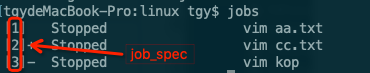

### 第四章,首次登录与在线求助

#### 4.2 文件模式下指令的下达

##### 1)使用\换行

​	指令太长的时候，可以使用反斜杠 (\\) 来跳脱[Enter]符号，使指令连续到下一行。

**注意:反斜杠后就立刻接特殊字符，才能跳脱!**

##### 2)linux严格区分大小写

​	在 Linux 的环境中， 『大小写字母是不一样的东西!』也就是说，在 Linux 底下， VBird 与 vbird 这两个文件是『完全不一样的』文件。

##### 3)locale 获取当前环境的编码

​	可以通过设置LC_ALL ,让一些命令按照地区来显示。如:date

```shell
LANG=en_US.UTF-8
#LC_ALL把所有的设置了
export LC_ALL=en_US.UTF-8
$ date
结果:Thu Jan 24 16:09:36 CST 2019

LANG=zh_CN.UTF-8
export LC_ALL=zh_CN.UTF-8
$ date
结果:2019年 01月 24日 星期四 16:10:23 CST
```

#### 4.3基础指令的操作

##### 1) date 

```shell
#显示年月日
$ date +%Y%m%d
# %Y-%m-%d
$ date +%F
# %Y/%m/%d
$ date +%D
```

##### 2) cal : calendar 日历

```shell
# 显示当前月
$ cal 
# 显示指定年的全年
$ cal 2016
# 显示指定的年月日的那个月
$ cal 10 3 2015
# Display prev/current/next month output.
$ cal 3
```

##### 3) bc 计算器

​	An ar**B**itrary precision **C**alculator language

小数设置:

```shell
#显示小数保留五位小数
> scale=5
```

##### 4)几个重要的热键

###### (1)tab:命令补全

###### (2)ctrl + c

​	强制中断程序的执行,,进程已经终止。

###### (3)ctrl+z 

​	将任务中止（暂停的意思）,但是此任务并没有结束,他仍然在进程中他只是维持挂起的状态,用户可以使用**fg/bg**操作继续前台或后台的任务,fg命令重新启动前台被中断的任务,bg命令把被中断的任务放在后台执行.

​	**当你vi一个文件是,如果需要用shell执行别的操作,但是你又不打算关闭vi,因为你得存盘推出,你可以简单的按下ctrl+z,shell会将vi进程挂起~,当你结束了那个shell操作之后,你可以用fg命令继续vi你的文件。**

1. jobs

   命令查看所有后台挂起进程

   

   fg 可以通过jobs 输出中的job_spec 唤起指定的bash进程继续执行

   ```shell
   $ fg 2
   ```

   **fg不带任何参数默认调起的是job_spec最大那一个进程**

###### (4) ctr+d

​	在不是操作系统发送信号，而是表示一个特殊的二进制值，表示 EOF (end of file)。

```shell
$ cat > a.txt	
# 退出
$ ctrl+d
```

**注：**

1. **在shell中，ctrl-d表示推出当前shell，相当于exit**
2. **在输入模式中，相当于EOF。**

#### 4.4 求助man page 与 info page

​	man 查找的文件在 **/usr/share/man**

​	man 的配置文件在 **/etc/man_db.conf**

##### 1) x 连按两下tab

​	显示以x开投的所以命令

##### 2) man

​	manual

###### (1) man 的 section numbers

- **1 Executable programs or shell commands**

- **2 System calls (functions provided by the kernel)**

- **3 Library calls (functions within program libraries)**

- 4 Special files (usually found in /dev)

- **5 File formats and conventions eg /etc/passwd**

- 6 Games

- 7 Miscellaneous  (including  macro  packages  and  conventions), e.g.
     man(7), groff(7)

- **8 System administration commands (usually only for root)**

- 9 Kernel routines [Non standard]

  ```shell
  # vim 开头为数字，数字后面多个空格换成一个空格
  :%s/^\([[:digit:]]\)\([[:space:]]\{2,\}\)/\1 /g
  ```

###### (2) man 输出内容搜索 

​	/ 或者 ？,

- n下一个
- N上一个

###### (3) whatis

​	用于查询一个命令执行什么功能，并将查询结果打印到终端上，相当于 **man -f**

###### (4) which

​	shows the full path of commands or shell

##### 3)超简单文本编辑工具: nano 

##### 4)关机

###### (1)  whoami /who / w 

###### (2) netstat -a

###### (3) ps -aux

###### (4) sync:

​	数据同步到磁盘中

###### (5)shutdown

- -r: reboot 重启
- -c: cancle 取消关机
- -h: power off 停止服务后关机

```shell
#"十分钟之后关机"
$ shutdown -r 10 
#立即关机
$ shutdown -r now
#八点整重启电脑
$ shutdown -r 08:00 
```

###### (6)halt/reboot/poweroff

​	都是调用底层的systemctl来实现的

###### (7)systemctl

```
#重启
# systemctl reboot 
```

### 五.Linux的文件权限和目录配置

#### 5.1 使用者与群组

##### 1)user/group/others 

- user配置文件: /etc/passwd
- 密码的配置文件: /etc/shadow
- group配置文件: /etc/group

#### 5.2 Linux 文件权限概念

##### 1) ls

-  --full-time

  ```shell
  alias ll='ls -l --time-style=+"%Y-%m-%d %H:%M:%S" --color=auto'
  ```

##### 2)修改系统语系

​	 修改: /etc/locale.conf 文件中的 LANG

##### 3) chmod /chown / chgrp

4)rwx权限

###### (1)文件

- r : 可读取此一文件的实际内容，如读取文本文件的文字内容等;
- w: 可以编辑、新增或者是修改该文件的内容(**但不含删除该文件**);
- x (execute): 该文件具有可以被系统执行的权限。

###### (2)目录

- r : 表示具有读取目录项列表的权限。

  所以当你具有读取(r)一个目录的权限时，表示你可以查询该目录下的文件名数据。 

  所以你就可以利用 ls 这个指令将该目录的内容列表显示出来!

- w: 这个可写入的权限对目录来说，是很了不起的! 因为他表示你具有移动该目录结构列表的权限，也就是底下这些权限(增删改):

  - 建立新的文件与目录;
  - 删除已经存在的文件与目录(**不论该文件的权限为何**!) 
  - 将已存在的文件或目录进行更名;
  - 搬移该目录内的文件、目录位置。

- x : 目录的 x 代表的是用户能否进入该目录成为**工作目录**的用途。

  如使用cd进入某个目录。

  1. 如果你在某目录下不具有 x 的权限， 那么你就无法切换到该目录下，也就无法执行该目录下的任何指令，即使你具有该目录的 r 或 w 的权限。
  2. **要读一个文件时，你得要具有这个文件所在目录的 x 权限才行**。所以，通常要开放目录的执行权限。

#### 5.3 Linux目录

##### 1) /bin

​	系统有很多放置执行文件的目录，但/bin 比较特殊。因为/bin 放置的是在单人维护模式下还能够被操作的指令。在/bin 底下的指令可以被 root 与一般账号所使用，主要有:cat, chmod, chown, date, mv, mkdir, cp, bash 等等常用的指令。

##### 2) /boot

​	这个目录主要在放置开机会使用到的文件，包括 Linux 核心文件以及开机选单与开机所需配置文件等等。 **Linux kernel 常用的档名为:vmlinuz**，如果使用的是 grub2 这个开机管理程序， 则还会存在 /boot/grub2/这个目录喔!

##### 3) /usr 

- /local

  三方软件安装位置

- /share

  - /man
  - /dict

- /src

  放源文件： kernal data source

- /include

  c lib head file

##### 4) /var

- /lib

  程序本身执行的过程中，需要使用到的数据文件放置的目录。

- /log

  运行过程中产生的日志信息。

- /spool

  这个目录通常放置一些队列数据，所谓的『队列』就是排队等待其他程序使用的数据啦!这些数据被使用后通常都会被删除。举例来说，系统收到新信会放置到/var/spool/mail/中， 但使用者收下该信件后该封信原则上就会被删除。信件如果暂时寄不出去会被放到/var/spool/mqueue/中,等到被送出后就被删除。

##### 5) uname 命令

```shell
# 跳转到指定用户的home
$ cd ~name
```

### 六.Linux文件目录管理

#### 6.1目录与路径

##### (1) 特殊目录

- \- : 前一个工作目录
- ~account : account 这个用户的家目录(account 是个账号名称)

##### (2) pwd :

- -P :在链接目录里面。显示真正的目录位置而不是链接的目录

##### (3)mkdir:

- m :指定目录权限

#### 6.2文件与目录管理

##### (1) cp

- -a --archive

  相当于 same as -dR --preserve=all

- -l :硬链接

- -s : 软连接

- -d:源文件为链接文件的属性(link file)，则复制链接文件属性而非文件本身;

- -r: 递归持续复制，用于目录的复制行为;(常用)

- -i: 若目标文件(destination)已经存在时，在覆盖时会先询问动作的进行

- -u: 若目标比源旧才更新目标，或目标不存在的情况下才复制。

  ```shell
  # 如果a.sh 比 test01.txt 新就替换
  cp -u a.sh test01.txt
  ```

- -p : 连同文件的属性(权限、用户、时间)一起复制过去，而非使用默认属性。

**注意:**

**1. 哪个用户cp的文件或者目录，则cp的文件或者目录的属主和属组与该用户一直。如果想保留原来文件的属性，则使用-a或者-p**

**2. 如果没有加上任何选项时，cp 复制的是源文件，而非链接文件的属性!**

**3.可以将多个文件或者目录一次复制到同一个目录去!最后面一定是目录!**

##### (2) rm

- -i :交互式删除文件

##### (3)mv

- -u: 若目标文件已经存在，且 source 比较新，才会更新 (update),使用**新的替换旧的**

##### (4)basename, dirname

#### 6.3 文件内容查看

##### (1) cat

- -b : 列出行号，仅针对非空白行做行号显示，空白行不标行号!
- -n : 打印出行号，连同空白行也会有行号，与 -b 的选项不同;