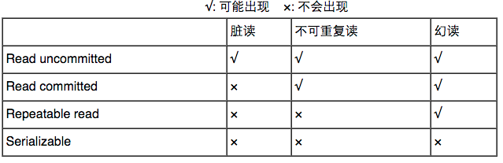
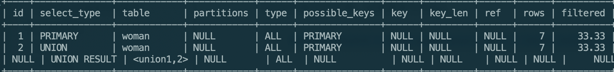
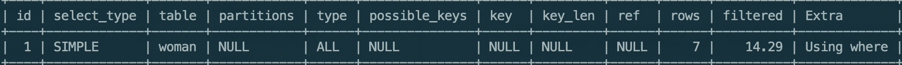
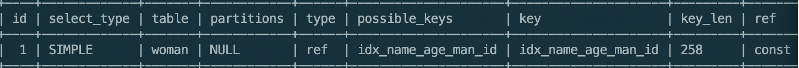
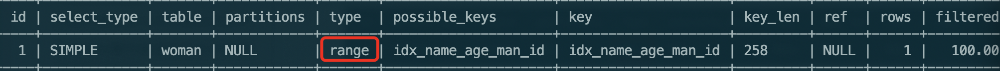
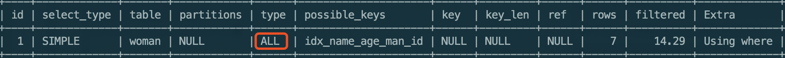
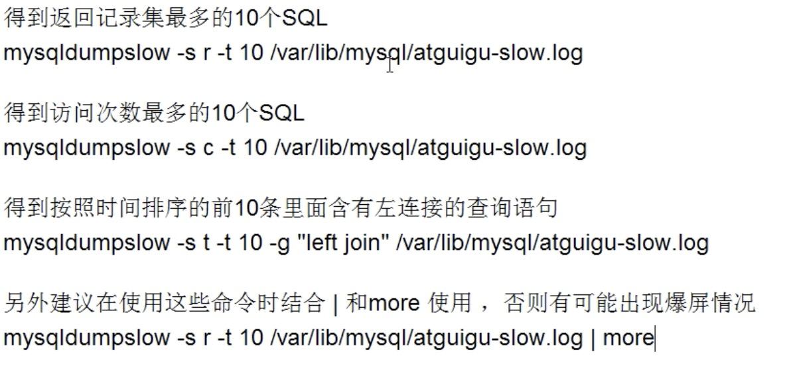
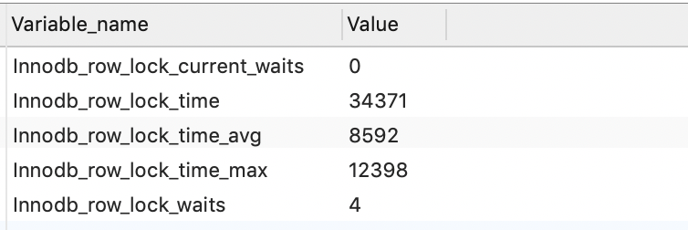

### 一.事务

#### 1)事件介绍

1. 事务的概念

   一个或一组sql语句组成一个执行单元，这个执行单元要么全部执行，要么全部不执行，如转账

   ```sql
   #查看mysql支持的存储引擎
   show engines;
   ```

2. 事务支持的ACID属性

   - 原子性（Atomicity）

     事务的原子性是指事务必须是一个原子的操作序列单元。事务中包含的各项操作在一次执行过程中，只允许出现两种状态之一。
     全部执行成功
     全部执行失败
     任何一项操作都会导致整个事务的失败，同时其它已经被执行的操作都将被撤销并回滚，只有所有的操作全部成功，整个事务才算是成功完成。

   - 一致性（Consistency）

     事务的一致性是指事务的执行不能破坏数据库数据的完整性和一致性，一个事务在执行之前和执行之后，数据库都必须处以一致性状态。

     比如：如果从A账户转账到B账户，不可能因为A账户扣了钱，而B账户没有加钱。

   - 隔离性（Isolation）

     事务的隔离性是指在并发环境中，并发的事务是互相隔离的，一个事务的执行不能被其它事务干扰。也就是说，不同的事务并发操作相同的数据时，每个事务都有各自完整的数据空间。

     一个事务内部的操作及使用的数据对其它并发事务是隔离的，并发执行的各个事务是不能互相干扰的。

   - 持久性（Duration）

     事务的持久性是指事务一旦提交后，数据库中的数据必须被永久的保存下来。即使服务器系统崩溃或服务器宕机等故障。只要数据库重新启动，那么一定能够将其恢复到事务成功结束后的状态。

3. 数据库并发访问会出现的问题

   - 更新丢失

     当有两个并发执行的事务，更新同一行数据，那么有可能一个事务会把另一个事务的更新覆盖掉。 
     当数据库没有加任何锁操作的情况下会发生。

   - 脏读

     一个事务读到另一个尚未提交的事务中的数据。 该数据可能会被回滚从而失效。 如果第一个事务拿着失效的数据去处理那就发生错误了。

   - 不可重复读

     不可重复度的含义：一个事务对同一行数据读了两次，却得到了不同的结果。它具体分为如下两种情况： 

     1. 虚读

        在事务1两次读取同一记录的过程中，事务2对该记录进行了==修改==，从而事务1第二次读到了不一样的记录。 

     2. 幻读

        事务1在两次查询的过程中，事务2对该表进行了==插入、删除==操作，从而事务1第二次查询的结果发生了变化。

        在mysql默认隔离级别下演示repeatable read

        

        | 事务1                                                        | 事务2                                                        |
        | ------------------------------------------------------------ | ------------------------------------------------------------ |
        | set autocommit=0                                             |                                                              |
        |                                                              | set autocommit=0                                             |
        | select * from woman where age=32                             |                                                              |
        |                                                              | \# 也可以使用delete语句，使其出现幻读<br>insert into woman(id,name,age) values("posix","张桑",32); |
        |                                                              | commit;                                                      |
        | \#这里的update至关重要，<br/>update woman set age=33 where age=32; |                                                              |

        

     3. 与『脏读』的区别

        脏读读到的是==尚未提交==的数据，而不可重复读读到的是==已经提交==的数据，只不过在两次读的过程中数据被另一个事务改过了。

4. 事务的隔离级别

   - Read uncommitted 读未提交

     在该级别下，一个事务对一行数据修改的过程中，不允许另一个事务对该行数据进行修改，但允许另一个事务对该行数据读。 
     因此本级别下，不会出现更新丢失，但会出现脏读、不可重复读。

   - Read committed 读提交

     在该级别下，未提交的写事务不允许其他事务访问该行，因此不会出现脏读；但是读取数据的事务允许其他事务的访问该行数据，因此会出现不可重复读的情况。

   - Repeatable read 重复读

     在该级别下，读事务禁止写事务，但允许读事务，因此不会出现同一事务两次读到不同的数据的情况（不可重复读），且写事务禁止其他一切事务。

   - Serializable 序列化

     该级别要求所有事务都必须串行执行，因此能避免一切因并发引起的问题，但效率很低。


   这四个级别可以逐个解决脏读 、不可重复读 、幻读 这几类问题

   

   mysql默认级别是：==Repeatable read 重复读==(行锁)

#### 2)事务的创建

1. 隐式事务

   事务没有明显的开启和结束的标记，如:insert,update,delete语句

   ```sql
   #默认是on，自动开启的
   show VARIABLES LIKE 'autocommit';
   ```

2. 显式事务

   事务具有明显的开启和结束标记

   ==前提是必须设置自动提交功能为禁用==

   ```sql
   #关闭自动提交,只对当前会话有效
   set autocommit=0
   ```

   - 开启事务的步骤

     1. 开启事务

        ```sql
        set autocommit = 0
        start transaction; #可选的
        ```

     2. 编写事务中的sql语句(select,insert,update,delete)

     3. 结束事务

        ```sql
        #提交事务
        commit;
        #或者出现问题，回滚事务
        rollback;
        ```

     4. 实例

        ```sql
        set autocommit=0;
        START TRANSACTION;
        INSERT INTO major VALUES(null,'语文');
        update books set book_name='三体' where id='dsds';
        -- ROLLBACK;
        COMMIT;
        ```

#### 3)事务的保存点(savepoint)

回滚到指定位置

```sql
set autocommit = 0;
START TRANSACTION;
DELETE FROM major where id = 7;
SAVEPOINT p1; #设置保存点
DELETE FROM major where id = 10;
ROLLBACK TO p1;#回滚到保存点
```

### 二.视图(view)

#### 1)概念

```
视图是从mysql5.0.1版本开始提供的视图功能。一种虚拟存在的表，行和列的数据都来自定义视图的查询中使用的表，并且是在使用视图时==动态生成的==，只保存了==sql逻辑==，不保存查询结果

```

#### 2)应用场景

1. 多个地方用到同样的查询结果
2. 该查询结果使用的sql语句比较复杂

#### 3)视图创建

1. 语法

   ```sql
   create view 视图名
   as
   查询语句;
   ```

   ```sql
   #创建视图
   CREATE VIEW woman_man_view
   as
   SELECT woman.`name` w_name,man.`name` m_name
   FROM woman INNER JOIN man
   on woman.man_id = man.id;
   #使用视图
   SELECT w_name, m_name
   FROM woman_man_view
   where w_name = '章子怡'
   ```

   ```sql
   #创建
   CREATE view woma_man_avg
   as
   SELECT woman.`name` w_name,AVG(man.age) ag
   FROM woman INNER JOIN man
   on woman.man_id = man.id
   GROUP BY woman.`name`
   #使用
   SELECT ar.`name`,wma.ag
   FROM age_rank ar INNER JOIN woma_man_avg wma
   ON wma.ag BETWEEN ar.`start` and ar.`end`;
   ```

2. 总结

   - 重用sql语句
   - 简化复杂的sql操作，不必知道其中的细节
   - 保护数据，提高安全性

#### 4)视图的修改

##### 1.语法

1. 第一种

   ```sql
   create or replace view 视图名
   as
   表名
   ```

   ```sql
   CREATE OR REPLACE view woma_man_avg
   as
   SELECT woman.`name` w_name,AVG(man.age) ag
   FROM woman INNER JOIN man
   on woman.man_id = man.id
   GROUP BY woman.`name`;
   ```

2. 第二种

   ```sql
   alter view 视图名
   as
   表名
   ```

   ```sql
   alter view woma_man_avg
   as
   SELECT woman.`name` w_name,AVG(man.age) `avg`
   FROM woman INNER JOIN man
   on woman.man_id = man.id
   GROUP BY woman.`name`;
   ```

#### 5)删除视图

##### 1.语法

```sql
drop view 视图名1,视图名2,视图名3...
```

```sql
drop view woman_man_view,woma_man_avg;
```

#### 6)查看视图结构

```sql
show create view 视图名
```

```sql
show CREATE view woma_man_avg;
```

#### 7)视图的更新(不允许更新数据)

1.不能更新的视图

  视图创建的sql语句中包含一下关键字不能更新

- 分组函数 ，distinct, group by,having,union或者union all

- 常量视图

  ```
  select 'abc';
  
  ```

- 子查询

- join

- from一个不能更新的视图

- where 子句的子查询引用了from子句中的表

2.能更新的视图

简单的没有上面限制的视图(一般也不会用视图)

3.总结

所以一般视图==不允许更新==

#### 8)视图与表的对比

|      | 创建语法关键字 | 是否实际占用物理空间 | 使用                   |
| ---- | -------------- | -------------------- | ---------------------- |
| 视图 | create view    | 只是保存了sql逻辑    | 查，数据一般不能增删改 |
| 表   | create table   | 保存了数据和逻辑     | 增删改查               |

### 三.变量

#### 1)分类

1. 系统变量
   - 全局变量
   - 会话变量
2. 自定义变量
   - 用户变量
   - 局部变量

#### 2)系统变量

1. 说明

   变量是由系统提供，不是用户定义的，属于服务器层面的

2. 使用语法

   - 查看所有的系统变量

     ```sql
     show global|session variables;
     ```

   - 查看满足条件的部分系统变量

     ```sql
     show global|【session】 variables like '%char%';
     ```

   - 查询指定的某个系统变量的值

     ```sql
     select @@global|session.系统名;
     ```

     ```sql
     #会话变量查询
     SELECT  @@session.auto_increment_increment; 或者
     SELECT  @@auto_increment_increment; 
     #全局变量查询
     SELECT  @@global.character_sets_dir;
     ```

   - 为某个变量赋值

     - 方式一

       ```sql
       set global|【session】 系统变量名=值
       ```

       ```sql
       set global  auto_increment_increment = 2;
       ```

     - 方式二

       ```sql
       set @global|session.系统变量名=值
       ```

       ```sql
       SET @@session.auto_increment_increment = 3;
       #或者如下方式写
       SET @@auto_increment_increment = 3;
       ```

   - ==注意事项==

     如果是全局级别，则需要加global，如果是会话级别，则需要加上session

     如果不写，默认是会话级别(session)

#### 3)自定义变量

##### 1.用户变量

1. 说明

   用户变量是用户自定义的变量，不是系统的变量

2. 使用步骤

   赋值操作符: ===== 或者 ==:===

   (1) 声明(三种方式)

   ```sql
   set @用户变量名=值;
   set @用户变量名:=值;
   select @用户变量名:=值;
   ```

   (2) 赋值

   1. 方式一

      ```sql
      set @用户变量名=值;
      set @用户变量名:=值;
      select @用户变量名:=值;
      ```

      ```sql
      set @name='张三';
      #没有定义类型，所以可以赋值各种类型
      set @name=100;
      ```

   2. 方式二

      ```sql
      #字段必须是一个
      select 字段 into @变量名
      from 表;
      ```

      ```sql
      set @count=0;
      SELECT COUNT(*) into @count 
      FROM woman;
      ```

   (3)查看值

   ```sql
   select @变量名;	
   ```

   ```sql
   SELECT @count;
   ```

3. 作用域

   针对当前会话（连接）有效，同于会话变量的作用域。

   应用在任何地方，也就是begin end 里面或者begin end外面

##### 2.局部变量

1. 作用域

   仅仅在定义它的begin end 中有效,并且==必须放在begin end第一句==

2. 声明

   ```sql
   declare 变量名 类型;
   declare 变量名 类型 default 值;
   ```

3. 赋值

   1. 通过set或者select

      ```sql
      set 局部变量名=值;
      set 局部变量名:=值;
      select @局部变量名:=值;
      ```

   2. 通过select into

      ```sql
      #字段必须是一个
      select 字段 into 局部变量名
      from 表;
      ```

4. 查看值

   ```sql
   select 局部变量名;
   ```

##### 3.用户变量与局部变量对比

|          | 作用域       | 定义与使用位置                  | 语法                    |
| -------- | ------------ | ------------------------------- | ----------------------- |
| 用户变量 | 当前会话     | 会话中的任何位置                | 必须加@，同时不限定类型 |
| 局部变量 | begin end 中 | 只能在begin end中，并且是第一句 | 一般不加@，限定类型     |


### 四.存储过程

#### 1)说明

1. 作用

   类似于Java中的方法

2. 含义

   一组预选编译好的sql语句的集合，可以理解为批处理

3. 好处

   - 提高代码的重用性
   - 简化操作
   - 减少了编译次数并且减少了和数据库服务器的连接次数，提高了效率

#### 2)语法

##### 1.创建语法

```sql
create procedure 存储过程名(参数列表)
begin
	存储过程体(一组合法的sql语句)
end
```

==注意点:==

1. 参数列表包含三部分

   参数模式 参数名 参数类型

   ```sql
   in name VARCHAR(20)
   ```

   - 参数模式

     - in

       该参数可以作为输入，也就是该参数需要调用方法入值

     - out

       该参数可以作为输出，也就是该参数可以作为返回值

     - inout

       该参数既可以作为输入也可以作为输出，也就是该参数既需要传入值，又可以返回值

2. 如果存储过程体仅仅只有一条语句，则 begin end 可以省略

3. 存储过程体中的每条sql语句的结尾要求必须加上分号

4. 存储过程的结尾可以使用delimiter 重新设置

   语法

   ```sql
   delimiter 结束标记
   ```

##### 2.使用语法

```sql
call 存储过程名(实参列表)
```

#### 3)空参存储过程

```sql
#定义
delimiter $
CREATE PROCEDURE insert_age_rank()
BEGIN
	
	INSERT INTO age_rank(`name`,`start`,`end`) VALUES('F',0,10);
END $
#调用
CALL insert_age_rank()$
```

==注意==

 在命令行执行存储过程

#### 4)in模式的存储过程

```sql
delimiter $
CREATE PROCEDURE exist_data(in col_name VARCHAR(32))
BEGIN
		DECLARE cout int DEFAULT 0;
		SELECT COUNT(*) INTO cout
		from age_rank 
		where `name` = col_name;
		SELECT cout;
END $
```

#### 5)out 模式

1. 一个out参数

   ```sql
   delimiter $
   CREATE PROCEDURE woman_to_man(in woman_name VARCHAR(32), out man_name VARCHAR(32))
   begin
   	SELECT m.`name` into man_name
   	from woman w INNER JOIN man m 
   	on w.man_id = m.id
   	where w.`name` = woman_name;
   end $
   
   set @man_name=''$
   call woman_to_man('李冰冰',@man_name)$
   ```

2. 多个out 参数

   ```sql
   delimiter $
   CREATE PROCEDURE woman_to_man_age(in woman_name VARCHAR(32), out man_name VARCHAR(32), out man_age INT)
   begin
   	SELECT m.`name`, m.age into man_name, man_age
   	from woman w INNER JOIN man m 
   	on w.man_id = m.id
   	where w.`name` = woman_name;
   end $
   
   SET @man_age=0$
   
   call woman_to_man_age('李冰冰',@man_name,@man_age)$
   ```

#### 6)inout模式

```sql
CREATE PROCEDURE argument_double(inout a int, inout b int)
begin
			SET a = a * 2;
			set b = b * 2;
end $

set @a_1=2$
set	@a_2=4$
call argument_double(@a_1,@a_2)$
```

#### 7)删除存储过程

1. 语法

   ```sql
   drop procedure 存储过程名
   ```

2. 练习

   ```sql
   drop PROCEDURE  woman_to_man_age;
   ```

#### 8)查看存储过程的信息

1. 语法

   ```sql
   show create procedure 存储过程名
   ```

   ```sql
   show create PROCEDURE woman_to_man;
   ```

### 五.函数

#### 1)说明

1. 作用

   类似于Java中的方法

2. 含义

   一组预选编译好的sql语句的集合，可以理解为批处理

3. 好处

   - 提高代码的重用性
   - 简化操作
   - 减少了编译次数并且减少了和数据库服务器的连接次数，提高了效率

#### 2)函数与存储过程的区别

|          | 返回值                                  | 作用                   |
| -------- | --------------------------------------- | ---------------------- |
| 函数     | 必须有一个，使用retures关键字           | 适合做批量插入，更新   |
| 存储过程 | 可以没有，也可以有使用(out,inout关键字) | 适合处理数据后返回一个 |

#### 3)语法

##### 1.创建语法

```sql
create function 函数名(参数列表) returns 返回类型
begin
	函数体
end 
```

==注意==

1. 参数列表包含两部分:

   参数名 参数类型

2. 函数体

   肯定会有return语句，如果没有回报错

   如果return 语句没有放在函数体最后也不会报错，但不建议

3. 函数体中只有一条语句，begin end 可以省略

4. 使用delimiter 设置结束标记

##### 2.函数的调用

```
select 函数名(参数列表);
```

#### 4)例子

##### 1.无参函数

```sql
delimiter $
CREATE FUNCTION fun_count() RETURNS INT
BEGIN
  DECLARE cou int DEFAULT 0;
	SELECT count(*) into cou 
	FROM woman;
	return cou;
END $

SELECT fun_count()$
```

##### 2.有参函数

```sql
delimiter $
CREATE FUNCTION fun_woman_to_man( woman_name VARCHAR(32)) RETURNS VARCHAR(32)
begin
	DECLARE man_name VARCHAR(32) DEFAULT '';
	SELECT m.`name` into man_name
	from woman w INNER JOIN man m 
	on w.man_id = m.id
	where w.`name` = woman_name;
	return man_name;
end $

SELECT fun_woman_to_man('李冰冰')$
```


#### 5)删除存储过程

1. 语法

   ```sql
   drop function 存储过程名
   ```

2. 练习

   ```sql
   drop FUNCTION fun_woman_to_man;
   ```

#### 6)查看存储过程的信息

1. 语法

   ```sql
   show create function 存储过程名
   ```

   ```sql
   show create function fun_woman_to_man;
   ```

### 六.流程控制

#### 1)分支结构

1. IF函数

   - 功能

     实现简单的双分支

   - 语法

     ```
     IF(表达式1,表达式2,表达式3)
     ```

     执行顺序: 如果表达式1成立，返回表达式2的值，否则返回表达式3的值

   - 应用

     可以应用到任何地方

     ```sql
     SELECT IF(1=2,'哈哈哈','呵呵');
     ```

2. case结构

   - 情况一: 类似于Java中的switch语句，一般用于实现等值判断

     - 语法

       ```
       case 变量|表达式|字段
       when 要判断的值 then 返回值1或者语句1;
       when 要判断的值 then 返回值2或者语句2;
       ...
       else 要返回的值n或者语句n;
       end 【case】;
       ```

   - 情况二: 类似Java中的多重IF语句，一般用于区间判断

     - 语法

       ```
       case 
       when 要判断的条件1 then 返回值1或者语句1;
       when 要判断的条件1 then 返回值2或者语句2;
       ...
       else 要返回的值n或者语句n;
       end 【case】;
       ```

   - 特点

     - 如果then后面是值，可以放在任何地方，包括begin end里面和外面
     - 如果then后面是语句，则只能放在begin end 之中
     - 如果then后面是语句，则结尾要加分号结尾
     - 如果then后面是值，则最后不要case，如果是语句，则要加上case

     ```sql
     SET @age=21;
     
     SELECT CASE @age
     	WHEN 10 THEN '10'
     	WHEN 20 THEN '20'
     	ELSE
     		'其他'
     END;
     ```

     ```sql
     delimiter $
     CREATE PROCEDURE range_word(in num INT, out rank CHAR(1))
     begin
     	CASE 
     	WHEN num > 100 THEN
     		set rank='A';
     	WHEN num > 90 THEN
     	  SET rank='B';
     	WHEN num > 80 THEN
     	  SET rank='C';
     	ELSE
     		SET rank='D';
     	end case;
     END $
     
     #使用
     set @re=''$
     call range_word(91,@re)$
     SELECT @re$
     ```

3. if结构

   - 功能

     实现多重分支

   - 语法

     ```
     if 条件1 then 语句1;
     else if 条件2 then 语句2;
     ...
     【else 语句n;】
     end if;
     
     ```

   - 注意

     ==只能应用在begin end中==

     ```sql
     delimiter $
     CREATE PROCEDURE range_word(in num INT, out rank CHAR(1))
     begin
     	IF num > 100 THEN set rank='A';
     	ELSEIF num > 90 THEN set rank='B';
     	ELSEIF num > 80 THEN set rank='C';
     	ELSE set rank='D';
       END IF;
     END $
     ```

#### 2)循环结构

1. 分类

   - while

     - 语法

       ```sql
       【标签】:while 循环条件 do
       	循环体
        end while 【标签】;
       ```

   - loop

     - 语法

       ```sql
       【标签:】loop 
       	循环体
        end loop 【标签】;
       ```

   - repeat

     - 语法

       ```
       【标签:】repeat  
       	循环体
        until 循环结束条件
        end repeat 【标签】;
       
       ```

2. 循环控制语句

   - Iterate 

     类似于continue

   - leave

     类似break	

3. 例子

   ```sql
   CREATE PROCEDURE insert_data_to_my_test( in num int)
   begin
   	DECLARE i int DEFAULT 0;
   	
   	a:WHILE i < num DO
   		SET i = i + 1;
   		IF MOD(i,2) <> 0 THEN
   			ITERATE a;
   		END IF;
   		insert into my_test(my_name) VALUES(CONCAT('lisi-',i ));
   	END WHILE a;
   
   END $
   ```

4. 经典例子

   随机生成字符串，插入到表中

   ```sql
   delimiter $
   CREATE PROCEDURE insert_data_to_my_test_two(in num int)
   begin
   	 
   	 DECLARE all_str char(26) DEFAULT 'abcdefghijklmnopqrstuvwxyz';
   	 DECLARE last_str varchar(26) DEFAULT '';
   	 DECLARE len int DEFAULT 0;
   	 DECLARE i int DEFAULT 0;
   	 DECLARE loc int DEFAULT 0;
   	 
   	 WHILE i < num DO
   			set len = FLOOR(RAND() * 26) + 1;
   			set last_str = '';
   			
   			WHILE len > 0 DO
   			 set loc = FLOOR(RAND() * 26) + 1;
   			 SET last_str = CONCAT(last_str,SUBSTR(all_str,loc,1));
   			 set len = len - 1;
   			END WHILE;
   			
   			INSERT into my_test(my_name) VALUES(last_str);
   			SET i = i + 1;
   	 END WHILE;
   end $
   ```

   去重之后插入

   ```sql
   delimiter $
   CREATE PROCEDURE insert_data_to_my_test_two(in num int)
   begin
   	 
   	 DECLARE all_str char(26) DEFAULT 'abcdefghijklmnopqrstuvwxyz';
   	 DECLARE last_str varchar(26) DEFAULT '';
   	 DECLARE len int DEFAULT 0;
   	 DECLARE i int DEFAULT 0;
   	 DECLARE loc int DEFAULT 0;
   	 DECLARE flag int DEFAULT 0;
   	 
   	 a:WHILE i < num DO
   	 
   			set len = FLOOR(RAND() * 26) + 1;
   			set last_str = '';
   			set flag = 0;
   			
   			WHILE len > 0 DO
   			 set loc = FLOOR(RAND() * 26) + 1;
   			 SET last_str = CONCAT(last_str,SUBSTR(all_str,loc,1));
   			 set len = len - 1;
   			END WHILE;
   			
   			SELECT COUNT(*) into flag 
   			FROM my_test
   			where my_name = last_str;
   			
   			IF flag > 0 THEN
   				ITERATE a;
   			END IF;
   
   			INSERT into my_test(my_name) VALUES(last_str);
   			SET i = i + 1;
   		
   	 END WHILE a;
   end $
   ```

### 七.索引

#### 1)索引是什么

1. 索引是帮助mysql高效的获取数据的数据结构

   ==排好序的快速查找数据结构==(B树的结构)

2. 数据本身除外，数据库还维护着一个满足特定查找算法的数据结构，这些数据结构以某种方式指向数据，这样就可以在这些数据结构的基础上实现高级查询算法，这种数据结构就是索引。

3. 一般来说索引本身也很大，不可能全部储存在内存中，因此索引往往以索引文件的形式存储在磁盘上

#### 2)索引的优势与劣势

##### 1优势

1. 通过创建唯一性索引，可以保证数据库表中每一行数据的唯一性.
2. 可以大大加快数据的检索速度，这也是创建索引的最主要的原因
3. 可以加速表和表之间的连接，特别是在实现数据的参考完整性方面特别有意义
4. 在使用分组和排序子句进行数据检索时，同样可以显著减少查询中分组和排序的时间。
5. 通过使用索引，可以在查询的过程中，使用优化隐藏器，提高系统的性能。

##### 2.劣势

1. 创建索引和维护索引要耗费时间，这种时间随着数据量的增加而增加。
2. 索引需要占物理空间，除了数据表占数据空间之外，每一个索引还要占一定的物理空间，如果要建立聚簇索引，那么需要的空间就会更大。
3. 当对表中的数据进行增加、删除和修改的时候，索引也要动态的维护，这样就降低了数据的维护速度。

#### 3)索引分类

##### 1.单值索引

即一个索引只包含单个列，一个表可以有多个单列索引

##### 2.唯一索引

索引列的值必须唯一，但允许为null

##### 3.复合索引

即一个索引包含多个列

#### 4)索引的操作

##### 1)索引的创建

1. 方式一

   ```sql
   create 【unique】index 索引名 on 表名(表的列名1(长度),表的列名1(长度)...)
   ```

   ```sql
   CREATE UNIQUE INDEX name_index on my_test(my_name);
   ```

2. 方式二

   ```sql
   alter table 表名 add 【unique】index 索引名 (表的列名1(长度),表的列名1(长度)...)
   ```

   ```sql
   alter TABLE my_test add UNIQUE INDEX name_index (my_name);
   ```

   - 添加PRIMARY KEY（主键索引）  

     ```sql
     ALTER TABLE `table_name` ADD PRIMARY KEY ( `column` )
     ```

   - 添加UNIQUE(唯一索引) 

     ```sql
     ALTER TABLE `table_name` ADD UNIQUE ( `column` ) 
     ```

   - 添加INDEX(普通索引) 

     ```sql
     ALTER TABLE `table_name` ADD INDEX index_name ( `column` )
     ```

   - 添加FULLTEXT(全文索引)

     ```sql
     ALTER TABLE `table_name` ADD FULLTEXT ( `column`) 
     ```

   - 添加多列索引 

     ```sql
     ALTER TABLE `table_name` ADD INDEX index_name ( `column1`, `column2`, `column3`)
     ```

##### 2)索引的删除

```sql
drop index 索引名 on 表名
```

```sql
DROP INDEX name_index on my_test;
```

##### 3)查看索引

```sql
show index 索引名 from 表名
```

```sql
show INDEX from my_test; 
```


#### 5）索引结构

##### 1)BTree索引

##### 2)Hash索引

##### 3)full-text全文索引

##### 4)R-Tree索引

#### 6)可以创建索引的条件

1. 主键自动建立唯一索引
2. 频繁作为查询条件的字段应该创建索引
3. 查询中与其他表关联的字段，外键关系建立索引
4. 频繁更新的字段不适合创建索引，因为每次更新还要更新索引，加重了io负担
5. 在高并发下倾向创建组合索引
6. 查询中的排序字段应该建立索引。排序字段若通过索引将大大提高排序速度
7. 查询中的统计或者分组字段应该建立索引。

#### 7)不可以创建索引的条件

1. 表记录太少
2. 经常增删改的表或者字段
3. 数据重复并且分布均匀的表字段
4. where条件里用不到的字段不要创建索引

### 八.explain

#### 1)介绍

```
使用explain关键字可以模拟优化器执行sql查询语句，从而知道mysql是如何处理你的sql语句，分析查询语句或者表结构的性能瓶颈

```

#### 2）作用

1. 获取表的读取顺序
2. 数据读取操作的操作类型
3. 哪些索引可以使用
4. 哪些索引被实际使用了
5. 表之间的引用
6. 每张表有多少行被优化器查询

#### 3）使用

```sql
explain sql语句
```

```sql
explain SELECT * from my_test LIMIT 90,10;
```

执行结果:


#### 4)explain执行结果列解释

##### 1) id

1. 含义

   select 查询的序列号，包含一组数字，表示查询中执行select 子句或者操作表的顺序

2. 出现的三种情况

   - id相同:执行顺序由上至下
   - id不同:如果是子查询，id的序号会递增，id值越大优先级越高，越先被执行
   - id相同不同:同时存在（如果相同id，则走第一个规律，不同走第二个）

##### 2)select_type

1. 含义

   查询的类型，主要是用于区别普通查询，联合查询，子查询等查询

 2.可选类型

- simple

  进行不需要Union操作或不含子查询的简单select查询时，响应查询语句的select_type 即为simple（查询中包含连接的情形也一样）。无论查询语句是多么复杂，执行计划中select_type为simple的单位查询一定只有一个。最外侧的select查询的select_type通常为simple

  ```sql
  SELECT `user_id`, `amount` FROM `coupons`  WHERE `locked`= 0 AND `expired_at`= 1476892800 
  ```

- primary

  一个需要Union操作或含子查询的select查询执行计划中，位于最外层的select_type即为primary。与simple一样，select_type为primary的单位select查询也只存在1个，位于查询最外侧的select单位查询的select_type为primary

- union

  由union操作联合而成的单位select查询中，除第一个外，第二个以后的所有单位select查询的select_type都为union。union的第一个单位select的select_type不是union，而是DERIVED。它是一个临时表，用于存储联合（Union）后的查询结果。

  ```sql
  explain 
  select * from(
  (select emp_no from employees el limit 10)
  union all 
  (select emp_no from employees e2 limit 10)
  union all
  (select emp_no from employees e3 limit 10)
  ) tb;
  ```

  

  3个联合（union）的select 查询中，只有第一个（el数据表）不是union，其余两个的select_type均为union。union的第一个查询设置为代表整个union结果的select_type类型。此外要将3个子查询的结果用union all进行联合，并创建临时表进行使用，所以union all的第一个查询的select_type为DERIVED。

- derived

  产生虚拟表的产生查询的selectType

  ```sql
  EXPLAIN SELECT ar.`name` ,wa.ag from (
  SELECT AVG(w.age) ag
  FROM woman w
  GROUP BY age
  ) wa left JOIN age_rank  ar
  on wa.ag > ar.`start` and wa.ag <= ar.`end`;
  ```

   

  上面的虚拟表derived2是由下面的w表执行查询产生的，索引w的selec_type是derived

- UNION RESULT

  UNION操作的结果，id值通常为NULL

  ```sql
  EXPLAIN SELECT * from woman where id > 5 UNION SELECT * from woman where id > 4
  ```

  

- subquery

  在select或者query列表中包含子查询

##### 3)table

```
显示查询来自哪一张表
```

##### 4)type

1. 含义

   显示查询用了哪种类型

2. 可以选的类型

   - system

     CONST的特例，当表上只有一条元组匹配

   - const 

     表示通过索引一次就找到了，const用于比较primary key或者union索引。因为这两个都是唯一的，比较一次就可以查到

     ```sql
     EXPLAIN SELECT * from woman where id='212sd2kld';
     ```

     const在==单表==查询中使用到了唯一索引,只查到了==最多一条==数据

   - eq_ref

     参与连接运算的表是内表（在代码实现的算法中，两表连接时作为循环中的内循环遍历的对象，这样的表称为内表）。

     基于索引（连接字段上存在唯一索引或者主键索引，且操作符必须是“=”谓词，索引值不能为NULL）做扫描，使得对外表的一条元组，内表只有==唯一一条元组==与之对应。

     ==内表就是左外查询的右表，右外查询的左表==

     ```sql
     EXPLAIN SELECT w.* from woman w left JOIN man m 
     on w.man_id = m.id;
     ```

     

     ==多表==查询中内表使用了唯一索引查询,只查到了==最多一条==数据，则对应的查询的type类型就是eq_ref

   - ref

     非唯一索引扫描，返回匹配的某个==单值==的所有行(==多行==结果)

     ```sql
     #创建索引
     CREATE index idx_man_id on woman(man_id);
     
     EXPLAIN SELECT * from woman where man_id='212sd2kld';
     ```

   - range

     范围扫描，基于索引做范围扫描，为诸如BETWEEN，IN，>=，LIKE类操作提供支持

   ```sql
     EXPLAIN SELECT w.age from woman w where w.age >= 28;
   ```

     ==注意:==

   1. 只遍历==索引的一部分==，是range，==全部==是index

      如果上面的sql中age最小值小于28，则是range

      如果上面的sql中age最小值大于28，则是index,因为要查找全部索引

   - index

     遍历索引，获取到了数据

     ```sql
     EXPLAIN SELECT w.age from woman w where w.age >= 28;
     ```

   - all

     全表扫描或者范围扫描：不使用索引，顺序扫描，直接读取表上的数据（访问数据文件）

##### 5)possible_keys

```
可能用在查询中的索引，一个或者多个

```

##### 6)key

   实际使用的索引，如果为null,则没有使用索引

- 覆盖索引

  就是select的数据列只用从索引中就能够取得，不必从数据表中读取，换句话说查询列要被所使用的索引覆盖。

  在 extra中标有==using index== 表明使用了覆盖索引

##### 7)key_len

```
表示索引中使用的字节数，可以通过该列计算查询中使用的索引长度，在不损失精确性的情况下，长度越短越好

该值显示的是可能的最大长度，并非实际的值。即key_len是根据定义计算而得，不是通过表内检索出来的

```

##### 8)ref

```
关联其他表或者条件的参数类型或者来源

```

```sql
EXPLAIN SELECT * from 
woman w INNER JOIN man m  on w.man_id = m.id 
where w.age = 30;
```


const 表明：w.age = 30中的30是常量

crud.w.man_id 表明 w.man_id = m.id 中的w.man_id 来自数据库crud的w表的man_id字段

##### 9)rows

查询记录所需要读取的行数

##### 10)extra

额外信息

1. using index

   出现这个说明mysql使用了==覆盖索引==，避免访问了表的数据行，效率不错！

2. using where

   这说明服务器在存储引擎收到行后将进行过滤。有些where中的条件会有属于索引的列，当它读取使用索引的时候，就会被过滤，所以会出现有些where语句并没有在extra列中出现using where这么一个说明。

3. using temporary

   这意味着mysql对查询结果进行排序的时候使用了一张临时表。==效率不行==，需要优化

4. using filesort

   这个说明mysql会对数据使用一个外部的索引排序，而不是按照表内的索引顺序进行读取。==效率不行==，需要优化

#### 5)两表关联索引建立(相反加)

1. 如果是左外，则左边的表都要遍历，在右边表中查询，所以应该在右表关联字段建立索引
2. 如果是右外，则右边的表都要遍历，在左边表中查询，所以应该在左表关联字段建立索引
3. 多张表一次类推

#### 6)索引失效

##### 1.最佳做前缀

- 如果索引了多列，则查询的顺序要与索引的顺序一致，不能出现最前面的不一致或者中间一致

  ```sql
  ALTER TABLE woman add index idx_name_age_man_id (`name`,`age`,`man_id`);
  ```

  - 全都有

    ```sql
    EXPLAIN SELECT * from woman where  `name`='aas' and age = 34 and man_id='sas';
    ```

    

  - 如果没有头部

    ```sql
    EXPLAIN SELECT * from woman where   age = 34 and man_id='sas';
    ```

    

  - 没有中间

    ```sql
    EXPLAIN SELECT * from woman where  `name`='aas'  and man_id='sas';
    ```

    

  - 尾部与中间一样

  总结：最好与创建索引时的列一样，如果不一样，==一定要保证头部是一样的==，不然该索引不会使用

##### 2)请不要在索引列上做任何操作

1. 操作包括

   (计算，函数，(自动或者手动)类型转换)

2. 结果

   会导致索引失效，转向搜索全表

3. 例子

   ```sql
   EXPLAIN SELECT * from woman where  left(`name`,2)='aas';
   ```

   	

   添加了left(`name`,2)之后，索引失效

##### 3)存储引擎不能使用索引中范围条件右边的列

```sql
EXPLAIN SELECT * from woman where  `name`='aas' and age > 34 and man_id='sas';
```


总结:==在条件中加了 > , < ,in , between and ,在该字段之后的字段不会使用到索引中==

##### 4)尽量使用覆盖索引，减少使用select *

##### 5)使用不等号(!=, <>)会使索引失效

```sql
EXPLAIN SELECT * from woman where  `name`!='aas';
```


##### 6)使用 is not null 或者 is null  会使索引失效

##### 7) like ==左边==使索引失效

```sql
EXPLAIN SELECT * from woman where  `name` like '%as';
```


==使用覆盖索引，解决like使索引失效问题==

```sql
EXPLAIN SELECT id, age,`name` from woman where  `name` like 'a%s%';
```



##### 8)字符串不加单引号会使索引失效

```sql
EXPLAIN SELECT * from woman where `name` = 2000;
```



##### 9)少用or，用or也会使索引失效

```sql
EXPLAIN SELECT * from woman where `name` = '2000' or age = 23;
```


#### 7）练习


#### 8)索引失效总结

```
==全值匹配我最爱，最左前缀要遵守；==

==带头大哥不能死，中间兄弟不能断；==

==索引列上少计算，范围之后全失效；==

==like百分写最右，覆盖索引不写星；==

==不等空值还有or，索引失效要少些；==

==var引号不能丢，sql高级也不难；==

```

#### 9)慢sql处理过程

##### 1.操作

1. 观察，至少跑一天，看看生产的慢sql情况
2. 开启慢查询日志，设置阀值，比如超过5秒的就是慢sql，并把这些sql抓取出来
3. explain  + 慢sql分析
4. show profile
5. 运营经理或者DBA，进行sql数据库服务器的参数调优

##### 2.过程

1. 慢查询的开启并捕获
2. explain + 慢sql分析
3. show profile 查询SQL在mysql服务器里面的执行细节和生命周期情况
4. SQL数据库服务器的参数调优

#### 10)小表驱动大表

##### 1)优化原则

小表驱动大表，即小的数据集驱动大的数据集

1. in

   ```sql
   select * from A where id 
   in (select id from B)
   
   #等价于
   select id from B;
   select * from A where B.id = A.id 
   ```

2. exists

   ```sql
   select * from A where 
   exists 
   (select 1 from B where A.id = B.id)
   
   #等价于
   select * from A;
   select 1 from B where B.id = A.id
   ```

   ==当B表的数据小于A表时，in 优于exists==

   ==当B表的数据大于A表时，exists 优于in==

##### 2)exists总结

1. 语法

   ```sql
   select * from 表明 where exists (子查询)	
   ```

   将主查询的数据，放在子查询中做条件验证，根据验证结果(true 或者false)来决定查询的结果是否保留

2. 总结

   - exists(子查询) 只返回true或者false，因此子查询中select * from 也可以是select 1 或者 selec 'x',官方表明实际执行过程中会忽略select 清单，因此没有区别
   - Exists 子查询的实际执行过程可能经过了优化而不是我们理解的逐句对比。如果担心效率问题，可进行实际验证以确定是否有效率问题
   - exists 子查询往往也可以用条件表达式，其他子查询或者join来替代，何种最优需要具体问题具体分析 


#### 11) order by 优化


##### 1.Mysql两种排序方式

1. 文件排序
2. 扫描有序索引排序(==推荐==)

##### 2.Mysql 能为排序与查询使用相同索引

##### 3.order by 使用情况

假设索引建立是:

```sql
alter A add index idx_a_b_c (a,b,c);
```

1. Order by 能使用索引最左前缀

   ```sql
   order by a
   order by a,b
   order by a,b,c
   order by a desc, b desc, c desc
   ```

2. 如果where 使用索引的最左前缀定义为常量，则order by能使用索引

   ```sql
   where a=const order by b,c
   where a=const order by b=const order by c
   where a=const order by b>const order by b,c
   ```

3. ==不能==使用索引的order by

   ```sql
   order by a asc,b desc,c asc #排序不一样
   where g=const order by b,c #丢失a索引
   where a=const order by c #丢失b索引
   where g=const order by a,d #d不是索引的一部分
   where a in (a1,a2,a3,...) order by b,c #对于排序来说，多个相等条件也是范围查询
   ```

#### 12)group by 优化

1. order by适用的group by都使用
2. group by的实质是先排序再分组，遵照索引建立的最佳左前缀
3. 当无法使用索引列，增大max_length_for_sort_data参数的设置+ 增大sort_buffer_size的参数设置
4. where 高于having，能写在where限定的条件就不要写在having中

#### 13）慢查询日志

1. 查询是否设置了

   ```sql
   show VARIABLES LIKE '%slow_query_log%';
   ```

2. 设置慢查询日志

   ```sql
   set global slow_query_log=1
   ```

3. 设置阀值

   ```sql
   #查看默认值:默认是10秒
   show VARIABLES LIKE '%long_query_time%';
   #设置时间为3秒
   set global long_query_time=3;
   ```

4. 查看日志文件的位置

   ```sql
   show VARIABLES LIKE '%slow_query_log_file%';
   ```

5. 查询有多少条慢sql

   ```sql
   show GLOBAL STATUS LIKE '%slow_queries%';
   ```

6. 借助mysqldumpslow明令使用

   - 可加的参数

     

   - 例子

     

#### 14)批量插入数据

##### 1)创建表

- 员工表

  ```sql
  create table `employee`(
   `id` varchar(32) PRIMARY KEY,
   `employee_name` VARCHAR(32) not null,
   `employee_age` int DEFAULT 0,
   `department_id` int
  );
  ```

- 部门表

  ```sql
  create table `department`(
  	`id` int auto_increment,
  	`department_name` varchar(32) not null,
  	PRIMARY key(id)
  );
  ```

##### 2)函数和存储过程

- 生成随机字符串的函数

  ```sql
  delimiter $
  CREATE FUNCTION random_str(num INT) RETURNS VARCHAR(32)
  BEGIN
  	DECLARE all_str VARCHAR(26) DEFAULT 'abcdefghijklmnopqrstuvwxyz';
  	DECLARE return_str VARCHAR(32) DEFAULT '';
  	DECLARE i int DEFAULT 0;
  	
  	WHILE i < num DO
  		set return_str = CONCAT(return_str,SUBSTR(all_str,FLOOR(RAND() * 26) + 1,1));
  		set i = i + 1;
  	END WHILE;
  	return return_str;
  end $
  ```

- 生成随机整数

  ```sql
  drop FUNCTION if EXISTS rand_int$
  CREATE FUNCTION rand_int(base int, rand int) returns Int
  begin
  
  	DECLARE return_int int DEFAULT 0;
  	set return_int = floor(base + RAND() * rand);
  	return return_int;
  end $
  ```

- 插入数据的存储过程

  ```sql
  drop PROCEDURE if EXISTS insert_data_to_emp_dep$
  CREATE PROCEDURE insert_data_to_emp_dep(in num int)
  BEGIN
  	DECLARE i int DEFAULT 0;
  	DECLARE flag int DEFAULT 0;
  
  	SELECT COUNT(*) into flag from department;
  	-- 	手动管理事务
  	set autocommit = 0;
  	WHILE i < num DO
  		IF  flag = 0 and i < 10 THEN
  			INSERT into department(`department_name`) VALUES(CONCAT('人事部-',i + 1));
  		END IF;	
  		insert into employee(id,employee_name,employee_age,department_id) VALUES(random_str(15),random_str(9),rand_int(20,30),rand_int(1,10));
  		set i = i + 1;
  	END WHILE;
  	commit;
  end $
  ```

##### 3)设置log_bin_trust_function_creators

```sql
show VARIABLES LIKE '%log_bin_trust_function_creators%';
set GLOBAL log_bin_trust_function_creators = 1;
```

##### 4)插入随机数

```sql
call insert_data_to_emp_dep(500000)$
```

#### 15)show Profile的使用

##### 1.作用

```
查询sql各个步骤具体使用的时间以及各种资源

```

##### 2.使用过程

1. 开启

   ```sql
   #查看
   show VARIABLES like '%profiling%';
   #设置
   set profiling=on;
   ```

2. 查看所有的sql

   ```sql
   show PROFILES;
   ```

3. 查看指定sql

   ```sql
   show PROFILE cpu,block io for QUERY 53;
   ```

   可以选的参数

   

##### 3.出现如下列说明sql有问题

1. Coverting heap to myisam 

   查询结果太大，内存不够往磁盘上面搬

2. creating tmp table

   创建临时表(拷贝数据到临时表，用完删除)

3. Coping to tmp table on disk 

   把内存中临时的表复制到磁盘中

4. locked

#### 16)全局查询日志

1. 开启

   ```sql
   #查看
   SHOW VARIABLES LIKE '%general_log%';
   #开启
   set GLOBAL general_log=on;
   #设置输出到表中
   SET GLOBAL log_output='table';
   ```

2. 使用

   ```sql
   SELECT * from mysql.general_log;
   ```

### 九.数据库锁

#### 1)表锁(MyISAM引擎)

1. 表锁引擎必须是==MyISAM==，设置mysql引擎

   - 创建表时设置

     ```sql
     create 表名(
     	字段
     )engine 引擎名
     ```

     ```sql
     CREATE TABLE `woman` (
       `id` varchar(32) NOT NULL,
       `name` varchar(64) NOT NULL,
       `age` int(11) NOT NULL,
       `man_id` varchar(32) DEFAULT NULL,
       `parent_id` varchar(32) DEFAULT NULL,
       PRIMARY KEY (`id`),
       KEY `idx_name_age_man_id` (`name`,`age`,`man_id`)
     ) ENGINE=MyISAM DEFAULT CHARSET=utf8mb4;
     ```

   - 修改表

     ```java
     ALTER TABLE 表名 ENGINE = 引擎名;
     ```

     ```sql
     ALTER TABLE `crud`.`woman` ENGINE = MyISAM;
     ```

2. 读写锁语法

   - 读或者写锁语法

     ```sql
     lock table 表名 READ|write, 表名 READ|write ...
     ```

   - 解锁

     ```sql
     unlock tables;
     ```

   - 查看表锁的情况

     ```sql
     SHOW OPEN TABLES;
     ```

3. 读锁特性

   

4. 写锁特性

   | Session 01                                                   | Session 02                             |
   | ------------------------------------------------------------ | -------------------------------------- |
   | LOCK TABLE woman WRITE;  <br>==使用写锁把表锁了==            |                                        |
   | select * from woman <br>==直接是等待中==                     |                                        |
   |                                                              | select * from woman ==直接也是等待中== |
   | UPDATE woman set age = 32 where id='212sd2kld';<br/>INsert into woman(id,`name`,age) VALUES('posasd','赵雅芝',78);<br>可以修改和插入 |                                        |
   |                                                              | 不能可以修改和插入                     |
   | SELECT * from books;<br>查询其他表报错:Table 'books' was not locked with LOCK TABLES, |                                        |
   | Unlock tables;                                               |                                        |
   |                                                              | select * from woman ==显示结果==       |

5. 总结

   

   简而言之: ==就是读锁会阻塞写，但是不会阻塞读,而写则会把写与读都阻塞==

6. 表锁分析

   - 查看哪些表锁了

     ```sql
     show open tables;
     ```

   - 分析表锁定

     可以通过检查table_locks_waited 和table_locks_immediate 状态变量分析系统上的表锁定

     ```sql
     show STATUS like 'table%';
     ```

     table_locks_immediate:产生表级锁定的次数，表示可以立即获取锁的查询次数，每理解获取锁值加1

     table_locks_waited:出现表级锁竞争而发生等待的次数，不能立即获取锁的次数，没等待一次值加1，此值高则说明存在严重的表级锁竞争情况。

     此外，Myisam的读写锁调度是==写优先==，这也是myisam不适合做写为主表的引擎。因为写锁后，其他线程不能做任何操作，大量的更新会使查询很难得到锁，从而造成永远阻塞

#### 2)行锁(Innodb)

1. 特点

   - 行锁，InnoDB存储引擎，开销大，加锁慢;会出现死锁;锁定粒度最小，发生锁冲突的概率最低,并发度也最高。
   - InnoDB.与MyISAM的最大不同有两点:
     - 一是支持事务(TRANSACTION) ;
     - 二是采用了行级锁

2. 行锁的基本演示

   | Session01                                                    | Session02                                                    |
   | ------------------------------------------------------------ | ------------------------------------------------------------ |
   | set autocommit=0;<br>UPDATE man set age = 34 where id='3323477'; |                                                              |
   |                                                              | set autocommit=0;<br>UPDATE man set age = 34 where id='3323477';<br>等待中..... |
   |                                                              | UPDATE man set age = 35 where id='422322';<br>可以更新       |
   | commit                                                       |                                                              |
   |                                                              | UPDATE man set age = 34 where id='3323477';<br/>立即         |
   |                                                              | commit                                                       |

3. 如果在执行一个SQL语句时MySQL不能确定要扫描的范围，InnoDB表同样会==锁全表==

   ```sql
   update line_lock set a=1 where b like '%aaa%';
   ```

4. 间隙锁

   当使用范围更新是，如果中间有的范围没有，则insert 中间行，则该行会被锁住，直到前一个session提交

   | Session01                                                    | Session02                                                    |
   | ------------------------------------------------------------ | ------------------------------------------------------------ |
   | set commit;<br>update line_lock set b='rtr' where a BETWEEN 1 and 4; |                                                              |
   |                                                              | set commit;<br/>INSERT into line_lock VALUES(2,'sadd');<bre>等待中... |
   | commit;                                                      |                                                              |
   |                                                              | 执行完成.                                                    |
   |                                                              | Commit                                                       |

5. 锁定一行

   ```sql
   SELECT * from line_lock where a=4 for UPDATE;
   ```

6. 查询锁的效率

   ```sql
   show status like 'innodb_row_lock%';
   ```

   

   Innodb_ row_ lock_ current_ waits: 当前正在等待锁定的数量;
   Innodb_ row_ lock_ time: 从系统启动到现在锁定总时间长度;
   Innodb_ row_ lock_ time_ avg: 每次等待所花平均时间;
   Innodb_ row_ lock_ time_ max: 从系统启动到现在等待最常的一次所花的时间;
   Innodb_row_lock_waits:系统启动后到现在总共等待的次数;
   对于这5个状态变量，比较重要的主要是
   ==Innodb_ row_ lock_ time_ avg (等待平均时长)== ,
   ==Innodb_ row_ lock_ _waits (等待总次数)==
   ==Innodb_ row_ lock_ time (等待总时长)这三项==。
   尤其是当等待次数很高，而且每次等待时长也不小的时候，我们就需要分析系统中为什么会有如此多的等待，然后根据分析结果着手指定优化计划。

### 十.触发器

#### 1)概念

触发器是与表有关的数据库对象，在满足定义条件时触发，并执行触发器中定义的语句集合。触发器的这种特性可以协助应用在数据库端确保数据的完整性。

举个例子，比如你现在有两个表【用户表】和【日志表】，当一个用户被创建的时候，就需要在日志表中插入创建的log日志，如果在不使用触发器的情况下，你需要编写程序语言逻辑才能实现，但是如果你定义了一个触发器，触发器的作用就是当你在用户表中插入一条数据的之后帮你在日志表中插入一条日志信息。当然触发器并不是只能进行插入操作，还能执行修改，删除。

#### 2)触发器的操作

##### 1.创建触发器

```sql
CREATE TRIGGER trigger_name trigger_time trigger_event ON tb_name FOR EACH ROW trigger_stmt
```

- trigger_name：触发器的名称

- tirgger_time：触发时机

  可以为:BEFORE或者AFTER

- trigger_event：触发事件

  INSERT、DELETE或者UPDATE

- tb_name：表示建立触发器的表明

  就是在哪张表上建立触发器

- trigger_stmt：触发器的程序体

  可以是一条SQL语句或者是用BEGIN和END包含的多条语句

- For each row:表示任何一条记录上的操作满足触发事件都会触发该触发器

总结:

1. 六种触发器

   BEFORE INSERT,BEFORE DELETE,BEFORE UPDATE,AFTER INSERT,AFTER DELETE,AFTER UPDATE

2. ==NEW==和==OLD==的使用

   | 触发器类型      | new含义                    | old                          |
   | --------------- | -------------------------- | ---------------------------- |
   | Insert 型触发器 | 表示将要或者已经插入的数据 | -                            |
   | update 型触发器 | 将要或者已经修改的数据     | 表示将要或者已经被删除的语句 |
   | delete型触发器  | -                          | 将要或者已经被删除的数据     |

   根据以上的表格，可以使用一下格式来使用相应的数据

   ```
   NEW.columnname：新增行的某列数据
   OLD.columnname：删除行的某列数据
   ```

```sql
delimiter $
CREATE TRIGGER woman_log_trigger 
AFTER INSERT on woman FOR EACH ROW 
BEGIN 
	DECLARE tmp VARCHAR(64) DEFAULT '';
	IF NEW.age > 30 THEN
		set tmp = concat(New.id,'-',new.`name`,':年龄大于30');
		INSERT into woman_log(message) VALUES(tmp);
	END IF;
end $
delimiter ;
```

##### 2.查看触发器

```sql
SHOW TRIGGERS;
```

SHOW TRIGGERS语句无法查询指定的触发器,使用如下查看触发器详细信息

```sql
select * from information_schema.triggers;
```

##### 3.删除触发器

```sql
drop trigger  触发器名;
```

```sql
drop TRIGGER woman_log_trigger;
```


#### 3)限制和注意事项

##### 1.限制

1. 触发程序不能调用将数据返回客户端的存储程序，也不能使用采用CALL语句的动态SQL语句，但是允许存储程序通过参数将数据返回触发程序，也就是存储过程或者函数通过OUT或者INOUT类型的参数将数据返回触发器是可以的，但是不能调用直接返回数据的过程。

2. 不能在触发器中使用以显示或隐式方式开始或结束事务的语句

   如START TRANS-ACTION,COMMIT或ROLLBACK。

##### 2.注意事项

	MySQL的触发器是按照BEFORE触发器、行操作、AFTER触发器的顺序执行的，其中任何一步发生错误都不会继续执行剩下的操作，如果对事务表进行的操作，如果出现错误，那么将会被回滚，如果是对非事务表进行操作，那么就无法回滚了，数据可能会出错。

#### 4)总结

	触发器是基于行触发的，所以删除、新增或者修改操作可能都会激活触发器，所以不要编写过于复杂的触发器，也不要增加过得的触发器，这样会对数据的插入、修改或者删除带来比较严重的影响，同时也会带来可移植性差的后果，所以在设计触发器的时候一定要有所考虑。
	
	触发器是一种特殊的存储过程，它在插入，删除或修改特定表中的数据时触发执行，它比数据库本身标准的功能有更精细和更复杂的数据控制能力。

触发器的作用:

1. 安全性。可以基于数据库的值使用户具有操作数据库的某种权利。

   - 可以基于时间限制用户的操作，例如不允许下班后和节假日修改数据库数据。
   - 可以基于数据库中的数据限制用户的操作，例如不允许股票的价格的升幅一次超过10%。

2. 审计。可以跟踪用户对数据库的操作。   

   - 审计用户操作数据库的语句。

   - 把用户对数据库的更新写入审计表。

3. 实现复杂的数据完整性规则

   - 实现非标准的数据完整性检查和约束。触发器可产生比规则更为复杂的限制。与规则不同，触发器可以引用列或数据库对象。例如，触发器可回退任何企图吃进超过自己保证金的期货。

   - 提供可变的缺省值。

4. 实现复杂的非标准的数据库相关完整性规则。触发器可以对数据库中相关的表进行连环更新。例如，在auths表author_code列上的删除触发器可导致相应删除在其它表中的与之匹配的行。

   - 在修改或删除时级联修改或删除其它表中的与之匹配的行。

   - 在修改或删除时把其它表中的与之匹配的行设成NULL值。

   - 在修改或删除时把其它表中的与之匹配的行级联设成缺省值。

   - 触发器能够拒绝或回退那些破坏相关完整性的变化，取消试图进行数据更新的事务。

5. 当插入一个与其主健不匹配的外部键时，这种触发器会起作用。例如，可以在books.author_code 列上生成一个插入触发器，如果新值与auths.author_code列中的某值不匹配时，插入被回退。

   - 同步实时地复制表中的数据。

6. 自动计算数据值，如果数据的值达到了一定的要求，则进行特定的处理。

   例如，如果公司的帐号上的资金低于5万元则立即给财务人员发送警告数据。